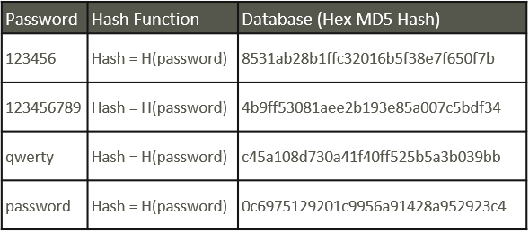

# Passwords and Encryption

There are 3 main groups of encryption that is used in cybersecurity. These are used to convert normal language and numbers into something that is totally unreadable by humans.&#x20;

The uncrypted forms of data is called a **plaintext,** and when encoded, it is called **ciphertext**.&#x20;

The 3 main types of encryption are:

1. Symmetric Encryption
2. Asymmetric Encryption
3. Hashes

Encryption is important because it protects **data at rest**. Meaning, passwords and other credentials stored in databases would all have to be encrypted, ensuring that if there's a leak, the information would at least be hard to read and spread.&#x20;

One key thing to note about encryption is that, **if anything about the algorithm is predictable, the encryption will be broken**. Everything has to be as random as possible in order to make sure that people aren't able to brute force what we do.

## Symmetric Encryption

Symmetric Encryption is used when there is only **one key** used to encrypt and decrypt the electronic data. This would mean that if there was an encryptor function, we would be able to decrypt any encrypted ciphertext by putting it through the function again.

<figure><figcaption></figcaption></figure>

Common types of encryption that use these are:

* Rivest Cipher 4 (RC4), RC5 and RC6
* Advanced Encryption Standard (AES)
* Blowfish&#x20;

Symmetric encryption would have varying key lengths, and hence they are encoded differently. For example, here's AES in action.

<figure><figcaption></figcaption></figure>

This is AES-128 working, and the 128 means 128-bits. 8 bits make up 1 byte, hence there are 16 bytes for the key length and the initialisation vector. The IV is not another key, but rather an added security vector (which I won't go into here).&#x20;

AES-128 is one of the most secure encryption standards today. With current supercomputers, a brute force attack i.e. trying out all possible keys would take about **1 billion years** before succeeding.

As the byte size increases, the number of possible combinations increases. At AES-256, there are basically 2^255 possible combinations that make up the key.&#x20;

To give you an idea how large that is, theoretically, if you had a supercomputer at the beginning of the Universe at the Big Bang, and you started brute forcing the algorithm there with the computer iterating through one try per second, you would not even be half way done if you've been trying this very moment.

Symmetric encryption like this is also unaffected by quantum computing as well, because of the fact that right now, quantum computers are not very functional, and mainly affect asymmetric encryption standards.

## Asymmetric Encryption

Asymmetric Encryption is the more secure (without considering quantum computing) compared to symmetric encryption. This form of encryption has 2 keys, a public and a private key.

To picture this, here's an analogy. Suppose we have two people, A and B, that want to talk to each other.

A sends a message in plaintext, which is then encrypted with **B's public key**. Then, the encoded message is sent to B, and B would decrypt this with **B's private key** to receive the plaintext.

<figure><figcaption></figcaption></figure>

The public key is one that is public, and you can share that with everybody no matter who they are. It's on the Internet, and likely loads of other computers have your public key. The **private key is the one you cannot leak.**  Both of these keys are unique to just you, because there's just that many. As such, your public key can be used to **verify that it is indeed you** that I have sent the message to.&#x20;

SSH uses this kind of asymmetric encryption formula. When we add our SSH key to our Github Repository, we can then SSH into Github and be able to do stuff with it. This is because when we add our key, what we are doing is adding our public key into the Github database, and telling it to authorize any requests that have this private key.

<figure><figcaption></figcaption></figure>

We can generate a pair of keys like so, and we can see how there is a **test\_rsa and a test\_rsa.pub.** The .pub file would be the public key that we add to Github, while we should never disclose our private keys.

Here are examples of asymmetric encryption:

* Transport Layer Security (TLS) protocol
* Rivest Shamir Adleman (RSA)
* Elliptical Curve Cryptography (ECC)
* Diffie-Hellman exchange method

The most commonly used one is RSA, which was named after the people that invented it. When I showcased `ssh-keygen` , we can see that it uses RSA as well.&#x20;

In RSA alone, the minimum key length is 2048 bits, up till 4096 bits. Remember how AES only has up till 256 bits? Yeah so algorithms like this are really secure and widely used everywhere.

Asymmetric encryption is definitely more secure than symmetric encryption, but it comes at a cost of speed. Of course it is a lot slower to encrypt and decrypt using two different keys. As such, they have different use cases, and in cases where security is more important, like when browsing securely on the Internet, asymmetric is used.

## Hashes

A hash function is basically a **one-way function** that takes a cleartext and spits out encoded jargon. **Unlike in other encryption standards, hashes cannot be reversed.** There is no way to simply decode a hash once it has been encoded. There's no key for it, and once something has been hashed, it's kind of gone forever.

There a few type of hashes, with varying lengths

* Windows NTLM
* MD5 - 128-bit
* SHA-1, SHA-256, SHA-512

Hashes are unique (most of the time) for each input, and they would truncate all of the possible input into a fixed length. This means that even if the **inputs have the slightest difference, it would produce an entirely different hash.**

<figure><figcaption></figcaption></figure>

<figure><figcaption></figcaption></figure>

Hashes are used for verifying integrity of information. For example, when downloading a file from the Internet, sometimes they would provide for the file hash signature, and we can check the downloaded file's signature. **If the signatures match, then it is the same file.**

Hashes do not have infinite length, hence there are bound to be different inputs that would basically end up having the same hash output. This is something called a **collision.**&#x20;

Apart from just verifying integrity, hashes can sometimes be used in databases where passwords and other sensitive information is stored. Storing it in hashes would look something like this.

<figure><figcaption></figcaption></figure>

When some user signs in, instead of taking the plaintext password out from the database, what can be done instead **is taking the user input and hashing it, followed by comparing it to the database entry**. If they match, you are authorized.&#x20;

This method is kind of safe(?), but gives rise to its own set of problems, like a technique called **Pass The Hash (PTH),** which I will cover in another section.&#x20;

Hashes also have their own set of issues when parsed into certain languages for comparing, one example being the **PHP Type Juggling Attack.**

### Cracking Hashes

Hashes cannot be decoded, but computers are still able to sometimes crack the hash. Hackers are able to use **something called rainbow tables**, which are basically humongous lists of known hashes.  **Dictionary attacks** are also utilised. Dictionaries are basically brute force attacks using huge wordlists of leaked passwords (which are all over the Internet), hashing each word in that list, and comparing it to the actual hash.

If all else fails, these tools can just brute force every single possible character possible until it finds it. If your password is short enough, then this can be done really quickly.

Hashes shown in the pictures above aren't very secure, because they come from easily guessable words. As such, it is possible to crack this using a hash cracker, **like John The Ripper, Hashcat or CrackStation**.&#x20;

So make sure your passwords are complex and not common!

<figure><figcaption><p><em>Crackstation in action</em></p></figcaption></figure>

<figure><figcaption><p><em>John The Ripper cracking a Kerberos Hash</em></p></figcaption></figure>

```bash
john --wordlist=/usr/share/wordlists/rockyou.txt <hash file>
```

## Attacks

Brute force attacks are generally a last resort because of how resource intensive and time consuming it is. Brute forcing would involve either trying every single possible character combination or some kind of dictionary attack.

### Dictionary Attack

Dictionary attacks utilize giant .txt files of passwords that are put online, with each file being able to contain millions of passwords. One of the most popular one is `rockyou.txt`which contains 14,341,564 unique passwords.

Apart from `rockyou.txt`, we can get more from SecLists.

```bash
sudo apt install seclists
```



Basically a giant compilation of wordlists from all over the web. Apart from passwords, it has subdomain, subdirectory, username and even fuzzing wordlists with special characters.

Apart from seclists, we can also create our own unique wordlists depending on what website we are attacking using cewl.

```bash
cewl -d 2 -m 5 -w docswords.txt https://example.com
```



Tools like `msfconsole`, `hydra` and many others can be used. Hydra is my favourite because of how simple it is to use. Hydra is a module based tool similar to MSF, with each module containing it's own use case, such as different syntax for http-post-form and SSH modules.


```bash
sudo apt install THC-Hydra -y

#general hydra use case
hydra -L <Userlist.txt> -P <Dictionary.txt> <Target> <Service>

# ftp and ssh
hydra -l linuxhintuser -P passlist.txt 192.168.0.100 ssh
hydra -L userlist.txt -P passlist.txt 192.168.0.100 ftp

#htttp-post-form (like login forms)
hydra -L <username list> -p <password list> <IP Address> <form parameters><failed login message>
hydra -L <wordlist> -P <password list> 192.168.1.101 http-post-form "/dvwa/login.php:username=^USER^&password=^PASS^&Login=Login:Login failed"
```


Other tools like `medusa` or Burp Intruder also exist, but I prefer using this because of how easy it is.

### Brute Brute Force

Apart from dictionary attacks, the brute brute force attacks would involve attempting every single possible combination of characters until it gets it right. Naturally, this isn't the fastest because of how slow it is to attempt every combination.

The difference is that although this is slower, it has a virtually 100% success rate. This might be more efficient for shorter passwords (which is really rare today anyway).

###
