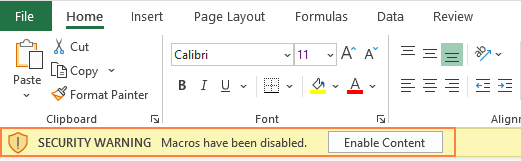

# Social Engineering

Social Engineering attacks are the most common type of attacks, and for good reason. They are easy to perform, as no matter how strong your infrastructure is, the weakest link is always the user.

These attacks would compromise but are not limited to:

* Phishing emails
* Scam calls
* Phishing texts
* Microsoft Macro Attacks

The goal of social engineering is to manipulate the user into performing an action of divulge some important information. As such, there are many reports of scam calls and whatever.

## Types of Attacks

There are a few types of attacks:

* Pretexting
  * Placing the person in a realistic but fake situation, to get them to divulge information such as social security numbers
  * Example of this would be impersonation of help desk staff
  * Perhaps playing as a Nigerian prince asking for money urgently to move diamonds from Uruguay to America, with you being able to make a profit if you were to make an undisclosed, untrackable payment in cryptocurrencies
  * Requires a great deal of research and sometimes need to gain trust of people within an organisation
* Phishing
  * Spear Phishing - Targetting specific individuals within an organisation with scams
  * Whaling - Targeting senior management, such as CTO or CEO, to gain specific info
  * Email phishing - Sending scam emails
  * Vishing - Scam calls
* Baiting
  * Taking advantage of people's curiosity, like leaving CDs and USB drives on the floor and waiting for someone to pick it up and connect to their device
* Physical
  * Attempts to gain physical access to buildings
  * Piggybacking, or tailgating someone to an entrance, like asking someone to hold the door for you
  * Dressing up as plumbers to gain access into buildings
  * Faking ID cards and badges, as most employees lack proper training for staff when it comes to simple observation due to complacency and lack of resources
  * Employees themself are wary of confrontation, and hence exploit the fact that it is unlikely for an employee to challenge them about ID.

## Phishing Links

Here, I will showcase a very basic phishing attack using the Social Engineering Toolkit (SEToolkit) on Kali.

<figure><figcaption>
<em>Fake Website</em>
</figcaption></figure>

Here's a really basic website, that looks exactly like Google. You can chcek all the links on the page to other places, and they are all legit.

We can attempt to sign in here.

<figure><figcaption></figcaption></figure>

When we press Sign in, it just brings us back to the regular Google page. However, when we view the output in the terminal from SeToolKit, we can see what really happens.

<figure><figcaption></figcaption></figure>

This basically shows us the credentials that we had used to sign in. As such, we have successfully been "phished", and our credentials were harvested.

This is the simplest example of what happens in a phishing attack, and the thing is, fake websites that do the same are all sent everyday, through text, email or whatever.

Setting this up with Kali took less than 20 seconds, and you best believe that it's just as easy for an attacker to set it up. In fact, there are merchants on the black market that would help one set up this kind of scam and send out everywhere.&#x20;

This is something called credential harvesting, and there are many others. Some links have hidden Javascript that is executed when you visit it, causing for viruses to be downloaded onto your device. &#x20;

In short, phishing is really easy to do, and to fall victim to.

## Microsoft Macro Attack

This is the more interesting type of attack vector. Macros are basically short VBS scripts that are executed based on an event. Macros can be used to quickly automate tasks and create a series of commands and instructions that are executed on a button click.

Naturally, this can be used maliciously.

Let's take a look at how to create one. (for a box)

<figure><figcaption></figcaption></figure>

Suppose we have a website that allows for us to upload a Microsoft Word or LibreOffice Word Document. However, the people do not know about Macro attacks, and are hence vulnerable to it.

While anti-viruses can pick up on these macros rather easily, there are still ways for us to bypass this by including encoded and obfuscated code. In reality, some macros are coded that so well, even if uploaded on VirusTotal (which is a website that checks whether a file passes anti-viruses checks), it would be able to bypass that.

<figure><figcaption>
<em>Encoded Reverse Shell in Macro</em>
</figcaption></figure>

This showcases how a file can contain some hidden commands within it. The above example is not exactly encoded super well to avoid anti-viruses, but will definitely avoid the human eye.

We can then set the macro to perhaps execute when the file is opened.&#x20;

<figure><figcaption></figcaption></figure>

Then we can upload and send it in, wait for the user to eventually open it, and see that it made a connection back to our machine. This connection can either be a reverse shell to remotely control the device, or just to make the target machine connect back to our machine and retrieve a password from there.

Why does this work? Manipulation of NTLM challenge requests and setting up rogue servers using `responder` to capture these packets and translate them into crackable hashes.

<figure><figcaption></figcaption></figure>

<figure><figcaption></figcaption></figure>

For this example, I managed to retrieve the user password just by using this Word document.&#x20;

In fact, this method is so easy to do, that there are scripts out there that would generate the files for me automatically, although they wouldn't bypass any defences.

<figure><figcaption></figcaption></figure>

It's things like this that make security a necessity. Most people aren't even aware that you could do such a thing from just a Word document and don't know how to protect themselves. This is why security education is so important (and the point of this book!).

Knowing about the damage should be enough to make people aware of the dangers of scams.

## Mitigations

### Check links

Generally, links by legitimate websites will have a **https://** in front, instead of **http://.**  The S in HTTPS means secure, and check for that when accessing websites

Another thing to check for is domain name. Here are some fake websites:

* https://facebook.corn
* https://gooogle.com
* https://twitter..corn

We can see that the links look similar if you're not looking carefully. Most of these can be potential scam website (I wouldn't know), or at least temporarily leased domains used for scams.

### Check sender and content&#x20;

When receiving files from an unidentified sender, always make sure that the sender's email is legit and from authorized people.

If we open some kind of Microsoft document accidentally, no worries, you're still safe.

<figure><figcaption></figcaption></figure>

**Just never click this enable content button.** This one button is the last line of defence between you and the attacker. Microsoft doesn't tell you about this (which is really stupid), and that's the reason so many people become victims.&#x20;

Next, always check the content of the email or message and make sure you're supposed to receive it and that the content is legit. Taking a few more seconds to scan through the content is way better than falling victim to phishing.

### Never click links

I hardly ever click links from random people I don't know, so you should too. You never know what they are gonna do.&#x20;

The amount of dangers from visiting a website is not limited to if you enter your credentials, but a lot of Cross-Site Scripting can be used by attackers to deliver their payload.&#x20;

