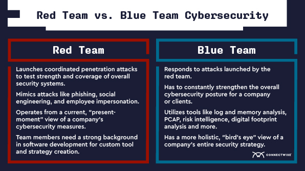

# Information Security

Information security focuses on minimising **risk** to an organisation's information assets. Realistically speaking, it is impossible to make something **unhackable**. However, measures and controls can be implemented to lower the risk to a level acceptable by organisations.

The main goal of information security is **risk management**!

Generally, there has 2 distinct teams, **the red team and the blue team.**

<figure><figcaption>
<em>Summary of Teams</em>
</figcaption></figure>

Red Team = Adversary, Blue Team = Defenders.

Specifically for hackers, they can be:

* **Black-Hat:** Criminal hackers.
* **White-Hat:** Those that hack for good and are law-abiding citizens.
* **Grey-Hat:** White-Hats in the day, Black-Hats in the night.
* **Hacktivists:** Groups like Anonymous, who hack to promote social agendas and beliefs. Hacks include defacing websites, doxing people, etc.
* **State-Sponsored Threats:** Elite hackers sponsored by and acting in their home nation's interests.
* **Script Kiddies:** Unskilled people who blindly run pre-made scripts and tools without understanding what they are doing. Uninterested in learning, more interested in looking l33t.
* **Green Hat Hackers:** Amateur hackers, but with a clear intention to learn, separating them from script kiddies.
